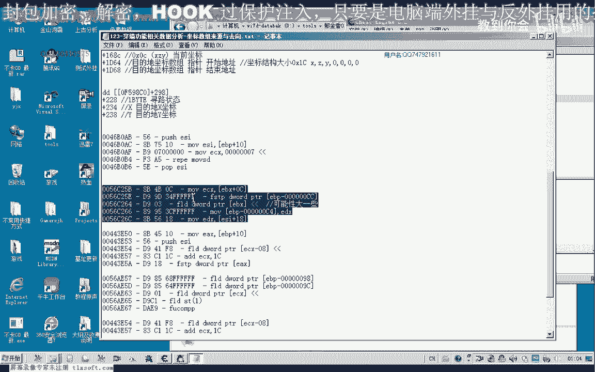
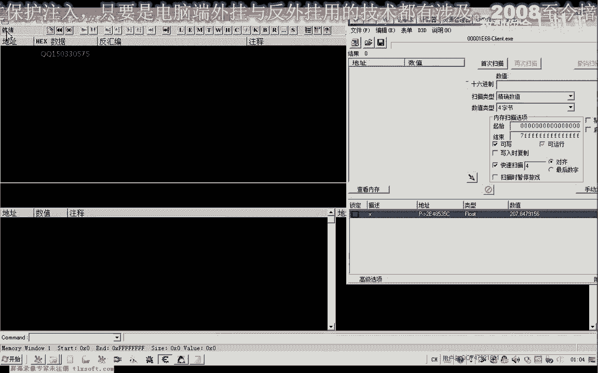
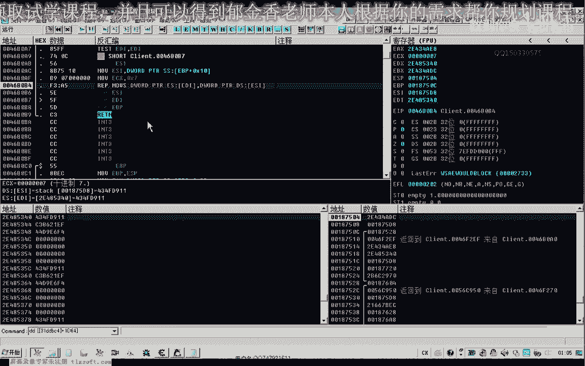
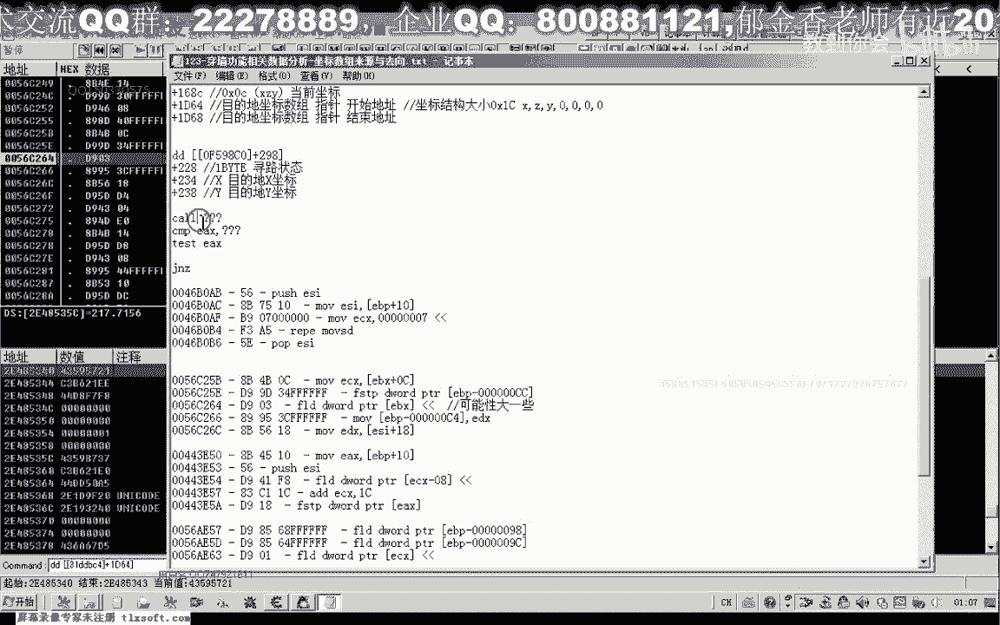
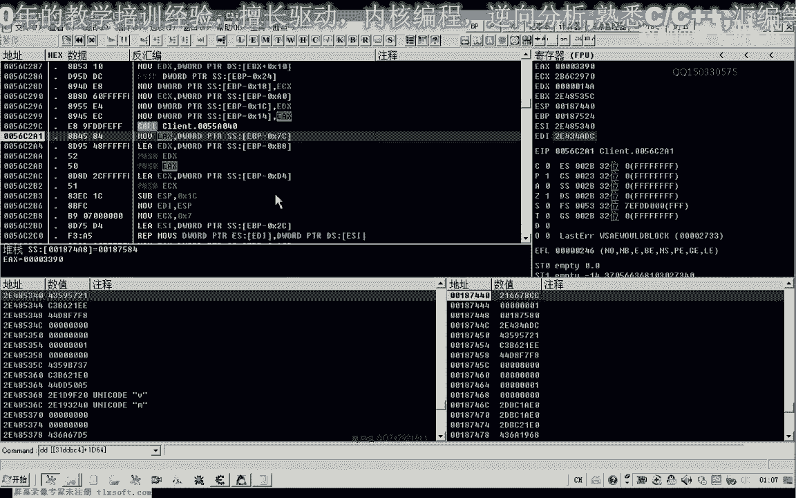
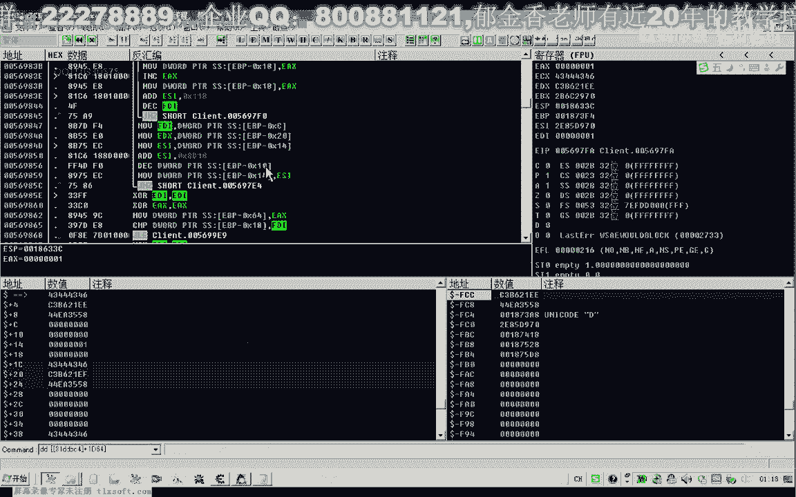
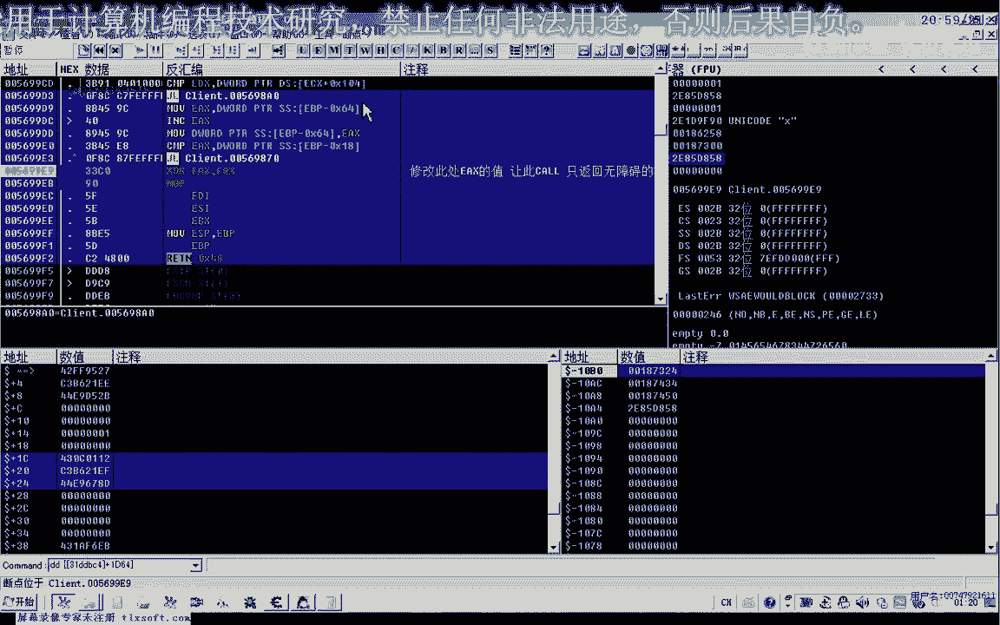

# P112：穿墙功能相关数据分析 - 坐标数组来源与去向 🧭

在本节课中，我们将学习如何分析游戏穿墙功能相关的数据，重点在于追踪坐标数组的来源与去向。我们将通过逆向工程工具，定位并理解访问坐标数组的关键代码，从而找到障碍物判断的核心逻辑。

---

上一节我们介绍了坐标数组的基本概念，本节中我们来看看如何追踪访问这个数组的代码。

首先，打开逆向分析工具CE，访问坐标数组的地址 `1964`。为了找到障碍判断的代码，我们对数组的第一个坐标进行访问操作。因为障碍判断代码很可能就在其附近，会用到这个坐标数组。

访问坐标数组的代码有两种可能情况：
1.  程序先生成一条直线的坐标序列，写入数组。
2.  程序再判断这个序列中的坐标点是否存在障碍物。

无论哪种情况，代码都必须访问我们的坐标序列。我们已知第一个数组在 `1964`，第二个数组的结构在 `1334`。

我们从 `1964` 地址开始，找出所有访问该地址的代码。然后，我们分别在有障碍物和无障碍物的路径上执行代码，观察差异。

以下是观察到的关键现象：
*   无障碍时，程序访问固定的几行代码。
*   有障碍时，程序会额外访问后面的几行代码。

这表明，后面新增的几行代码很可能与障碍判断关系更大。可能性最大的判断代码就在这些新增访问的附近。这些代码可能负责计算如何绕过障碍。

---

上一节我们定位了可能的障碍判断代码区域，本节中我们深入分析这些具体的汇编指令。

我们使用分析工具，重点观察访问坐标数组后代码的走向。我们特别关注那些使用括号 `[]` 进行内存访问的指令，例如 `mov eax, [ecx+xx]`。如果这个 `[ ]` 访问的是我们的坐标数据，那么后续很可能有判断逻辑。

以下是常见的判断代码模式：
*   `cmp eax, xx` 或 `test eax, eax`
*   后面跟随条件跳转，如 `jz` (为零跳转) 或 `jnz` (非零跳转)
*   或者将判断结果保存到某个变量中

我们主要寻找这类模式。如果发现 `[ ]` 访问了坐标数据，并且后面有比较和跳转，我们就跟进查看。

我们跟踪到一个关键的函数调用（`call`）。通过分析其参数，发现它传入了坐标序列中的第一个和第二个坐标点。这强烈暗示该函数是在计算这两个点之间是否存在障碍物。

我们在此函数调用处下断点，并观察其返回值（通常存储在 `EAX` 寄存器中）：
*   **无障碍时**：返回值 `EAX = 0`。
*   **有障碍时**：返回值 `EAX > 0` (非零)。

这个函数 `call xxxxxxxx` 很可能就是**障碍物判断的核心函数**。

---

上一节我们确认了障碍判断函数，本节中我们看看如何利用这个发现。

我们跟踪该判断函数的返回点。发现程序根据返回值 `EAX` 是否为0，进行了不同的跳转：
*   如果 `EAX == 0` (无障碍)，程序沿一条路径返回，继续正常移动。
*   如果 `EAX != 0` (有障碍)，程序可能跳转到另一处代码。

在分析过程中，我们还偶然发现了一个现象：在特定时机暂停游戏线程，角色有时能“卡”过墙壁。这证明游戏客户端和服务器之间存在时间差，也说明我们离实现穿墙功能很近了。

基于以上分析，最直接的修改思路是：**强制让障碍判断函数的返回值始终为0（即始终判断为无障碍）**。我们可以修改调用该函数后的跳转逻辑，或者直接修改函数本身的返回值。

修改此处特征码，可能就能实现基础的穿墙功能。当然，更稳定的方法需要更全面地分析所有相关的判断线程。

---

本节课中我们一起学习了如何通过逆向工程定位游戏中的坐标数组，并找到了关键的障碍物判断函数。我们分析了该函数的调用模式、返回值含义，并提出了实现穿墙功能的潜在修改点。下一节课，我们将继续分析其他可能相关的判断逻辑。