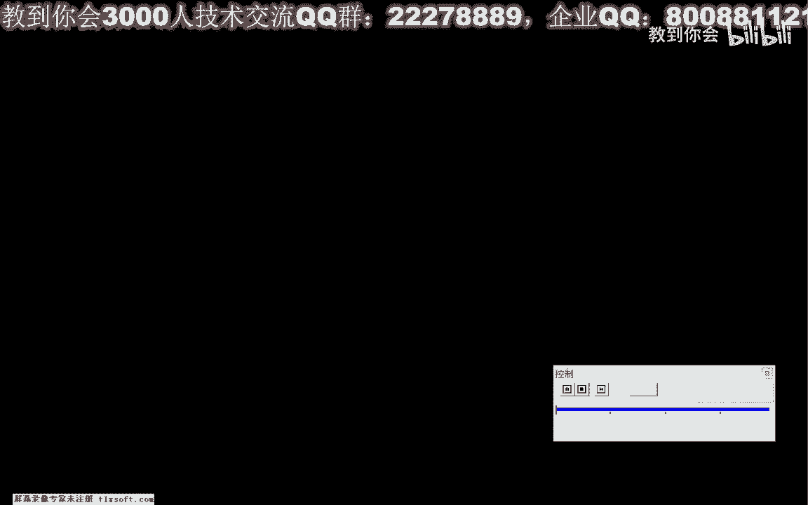

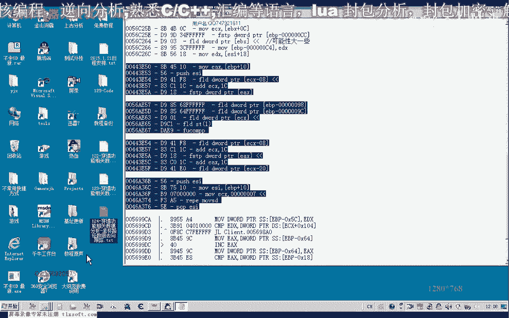

# 课程 P113：穿墙功能相关数据分析 - 路径坐标数组去向跟踪 🧭

在本节课中，我们将继续深入分析游戏中的穿墙功能，重点跟踪路径坐标数组的访问与修改过程。上一节我们分析了关键判断函数，但修改后仍未实现穿墙，这表明可能存在其他检测点。本节我们将跟踪更多数据访问地址，寻找所有与障碍判断相关的代码。

## 跟踪第二个地址的访问

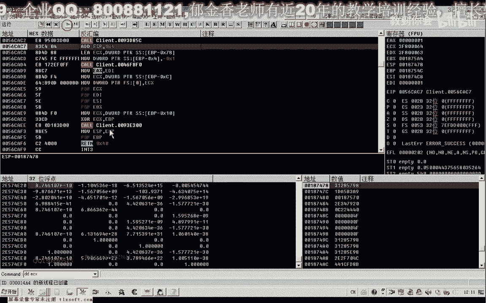

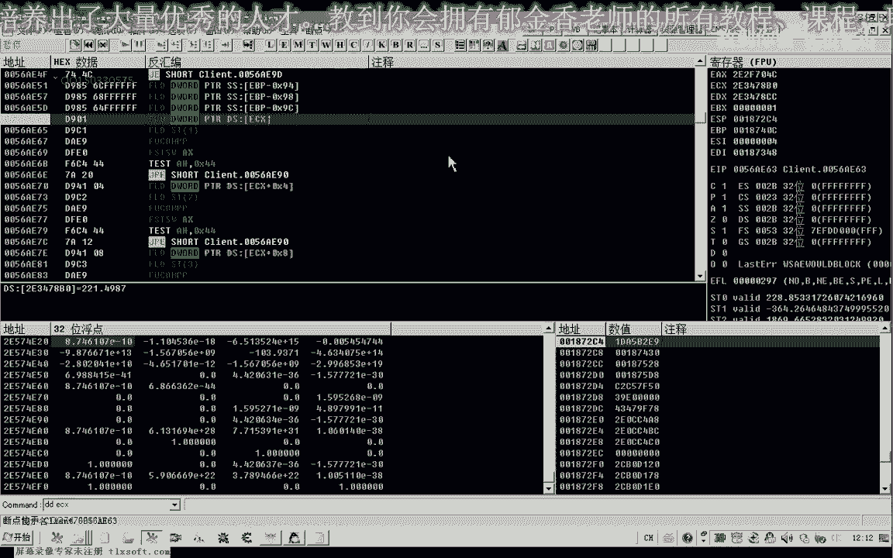

上一节我们分析了第一个关键地址。本节中，我们来看看第二个访问目的地坐标路径的地址。

以下是分析步骤：

1.  附加调试器到游戏进程。
2.  转到第二个目标地址，该地址同样访问目的地坐标数组的第一个元素。
3.  在此地址下断点，然后执行移动操作（走路或寻路），观察断点触发情况。
4.  分析断点触发时的寄存器数据，特别是 `ECX` 的值，它可能包含坐标相关数据。
5.  观察代码逻辑，发现该处读取坐标后并未用于关键判断，因此可能不是障碍检测的核心位置。

## 分析关键判断函数

我们越过上一个非关键点，继续跟踪下一个地址 `56A` 处的代码。

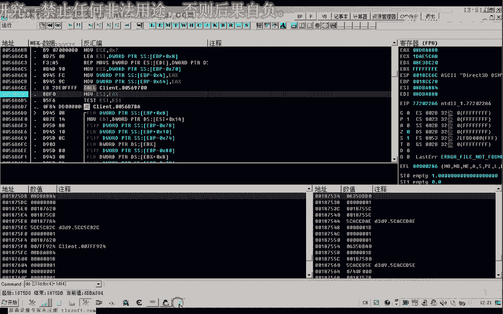

以下是分析过程：

1.  在地址 `56A` 处下断点，并尝试移动角色。
2.  发现该断点并非每次移动都触发，而是在目的地为障碍物（如墙）时才触发。
3.  这表明，之前的某段代码进行了障碍判断，并根据结果跳转至此。
4.  分析跳转来源，发现是从下方代码跳转而来，其中比较了 `ECX` 和 `EDX` 的值。
5.  这两个值可能分别代表路径坐标数组的起始地址和结束地址，用于循环判断。
6.  进一步分析，发现该函数内部可能负责计算绕过障碍物的新路径。

## 确认并标记障碍判断函数

通过多次跟踪和测试，我们确认了一个反复出现的核心函数。

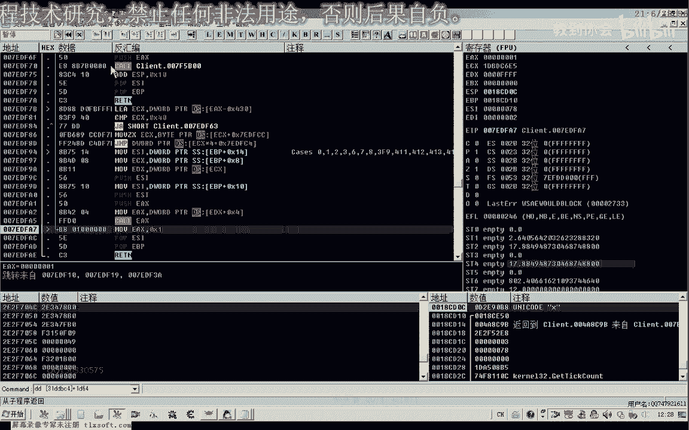

以下是确认步骤：

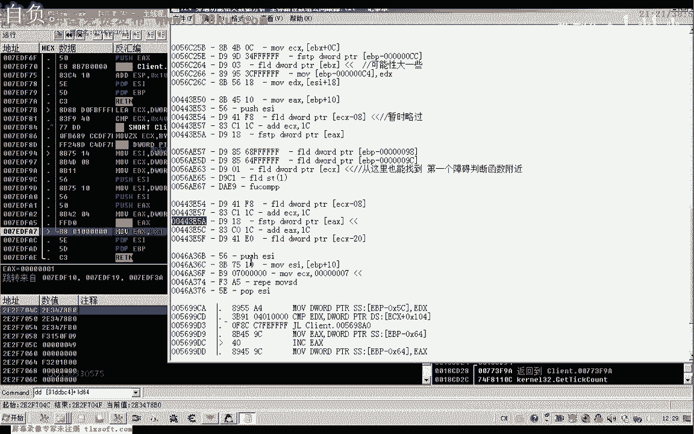

1.  返回到调用层，定位到函数 `56B650`。
2.  在该函数入口下断点，测试在有障碍和无障碍情况下是否触发。
3.  确认该函数在两种情况下均会执行，但其内部返回值 (`EAX`) 可能不同。
4.  结合上一节课的分析，确认此函数正是进行“两点间是否有障碍物”判断的关键函数。其逻辑可简化为：
    `返回值 = CheckObstacle(坐标A, 坐标B)`
5.  为代码添加清晰标签和注释，例如“障碍判断函数”，便于后续分析。将返回值意义注明：`0` 为无障碍，非 `0` 为有障碍。

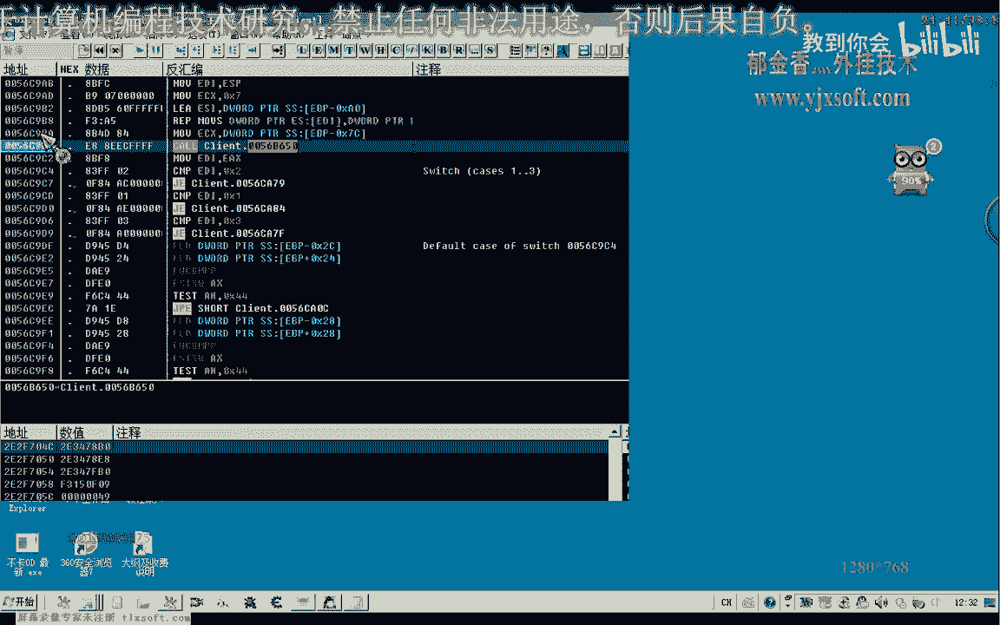

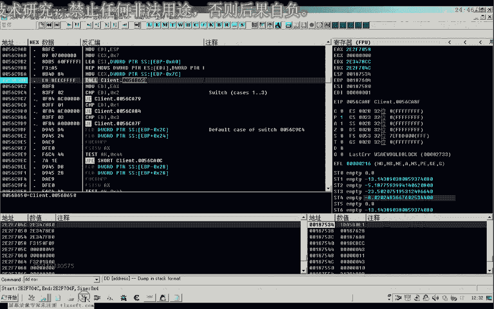

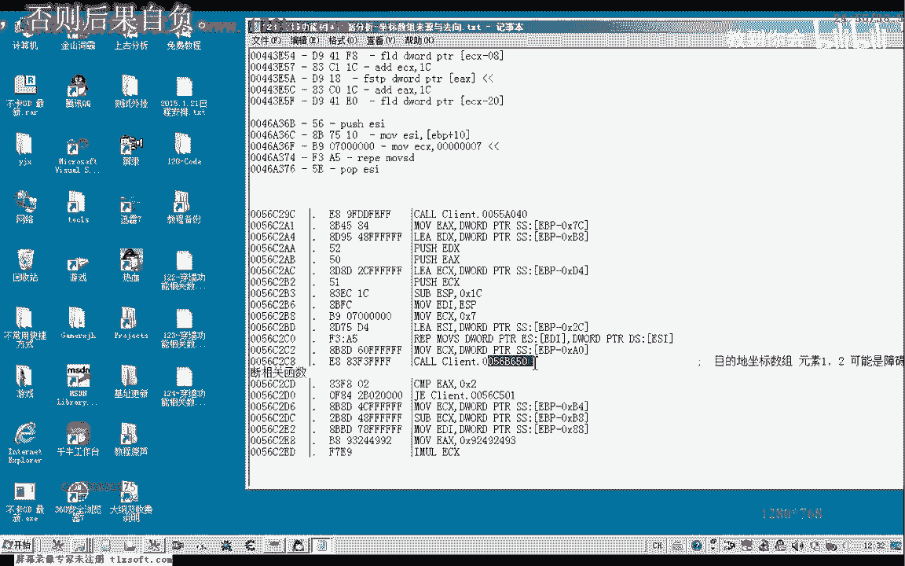

## 跟踪坐标数组的复制过程

除了直接判断，游戏还可能通过复制和修改坐标数组来处理路径。

以下是跟踪发现：

1.  跟踪另一个数据访问地址，发现一段将原坐标数组数据复制到新内存区域（`EDI` 指向）的代码。
2.  分析 `ESI` 和 `EDI`，发现 `EDI` 指向的可能是“人物角色属性+1964”处的目的地坐标数组副本。
3.  这意味着，游戏可能先在一个临时区域计算路径（包括绕行），然后再写回或应用。
4.  要找到最终的障碍生效点，可能需要跟踪这个副本数组的后续修改和访问情况。

## 新的分析思路：从坐标写入点入手

如果直接跟踪数组流向复杂，我们可以转换思路。

以下是新思路的切入点：

1.  无论路径如何计算，角色最终要移动，就必须修改其“当前坐标”。
2.  在无障碍正常行走和有障碍被阻挡时，修改“当前坐标”的代码路径很可能不同。
3.  对“当前坐标”的内存地址下“写入”断点。
4.  分别观察正常行走和遇到障碍时，断点触发的代码位置有何差异。
5.  在差异点附近，很可能就存在着决定是否更新坐标（即是否允许移动）的最终障碍判断。

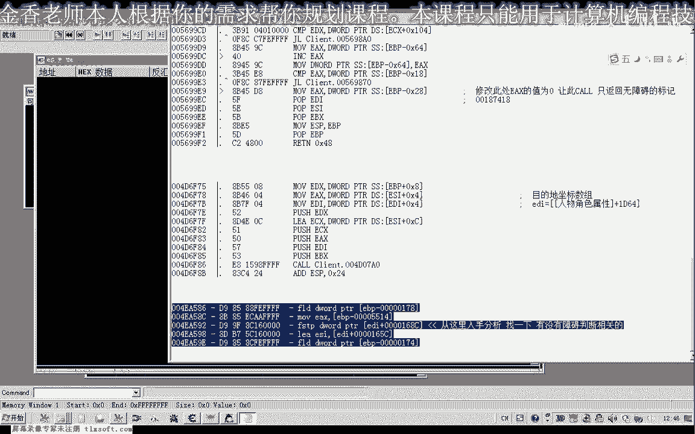

本节课中我们一起学习了如何多角度跟踪和分析路径坐标数组。我们确认了一个核心的障碍判断函数，并发现了坐标数据被复制处理的流程。最后，我们提出了通过对比“当前坐标”写入点来定位最终判断逻辑的新思路。穿墙功能分析需要耐心，下节课我们将基于今天的发现继续深入。