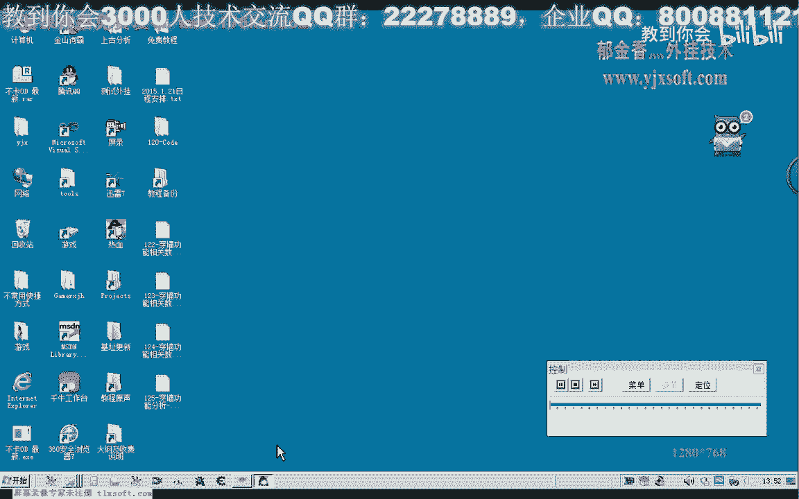
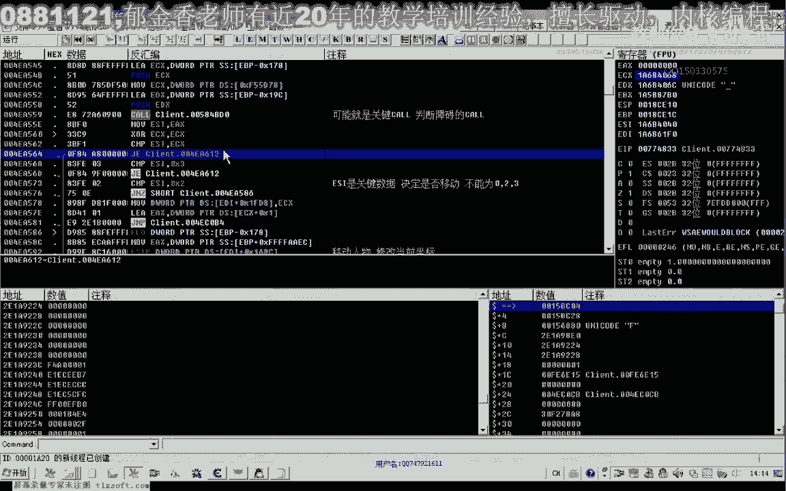
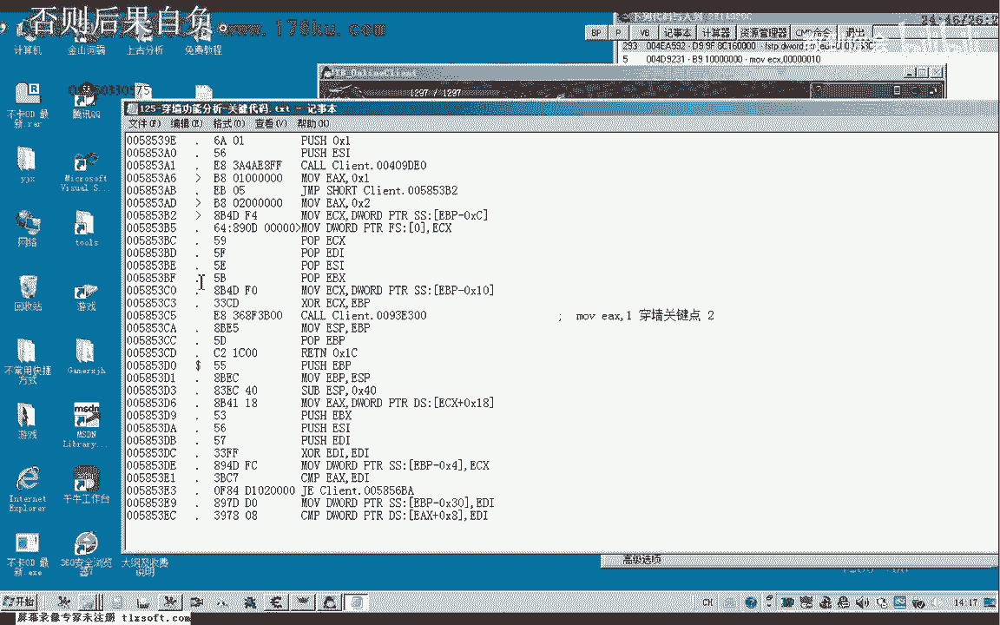
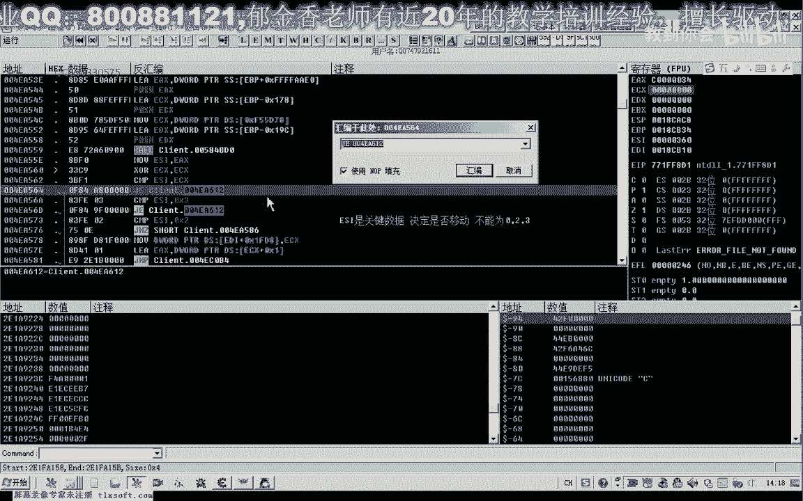

# 课程 P114：125-穿墙功能分析-关键代码 🧱➡️🚶

在本节课中，我们将学习如何分析并实现游戏中的“穿墙”功能。我们将从上一节课的代码入手，定位到控制角色移动的关键逻辑，并学习如何修改代码以绕过障碍物检测，最终实现穿墙效果。

---

## 概述

上一节我们介绍了如何定位到与角色坐标相关的内存地址。本节中，我们来看看如何分析并修改控制角色移动路径的障碍物检测逻辑，从而实现穿墙功能。

核心原理是：游戏在移动角色前，会调用一个函数来判断起点与目标点之间是否存在障碍物。如果存在障碍物，则不会更新角色坐标。我们的目标就是修改这个判断逻辑，使其始终返回“无障碍”的结果。


---


## 关键代码定位与分析


我们首先需要找到负责判断两点之间是否有障碍物的关键函数（CALL）。

通过分析对坐标地址 `1680C` 的访问，我们发现角色移动前会进行一个判断。这个判断决定了是否更新当前坐标。

以下是分析过程中定位到的关键汇编代码片段：

```assembly
; 这是一个判断跳转，esi的值是关键
cmp esi, 2
je SOME_LABEL ; 如果esi等于2则跳转，不执行移动代码
cmp esi, 3
je SOME_LABEL ; 如果esi等于3则跳转，不执行移动代码
; ... 其他判断
```

**核心概念**：寄存器 `esi` 的值来源于一个关键函数（CALL）的返回值。这个返回值代表了路径的状态：
*   `esi = 0, 2, 3` 通常表示存在障碍，角色不会移动。
*   `esi = 1`（或其他非0、2、3的值）通常表示路径畅通，角色可以移动。

因此，实现穿墙的思路就是：**确保这个关键CALL的返回值不为0、2或3，最好恒定为1**。

---

## 修改方案与实施

我们找到了影响移动判断的多个位置。以下是几种可行的修改方法：

### 方案一：修改判断跳转

直接修改对 `esi` 值的比较和跳转指令，让程序即使检测到障碍也继续执行移动代码。

例如，将 `je`（等于则跳转）指令修改为 `jmp`（无条件跳转），或者直接 `nop`（空指令）掉整个判断块。

```assembly
; 修改前：有障碍则跳走
cmp esi, 2
je BLOCK_MOVEMENT

; 修改后：无视障碍，继续执行
cmp esi, 2
jmp CONTINUE_MOVEMENT ; 或直接 nop 掉 je 指令
```

### 方案二：修改关键CALL的返回值

这是更根本的修改方法。在关键CALL的函数尾部，强制设置其返回值（通常存放在 `eax` 或 `esi` 寄存器中）为1。

```assembly
; 在CALL返回前插入代码
mov eax, 1 ; 或 mov esi, 1
retn
```

### 方案三：修改函数内部的逻辑

进入关键CALL内部，找到其生成返回值0、2、3的逻辑分支，并修改它们，使其走向返回1的逻辑分支。

这需要更深入的分析，但效果最稳定。

---

## 测试与验证

修改完成后，需要进行测试。

1.  尝试点击墙后的位置，角色应能直接穿过障碍物移动过去。
2.  尝试正常的寻路功能，确保修改没有破坏游戏的其他逻辑（例如自动寻路）。

如果寻路出现问题，可能需要调整修改点，确保只在“点击移动”时绕过检测，而在“自动寻路”时保持原有逻辑。

---

## 关键代码地址总结

以下是分析过程中找到的关键代码地址（示例，实际地址需动态分析）：

*   **坐标访问点**：`xxxxxxxx` (例如1680C相关代码)
*   **障碍判断CALL**：`yyyyyyyy`
*   **移动执行代码块**：`zzzzzzzz`
*   **关键跳转点1**：`aaaaaaaa` (判断 esi == 2)
*   **关键跳转点2**：`bbbbbbbb` (判断 esi == 3)

将修改应用到这些关键位置，即可实现穿墙功能。




---

## 总结


本节课中我们一起学习了游戏穿墙功能的实现原理与步骤。



我们首先回顾了角色坐标的存储位置，然后分析了控制移动的障碍物检测逻辑。核心在于理解一个关键函数（CALL）的返回值决定了角色能否移动。通过修改该函数的返回值，或修改基于该返回值的条件跳转，我们成功地让角色无视障碍物移动，实现了穿墙效果。




记住，修改游戏代码时需谨慎测试，以确保功能的实现不会引起游戏崩溃或其他意外行为。