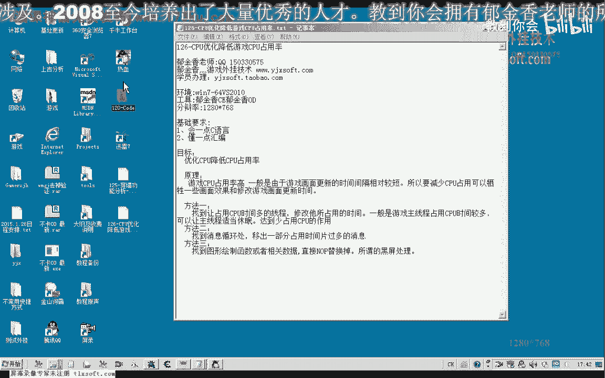
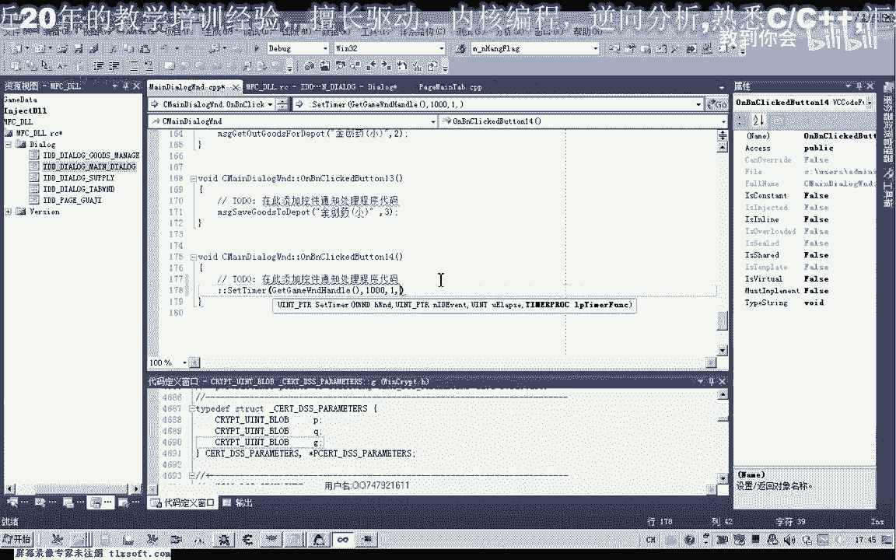
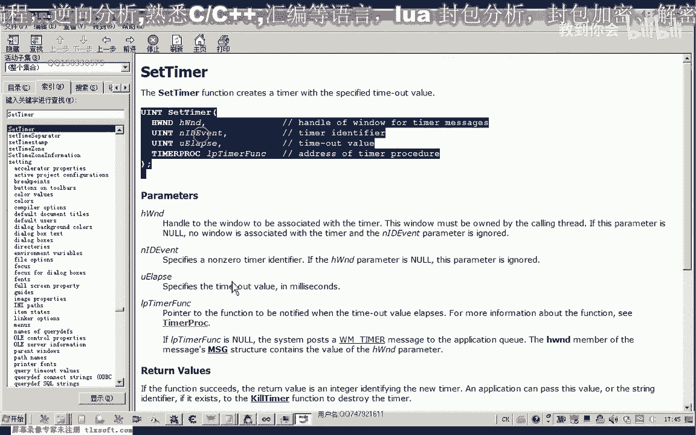
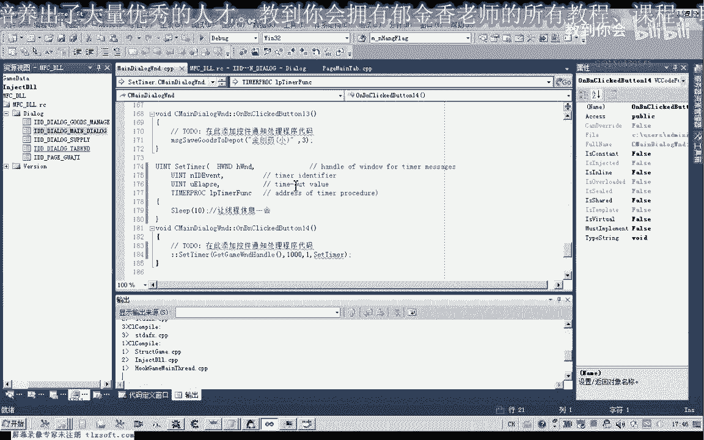

# 课程 P115：CPU优化降低游戏CPU占用率 🎮⚙️

在本节课中，我们将学习如何通过编程手段优化游戏，降低其对CPU的占用率。我们将探讨一种通用方法，并介绍其他高级优化思路的原理。

## 概述

游戏对CPU占用率较高，通常与画面渲染和画质更新有关。这些操作可能由定时器或独立线程频繁执行。通过干预这些过程，可以有效降低CPU负载。一种通用做法是强制游戏主线程定时休眠。

## 通用优化方法：线程定时休眠

上一节我们介绍了优化的基本思路，本节中我们来看看如何通过代码实现线程定时休眠来降低CPU占用。

这种方法的核心是：在游戏主线程上设置一个定时器，使其周期性地进入短暂休眠状态，从而减少CPU时间片的占用。

以下是实现步骤：

1.  **获取游戏窗口句柄**：这是操作目标窗口的必要标识。
2.  **设置定时器**：使用 `SetTimer` API函数在主线程上创建一个定时器。
    *   **函数原型参考**：`SetTimer(HWND hWnd, UINT_PTR nIDEvent, UINT uElapse, TIMERPROC lpTimerFunc)`
    *   **参数说明**：
        *   `hWnd`: 窗口句柄。
        *   `nIDEvent`: 定时器ID，建议定义为宏常量以提高代码可读性，例如 `#define TIMER_ID_OPTIMIZE 1`。
        *   `uElapse`: 定时器间隔，以毫秒为单位。此值不宜过大或过小，经测试10毫秒左右效果较好。
        *   `lpTimerFunc`: 定时器回调函数指针。
3.  **实现回调函数**：在回调函数中调用 `Sleep()` 函数使线程休眠。
    *   **休眠时间**：回调函数中的 `Sleep()` 参数应尽量小，例如10毫秒。这个值可以作为可调参数提供给用户。
4.  **提供关闭功能**：使用 `KillTimer` API函数来停止定时器。
    *   **函数原型**：`KillTimer(HWND hWnd, UINT_PTR uIDEvent)`

通过测试，启用此优化后，游戏CPU占用率可从30%-40%显著降低至10%以下，且不影响正常游戏操作。取消优化后，占用率会恢复原状。

## 高级优化思路探究

除了通用的线程休眠法，更有效的优化需要深入游戏内部机制。游戏通常在一个消息循环中处理各种事件，包括渲染更新。

我们可以使用工具（如Spy++）监视游戏窗口的消息流。观察发现，游戏会频繁处理某些特定消息（例如消息代码492、268等），这些很可能对应着画面更新的定时器事件。

理论上，如果能定位到负责渲染的关键定时器ID及其回调函数，并重新设置其时间间隔（例如延长触发间隔），就能从根源上降低CPU占用。这需要逆向分析技术来辅助完成。

## 总结

本节课中我们一起学习了降低游戏CPU占用率的两种思路：
1.  **通用方法**：通过 `SetTimer` 和 `Sleep` 强制游戏主线程周期性休眠，快速见效。
2.  **进阶方向**：分析游戏消息循环，定位并修改高频率的渲染定时器参数，实现更精准的优化。

通用方法简单有效，适合初学者实践。而深入消息机制的方法则作为进阶练习，鼓励大家课后使用工具进行探索。下一节课我们将深入研究具体的定时器消息。