# P116：127-CPU优化降低游戏CPU占用率方法二 - 教到你会 - BV1DS4y1n7qF

大家好，我是郁金香老师，那么这节课呢我们继续分析与cpu优化相关的数据，那么首先呢我们打开第126课的代码，当，那么首先呢我们，接着从上一节课的这个定时器的相关数据让我们进行分析。

那么这个时候呢我们有很多的这个定时器啊，有三个呃，它的id呢，当然每次启动之后呢，这个id呢是变化的，那么首先呢我们进行尝试啊，这三个定时器我们看呃把它重新进行这个设置。

那么或者是呢我们把这里的三个定时器呢把它关掉啊，关掉之后呢，我们看一下呃，它是不是与我们的这个游戏的画面啊有一些关系，那么我们可以来嗯在它的资源按钮上添加一个测试按钮，当然你可以用上面节课的这个代码。

那么在这里呢我们可以呢呃用ctime，那么这里呢我们把它改一下，那么这里呢我们就把这记录下来的，一个是2946102094，还有一个是610，那么另外还有一个定时器呢是364啊。

那么我们先关掉两个看一下，那么我们看一下这个我们看一下cpu的占用率的话，这个时候呢并没有啊，而且我们在游戏画面呢也没有受到影响，那么我们继续看一下，清空一下，再看一下消息记录。

那么这个时候定时器的话就只有一个了啊，那么这里呢也有一个回调函数啊，另外一个回调函数不断的在被执行，那么364这个呢我们也也添加代码来把它关掉，另外一个呢是364，那么再重新生成一下。

那么这个时候的话我们发现了我们的这个定时器的这个消息的话，呃已经没有了啊，这个pos体啊，呃系统发送的这个定时器的这个消息。

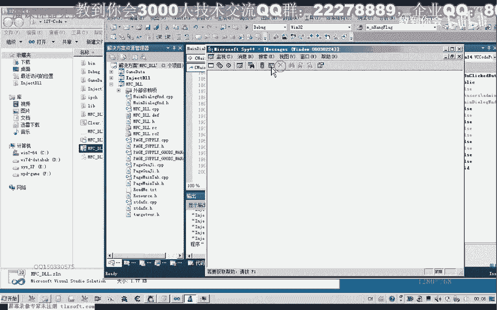

那么我们再来看一下游戏，它有没有相应的被影响到，那么这个时候的话我们发现了我们的cpu占用率啊，好像有我们的这个定时器的话，好像是没有关系的啊。

那么所以说的话我们不能够从这个呃定时器这里来来做一个入手点，那么我们需要了另外的呃分析，那么另外的分析的话，我们一般呢呃游戏在处理系统消息的时候呢，在这个循环里面呢一般会用到两个几个函数啊。

一个是gtmessage，另外一个呢是pk啊，message，那么这两个函数的话，它是用来从我们的消息队列里边呢，呃获取我们的这个消息，那么获取消息之后呢。

然后进行一些就是说啊派送到调用我们相应的这些回调函数啊，通过另外的两个函数呢来解释啊。

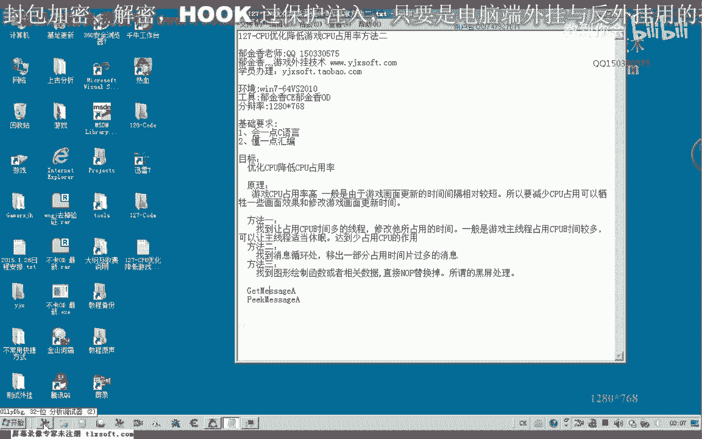

另外好像还有两个函数需求这个名字translate，有这么多事情，那么相关的还有几个函数啊，但是我记不太清楚。

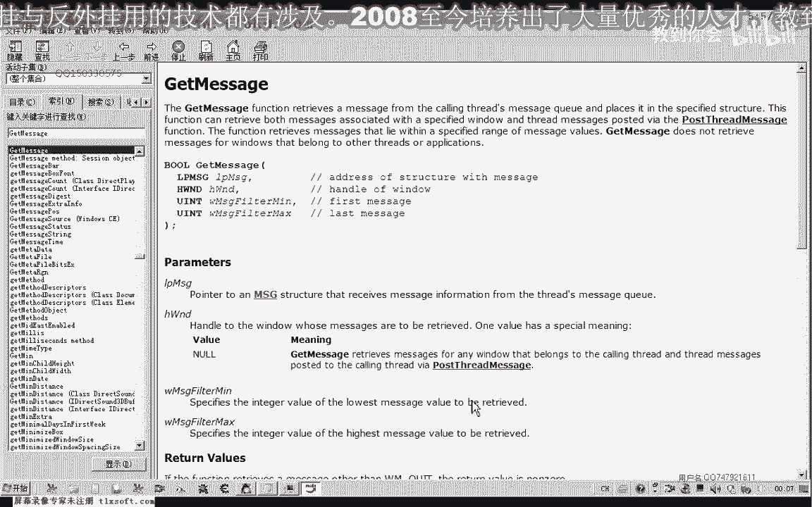

还有这个post to sell message啊，这一类的，那么我们先通过这两个函数呢，下段啊通过我们的o d来附加一下。

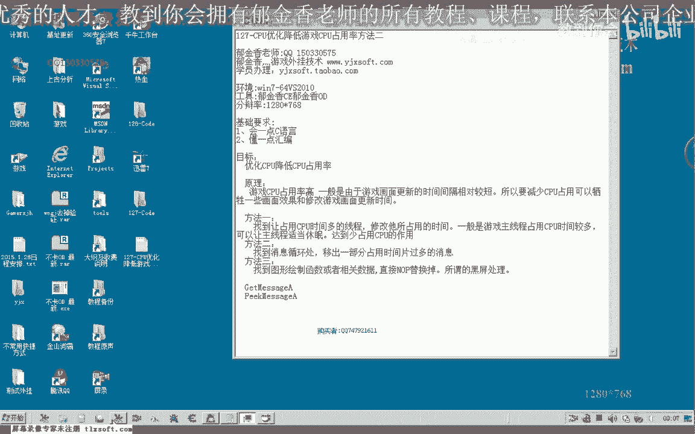

看一下呃能不能够找到我们的这个消息循环，然后再通过我们的消息循环呢，看能不能找到一些关键的数据嗯，嗯。

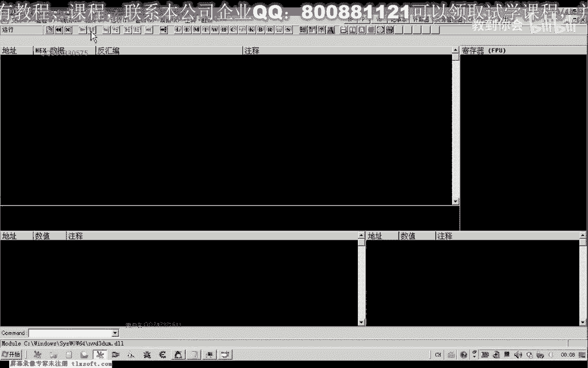

好的，那么我们先对这个pgm s技能啊进行一个下段。

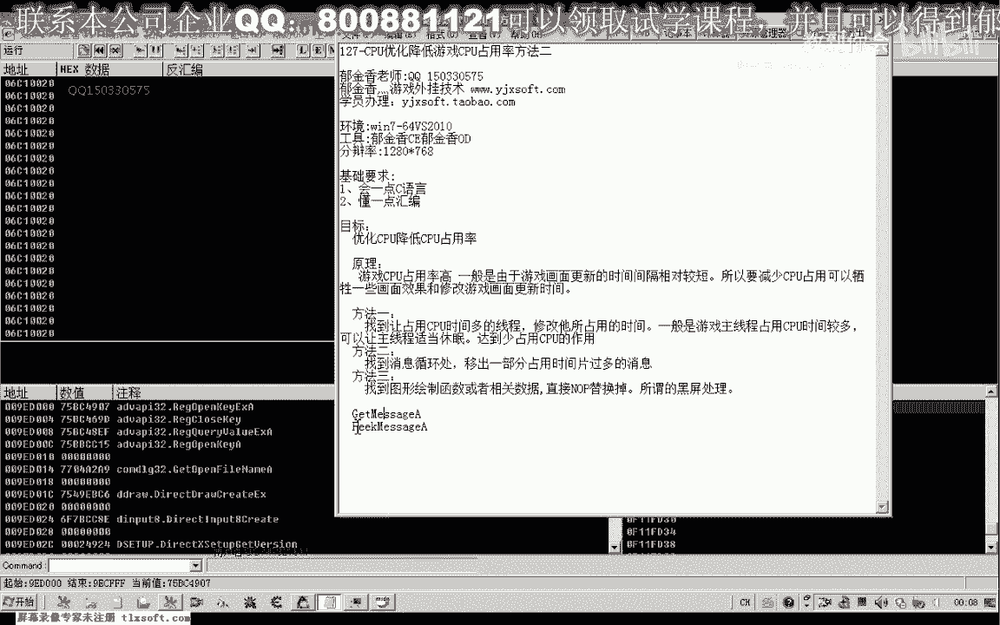

那么首先呢我们嗯这个他有个全局钩子。

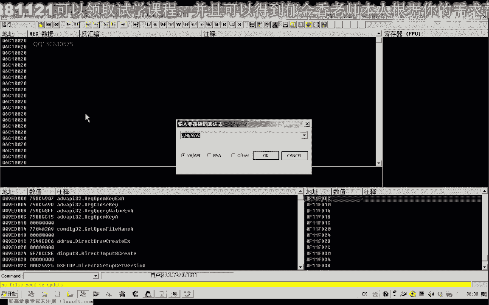

我们需要把它去掉啊，不然有点卡。

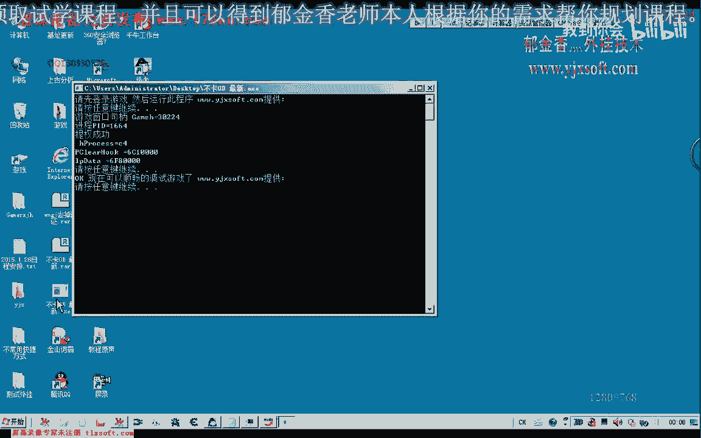

然后在这个地方呢我们断一下，断一下之后，我们找一下它调用的一个来源嗯，在这个地方调用的，那么这里呢他对于这个消息呢有一些啊解释啊，然后呢呃这里呢它相当于是调用相相关的这个回调函数去调用。

那么这一片的话他就是对我们可能的话啊，从这里的话来看呢，它也是有一个循环很大的一个循环，那么像这种循环里面的话，它也有可能呢就就是对我们的这个图像的这些进行处理，那么我们可以从这个消息的头部呢。

我们下一个断点往下跟一下，那么有关图像的话，一般呢它会调用这个第当。

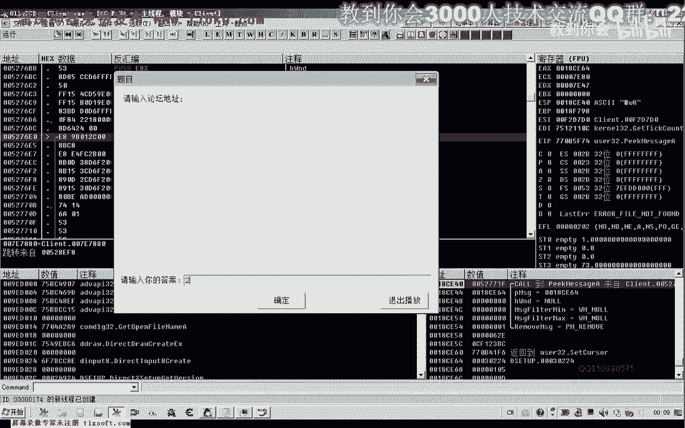

d9 的这个动态链接库里面相关的一些函数，那么我们从这里呢开始下段，然后呢我们把断点取消掉，往下执行，跟一下，那么注意这个寄存器和堆栈的一些变化数据，我们看有没有与我们绘制图形相关的一些数据。

那么执行到这个这个函数的时候的话，好像呢它在这里好像是主赛了哈，那么就，这个时候呢它就暂停了啊，那我们需要把它恢复一下啊，然后呢继续执行，那么从这个地方呢我们能够看到哈。

呃应当是一个我们界面绘制相关的一些地方啊，从这上面一句来这里啊，第三第九的与我们这个图形相关的啊，这一句应当是，那么我们再往后面啊继续执行一下，看还有哪些相关的数据，那么这又开始新一轮的一个循环。

那么这个时候好像是直接跳到了嗯，下一次的一个循环啊，直接就跳到尾部来了，那么我们按下回车之后来看一下这个大的跳转跳到什么地方去了，那么跳到尾部之后呢，他又进行下一次循环啊，那么这个是一个什么意思呢。

我们再来看一下，1a x那么我们看一下这个ex是一个什么数，是什么，那么现在的话看不出来啊，那么我们继续看一下，那么首先呢这里呢他从我们的消息队列里面取到数据，然后呢这里返回值是零，那么返回值是零的话。

也就是说我们的这个消息队列里边呢，他没有取得数据啊，嗯没有取到数据的话，可能呢就直接来会从呃直接来就进行下一次循环，那么我们来看一下，这个时候来这里有个计时器哈，用来计算一个时差的time。

get time，那么这种的话呃他个体碳呢一般是在我们绘制这个画面的时候呢，用来计算一个时差的啊，两个前面一个时间与现在的一个时间的一个时间差，那么这里呢它好像也是有一个时间差的一个判断。

他把这个以前的这个数值来加上64，然后呢与我们现在的这个数值来相比啊，那么如果呢这里呢嗯j n b好像是小鱼啊，小鱼的时候呢就跳到跳到下边来执行，那么也就是说它检查这个时间差的话，大概是100ms。

可能是100ms更新一次，可能是，那么我们再往下面啊，执行一下，跟进去看一下这里面，那么这里的话我们能够看到的话，应当是从我们的呃这个服务区呢，呃到这个缓冲区来读取我们的这个包啊。

因为服务器这边呢发送过来的一些数据，那么这个包的话它也可能呢设计我们再退回来啊，那么这里的话应当是嗯接收服务器数据，那么那么我们先让它跑起来，那么这里呢应当是接收了服务器的一个数据，那么接收数据之后。

我们看一下这个e d i它是调用了什么，那么这里呢也是一个计时啊，计时他把这个ex来存放到我们的这个变量里边，然后呢也也要进行一个什么判断啊，这一类的，判断是否大于零啊，这个gm s啊。

这这也是一个跳转，那么这里是服务器的数据的一个接收，那么我们继续往下看一下，这里呢我们把它记录下，咳咳咳，好的，那么我们再往下面看一下，那么这里呢也有三个空啊。

嗯好像这里感觉的话应当是一个什么登录的界面，什么什么的，那么感觉这个函数的话，从它的这些字串来看的话，好像也是与我们图形绘制相关的，get to take count，那么我们可以把这个扩了。

把它落不掉啊，看一下这里呢他也没有返回参数这几个空，那么我们直接来把它落不掉，看一下结果，那么这个时候的话我们发现了移动人物的时候呢，它移动不了了啊，那么这个库的话可能是与我们这个人物相关的。

那么后面这个括我们先进去看一下啊，它的一个返回是啊，也是没有参数的，那么这个我们就把它弄不掉，看一下有没有什么效果，那么这个时候呢我们人物呢它也不动了啊。

那么这个扩的后面这个扩的话可能是与我们人物相关的，那么我们嗯紫萝卜后面这个孔再来看一下，那么从这个处理来看的话，可能前面两个呢它是做一些数据的初始化。

那么这个课呢可能才是我们这个呃绘制我们人物相关的一个孔，那么我们第一个括先来看一下，这个货好像没有影响啊，看起来，那么我们再进去看一下这个库里边是什么，啊刚才已经进来看过了，我们是创建一些什么数据。

那么这里呢这三个扩的话，我们就是这个人物角色的动作，更新啊，暂时我们可以这样的理解，那么我们再从这个地方下个段，继续往下面跟，那么这里呢也有一个空进来看一下，那么这里呢它一共有三个参数。

那么我们再退回来，在这个地方我们嗯a d d先评上一usp等于c啊，也就是说相当于把这前面的这三个参数来出战嗯，这样的话能够形成一个堆栈的一个平衡，然后呢我们不调用这个库来看一下它的一个这个库的话。

看起来没有影响，目前对我们的这个界面，好这个没有影响的，那么我们把它撤销，然后呢继续往后边跟一下，主要我们注意一下相关的这个库，那么这里也有一个扣啊，也是我们这个呃d3 d9 相关的。

6182个d r20 条这样一个空，那么后边呢我们再看看这里呢也有一个空，是一个第三进球啊，618233889，那么这种错的话啊，一般呢就是与我们贴图相关的啊，也就是呃这个3d界面好相关的一些东西。

那么我们可以看到了，从这里的话e s i194 哈，那么我们看一下e s i的一个来源，那么这里的话看不到这个usi的一个来源，那么我们把这两个过来把它注销掉啊，那么注销的话我们也需要知道它的一个参数。

那么我们跟进去看一下还有多少参数啊，这里呢yc啊，它的这个参数呢，那么我们这里要评价的话，也就是a t p u s p e c，那么后面这里呢我们也需要评上。

因为如果我们前前面这一段我们这样处理之后的话，那么后面这里呢我们也不能够呃，因为这里有一行啊，那么我们只需要，这里我们加的话，我们会影响到后面这段指令，那么影响到后面这段指令的话。

这里呢我们也不能够调用，那么我们还有另外的一种做法，在这前面我们跟他屏障啊，直接从这个地方我们跳跳转到后面这个地址了，但是它这里也有一个跳转嗯，就因为它这里边也有两个谱写。

那么我们可以在这个位置来屏障a d t e s p，那么从这里评价的话，我们就应当是，计算一下，这个应该是101418，那么应该是a a d d e s p0 c啊，这样才对，而且在后面的这个数据的话。

我们需要lop掉，不然的话游戏会出错，那么这样呢才不会影响到我们下一个库的一个运行，结果还是出错了，好的，那么我们重新加载一下游戏，然后继续从我们刚才这个位置来啊来分析，先把它还原一下。

那么前面的还有我们的分析啊。

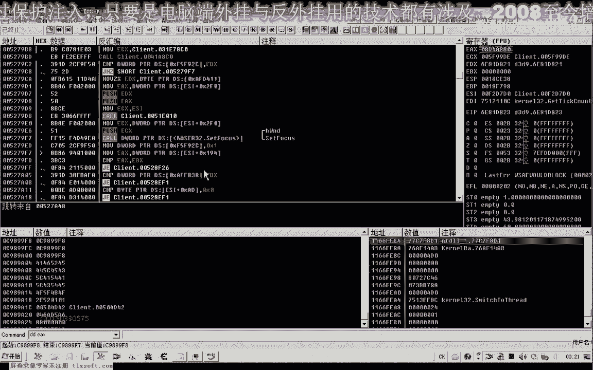

成果啊，这里，好的，那么我们再次来用我们的d来进行附加。

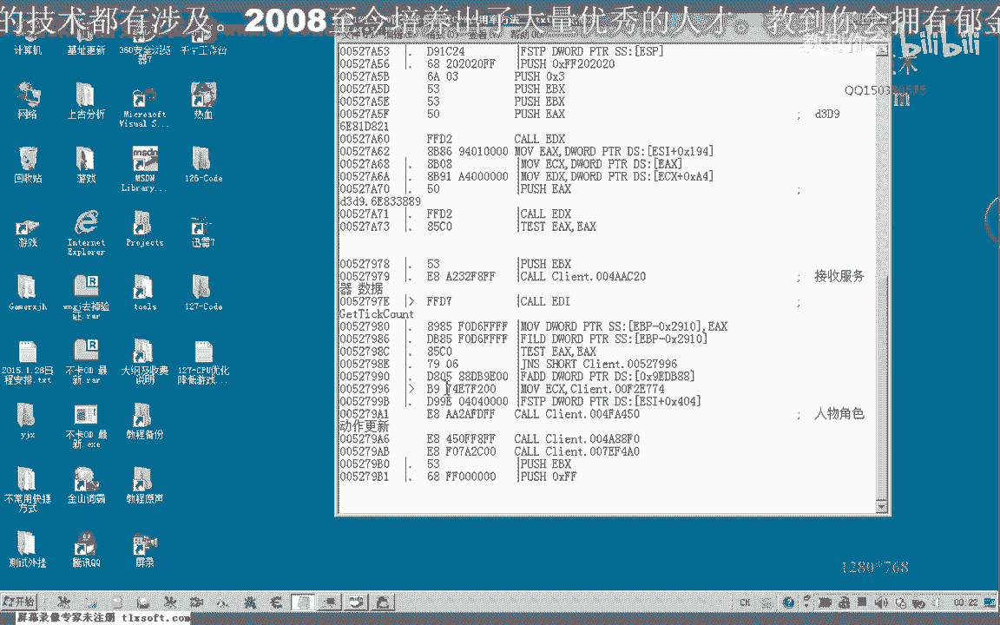

那么这次附加之后呢，我们就注意看一下刚才这些呃更新我们见面的这些函数呢，他是通过什么消息呃来完成的，也就是说他在获取这个消息队列的时候，究竟获取获取到了什么消息。

然后呢才会来执行我们的这个界面的一个更新的一个动作啊，当然我们还要接触呢，呃刚才的这个测试，那么我们需要把这两个库呢嗯进行注释掉，看一下有没有是不是我们界面相关的一些数值。

那么我们可以先把后面这个漏不掉，那么我们可以选中这里呢它只有一个参数，那么我们在这里来下个断点，然后呢再把这几行呢一起落不掉，用lop音乐来填充，填充一下，好的，那么我们先运行一下。

那么这个时候的话我们实际上啊看不出任何的一个效果，那么但是呢前面这里还有一个，那么这里的话我们弄不掉的话，这里需要屏障的话，就是本来是嗯ec那么e c的话，我们从这里评价的话，应该是这里少了一个幺零。

应当是零四，那么我们在这里呢下一个段啊应当是要评价是零碎，名字的话应该是这里有一个谱系，这里有一个谱系，这里还有一个谱系啊，这样来的，那么把这一段让我们解注释掉啊，但是刚才呢我们出错了啊。

不知道是什么原因，然后我们再分析一下。

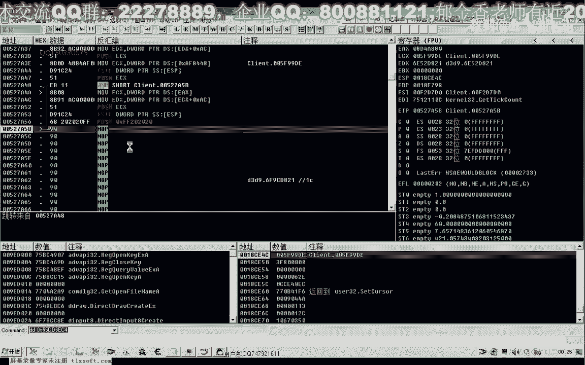

好分析之后呢，从这个地方呢，我们在i t t l s p a c，然后再跑起来，那么这个时候的话，我们发现呢这个呢它也的确是与我们画面呢有一些关系啊，有一些关系与我们贴图是相关的啊。

至少那么这个时候呢整个游戏画面呢就花掉了就花掉了，但是呢这个我们发现了对我们cpu的占用率的话，它并没有下降多少啊，并没有下降多少，但是的话我们可以了，实际上我们可以在这个地方呢呃加上一个。

push and cosleep，这样的话cpu下降的话就会下降多一些，当然这个参数的话，我们还可以调大一些这个参数这里，那么我们可以了，比如说把它改为111，然后再cosleep。

让我们这个主线才能在绘制图形的同时呢，我们让它休息一会儿，那么这个时候我们看一下，那么cpu的占用率的话，实际上就很低了，但是这种占用率的话，它是在我们牺牲的这个画质的这个情况下啊。

那么这样的话肯定不是很呃不是很理想，那么我们还有另外的一种方式也可以，那么主要是我们在这里呢我们要分析一下它的一个，就是他是通过什么消息来处理的，来进行我们的这个呃画面的一个更新。

那么这个消息的话在最前面呢，我们这里嗯应该是注意前面啊，应该是这个地方，那么这里呢有个p嗯，p和message，然后呢他把他的这个取出来的这个消息的话，放到了这个bp减2394这个结构里边，嗯。

因为这个我们看一下pmc，那么这个pk message的话，它这里呢有一个结构啊，它会取出来作为一个输出啊，然后呢存在这样一个结构里面，它的第一项呢是我们的呃这个游戏窗口的句柄，第二个是一个消息的类型。

然后呢其他的几个附加的一些呃相关的参数。

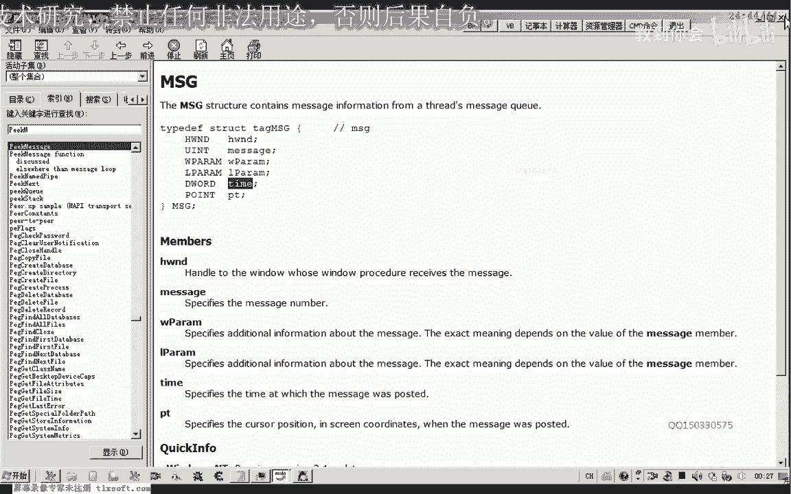

那么我们来看一下，减2934这个地方，那么我们可以在这里来发现有一个九这一段参数呢，我们把它复制出来，然后我们再看一下当前的呃e i p啊，你就是当前的指令地址是在这个地方。

那么这是他执行的一个相关的一个消息呢，会执行到这里好的，那么我们可以撤销钓鱼。

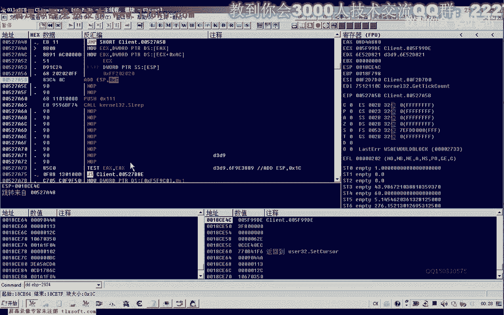

然后让它跑起来，那么这是他执行的一个，这是我们的窗口区别，那么这个窗口句柄的话多半都是我们的游戏窗口的主窗口的一个区别，这是一个消息的一个类型，那么这个消息路线代表的是什么呢。

我们一起打开127克的代码来看一下。

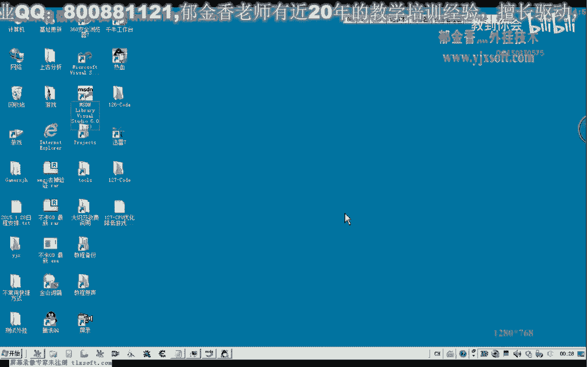

啊这是126克的这个代码，那么我们再来看一下，那么我们转到我们的这个相关的这个消息里边去看一下啊，比如说我们的这个消息w这个log button这一类的啊，那么我们转到这个定义来看一下，往前面移动。

那么这里呢是123117，那么我们看一下113呢，我们在这里找到它它的这个消息类型的话，实际上还是定时器啊，还是一个定时器啊，其他地方呢它有有向这个地方呢发送这个定时器的一个消息啊。

嗯那么实际上它最终呢只是我们的这个spi加加呢。

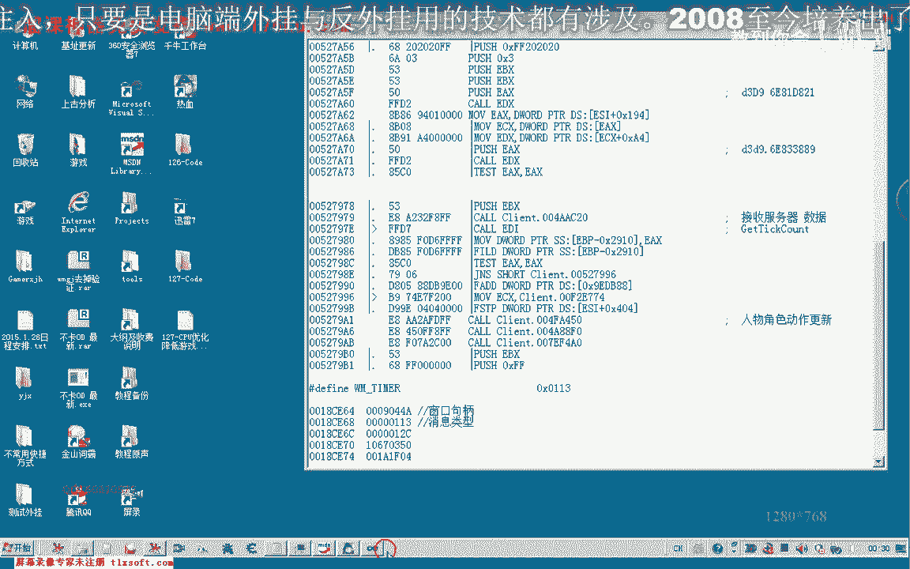

他们又检测到我们的这个定时器，因为spy加加的话，它只能够检测到呃，这个post发送post message发送过来的这一位的这个消息，还有就是系统发送过来的啊，你部分消息他检测的这个消息的话不是很全。

刚才我们这些消息，那么我们再把这些定时器的消息再关掉，再试一下，那么我们看一下嗯，138350 300，然后383 300，那么我们看一下，关掉这些定时器之后，他还有没有这个消息。

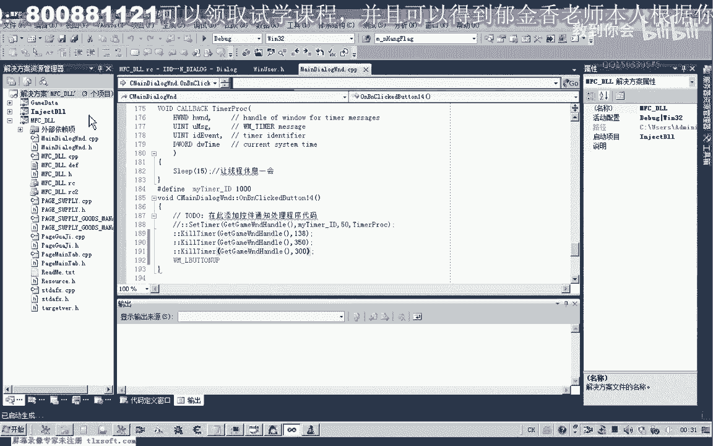

嗯。

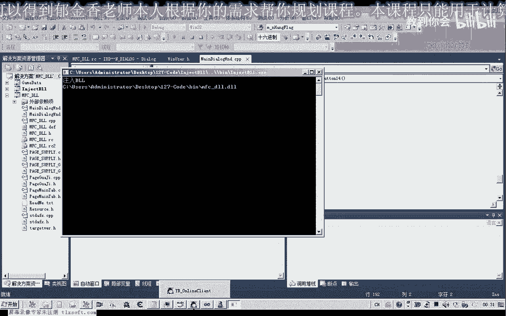

好的，重新进入游戏之后呢，我们再次把我们的这个i加加啊，我们查看一下我们的这个游戏，再来看一下相关的这个消息，然后这里呢我们再修改一下代码呃，5634971056，三四，760。

那我们再核对一下349710，那么我们再次注入我们的代码，那么还有一个701啊，这里还有一个701呢，呃没有被关掉电视器，那么这个时候的话我们来看的话，它相关的相关的这个定时器的这个消息呢就被消掉了。

已经没有了嗯。

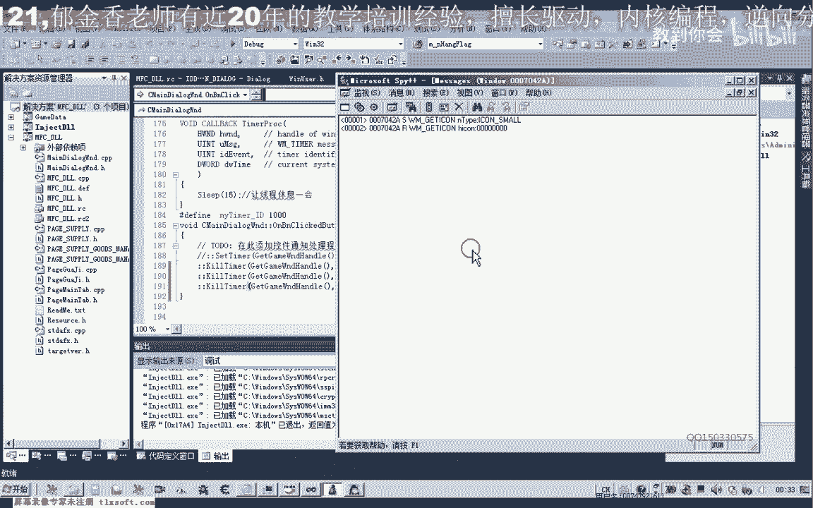

那么我们再用我们的调试器啊，附加看一下它的它的这个游戏界面的一个更新，是在什么地方用到一个什么消息。

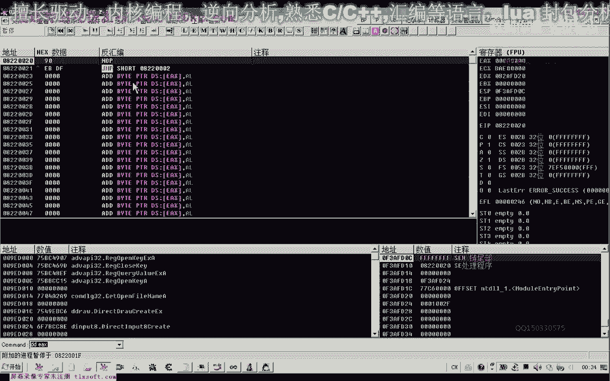

那么再转到我们刚才分析的一个地址，那么刚才这里的这个类型的话，是我们的这个定时器。

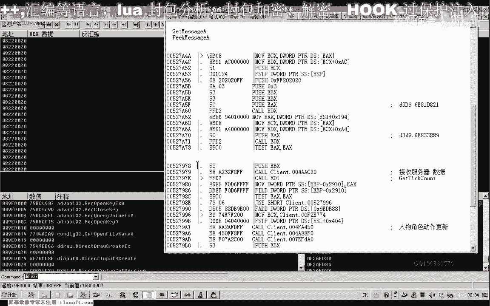

好的，那么我们解锁在这个地方下段来看一下，然后呢我们移到最前边，那么这里的一个pk message啊，我们再来看一下他所在的这个缓冲区，哈哈哈，那么这里的话同样的是113，那我们改一下它的一个数值。

看一下，然后呢我们再带到刚才的地址，再进行下道看一下，那么这个时候的话，同样的进行断下，下一次，那么发现的话，这个地方好像跟我们的这个消息的内心好像没有太大的关系，那么我们再进游戏看一下。

也能够正常的进行移动，啊当然这个时候的话再一次的变成了113，但是我们的定时器已经关掉了，但是呢可能还有其他的这个消息的一个来源，那么像这种情况的话，我们也可以做一个钩子啊，就类似的钩子。

那么只要只要有消息的时候，或者是呃那么我们就在这里边呢做一个判断啊，跟他做一个计时，每个多少时间呢，我们让它呃进行休息一段时间，那么这个呢我们可以用这个tgta计时。

也可以用这个get her count啊来进行一个计时的一个判断，当然这里的话最方便做后壳的话，可能就是这个循环的这个首付啊，因为他每次每刻都要经过这个地方，那么我们可以在这里呢来做相应的这个户口啊。

那么现在的话我们可以在这个地方来做贺卡，我们来看一下啊，首先呃它的流程是这样，那么呢首先他可能在这里的话判断这里有个零，那么这个零的话可能是用来判断这个缓冲区是否有这个数据呃，如果是缓冲区没有数据的话。

他就转到这个get message这里的，因为在这个gt message好像是主赛的啊，他会一直等到我们的这个消息对应的队列有消息存在，然后从里面取出这个消息。

而这个pk message呢它不管有没有消息呢，都会从我们的这个消息对点里面的呃，去这个消息出来啊，那么如果他取消息队列为空，没有消息的时候呢，它取出来他的一个返回值的话是零啊，那么我们再来看一下啊。

嗯它的一个流程呢，第一次他可能会执行这个pk message的pk pk message，如果他没有成功的取得消息呢，嗯那么这里呢他会做一个判断啊，那么为零的话它就跳到这个位置来执行，然后继续五零的话。

它就跳到最后啊，进行一个下一轮的一个循环，还有这两个函数呢，它是向我们指定的这个游戏窗口吧来的这个回调函数里面呢，呃进行相关的一些数据的一些处理，那么在他处理的主要是系统的这个消息。

那么所以说这这两个的话，我们可以把它弄不掉啊，这个地方，那么这个地方抹不掉之后呢，我们可以在这个地方来来做一个贺口啊，那么我们先把这一段啊嗯，用lop来填充哈，再进游戏看一下，对了这个时候最小化的话。

它也是属于我们的系统消息，如果这里呃把它落不掉之后呢。

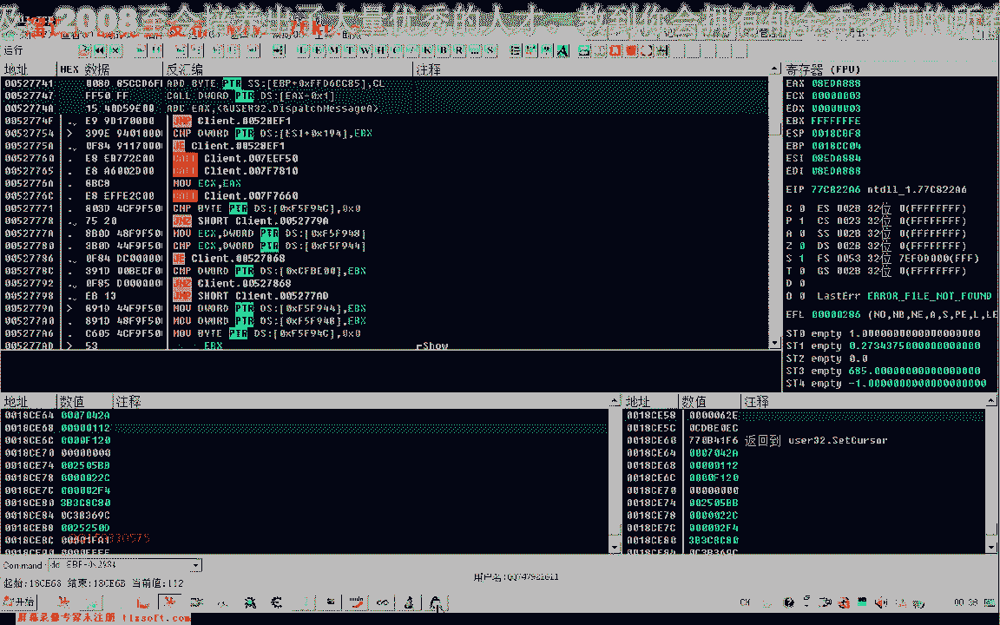

呃游戏呢就不能够最小化了，那么我们需要先把它嗯。

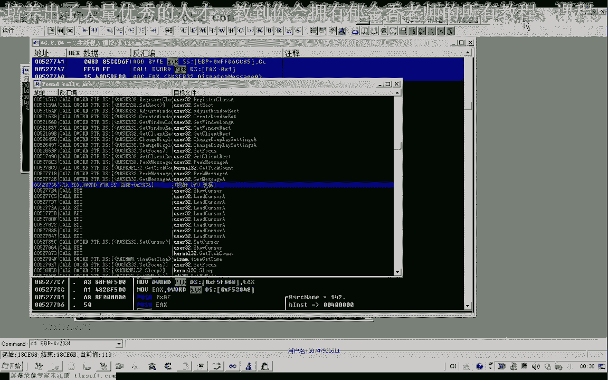

先把这个游戏来显示出来之后呢，再进行这个相关的这个loop啊，这个时候呢我们可以进行啊，no它就没有问题了，但是，当然我们还需要做一些修改，可能，洛普之后我们再来看一下它的这个流程。

那我们把这个跳转呢也把它改一下，这个跳转呢我们也把它弄不掉，再试一下啊，那我们再来看一下，如果这里的话去，取得了之后啊，就会jump到这个地方来执行，那么如果这里我零，那为零的话，应该是没有取到这个呃。

没有取到消息，然后呢就跳过，那么我们要进行loop的话，应当怎么办呢，那么我们但是这个地方哈这个地方的话我们看一下呃，无论是有都是取到这个消息成功之后呢，才会进行这个判断啊。

这里get get message，取消息成功之后呢，会执行到这一句，如果是pcb设计了，他执行之后呢也会到这里去啊，嗯照到这一句之后呢，然后进行这个消息的判断啊，如果为零的话，会跳到这个地方来。

那么最后呢这个地方呢都会被执行，那么这个空啊，如果是被这个消息处理，被处理之后呢，它会跳到最后去啊，那么所以说我们把这个项目给他，先把它弄破掉，这样的话它就没有这个影响，没有相关的影响。

然后我们可以把这个时候呢可以再把这一段呢嗯弄不掉这个货的话，这一段我们落户掉，本来他就要跳到这个地方来执行啊，这段代码本来是要跳到这里来执行，那么我们把它中间的这一部分部分呢，漏不掉的话。

应该是没有关系的，那么这个时候我们看到没有关系，但是这个时候唯一的呢它不能够最小化了啊，就是也不能够移动窗口，他对这些消息呢没有响应的，因为我们刚才这两个函数呢被注释掉了。

那么关于我们最小化以及一些鼠标的一些消息的话，最大化最小化这些系统的这个消息的话，需要通过这两个函数来去解释哈执行，那么所以说我们把它弄不掉之后就没有了，然后呢我们再落不掉啊，这个奖配啊。

这个时候呢也是没有问题的啊，只是唯一的一个缺点，能不能够移动移动，然后我们看一下现在的cpu的占有率的话就要低上很多，啊35左右啊，然后呢我们再再到这个地方进行，让这个主线成本进行一个休息哈。

取消息成功之后的，我们让他休息一下，休息100ms左右，嗯然后呢cosleep，然后我们再来看一下这个时候cpu的占有率的话呃，就要低上很多啊，大概是这个进程的话大概是3~4之间啊，一那么最高呢再三啊。

那么这个时候的话就是比较理想的，那么而且这个时候的话，我们发现的话也不影响我们人物的移动，或者是打怪再打怪这一类的啊，都没有多大的这个影响，好的，那么在这样的处理的话，它应该是最省我们的这个cpu的啊。

这种方式，当然我们呢可以通过我们的这个代码来把这个呃，把这个hook来做得更完美一些，那么这样的话我们看一下，它大概是我们的cpu占用率的3%到4%左右啊，不到5%，那么这样的话理论的话能够实现。

那如果是内存足够大的话，可以开五六十个号都没有问题啊，这样的话当然内存的话一般不可能有这么大，那么我们下一节课呢再分析怎么把我们的这个hook来把它写好啊，像这样的一个hook的一个处理方式的话啊。

毕竟不是很完善啊，不是很完善，那么我们再来看一下他取得的这个消息的一个类型，再分析一下呃，这里取得的这个消息的话，放在这个bp减2934这个结构里面嗯，那么这里的话它有多种的这个消息。

只要取这个消息啊成功了，然后呢我们就就会到这里来执行，那么我们实际上应当对它进行一个过滤呃，有一些消息的话，我们应当是立即处理的，那么某一部分的这个消息呢，我们呃才是区别对待。

那么我们再次转到我们刚才这个图形处理这里来看一下啊。

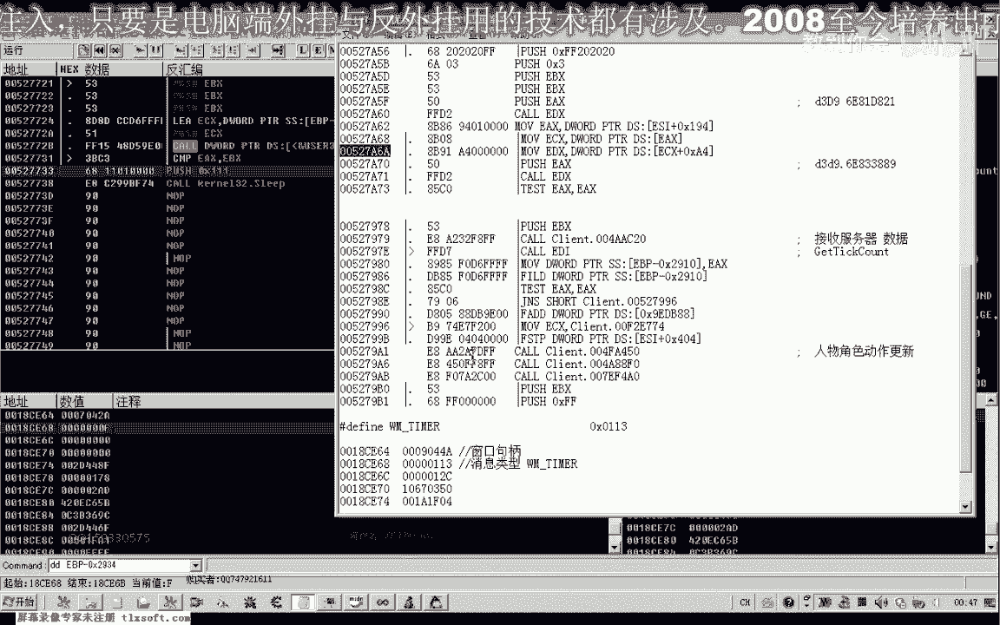

第三第九这个地方，那么最后呢我们是在呃牺牲这个图图形这方面的都可以啊。

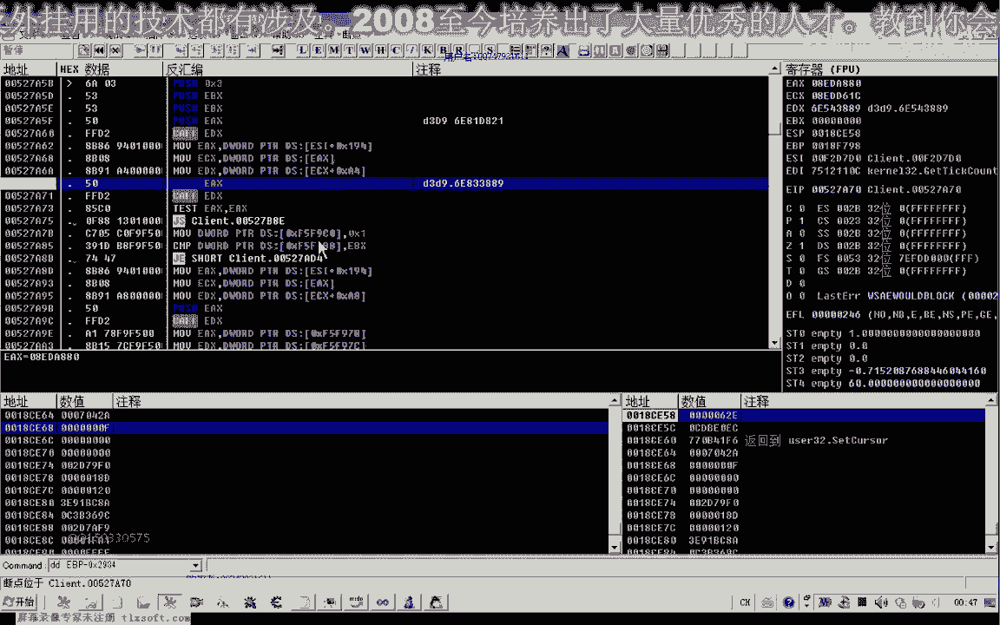

其他的呢我们消息呢马上进行处理，那么我们来看一下0f是什么呃，什么类型的，啊这个0f的话它也是这个界面绘制的啊，当然这个的话呃这个消息的话它也可以作为我们的嗯。

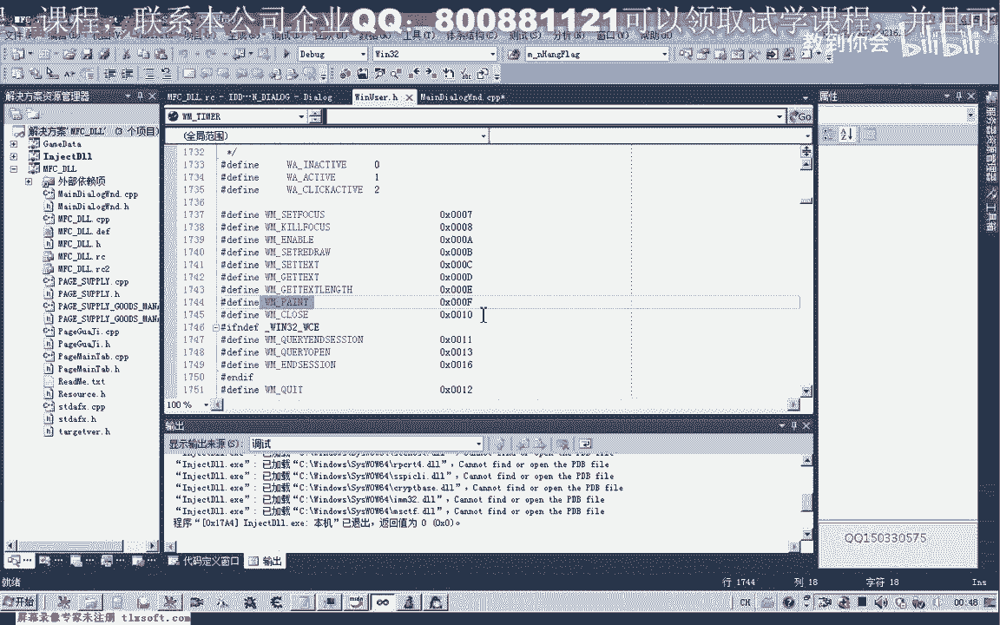

这个户口都是可以的，那么这里的话我们可以来加上一些消息的一些呃序列，哪些消息我们可以就是说哪一个范围，我们可以用来让我们的这个线线程呢啊进行这个休息，哪些消息呢要马上处理啊。

这个时候呢编程的时候可以具体的写在这个hook里边啊，进行一些过滤，好的，那么我们呃进行一个赏识啊，那么另外呢从这里的话来看，他就是一个消息的一个循环，那么我们可以对这个获得的这个消息来进行判断。

那么如果这个消息不是我们呃必须要处理的了，那么我们直接就跳到这个循环的头部呃，进行了下一次循环，你可以这样来处理，当然这个做最终怎么处理的话，需要多做啊，写代码进行测试啊，进行尝试。

那么大概大概的这个原理呢就是这样的，我们一个人可以通过这个sleep呃，那么另外呢我们也可以来呃，通过我们的这个和其他的计时的这个函数来进行一个判断，但是呢我们应当来说的话。

要把我们的这个县城里面的这个时间片啊，把它腾出来的话，最终呢都要用到这个sleep这个函数必须要用到，那么我们才最终能够把这个时间漂亮。

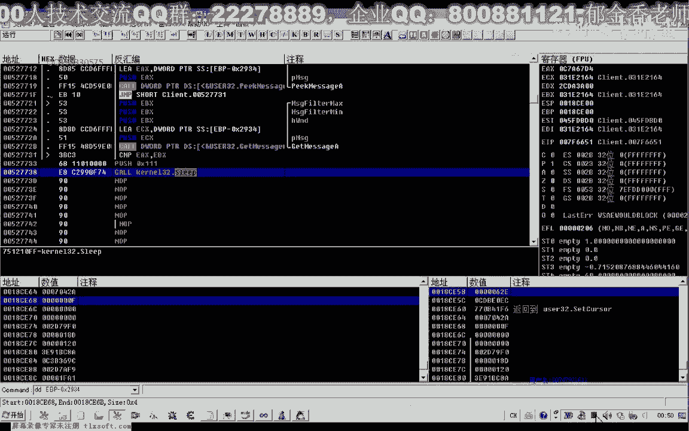

我就把它弹出来，好的，那么我们看一下，把这个代码恢复之后，cp多一个占用率啊，马马上这个占用率绿的话就上来了啊，就是40%左右，差不多我们经过优化之后呢，差不多只有以前的呃。

1/10左右的这个cpu的占用率，而且还不影响我们游戏的呃，这个正常的运行，还有这个挂机这一类的好，那么这节课呢我们就到这里，那么下一节课呢我们再来探讨一下怎么来写这个hook的这个代码。

怎么来进行完善。

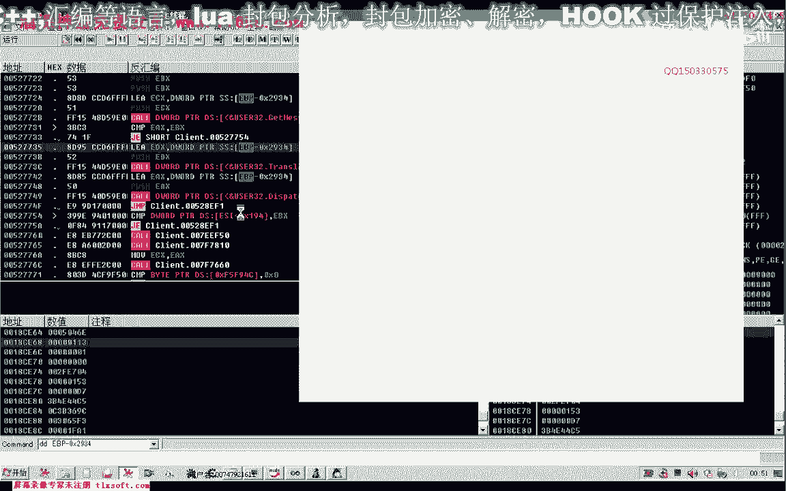

那么我们下一节课再见。