# 课程 P116：CPU优化降低游戏CPU占用率方法二 🔍

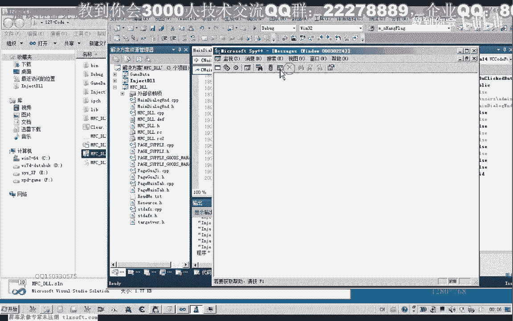

在本节课中，我们将继续学习如何通过分析游戏的消息循环来降低其CPU占用率。我们将使用调试工具定位关键函数，并通过注入代码（Hook）的方式，在非关键消息处理流程中让线程休眠，从而有效降低CPU负载。


---


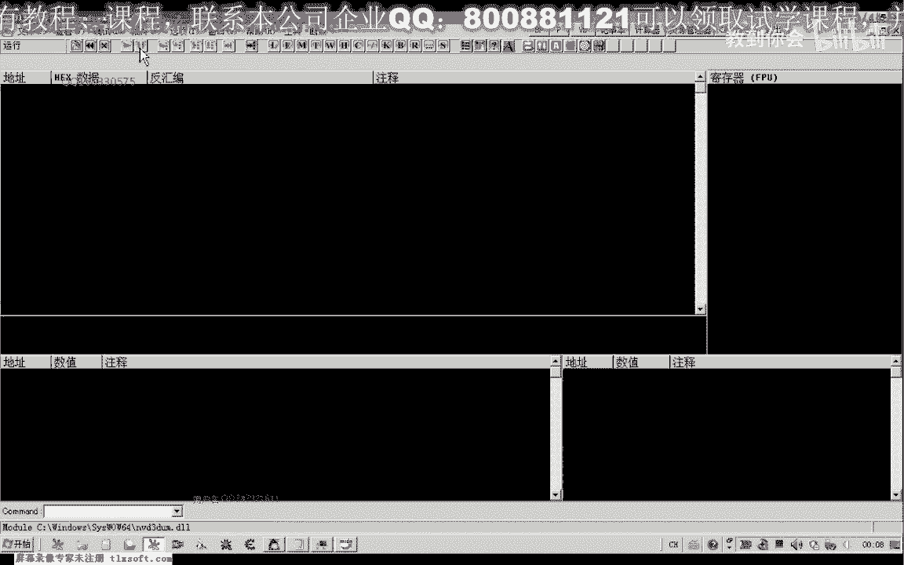


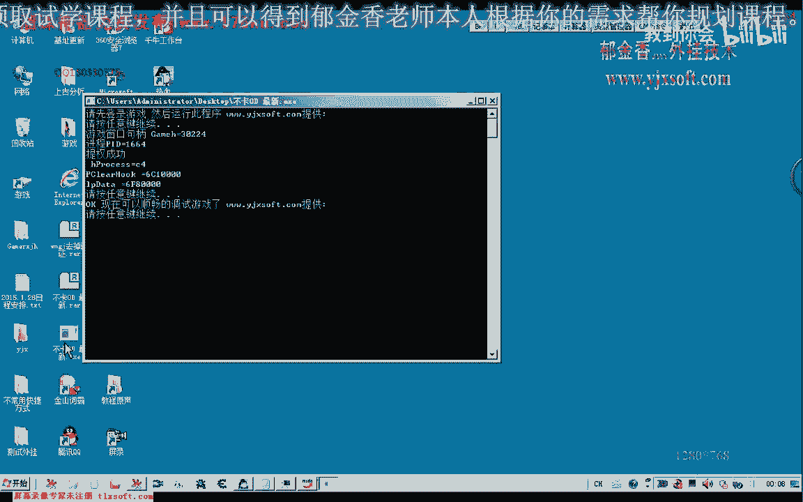

## 概述

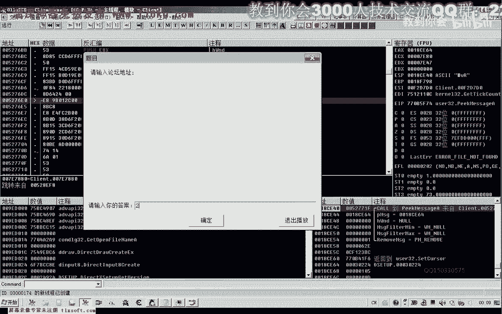

上一节我们分析了定时器与CPU占用的关系。本节中，我们将深入游戏的消息处理循环，定位图形更新和逻辑处理的关键代码，并探索通过干预消息处理流程来降低CPU使用率的方法。

## 分析消息循环

游戏通常在一个循环中处理系统消息，例如鼠标、键盘和定时器事件。这个循环的核心是 `GetMessage` 和 `PeekMessage` 这两个Windows API函数。

*   **`GetMessage`**: 从消息队列中获取消息。如果队列为空，线程会在此处挂起等待，不消耗CPU。
*   **`PeekMessage`**: 同样从消息队列获取消息，但无论队列是否为空都会立即返回。这通常用于实现“不阻塞”的消息循环。

以下是这两个函数的基本形式：
```cpp
// GetMessage 示例
while (GetMessage(&msg, NULL, 0, 0)) {
    TranslateMessage(&msg);
    DispatchMessage(&msg);
}

// PeekMessage 示例
while (true) {
    if (PeekMessage(&msg, NULL, 0, 0, PM_REMOVE)) {
        TranslateMessage(&msg);
        DispatchMessage(&msg);
    }
    // 其他游戏逻辑（如渲染）...
}
```
通过调试器附加到游戏进程，我们在 `PeekMessage` 函数处下断点，可以追踪到游戏的主消息循环位置。


## 定位图形更新代码


在消息循环之后，游戏会执行其核心逻辑，包括从服务器接收数据、更新角色状态和渲染图形。


以下是定位关键代码的步骤：

1.  在 `PeekMessage` 调用后单步跟踪。
2.  观察堆栈和寄存器变化，寻找与图形API（如 `d3d9.dll` 中的函数）或游戏逻辑相关的调用。
3.  尝试临时“NOP”（空操作）掉疑似负责非必要高频更新的函数调用，观察游戏画面和CPU占用率的变化。


通过此方法，我们定位到几个关键函数：
*   一个与角色动作更新相关的函数（`Call_UpdateActor`）。
*   几个与Direct3D图形渲染和贴图相关的函数（`Call_D3D9_Render`）。


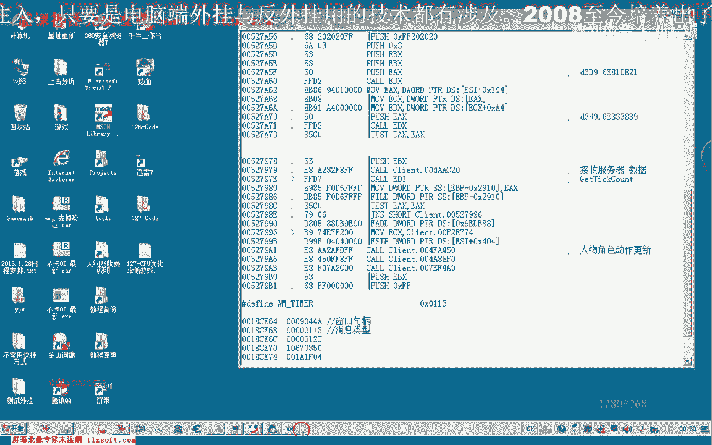

初步测试发现，直接禁用图形渲染函数会严重破坏画面，但CPU占用下降不明显。这说明单纯阻止渲染不是最优解。

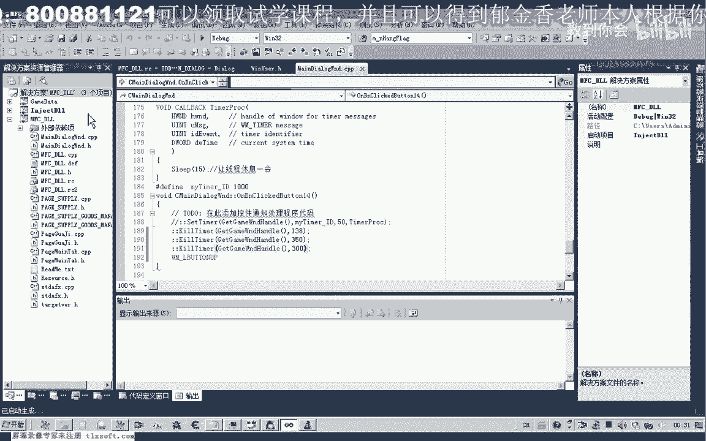

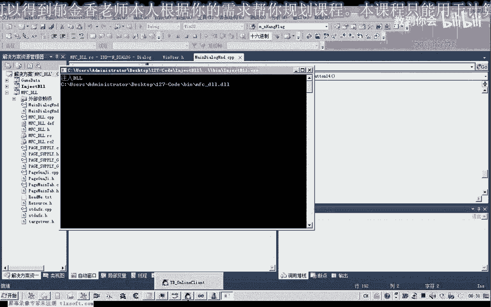

## 优化思路：Hook消息循环


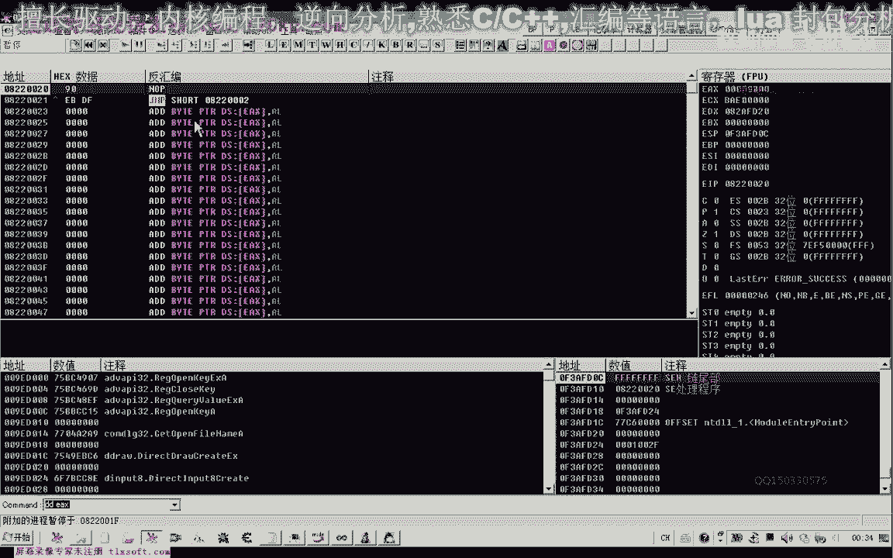

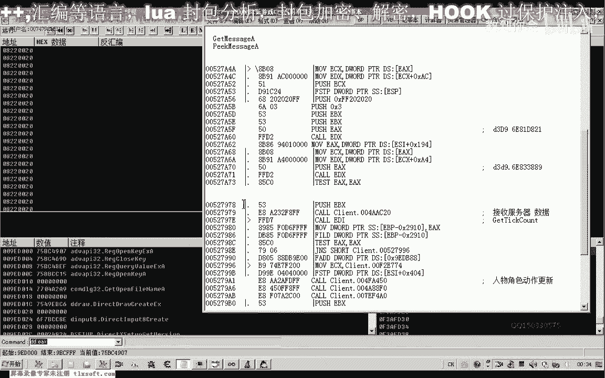

更优雅的方法是在消息循环内部进行优化。核心思路是：**让处理消息的主线程在非关键时期主动“休息”**。

我们分析发现，游戏循环结构大致如下：
```
循环开始：
  调用 PeekMessage 取消息
  如果 取到消息：
      处理消息 (TranslateMessage/DispatchMessage)
      跳转到 循环开始
  如果 没取到消息：
      执行游戏逻辑（如渲染、网络处理）
  跳转到 循环开始
```
当 `PeekMessage` 没有取到消息时（即 `WM_NULL` 或返回值为0），游戏会执行那些消耗CPU的逻辑（如空闲状态下的渲染）。这正是我们可以插入 `Sleep` 调用的理想位置。

以下是修改后的逻辑示意：
```
循环开始：
  调用 PeekMessage 取消息
  如果 取到消息：
      处理消息 (TranslateMessage/DispatchMessage)
      跳转到 循环开始
  如果 没取到消息：
      调用 Sleep(10) // 让线程休眠10毫秒，释放CPU时间片
      执行游戏逻辑（如渲染、网络处理）
  跳转到 循环开始
```


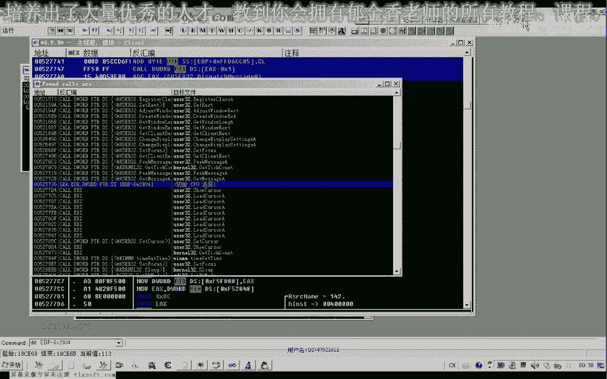

## 实施优化与测试

我们在调试器中直接修改汇编代码，在消息循环中“未取到消息”的分支路径上，插入 `push 0Ah` 和 `call Sleep` 的指令。

优化后效果显著：
*   CPU占用率从约 **40%** 下降到 **3%-4%**。
*   游戏基本功能（移动、打怪）未受影响。
*   但窗口管理消息（如最小化）可能因我们跳过了部分消息派发而失效，这需要在完整Hook代码中精细过滤消息类型来解决。

## 总结与展望

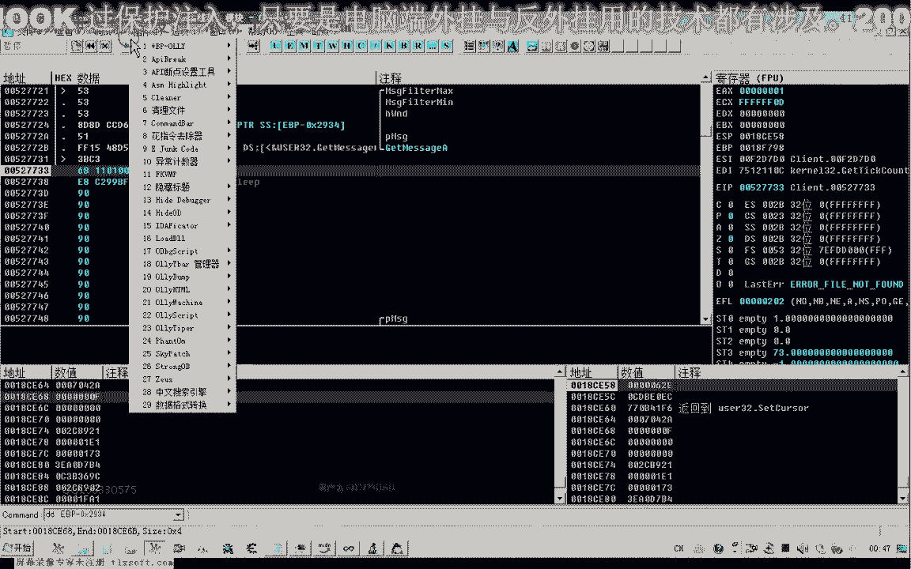


本节课中我们一起学习了第二种降低游戏CPU占用率的核心方法：**通过Hook游戏主消息循环，在空闲处理阶段插入线程休眠**。

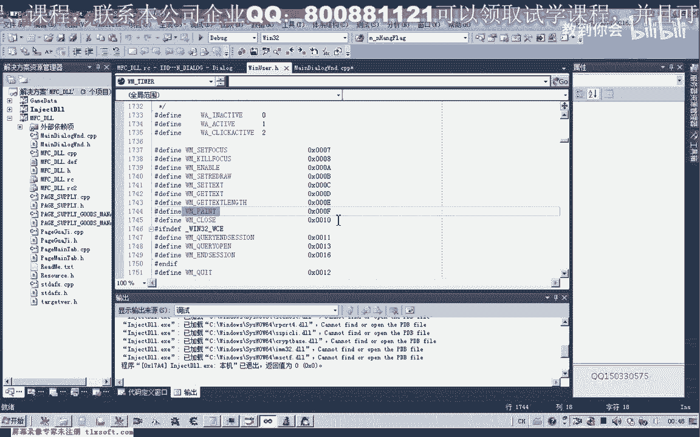

关键要点如下：
1.  **定位循环**：使用调试器找到 `PeekMessage`/`GetMessage` 所在的消息循环。
2.  **分析分支**：识别出“无消息处理”时执行游戏逻辑的代码路径。
3.  **注入休眠**：在该路径上注入 `Sleep` 函数调用，强制线程让出CPU。
4.  **效果权衡**：此方法能大幅降低CPU占用，但可能影响对实时性要求极高的操作，且需妥善处理系统消息以避免功能异常。


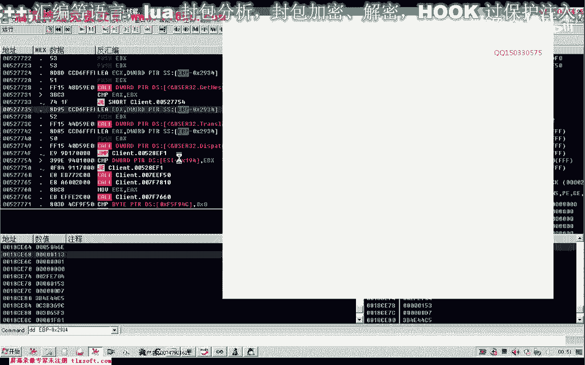

目前我们在调试器中的修改是临时的。下一节课，我们将探讨如何编写一个稳定、完善的Hook代码（DLL注入），并实现消息过滤机制，使优化方案更健壮和实用。