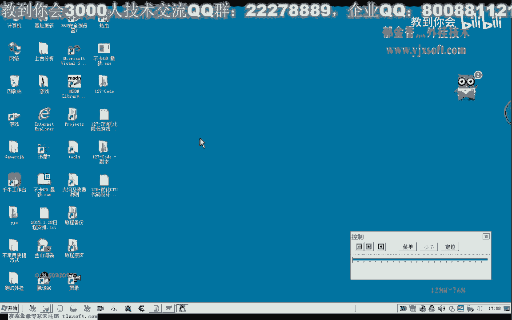
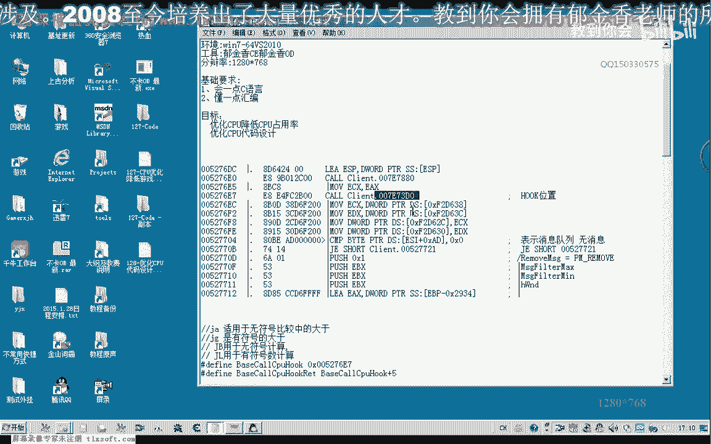
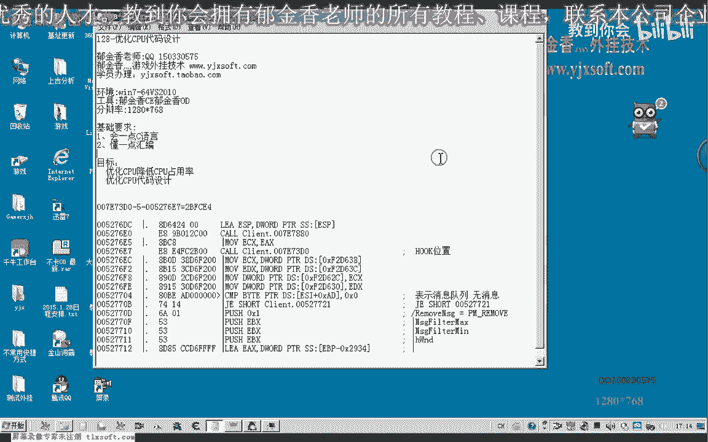
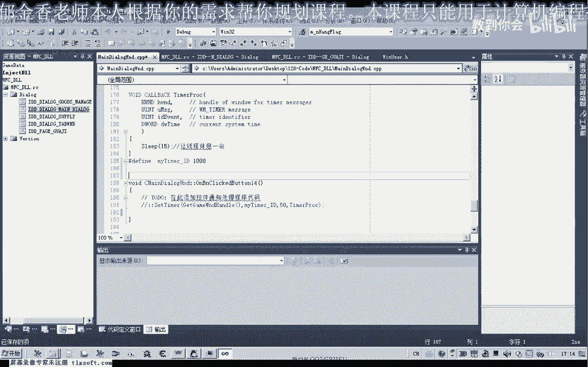
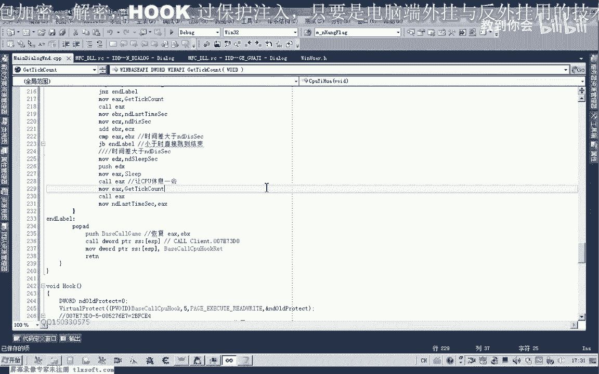

# P117：128-优化CPU代码设计 - 教到你会 - BV1DS4y1n7qF

大家好。

我是郁金香老师，那么这节课呢我们为我们的这个cpu u的一个优化来编写相应的代码，嗯，那么它的原理呢主要就是呃对我们的游戏的主线程呢进行一个贺口啊，嗯那么hook的位置的话。

理论上可以选择在我们整个这个主循环的任意位置啊，但是有一些位置呢它有一些判断可能被跳过了，那么我们选位置的时候呢，呃主要选他能够一直啊在整个循环的头部，那么比较好，那么因为这个循环的话。

它会一直的被执行到嗯，那么我建议的话是选前面哈这两个括号进行一个后口，那么我选择选择的这个贺卡的这个位置呢是第二个空啊，嗯那么选择这个位置之后呢，我们需要做的一些相关的一些准备哈。

第一个呢我们就是把这个地址呢呃提取出来，还有这个扩的地址呢，我们需要提取出来，因为这个地址呢我们首先要写入我们自己的扩的一个呃，函数的一个代码，然后跳转到我们的这个函数里面去。

把我们自己想要的功能完成之后呢，我们还需要还原它的数据啊，也就是要调用这个库啊，因为它的可能呢要处理一些数据或者是有返回值这一些的啊，我们需要把这个整个环境来给它恢复起来，好的。

那么我们先来看一下这个例子之后呢，我们再开始写我们的代码，那么我们看一下现在的一个cpu的一个占有率和游戏呃，现在大概是在30%到40%之间的一个c p u占用率啊，那么我们现在看一下我们的代码。

那么cpu优化的代码注入之后的一个情况，好那么我们点一下优化之后啊，嗯再来看一下进程的一个cpu的一个占有率呃。

大概在4%到6%之间啊，它这个数值那么很小，当然这个数值的话我们还可以进一步的优化，我们只要把相应的参数给它设设置大一点就可以了。

而且在这种情况下的话，呃对我们的游戏的话操作起来的话，感觉呢还没有啊，没有相应的这种就是说呃没有卡的这种情况还是相对的比较流畅，那么我们还可以来通过修改一些参数来实现呢，呃更强的一些优化啊。

那么比如说这个时间的间隔的话，我们可以给它改小一点啊，那么这样的一个优化的话，可能还要占用的cpu呃的这个这个占有率的话还可以下降一两个百分点，好的，那么我们再次来看一下。

那么现在的又下降了一个百分点的样子啊，刚才是最大的数值是6%，那么现在是啊也差不多啊，50块什么啊啊，当然这个参数的话，我们还可以尽量的给它设置小一些，而且这个数字呢我们可以给它设置大一点啊。

这个也就是我们主线程休息的这个时间，我们可以，那么主要就是这两个参数我们需要设置，到时候呢我们可以把它设置成一个进度条的一个形式，那么我们可以看到现在的cpu占有率的话会更低一些哈，嗯。

那么稳定在大概的话稳定在5%到4%的这个区间啊，现在在他，那么我们一直可以看到它的一个cpu的一个占有率好的，那么我们还是来看一下我们的代码怎么编写的，那么关掉之后呢。

我们把呃把第127课的代码复制一下。

那么首先呢我们要设计一个自己的一个函数啊，那么在设计自己这个函数的时候呢，我们首先呢嗯要把它用纯汇编来和书写，那么这两个人我们可以把相关的代码先注释掉啊，保存一下。

然后在这前面这个位置呢我们定义相关的这个变量，以及我们的这个游戏的相关的一个机制。

那么在这里呢我定义了四个变量啊，那么第一个这个变量的话，用来记录了我们上一次啊获得的一个系统时间，然后呢这个也就是我们的时间的一个间隔啊，检测的一个间隔啊，相当于我们的这个定时器啊的这个时间的一个间隔。

那么后面呢这个是我们每次哈判断到这个间隔之后啊，也就是说间隔了这个10ms的这个时间之后呢，那么我们主线成了一个休息的一个时间，让他腾出这个时间票，那么这个呢是用来hook的时候来保存它啊。

之前的这个相关的一个数据，好的，那么我们首先来看一下我们自己的合格代码应该怎么写，那么在这里呢，由于代码比较多哈，我就直接把它复制进去，我们来看一下这个代码的一个构成。

那么首先呢我们在这里呢也是调用一个相应的这个函数，嗯，这里呢我们调用的这个p commet，那么我们以这样的形式来写pk messaga啊，然后呢coex，那么用这种写法的话，可能考虑性会高一些。

那么用它的一个目的呢，我们是检测一下我们的这个缓冲区结构呢，是否有我们的这个相关的消息啊，有没有消息存在我们的这个消息的缓冲区，那么如果然后呢再做一个判断啊，这里呢也就是说不移除这个消息啊。

那么如果是移除的话，可能这个游戏可能会出相应的这个问题啊，然后呢我们在这里做一个判断啊，那么如果这里为零的话，也就是说啊缓冲区内嗯，消息队列一样不存在，那么不存在这个消息的时候呢。

我们就直接就跳出这个函数啊，就不执行，因为没有消息的时候，我们也用不着啊去执行啊，因为没有消息的话，我们直接跳出去就行了啊，只有有消息的这个情况呢，他才会去呃做更新我们游戏的画面呢，或者是做其他呃。

从服务器去读取我们的这个缓冲区数据这一类的，如果消息队列里面没有不存在消息的话，那么我们就不用做后面的这些相应的工作，那么如果有消息存在了，在这里呢我们跟他做了一个判断啊，113，这个我们知道是哪位啊。

定时器的，因为它有很多定时器啊，因为这个消息的种类比较多哈，那么我们这里呢就以这个定时器为例来给他做一个相应的判断啊，当然这一段的话呃不要也可以哈，可能嗯等会我们可以测试一下啊，当然这个呢我们可以呃。

或许前面的这两句呢都不要啊，呃也许也许的话也可以完成这个相同的这个功能啊，那么我们等会儿以测试的为准，而这个2392930的这个数据的话，就是在我们的嗯，这里呢它它本身的建立了一个缓冲区啊。

他用来接收这个数据的是2934这个地方，2934这个地方呢，它是用来存放着我们的这个游戏的相应的这个句柄啊，取得的这个剧本，也就是我要发网这个指定窗口的去评，那么这个位置我们再加上四的话。

那么这里呢就是三零了，因为这里是负数啊，加四了，这里就等于2930，那么2930这个地方呢，它实际上是存放着我们的，游戏啊消息的类型，那么所以说在这里呢我们做了一个比较。

那么如果呢它不是我们的定时器的这个消息的话，那么我们就转到这个标签最后来执行啊，这里是恢复我们的环境，然后呢我们就跳到呃，跳到这个扩的下面去执行，那么这个地址的话，我们可以看到也就是扩的地址交互嗯。

也就是这个地址呢加上实际上就等于ec啊，也就是说我们函数执行完之后呢，就会跳转到ec这个地方呢啊52761c这个地方来执行，那么我们继续看一下。

那么这里呢我们用这个用汇编调用这个get take county，来来获取当前的这个系统计时，那么获得这个系统计时之后呢，我们另外一个last time啊。

那么这个拉点它呢它在最后这里呢用也是用的这个标题，这个抗体呢来获取的这个时间，那么也就是说上一次的这个时间呃，我们呢再加上这个10ms的这个间隔间隔时间啊，加起来之后呢。

我们与当前的这个系统时间呢两个比较，那么也就是说上一次执行这个货的时候啊，执行这段代码的时候呢，与现在第二次执行这个代码的时候呢，它的一个时间差啊，那么做一个比较。

那么如果这个时间差它大于大于我们的这个，这里我们设置的是10ms哈，那么如果大于这个10ms的话，我们就执行下面的这段代码，也就是说让我们的这个cpu呢呃休息一会儿啊，8623678。

那么如果是小于的话，也就是说没有达到我们的这个时间的一个间隔，那么我们就转到这个the label这里来执行，那么the label的话，这里呢也是呃，首先呢是做一个扩的一个恢复啊。

那么这里呢也就是说相当于调用了我们这一句代码啊，因为这一段我们被hook了，实际上这个奇以73d0 这个地方呢他没有被执行到，那么在这里呢我们就相当于是啊后这个7173d0 。

那么这里呢是这个7173d0 的地址啊，啊地址呢我们放到这个e s p里边啊，然后呢我们进行进行这个啊进行功能的调用，为什么这里我们要用push，而不用直接的这个e x e d x这类的计算器。

因为这里呢我们需要保护这个环境啊，那么如果我们这里去调用调用其他的ex 1 b x的话，那么这个环境呢就可以就被破坏掉了，那么这次我们返回这个上一层这个扩的时候的话。

那么我们的e x1 b x这些基层基本破坏掉了，那么在执行这些代码的时候呢，就可能造成错误，那么比如说这个地方它e b x的话，他肯定呢在之前呢有一个数值啊。

那么如果我们在这个库里面用这个e b x来放，存放了这个扩的地址的话，再来进行调用的话，那么在这里传入的参数的数据呢就是错误的，那么所以说这里呢我们可以用这种方式来来进行一个调用啊，用堆栈。

而且这个堆栈呢这里呢我们就像这个堆栈里面写入，我们要返回的这个地址，返回来就看，那么return这里的时候呢，就相当于喊出了我们的这个地址啊，也就是相当于屏占了啊。

因为这个时候呢它的一个地址来恰好也就是我们的嗯这个地址，那么我们大致就是这样的，好的，那么我们另外呢我们要hook的时候呢，呃还有一个问题，也就是要计算这个地址，那么我们计算这个地址的话。

实际上有一个公式，那么我们看一下这后面的这个数据的话，那么实际上呢不是这个扩的这个地址，而这个扩的地址的话，它是计算出来的，它有一个公式，那么实际上是这个当前的地址呃，加上我们当前的这个地址呢。

加上这五个字节啊，那么再加上后边的这个偏移量，最后呢得到的这个地址，那么这个偏移量的话我们要加上的话啊，也不能够直接这样加，那么直接这样加也是错误的，因为呢我们要把它反序过来啊。

那么这个反馈过来的话就是呃因为它的低位是隐士啊，我们应该这样写002b f c14 啊，因为这这样写过来啊，才是他真实的一个数字，那么这样加上之后呢，实际上我们就会等于这后面的这个数值。

那么这个我们可以用计算器来计算一下，那么我们16进制啊，27617，再加上再加上一个2b fc 2比c14 ，啊那么等于，嗯这个时候好像我们计算有点错误啊，我们再把它清掉，重新计算一下。

呃首先我们是把这个复制一下，加上五六，然后再加上我们的2b fc 3比来c1414 ，啊这个时候呢就等于我们最后的这个7173d0 ，那么但是我们现在呢我们需要把我们自己扣的这个地址来，写到这个地方来。

但是呢我们也不能够直接写这个地址，因为如果我们把这个地址写到这里的话，他马上就会崩溃了，那么我们要求出呃我们自己的这个扩的地址啊，比如说我们要把这个地址嗯写入到这个地方去。

那么也就是说我们有一个呃它会是这样一个公式，就有，那么我们把它代入一下，也就是同样的是呃这个当前的这个地址加五加上我们的这个地址啊，理论上啊加上我们的呃加上一个问号的一个地址。

那么最后呢等于我们获得这个地址，那么我们反过来求的话，这个问号这个地址呢也就等于我们的呃这个当前的地址的话，他要去解，要去捡物，然后去剪掉我们的呃这个地址啊，这样来实现，那么所以说它最终的代码的话。

呃求得要写入我们这个扩的这个地址的话，那么就是这样的一个公式来计算的话，那么这个地址呢就是我们要写入的一个地址，嗯嗯嗯这个地址是我们要写入的一个地址，那么这个我们要写入的地址呢，我们先把它放到ex里面。

嗯，然后呢对这个空加一的这个地址来进行写入啊，那么这里是写入，当然在之前呢我们这里呢是保存它原有的这个数据，把它保存一下，因为我们后边呢我们啊恢复这个hook的时候呢。

我们需要把这个保存的这个地址来要写回去啊，让他还原啊，让他还原，当然前面的这个呢我们还有一个函数来，是要打开我们的这个页面属性啊，让它有一个呃呃可读写的一个属性嘛，至少有一个写的属性。

不然的话我们直接往这个呃里边写的话，它本来只有一个啊可以执行的一个属性，那么我们往这个页面里面写的话就会出错，好的，那么我们一起来看一下啊，把这个号口以及这个2号可能啊这两个函数我们粘贴进去。

那么在这里呢我们用后口，那么在这里呢我们添加暗号的代码，那么我们先给你生成一下，那么这里呢我们还需要来定义一个变量啊，那我们看一下是不是对，在这里，啊这上一节课遗留的这个消息呢，我们需要删掉。

好的看一下现在cpu的一个占用率43%啊，然后我们优化一下，看一下，这个时候呢cpu呢马上他的这个占有率了啊，就低下来了啊，大家看我们看一下是多少，那大概是3%到4%的样子，那么我们进去看一下。

那么这个时候的话，同样的呃一点都不影响我们这个游戏的呃这个可操作性啊，二，好的，那么这节课呢我们就讲到这里哈，那么下一节课呢我们在为我们的这个cpu优化的呃，呃专门写一个页面啊，配上相应的进度条。

对相关的两个参数来进行调节就可以了，那么我们可以调节的参数呢一共有两个，你控制一个是这个休息的时间，一个是这个间隔啊，那么你只要调到这个火势的位置了，那么就能够最大的优化了我们的这个cpu。

因为如果是你的这个cpu速度越快的话，那么这个值呢可以调的越大啊，那么这个值可以调的越小，那么这个间隔时间的话，理论上的间隔时间越小的话，那么呢能够起到越好的一个优化效果啊。

那么这个休息的时间呢越大越能够起到一个优化的一个作用，好的，那么这节课呢我们就讲到这里。

