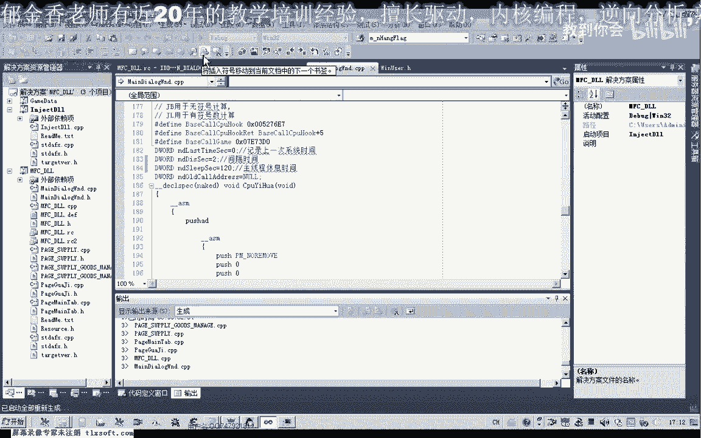
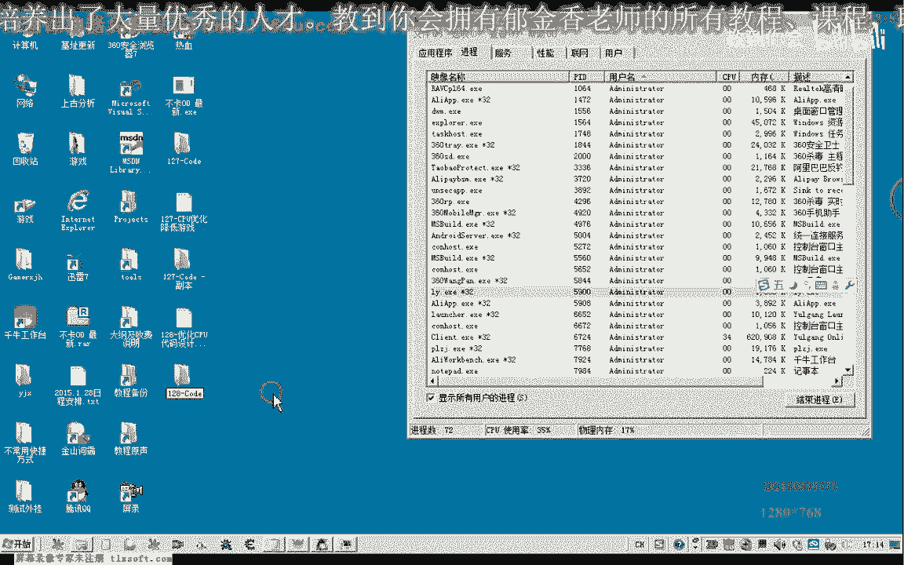

# 课程 P117：CPU 代码优化实战教程 🚀

在本节课中，我们将学习如何通过 Hook 游戏主线程来优化其 CPU 占用率。我们将从原理分析开始，逐步编写代码，并最终实现一个可显著降低 CPU 使用率的优化模块。


## 概述与原理


上一节我们介绍了 CPU 优化的基本概念，本节中我们来看看具体的实现原理。核心思想是 Hook 游戏的主线程循环，在特定位置插入我们自己的代码，让线程在空闲时“休息”，从而降低 CPU 的持续占用率。


理论上，Hook 点可以选择在主循环的任意位置。但为了稳定性和效果，最好选择一个能确保每次循环都被执行到的位置。本教程选择在循环头部附近的第二个空指令位置进行 Hook。



## 代码实现步骤



以下是实现 CPU 优化的主要步骤。


### 1. 准备工作与变量定义


首先，我们需要定义几个关键的变量，用于控制时间间隔和保存状态。


```cpp
// 定义关键变量
DWORD g_dwLastTime = 0;     // 上一次记录的系统时间
DWORD g_dwInterval = 10;    // 检测时间间隔（毫秒）
DWORD g_dwSleepTime = 1;    // 线程休息时间（毫秒）
BYTE g_OldCode[5] = {0};    // 用于保存被 Hook 地址的原始数据
```

### 2. 编写自定义 Hook 函数

我们的自定义函数需要用汇编编写，以确保对执行环境的精确控制。该函数的核心逻辑是：检查消息队列，若非必要（如无消息或非定时器消息），则让线程休眠。

```assembly
MyHookProc:
    // 保存现场
    PUSHAD
    // 检查消息队列
    PUSH 0
    PUSH 0
    PUSH 0
    PUSH 0
    CALL DWORD PTR [PeekMessageA]
    TEST EAX, EAX
    JZ EXIT_FUNC
    // 检查是否为定时器消息（示例，可选）
    CMP DWORD PTR [EBP-0x2C], 0x113
    JNE EXIT_FUNC
    // 获取当前时间
    CALL DWORD PTR [GetTickCount]
    MOV EBX, EAX
    // 计算时间差
    SUB EBX, g_dwLastTime
    CMP EBX, g_dwInterval
    JB EXIT_FUNC
    // 达到间隔，让线程休息
    MOV EAX, g_dwSleepTime
    PUSH EAX
    CALL DWORD PTR [Sleep]
    // 更新上一次时间
    CALL DWORD PTR [GetTickCount]
    MOV g_dwLastTime, EAX
EXIT_FUNC:
    // 恢复现场并跳回原函数
    POPAD
    JMP g_dwHookRetAddr
```

### 3. 计算并写入 Hook 地址

Hook 的关键是计算正确的跳转地址并写入目标位置。我们不能直接写入绝对地址，需要根据相对偏移来计算。

**公式**如下：
假设当前指令地址为 `CurrentAddr`，原跳转偏移为 `OriginalOffset`，我们的函数地址为 `MyFuncAddr`。
我们需要计算的新偏移 `NewOffset` 为：
`NewOffset = MyFuncAddr - (CurrentAddr + 5)`

以下是实现代码：

```cpp
void WriteHook(DWORD dwHookAddr, DWORD dwMyFuncAddr) {
    // 1. 保存原始字节
    ReadProcessMemory(... , dwHookAddr, g_OldCode, 5, ...);
    
    // 2. 计算新的跳转偏移
    DWORD dwNewOffset = dwMyFuncAddr - (dwHookAddr + 5);
    
    // 3. 修改内存页面属性为可写
    DWORD dwOldProtect;
    VirtualProtect((LPVOID)dwHookAddr, 5, PAGE_EXECUTE_READWRITE, &dwOldProtect);
    
    // 4. 写入跳转指令 (E9) 和计算出的偏移
    BYTE jmpCode[5] = { 0xE9 };
    memcpy(&jmpCode[1], &dwNewOffset, 4);
    WriteProcessMemory(... , dwHookAddr, jmpCode, 5, ...);
    
    // 5. 恢复页面属性
    VirtualProtect((LPVOID)dwHookAddr, 5, dwOldProtect, &dwOldProtect);
}
```

### 4. 恢复 Hook

当需要卸载优化功能时，必须将原始指令写回，恢复游戏代码的原本状态。

```cpp
void Unhook(DWORD dwHookAddr) {
    // 恢复内存页面属性
    DWORD dwOldProtect;
    VirtualProtect((LPVOID)dwHookAddr, 5, PAGE_EXECUTE_READWRITE, &dwOldProtect);
    
    // 写回原始字节
    WriteProcessMemory(... , dwHookAddr, g_OldCode, 5, ...);
    
    // 恢复页面属性
    VirtualProtect((LPVOID)dwHookAddr, 5, dwOldProtect, &dwOldProtect);
}
```

## 参数优化与效果

通过调整 `g_dwInterval`（检测间隔）和 `g_dwSleepTime`（休息时间）两个参数，可以微调优化效果。

*   **间隔时间 (`g_dwInterval`)**：值越小，检测越频繁，优化可能越细腻，但开销会略微增加。
*   **休息时间 (`g_dwSleepTime`)**：值越大，CPU 休息得越充分，占用率下降越明显，但需注意不要影响游戏响应。

通常，CPU 性能越强，间隔可以设得越小，休息时间可以设得越大，从而达到最佳的优化效果。最佳参数需要根据具体游戏和硬件进行测试。

## 总结

本节课中我们一起学习了 CPU 代码优化的实战方法。我们从原理出发，分析了 Hook 主线程的思路，然后逐步实现了自定义 Hook 函数、地址计算与写入、以及环境恢复的完整代码。通过调整两个关键参数，我们可以有效将游戏的 CPU 占用率从较高的水平（如 30-40%）显著降低（如 3-6%），同时保持游戏的流畅操作。


下一节课，我们将为这个优化器创建一个配置界面，添加进度条来方便地调节这两个参数，使其成为一个更完善、更易用的工具。