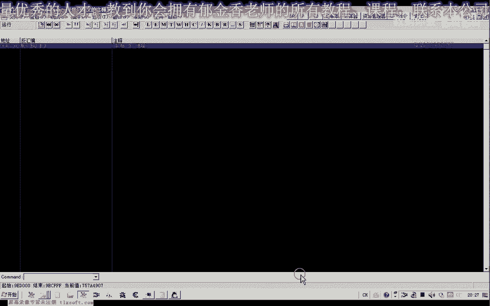
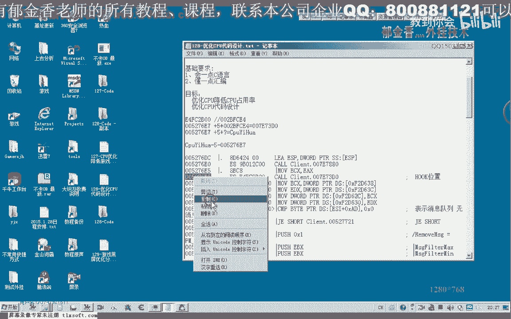
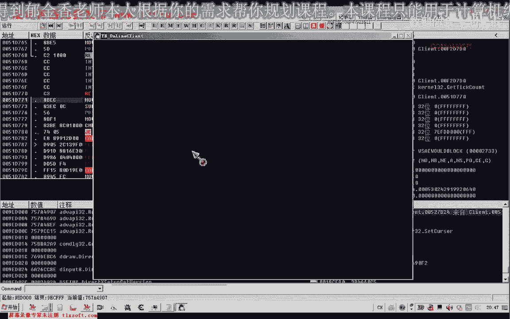

# P118：129-游戏黑屏优化分析 - 教到你会 - BV1DS4y1n7qF

大家好，我是郁金香老师，那么这节课呢我们一起来分析啊，呃游戏的黑屏优化的一个处理，那么我们要分析这个黑屏相关的这个数据的话，我们可以接着之前的这个cpu优化的相关数据来继续的一个分析。

那么我们的入手的话，主要还是从我们的游戏的主线程开始分析，那么这是一种思路，那么另外一种思路呢，我们可以从游戏的所有这个对象嗯去分析嗯，但是另外一种分析的手法的话挺难上，可能要困难一点。

那么我们要去分析这个对象的属性啊，这一类的呃，做一个对象的一个偏离，那么我们首先呢我们从这个游戏的主线程来分析一下啊，因为我们的游戏主线程呢，它这个循环里面呢它分了很多块呃。

肯定就有涉及到我们的这个屏幕画面的一个更新的啊，相关的一个库。

那我们先附加到游戏里边，这不。

那么我们看一下啊128克的相关的一个分析哈，这个合格的位置我们先转到这里。

那么这是我们的主线程的这个循环，那么我们从这里来开始分析，那么这是我们主线程循环的这个扣，那么这个括后面的话我们呢当时有一个注释的一个地方嗯，就是我们我们找一下，好像是这个地方涉及到我们这个绘制相关的。

我们在这个地方下个断点，然后我们看一下断不下来哈，是这个地方看另外有一个类似的一个地方，这是他们，那么我们从这里往后跟，那么一般来说的话，我们这个就是画面的一个更新的话，都有一些时间函数相关。

比如说这个get to account，还有一个tgt t，还有一个是他，一提他那么这两个函数的话都是与时间相关的，它要计算一个时间差，那么多久的时间呢，我们更新一下这个画面，好。

那么我们先备注一下这节课，我们的目标是黑屏化分析，那么我们从这里呢继续啊，下了段之后呢，继续往后面跟一下，当然不是说他每次他都会呃更新这个数据，那么有有时候呢我们需要多跟几次，因为它有很多很多的跳转。

那么可能是某一次循环呢，它才是绘制我们的这个呃游戏的界面，那么这里呢也是一个计时啊，计时的我们给它的注释一下。

好继续往后面给一下，那么实际上我们这个计时呃，前后计时的这几个函数呢，我们可以来，那么像这里呢也有很多函数啊，那么我们可以对这些函数来进行，就是说呃loop啊，我们试一下它与我们的这个图片的绘制啊。

呃界面的一个绘制有没有关系，那我们再来看一下它有没有参数，好那么这个框呢也没有参数，我们也把它弄不掉，看我们的游戏界面呢，那这个时候我们就不能够移动了啊。

那么这个的话说明的话它实际上是我们移动相关的一些数据啊，那么这个也是与我们界面呢有关系的，那么我们把它注释一下，嗯，嗯切画嗯，可能是负责和移动人物这一类的啊，这一类的一个画面的一个更新。

那么我们在继续看一下后面这个库，这个库看来也是没有参数的，那么在这个库的话我们可以看到啊，这里我们可以点击呃，但是我们的人物呢它不会有这个动作哈，那么我们在这里点击一下啊。

但是我们的人物呢呃这个动作的啊相关的它没有了，那么可能这个过程就是我们人物啊动作相关的，实际上你看他还是在执行相关的动作，只要只是说我们这个课把它弄不之后呢，它相相关的移动的这个动作呢没有了啊。

这个时候啊，那么这这几个呢都是人物相关的，应当是啊这三个空啊，88888，那么这三个扩的话应当就是我们呃人物动作相关的这个空，那么我们现在的话如果要做这个黑屏的这个分析的话。

那么我们还要找到来绘制我们场景，还有建筑啊这一类的呃相关的这个空，那么我们在这个地方来下段哈，呃再继续往后面跟，然后呢这里也有一个扣啊，那么我们进去看一下呃，这个括它有几个参数，这个扩呢有四个参数。

那么我们再退回来，在这个地方呢，我们或者进这个库之后呢，我们这里呢提前跟他return银色啊，呃做一个堆栈的一个平衡，然后呢再跳回来，然后我们跑起来之后呢，再看一下，那么这个时候呢。

我们暂时没有发现与我们这个呃图像相关的这些数据啊，你没有发现，那么从这里来看的话，好像我们是呃这个怪物对象好像被隐藏掉了啊，那么我们再继续恢复一下，一般恢复之后的话，我们的这个怪物对象呢还是没有出来嗯。

那么我们再来看一下有没有其他的地方，我们有没有好考，再分析一下，那么这里本来应当是有很多怪物的，那么我们小退一下，再进来看一下，那么我们从这里下段呢，我们还是继续的往往下看一下嗯，再弄平一下这个孔。

再测试一下，看它与我们的这个怪物有没有关系，那么这个时候呢我们发现了所有的怪物呢，这个人物呢都不动了啊，那么这里的话应当是人物啊，怪物这一类的呃，画面的一个更新，人物角色啊，怪物，相关，好。

那么我们再来看一下后边，那么这里的话有一个time get time哈，理论上它也是有一个什么对象啊，思路的一个更新，那么我们再次测试一下，在这里呢我们你看一下，让他跑起来。

那么这个扣的话看来是就是说那个怪物死亡之后，他的一个一个数据的一个更新，应当是那么在这个数据，如果我们这个扣如果return了，那么怪物呢就不会死亡啊，看起来的话，那这个时候的话我们就攻击之后的话。

他就死亡了，哈的这个相应的这个怪物，好那么这这个事呢，我们怪物啊应该是对象死亡的这个扩，那么我们把它记录一下，嗯1333333，那么如果这个空我们被hook啊，或者是不调用它的话。

那么怪物呢我们攻击它之后呢，他就不会死亡哈，就不会死亡啊，从我至少是从我们这个呃本机上来看，它应该是没有死亡好，那么我们接着再往后面分析，那么这里呢我们是一个也是画面相关的啊，上一节课我们有分析了。

这个是一个第三第九的相关的，也是画面相关的，那么这个呢当然具体是一个什么空，我们还不知道，在这里呢我们也进去一下，进去之后呢，我们看一下它的返回参数是多少，那么是一岁，我们也把它注释一下啊。

好那么我们再让它跑起来，那么这个我们可以看到它是一个有画面的话贴图啊相关的，那么也都是与画面相关的，那么这个贴图的话应该是也是与我们黑屏啊相关的一个空，嗯这个是场景，我们暂时跟他取名一下啊。

呃场景贴图在这里，我们再下一个断点，然后f7 呃进了，那么这个理论上的话是一个场景的一个贴图的一个空，这个可能的话可以用来做我们的黑屏的一个优化嗯，嗯，好那么下面这里还有一个括，我们在这个段啊。

这个地方呢下段看一下，那么这个地方呢也是另外一个这个d3 d9 画面相关的一个数据啊，那么我们先来看一下嗯，这个我们看它的一个返回值是多少，需要屏障，那么这个的话我们可以看到他们有这个参数。

直接直接就return了，我这前面有一个参数额比腾零四还有一个参数，那么我们就来看一下这个地方，那么这两个结合起来的话，可能是我们的这个场景的一个贴图相关的一个动作啊，而且我们可以看到这里的话。

它也不影响我们的人物的移动啊，这一类的好，那么我们再回过头去哈，在这个地方再下一个段，那么我们进去看一下，那么这个地方我们把它恢复啊，看一下，那么从这里来看的话，应该是前面一个括号才是与我们贴图相关的。

那么这个库的话看不出来有什么作用啊，暂时，那么这个库的话我们暂时来看不出有什么这个作用啊，在这里，那么我们也先把它恢复，都把它注释一下，这两个地方，好的，那么这两个，然后呢我们继续往后面再看一下。

那么看一下这个空，我们跟进去看一下f7 。

那么这个扩的话也只有一个参数，那么我们就看一下，你这那么这个扣的话，我们就可以实现一个黑屏的一个处理，我们发现整个屏幕就黑掉了，好的。

那么这节课呢我们暂时呢就分析到这里了，那么我们暂时呢可以认为呢呃这个扩就是我们黑屏处理的一个扩，嗯嗯嗯，那，么我们还可以给一下后面的这个库，也可以看一下，这个好像是定时的啊。

这个与这个没有时间相关的这些数啊，可能与我们的这个黑屏的话没有多大的这个关系，从这个库这里来看的话，它是一个高精度的，好像是一个定时的，下面的呃方面的一个函数，这个函数呢平时用的比较少，那么我们看一下。

那么sd里面它的一个说明，那么从他的这个说明来说的话，好像是一个定时的啊，用来计时多少多少毫秒啊，这个是一个地址，是屏幕的一个当前什么屏幕的一个地址。

好的这个函数呢我也没有用过啊。

呃那么这节课呢我们暂时就分析到这里哈，目前的话我们就认为呢呃这个库哈应当就是可以处理我们黑屏的，那么我们把它把落p掉，或者是嗯做一个return，就是说不执行这个函数里面的好像来就可以了。

实现我们的黑屏的一个处理，那么这个时候呢整个屏幕呢就黑掉了吧。

但是呢我们看走路的话，不知道这个时候有没有影响寻路这类的，也没有影响，你们发现这是刚才黑屏状态下面我们的点的这个寻路，这是，好那么这节课呢我们就暂时就分析到这里，那么如果我们是要写那个这个功能的话啊。

就从这里来hook这个这个库，那么也可以把前面的这几个库来都hook掉，呃，也可以啊，那么可能的话前面这两个库呢是一个常见的场景的一个处理，那么最后呢这个库呢呃才是负责了一个场景的一个绘制啊，好的。

