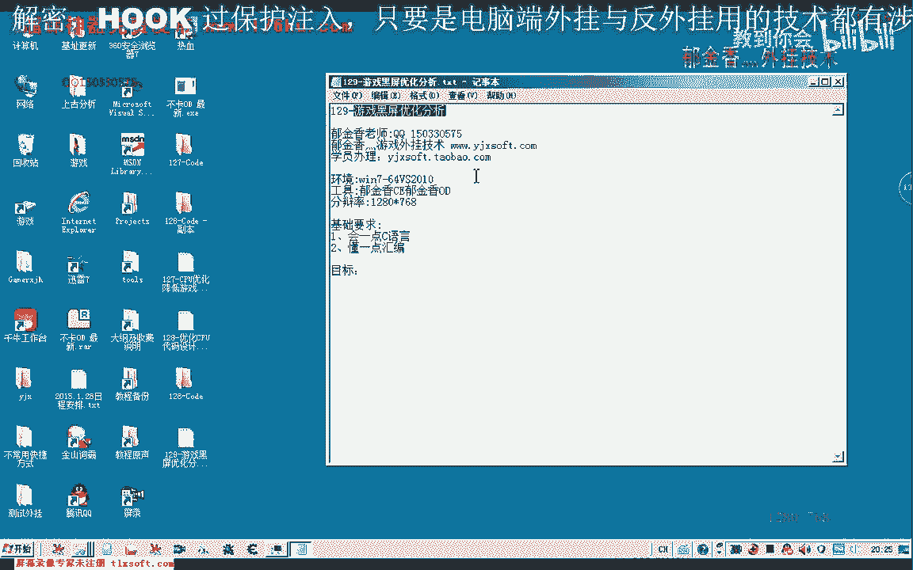
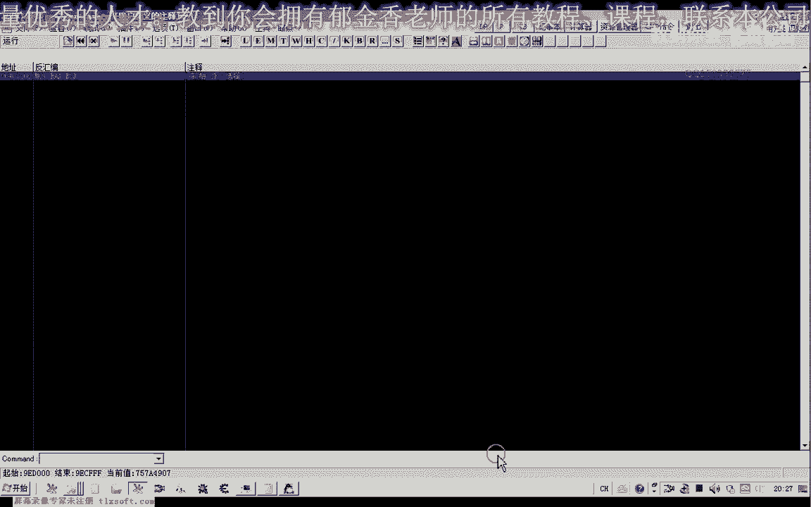
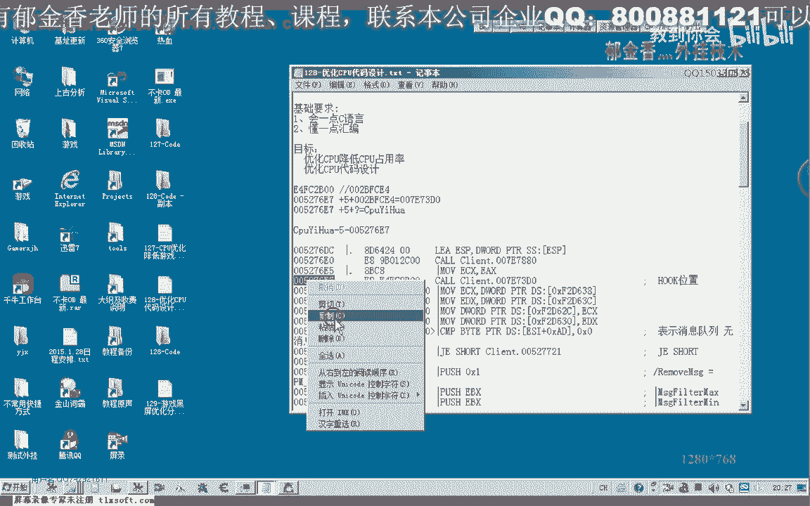
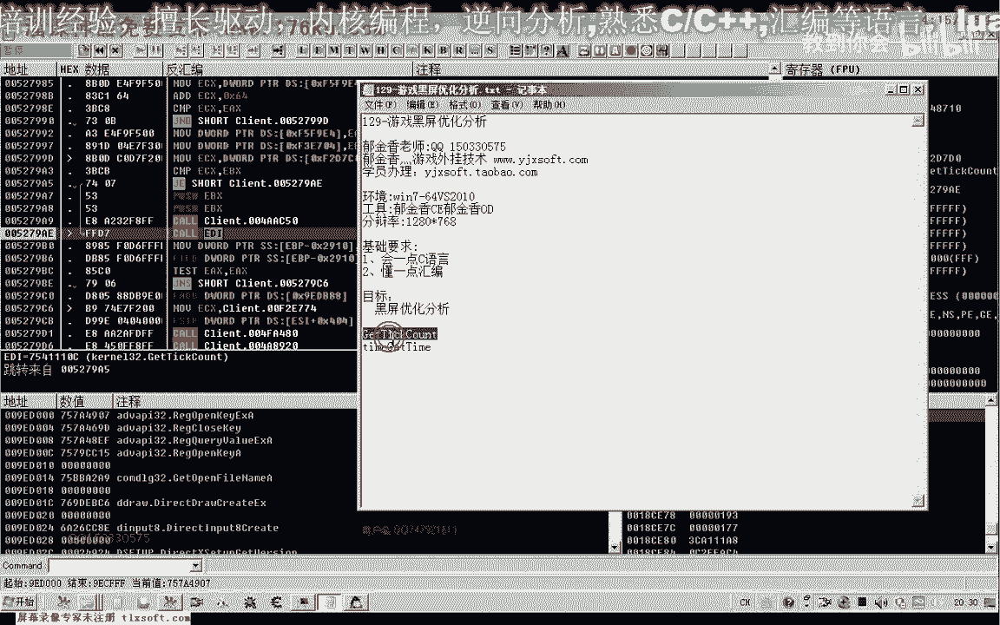
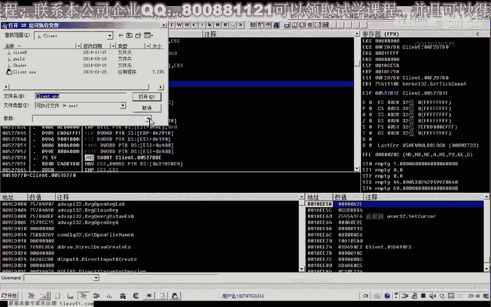
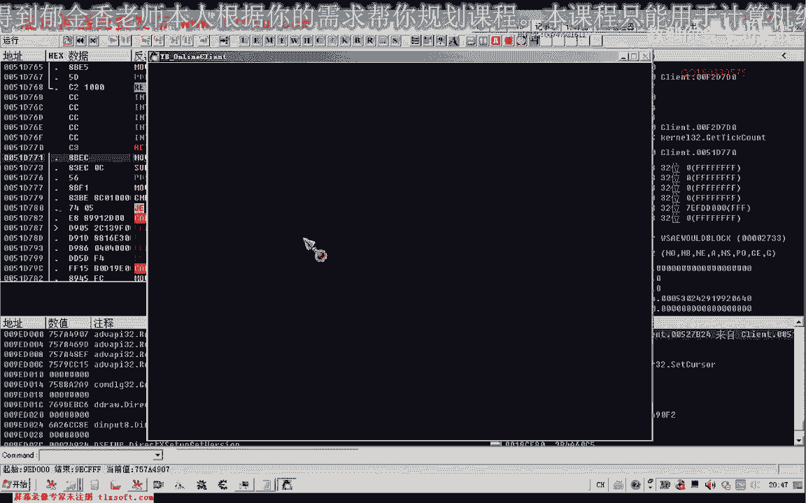
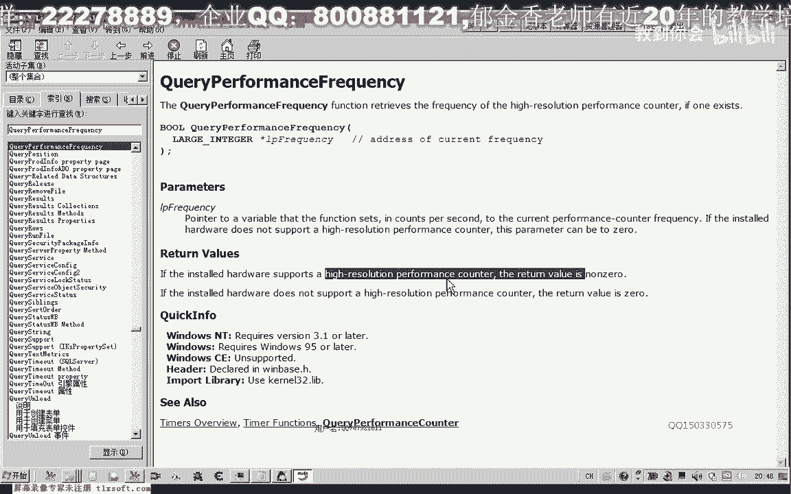
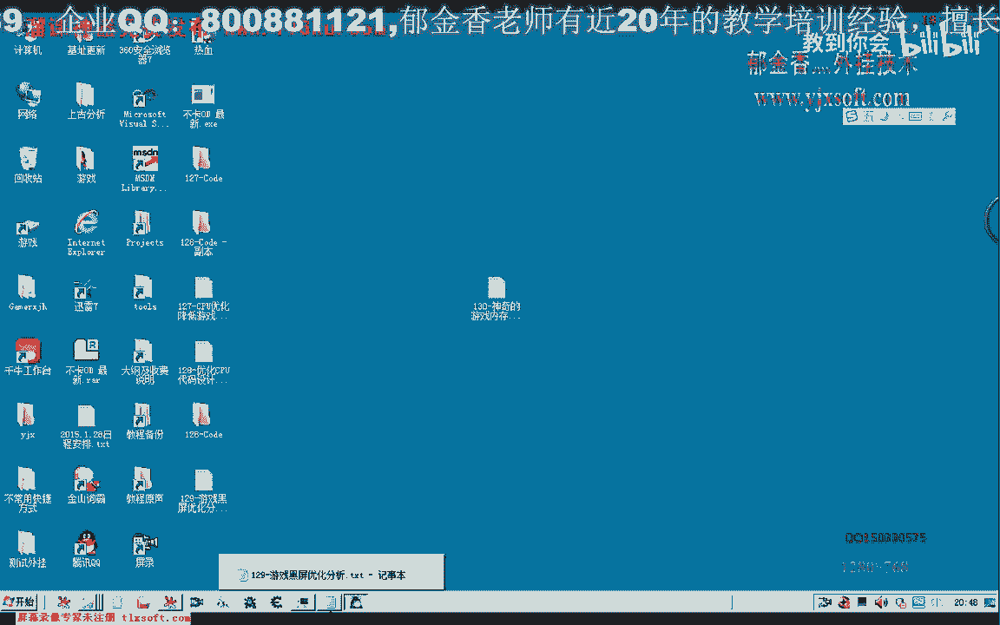
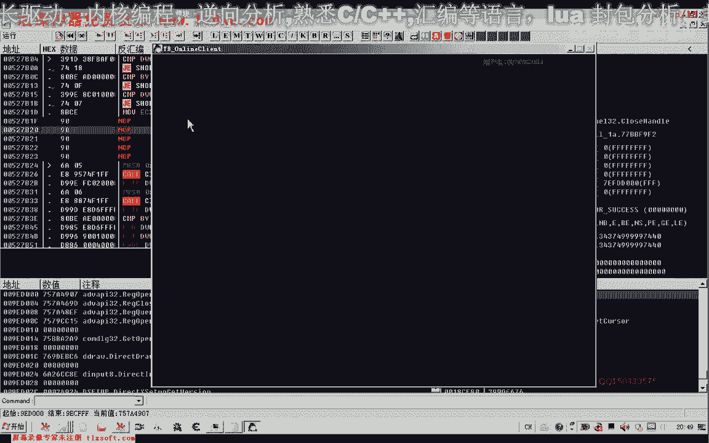

# 课程 P118：129-游戏黑屏优化分析 🎮

在本节课中，我们将学习如何分析并定位导致游戏黑屏的关键函数。我们将从游戏主线程的循环入手，通过逆向分析，逐步识别出与画面绘制、角色动作、场景贴图以及最终黑屏效果相关的核心函数。

---

上一节我们介绍了CPU优化的相关分析，本节中我们来看看如何针对游戏黑屏现象进行优化分析。我们的入手点主要是从游戏的主线程循环开始。

首先，我们需要附加到游戏进程。

接着，我们查看主线程的循环代码。这是分析画面更新的起点。

在主线程循环中，通常会有与时间计算相关的函数，用于控制画面更新频率。例如：
*   `GetTickCount`
*   `timeGetTime`

这些函数计算时间差，决定何时更新画面。我们的目标是找到负责绘制游戏界面的具体函数。

我们在疑似绘制相关的代码处下断点，并逐步跟踪执行流程。画面更新并非每次循环都发生，可能需要多次跟踪才能找到正确的绘制调用。

在跟踪过程中，我们遇到了多个函数。以下是初步分析的一些函数及其可能的作用：

*   **函数A**：可能与角色移动和界面更新有关。Hook此函数后，游戏角色无法移动。
*   **函数B、C、D**：这三个函数可能与角色和怪物的动作更新相关。Hook后，角色和怪物的动作会停止。
*   **函数E**：可能与怪物死亡后的数据更新有关。Hook后，怪物被攻击后不会死亡。
*   **函数F**：是一个D3D9相关的函数，与画面处理有关，可能是场景贴图的一部分。
*   **函数G**：另一个D3D9相关函数，参数较少，具体作用暂时不明。

我们继续向后分析，发现了一个关键函数。

这个函数只有一个参数。当我们尝试Hook或直接返回（`return`）此函数时，整个游戏屏幕变黑。

因此，我们可以初步判定这个函数是实现黑屏处理的关键。它很可能负责最终的场景绘制或提交。

之后我们还看到一个与高精度计时相关的函数 `QueryPerformanceCounter`，根据MSDN说明，它用于获取高分辨率性能计数器的值，通常用于精确计时，与黑屏处理直接关系不大。

在黑屏状态下测试，游戏寻路等功能似乎未受影响。

---

本节课中我们一起学习了游戏黑屏优化的分析思路。我们从主线程循环入手，通过下断点和跟踪执行流，逐步筛选并识别出与角色动作、怪物状态、场景贴图相关的多个函数，并最终定位到一个关键函数。通过Hook或绕过这个函数，可以实现游戏画面的黑屏效果。若要编写黑屏功能，可以从此处入手。