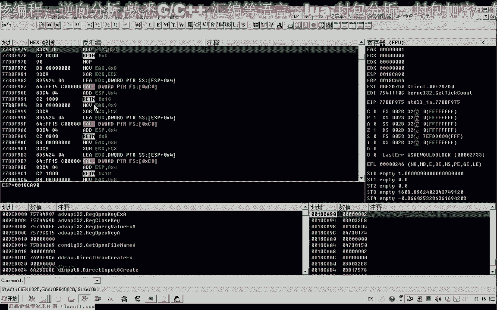

# 课程 P119：真正的黑屏优化 🖥️

在本节课中，我们将学习如何通过逆向分析，定位并实现一个能显著降低游戏CPU占用率的“真正黑屏”优化方法。我们将分析关键函数，区分“伪黑屏”与“真黑屏”，并学习如何通过Hook技术实现优化。

---




## 回顾与起点

上一节我们分析了与游戏建筑物隐藏相关的数据。本节课我们将从上一节找到的相关地址继续深入分析，目标是找到负责画面绘制的核心函数。

我们首先打开上一课（129课）分析的数据。从相关地址继续跟进，目标锁定在可能包含游戏对象或建筑物画面更新的函数库中。这个函数可能在库内部，也可能是单独完成的。

## 分析关键函数

我们首先转到上一课分析的黑屏相关函数库中查看。

以下是上一课分析的黑屏函数，我们将从这里继续向下跟踪。

按下F8单步执行，我们观察这个函数。上一课已跟进过，它内部没有循环，主要包含一些定时相关操作。

我们继续向下执行，发现另一个函数调用。我们跟进到这个函数内部查看。

首先，我们观察`ECX`寄存器的值。从上下文看，`ECX`指向的是我们的人物角色对象。这个函数可能执行与人物角色相关的操作。函数内部有`GetTickCount`等计时函数。这个函数体量较大，实现的功能可能较多。


另一种分析方法是直接观察堆栈`ESP`值在执行前后的变化，而不必深入函数内部。这可以帮助我们判断函数的参数数量。


执行前，`ESP`值为`0x148`。按下F8执行该函数后，`ESP`值变为`0x3A`。计算可知，堆栈变化了`0x10E`（即`0x148 - 0x3A`），这通常意味着函数清理了其参数。通过计算，可以推断它大约有3个参数。

由于该函数后面还有可能引发错误的语句，我们可以选择跳过它。具体方法是修改代码，直接跳转到地址`0x27BBE1`处执行。这样我们就跳过了这个函数调用。

我们将这一修改记录下来，然后重新启动游戏进行验证。

## 验证与定位

我们再次转到分析的目标地址。

首先，在此处设置一个跳转指令。

由于此处没有参数压栈操作，我们跳转后无需恢复堆栈。

再次运行游戏观察。此时，这个函数暂时看不出与绘图界面有直接关系。

我们继续向后执行。接下来会遇到一段与`D3D9`相关的操作，这里也可能是界面绘制的关键部分。

我们主要观察执行该函数后堆栈`ESP`的变化。执行前`ESP`为`0x54`，执行后变为`0x8`。因此，我们可以让`ESP`的值增加`0x4C`来跳过此调用。由于指令空间可能不足，我们可以考虑直接NOP掉这几条指令。

我们在此处下断点，观察`ESI`寄存器的值。`ESI`的值可能不属于常见的游戏对象，因为其偏移`+8`处的数值过大。它可能是与游戏界面相关的某个数据结构。


此时，我们观察游戏画面。画面变成了**真正的黑屏**，与上一课的效果不同。同时，CPU占用率变得非常低，大约只有3%。这表明我们找到了实现**真正黑屏优化**的关键点。

撤销修改后，CPU使用率立刻回升。因此，实现真正黑屏优化的关键函数调用就在这个地址：**`call d3d9.xxxxxxx`**。

我们可以直接Hook这个`D3D9`函数调用的地址，来实现黑屏优化。


## 区分“伪黑屏”与“真黑屏”


上一节课我们分析了一个“黑屏”函数，但那是“伪黑屏”。本节课我们找到了实现“真黑屏”优化的核心函数。

“伪黑屏”函数虽然能使屏幕变黑，但CPU占用率并未显著下降。其函数特征如下（作为特征码参考）：
```
// 伪黑屏函数特征
call some_library_function
// ... 其他操作
```


而“真黑屏”函数位于`D3D9`调用处，Hook此处能同时实现黑屏和降低CPU占用。其附近可能有明显的字符串可用于特征码定位。

此外，在图像更新后，还有一个函数调用可能用于发送消息或挂起线程。如果只NOP掉这个函数，虽然能达到黑屏效果，但CPU占用率不会下降，因此它属于“伪黑屏”函数。

**核心结论**：需要同时NOP掉`D3D9`绘图调用和其后的特定挂起/消息函数，才能实现CPU占用率显著降低的“真正黑屏”。

## 总结

本节课我们一起学习了：
1.  **回顾分析**：从上一课的数据地址继续深入。
2.  **函数分析技巧**：通过观察堆栈`ESP`变化判断函数参数，以及使用跳转或NOP跳过特定调用。
3.  **定位关键函数**：找到了位于`D3D9`调用处的、能实现**真正黑屏优化**（显著降低CPU占用）的核心代码位置。
4.  **概念区分**：明确了“伪黑屏”（仅画面变黑）与“真黑屏”（画面变黑且CPU占用降低）的区别及实现原理。


关键实现在于Hook以下公式描述的核心调用：
```
Hook(Address_of_D3D9_Draw_Call) -> NOP 或 Return
```


下节课，我们将在此基础上，分析如何实现游戏内人物或建筑物的隐藏功能。


---
**注**：教程中涉及的地址和特征码因游戏版本和环境而异，需在实际分析中动态确定。