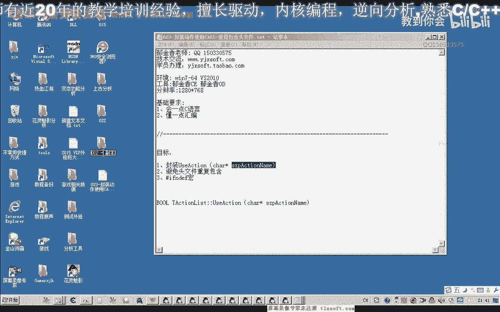
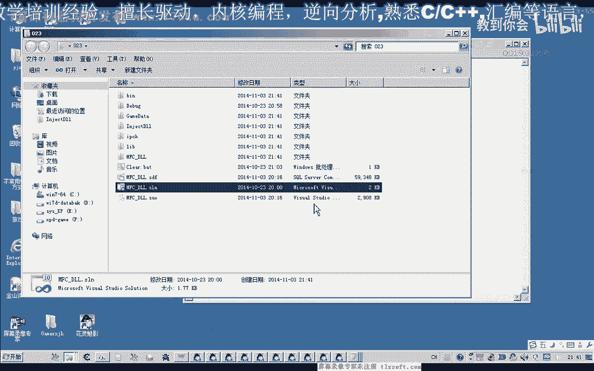
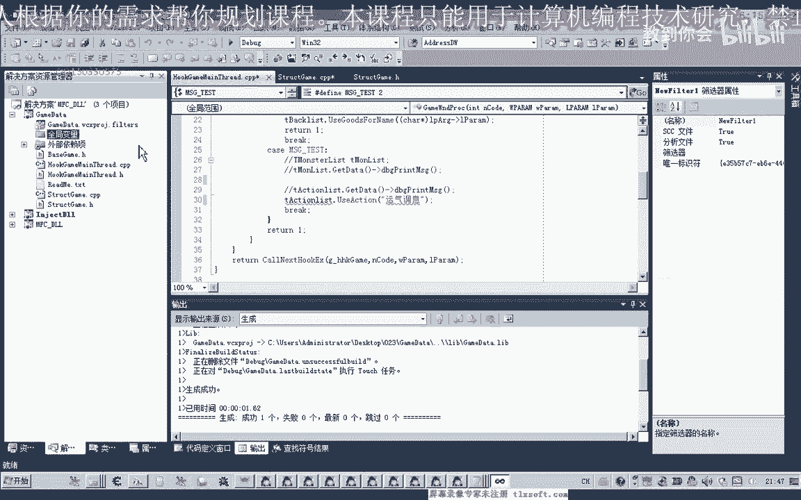
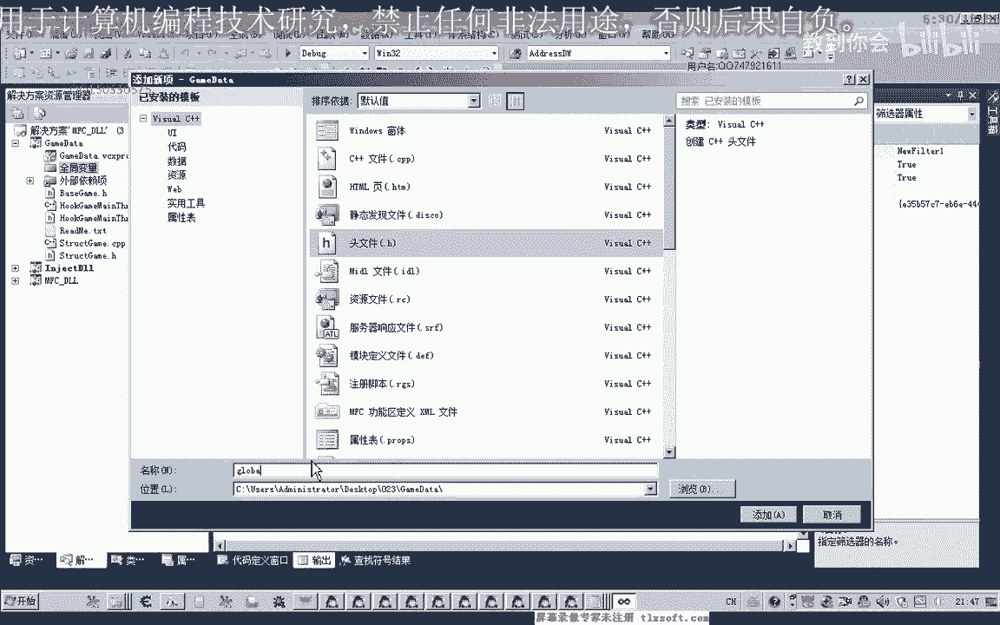
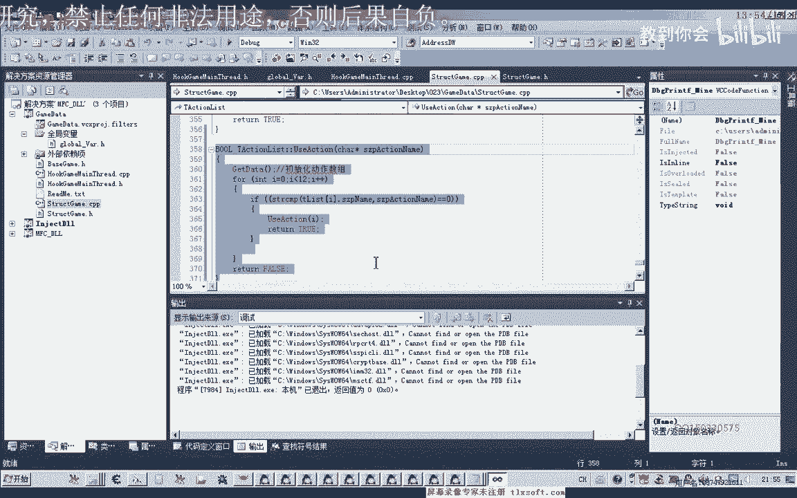

# 课程 P12：封装完善动作使用CALL与避免重复包含头文件 🛠️

在本节课中，我们将学习如何封装和完善游戏动作的调用函数，使其更易读、更易用。同时，我们还将探讨一个重要的编程技巧：如何避免因重复包含头文件而导致的编译错误。通过本课的学习，你将能够编写出更健壮、更易于维护的代码。



---



## 完善动作调用函数

上一节我们介绍了如何调用游戏中的动作。本节中，我们来看看如何封装一个更便捷的函数，通过动作名称来执行对应的操作。

我们打开第26课的代码，目标是创建一个函数，它接收一个动作名称作为参数，然后执行该动作。


首先，我们需要遍历动作数组，找到与传入名称匹配的动作下标。找到下标后，就可以调用之前编写的执行函数了。

以下是实现该功能的核心代码逻辑：

```c
int i;
for (i = 0; i < 12; i++) {
    if (strcmp(g_ActionList[i].name, actionName) == 0) {
        // 找到对应动作，使用其下标
        UseAction(i);
        break;
    }
}
```

这段代码中，`g_ActionList` 是存储所有动作信息的结构体数组，`actionName` 是传入的参数。我们使用 `strcmp` 函数比较字符串，如果相等，则调用 `UseAction` 函数并传入找到的下标 `i`。

为了使代码更清晰，我们可以在调用前对字符串比较函数 `strcmp` 进行初始化操作。当然，也可以将初始化步骤直接写在循环内部。

---

## 优化：使用全局变量

在测试时，我们发现每次调用函数都需要创建一个结构体对象，这很麻烦。为了解决这个问题，我们可以将常用的结构体对象声明为全局变量。

我们创建一个专门的头文件（例如 `GlobalVars.h`）来存放这些全局变量的声明。






在这个全局变量单元中，我们定义动作数组、背包数据等所有需要全局访问的变量。定义之前，需要包含相应的结构体头文件。

```c
// GlobalVars.h
#include “ActionStruct.h” // 假设动作结构体定义在此头文件

// 声明全局动作数组
extern Action g_ActionList[12];
// 声明其他全局变量...
```

这样，在其他源代码单元中，只需包含 `GlobalVars.h` 即可使用这些全局变量，而无需再单独包含 `ActionStruct.h`。

---

## 避免重复包含头文件 🔄

当我们尝试在多个地方包含同一个头文件时，编译器可能会报“重定义”错误。这是一个常见问题。

为了解决这个问题，我们可以在头文件中使用“包含守卫”或“宏定义保护”。

其原理是：在头文件的开头检查一个特定的宏是否已被定义。如果是第一次包含，则定义该宏并编译头文件内容；如果是第二次或后续包含，则因为宏已定义，头文件内容会被跳过，从而避免重复编译。

以下是具体的实现方法：

```c
// ActionStruct.h
#ifndef ACTION_STRUCT_H // 如果 ACTION_STRUCT_H 这个宏没有被定义
#define ACTION_STRUCT_H // 那么定义它

// 这里是头文件的实际内容，比如结构体定义
struct Action {
    char name[20];
    int id;
    // ... 其他成员
};

#endif // ACTION_STRUCT_H
```

`#ifndef` (if not defined) 指令会检查 `ACTION_STRUCT_H` 是否已定义。如果没有，则执行 `#define` 定义它，并编译后续代码直到 `#endif`。如果这个头文件被再次包含，由于宏已定义，`#ifndef` 条件为假，中间的所有代码都不会被再次编译，从而避免了重定义错误。

Windows 系统头文件也大量使用了这种技巧。我们也可以为自己编写的头文件（如 `GlobalVars.h`）加上类似的保护。

---

## 测试与总结

现在，我们可以使用封装好的函数进行测试了。例如，要执行“调息”动作，只需调用：
```c
ExecuteActionByName(“调息”);
```

要攻击怪物，可以先选中怪物，然后调用：
```c
ExecuteActionByName(“攻击”);
```

这样，代码的可读性大大提高。我们不再需要记忆晦涩的数字下标，直接使用动作名称即可。这为后续实现更复杂的自动化功能（如挂机）打下了基础。



本节课中我们一起学习了两个核心内容：
1.  **封装动作调用函数**：通过动作名称来查找并执行对应功能，提升了代码的可用性和可读性。
2.  **使用包含守卫**：通过 `#ifndef` / `#define` / `#endif` 宏来防止头文件被重复包含，这是编写健壮C/C++程序的重要技巧。


通过将动作调用封装成易于使用的函数，并合理组织全局变量和头文件，我们的代码结构变得更加清晰和易于维护。下一节课，我们将在此基础上继续探索。