# 逆向工程课程 P120：131-隐藏建筑物分析 🏗️🔍

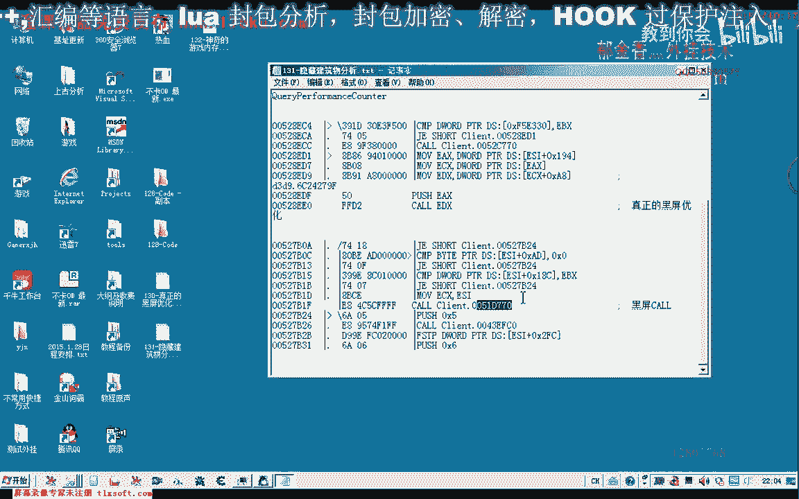

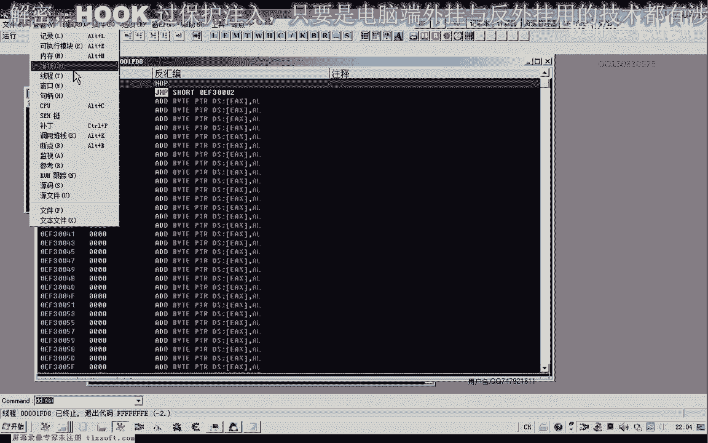

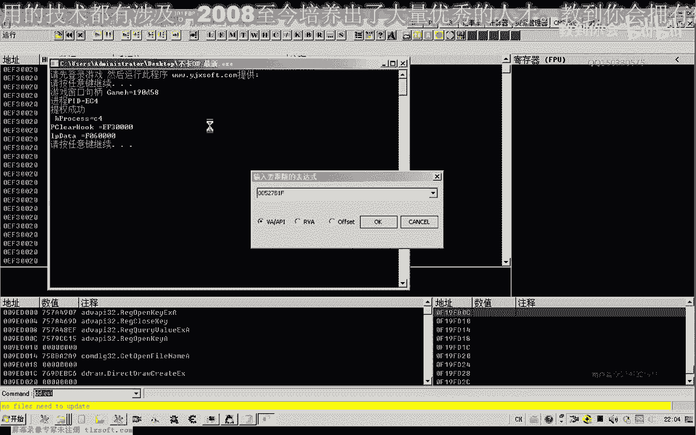

在本节课中，我们将学习如何通过逆向工程分析游戏中的隐藏建筑物或场景对象。我们将从黑屏优化相关的函数入手，逐步追踪并分析负责游戏画面数据准备和对象绘制的关键代码逻辑。

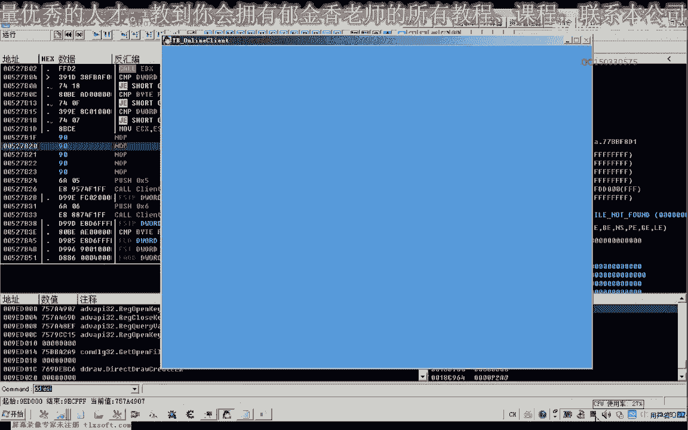

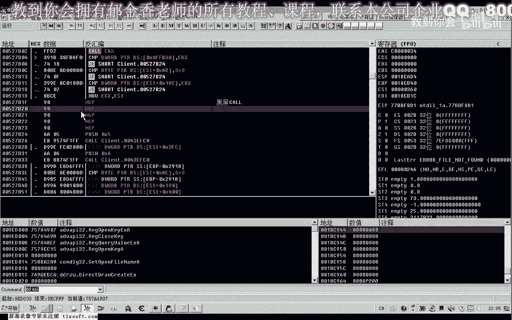

---

## 概述

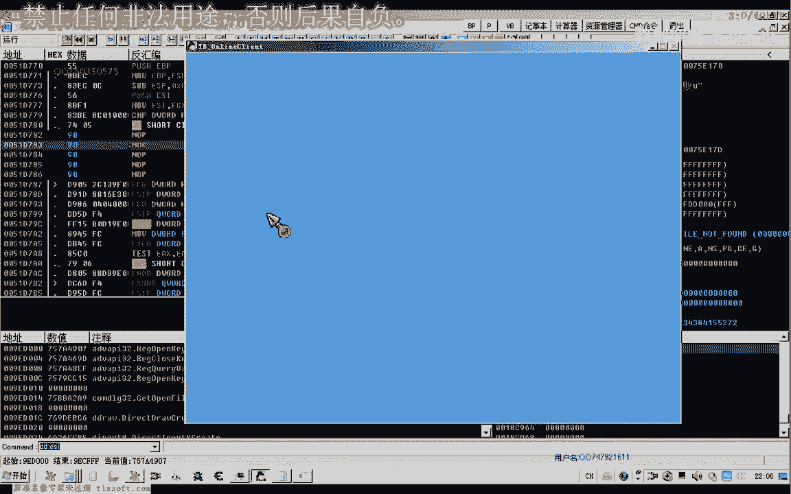

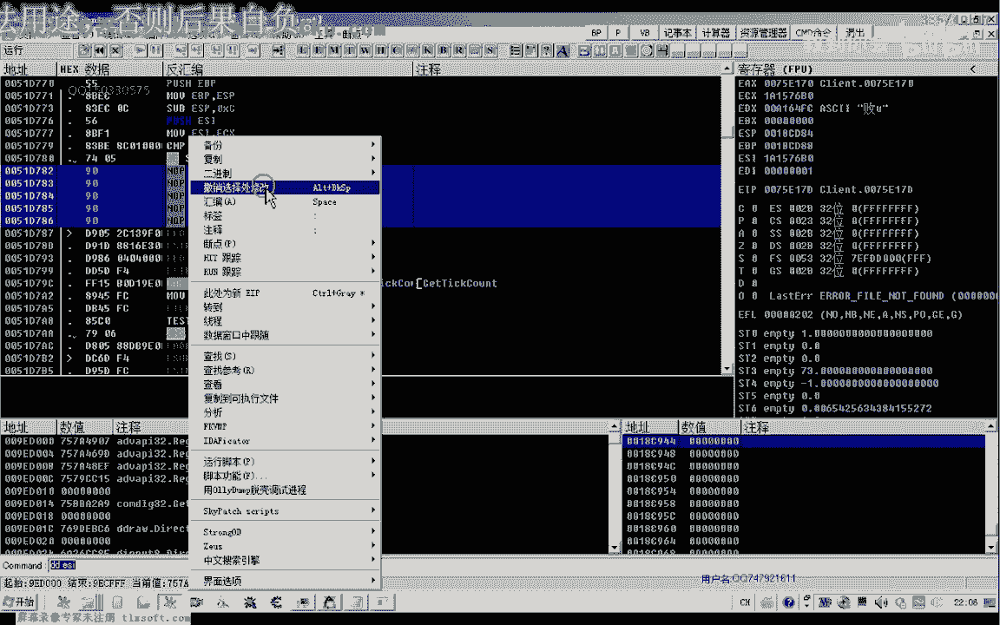

本节课的目标是定位并分析游戏中负责处理场景对象（如建筑物、角色、UI界面）绘制数据的核心函数。我们将使用调试工具附加进程，通过分析函数调用栈、参数变化及执行效果，来理解游戏渲染对象的管理机制。

---

## 从黑屏优化函数入手

上一节我们介绍了逆向分析的基本思路。本节中，我们来看看如何从游戏的黑屏优化相关代码开始分析。

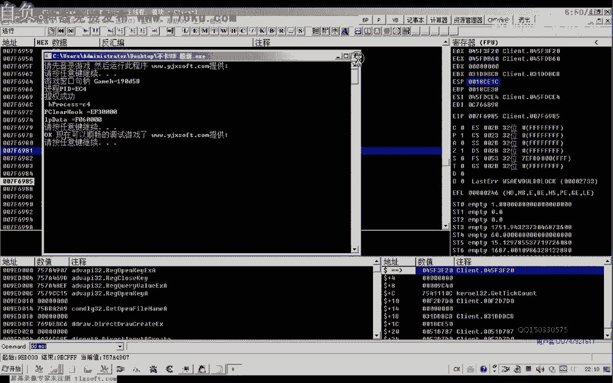

首先，我们找到了两个与黑屏优化相关的函数。其中一个函数是真正的黑屏优化处理函数，而另一个函数（我们暂时称其为“管理函数”）可能负责游戏画面相关数据的准备工作。

以下是初步分析步骤：

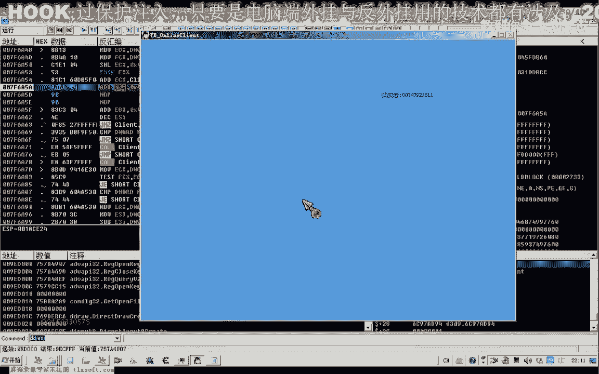

1.  使用调试器（如OD）附加到游戏进程。
2.  转到疑似黑屏优化的函数地址。
3.  观察函数执行时CPU占用率的变化，以区分“真黑屏”（CPU占用大幅下降）和“伪黑屏”（CPU占用变化不大）。

通过观察，我们确定目标函数是一个“伪黑屏”函数，它可能负责管理对话框、人物角色等场景对象的画面更新数据。

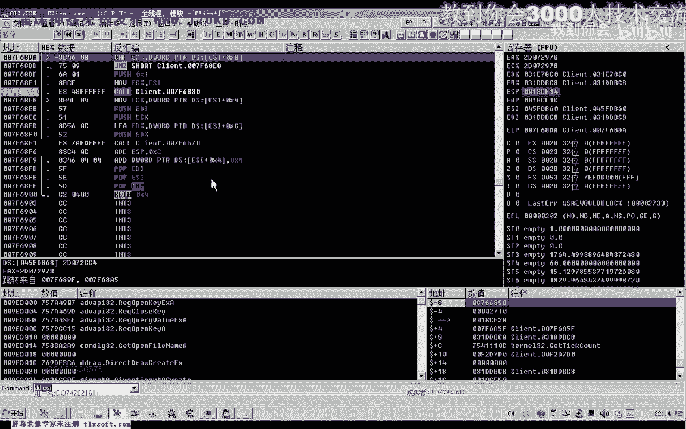

---

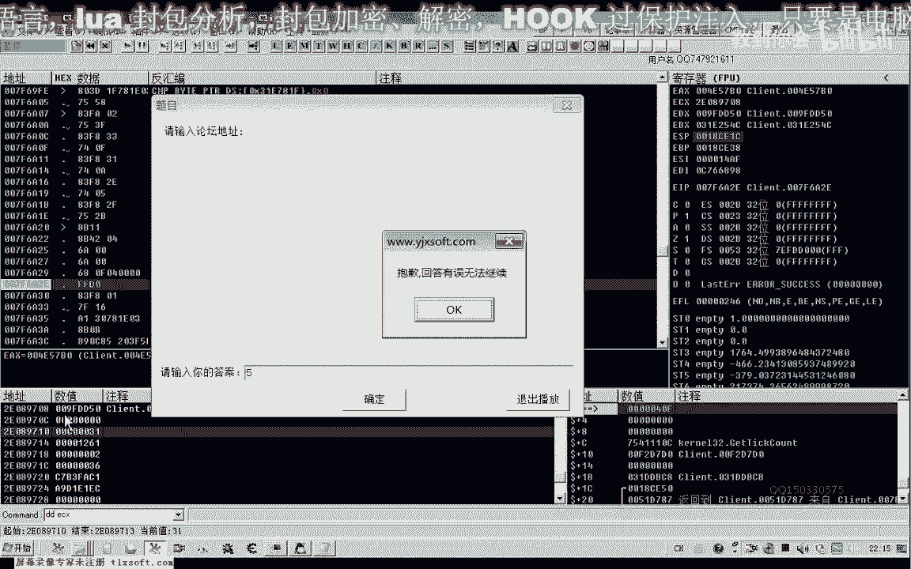

## 深入分析数据管理函数

既然我们初步定位了可能的数据管理函数，本节中我们来看看其内部的具体逻辑。

我们进入该函数内部，发现它体积较大且没有明显的参数。为了便于分析，我们首先记录下该函数的地址，并尝试在其内部下断点，观察堆栈变化。

以下是关键操作记录：

*   在函数入口下断，执行一步（F8），观察ESP寄存器值从 `0x1C` 变为 `0x28`，表明该函数可能有3个参数（因为 `0x28 - 0x1C = 0x0C`，即12字节，通常对应3个4字节参数）。
*   我们尝试使用 `ADD ESP, 0x0C` 来平衡堆栈并跳过该函数调用，发现游戏画面未受影响，说明此函数可能不是核心的数据处理函数。

我们继续在函数内部跟踪，发现了一些循环结构和条件判断，这暗示它可能在对某种对象列表进行分类处理。

---

## 定位对象绘制相关函数

上一节我们发现了一个可能进行对象分类的函数。本节中，我们来看看如何找到真正负责对象绘制的函数。

我们沿着调用链继续跟踪，发现了一个被循环调用的函数。当我们跳过这个函数执行时，游戏出现了黑屏现象，这强烈暗示它与画面数据处理直接相关。

以下是定位过程：

1.  在疑似函数上下断点并跟踪。
2.  发现该函数在一个大循环中被反复调用，每次传入一个对象指针（存储在ECX或ESI寄存器中）。
3.  函数内部会读取对象指针偏移 `+8` 处的数据，并与一些固定值（如 `0x3331`， `0x2E31`）进行比较。
4.  根据比较结果进行跳转，可能是在区分对象类型（例如，人形NPC、怪物等）。

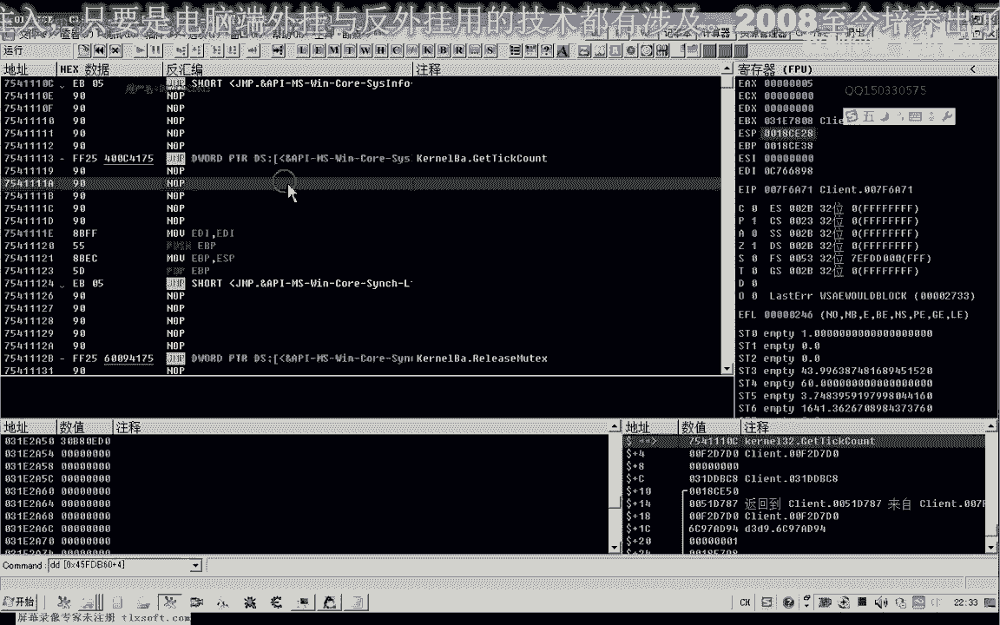

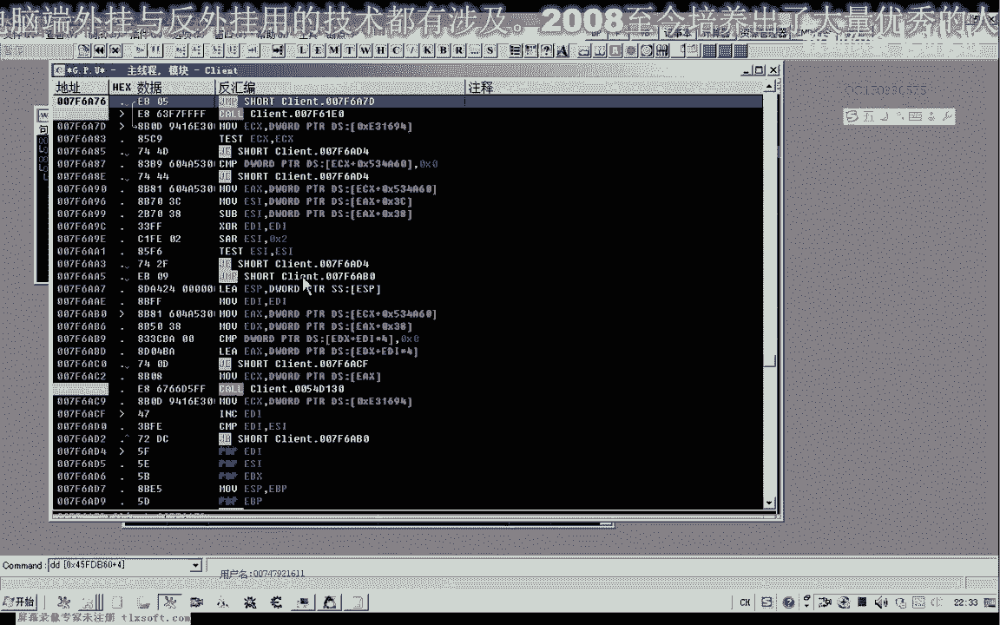

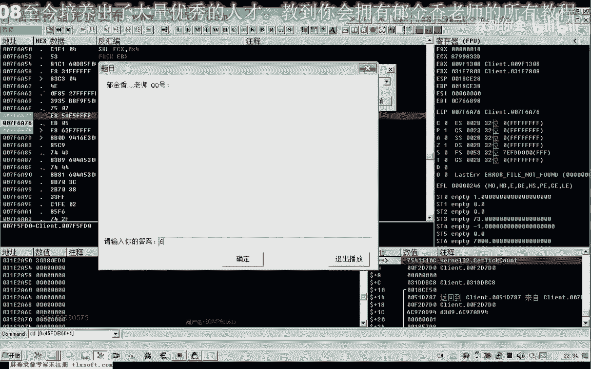

我们尝试修改跳转条件，发现当跳过对人形NPC的处理时，选中NPC后其血条不再显示。这表明我们可能找到了与对象状态（如选中高亮、血条绘制）相关的判断逻辑。

---

## 分析核心绘制逻辑

我们找到了影响血条显示的函数，但核心的物体（如建筑物）绘制逻辑可能还在别处。本节中，我们继续深入分析。

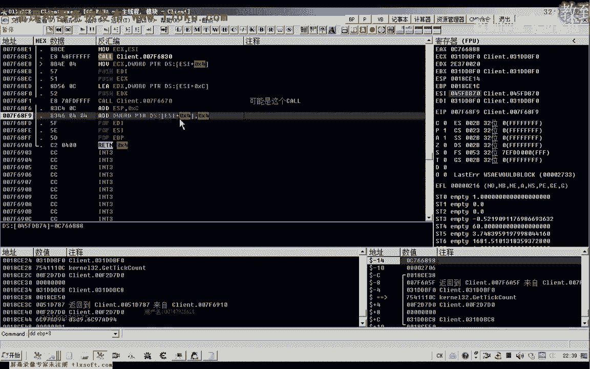

我们跟踪了另一个被频繁调用的函数，它同样处在一个循环中。跳过此函数后，游戏发生了显著变化：

*   地面贴图消失。
*   游戏菜单、背包界面（按Tab键）无法打开。
*   F1-F10的快捷栏图标消失。
*   但CPU占用率没有下降，游戏角色和NPC依然可见且可动。

这表明我们找到了一个**核心的绘制分发函数**。它可能根据不同的参数，负责调度不同类别对象的绘制工作，包括UI界面、地面贴图等。而建筑物、角色模型的绘制，可能是由它调用其他更具体的函数来完成的。

由于此函数调用点非常多，且内部逻辑复杂，直接全面分析耗时较长。我们在尝试跳过其内部一个子函数时导致了游戏崩溃，说明函数内部的数据处理存在依赖关系。

---

## 总结

本节课中我们一起学习了逆向分析游戏渲染流程的初步方法：

1.  **从现象切入**：从“黑屏”这类显著现象入手，定位相关的优化或管理函数。
2.  **动态调试**：利用调试器观察函数执行、参数传递和堆栈变化，区分关键函数与非关键函数。
3.  **逻辑分析**：通过分析循环、比较和跳转指令，理解游戏如何分类和处理不同的场景对象（如NPC、UI）。
4.  **功能验证**：通过修改代码（如NOP指令跳过调用）并观察游戏画面变化，来验证函数的具体功能。

我们最终定位到了一个核心的函数，它很可能负责游戏内多种元素（UI、地面、可能包括建筑物）的绘制调度。由于内部逻辑复杂且存在数据依赖，完整的分析需要更细致的跟踪和测试。

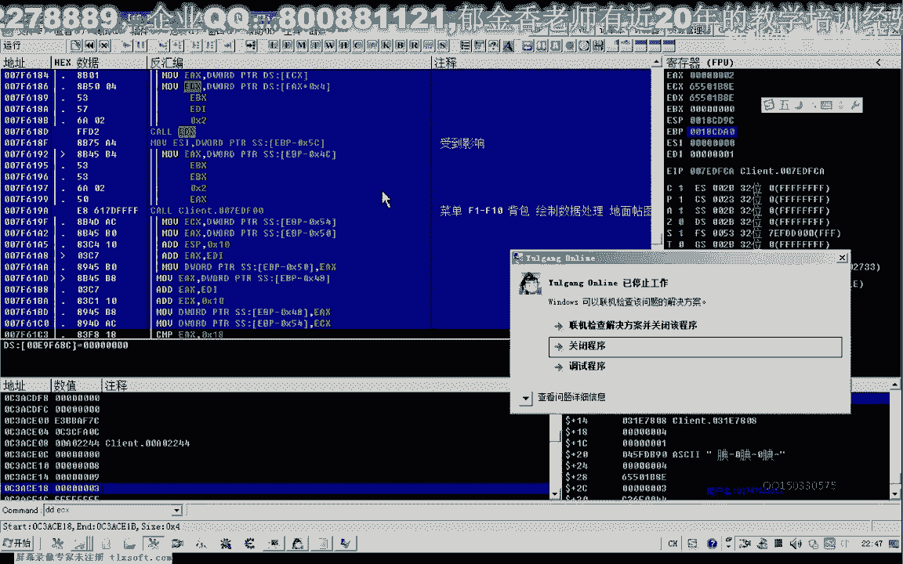

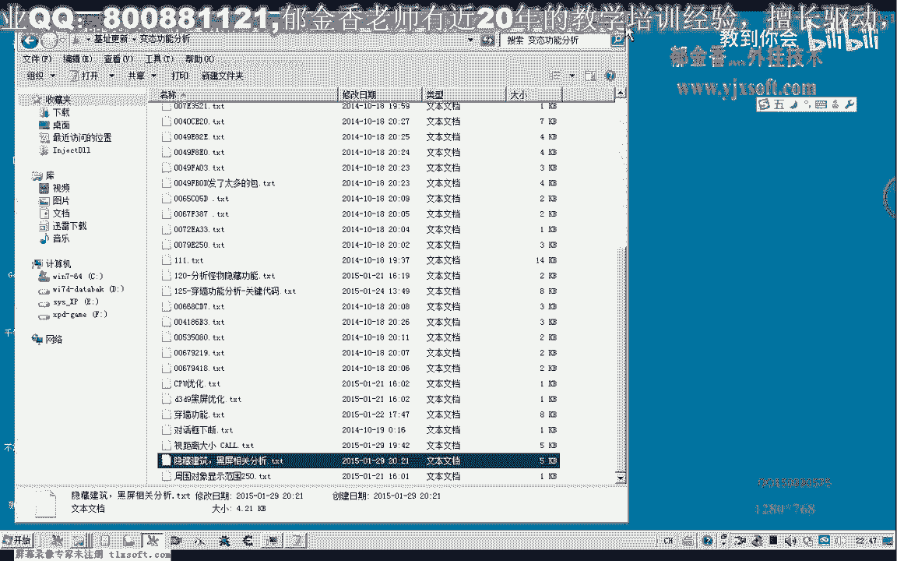

在下一节课中，我们将基于本节课找到的线索，继续深入分析这个核心函数，并尝试定位到专门处理建筑物隐藏或显示的具体代码逻辑。