# P121：132-隐藏人物分析 - 教到你会 - BV1DS4y1n7qF

大家好，我是郁金香老师，那么这节课呢我们接着第131课呢，呃继续分析怎么隐藏我们的这个建筑物。

那么首先呢打开我们的ood附加到游戏里面。

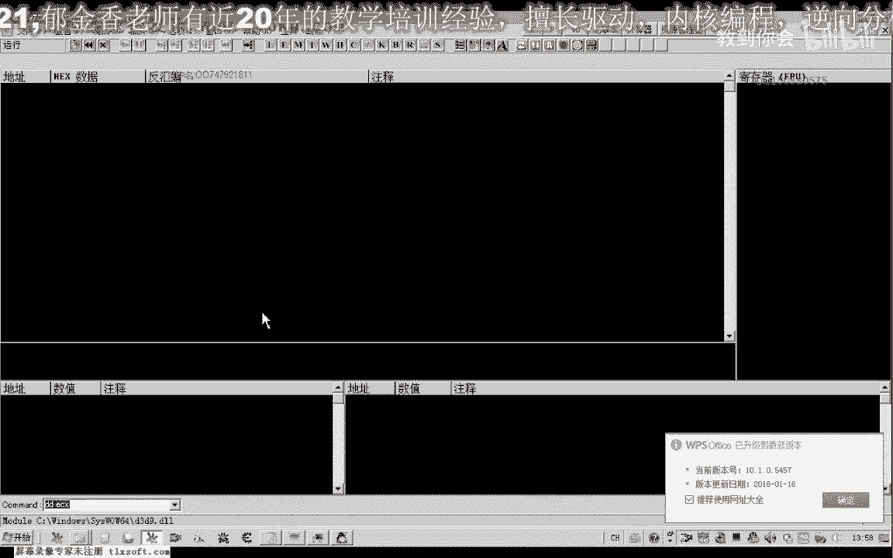

那么这是上一节课哈下的相应的一个断点，那么我们先把所有的断点呢先取消掉。

然后呢我们接着上一节课的数据来再分析，那么上一节课的话。

那么我们继续从这个位置来下断点，我们继续从这里分析，那么首先呢我们跳过这个扩的执行啊，直接啊这里有一个跳转，我们可以从这里呢呃修改，让他这样陪跳啊，直接就跳过了啊，就不会执行这个扩了。

那么我们再来看一下它的一个效果，那么这个时候的话我们发现了没有任何的这个效果嗯，那么我们继续的往后边看啊，呃这个地方的话我们当时的一个注释是大概是f一到f 10，一个贴图，那么我们继续啊往下边看一下。

那么再往下边的话就移到这个或者这个尾部了啊，这个地方我们还没有标记过，我们在这里下个段看一下，然后注意usp的一个变化，那这个usp我们发现它没有变化，说明这个扩的话里面呢它不涉及到相应的参数。

我们把它哈lap掉了，那么这个时候的，话仍然看不出相应的变化，那么我们在这个时候来到这个循环里面，来找这个相应的这个空，那么我们在这里下段啊，看这个地方会不会执行。

然后呢再往前面找一找一下这个地方我们也下断，然后我们看一下usp有没有变化，执行call与执行这个扩之后，那么没有变化呢，我们可以直接在弄不掉这个空，然后把断点取消掉，那么这个场景呢没有任何的变化啊。

那么我们在望着前面看，那么这里呢我们也可以把这个j一可以把它改为降低，让他跳过这里啊，那么这个框呢也不会被执行了，我们可以在这里下个段，他永远都不会断下了啊，因为跳过了。

那么也那么这个扩的话也不是我们这个建筑相关绘制的这个扩，那么我们继续往前看啊，那么这里呢也有一个扩呃，那么这里有个扩的话，它从上面这个地方啊跳转下来，那么我们可以在这里的时候来直接跳过啊。

这个后那么我们看这个循环里边呢一共有两个括，那么我们甚至还可以在这个地方修改啊，我们加深一下看一下，那么这个时候是小于的时候不能拆跳转，那么我们把它改为一个绝对的一个跳转。

那么在这些地方的话就断不下来了啊，那我们再来看一下，那么这个时候的话仍然没有任何的变化，但是有一点点变化的就是我们的，人物和我们的这个怪物呢，它相应的这个选中的这个血条呢不见了啊。

那么这个的话有可能这个地方呢就是我们嗯这个人物啊，怪物的选中状态的显示啊，其实啊这个相应的画面层，那么这个地方也与我们的这个建筑的话不相关，那么我们继续往前边看，嗯这里呢还有一些空。

那我们也跟他下一个断点注意一下啊，e s p的一个变化，按一下f8 ，那么没有变化的话，我们直接落户电话，好把这个点取消掉啊，再进入到游戏里面看一下，仍然没有变化，那么接着是这个库。

那么这里呢我们可以来直接这里下不来就把它跳过，跳过之后呢，呃就一直会执行到这里，那么这里呢我们下段的话就不会被断下，那么我们可以发现，那么这个时候呢我们的人物角色呢被隐藏掉了啊。

那么这个是我们人物角色的一个绘制，应该是可能是哈，但也不是绝对的，如角色，绘制，当然这个呢我们后边呢我们再做一个详细的测试啊，因为要把其他的那么也可能是由于呃其他的某几个啊跳转。

我这后面的这个跳转呢配合起来才把这个人物角色呃隐藏起来了，好的，那么我们重新可能是我们修改的地方过多。

那么我们重新再进一下游戏，那么我们这个建筑的呢，我们稍后再分析，那么我们刚才因为我们分析到，有一个地方呢可以隐藏我们的这个人物角色。

那么我们先把其他的断点呢先取消掉啊。

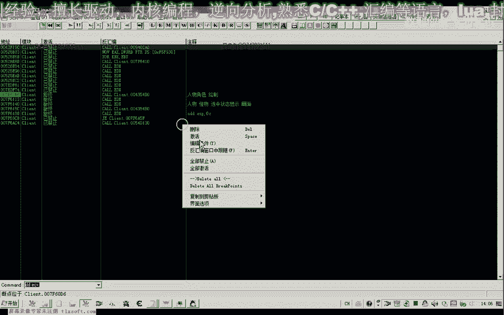

全部禁止，然后我们当时修改的是这个地方，它能够隐藏我们的人物角色哈，这个时候我们把其他的地方呢呃先就是先去掉单独的修改这个地方，我看能不能够隐藏，那么这个时候的话我们就能够隐藏我们的这个人物角色了啊。

看不到只能看到一个影子哈，这个时候好的，那么这个呢也算是一个功能，这些功能呢可能没有实际的一个呃作用啊，但是如果你是制作辅助的时候呢，它多一项功能呢也是一个卖点啊，这个挺忽悠人啊，看起来哈呃那。

么我们先把这个跳转啊，先把它备注一下，那么当然是。

实际上呢是通过这个扩哈，这里的话它调用的地方更多，那么我们直接在这个地方return的话，那么可能的话我们再来看一下效果，那么可能其他的玩家这一类的也可能会调用这个库啊，凡是是对象的类型是三幺的。

这里有三个参数啊，那么可能的话呃凡是对象呢嗯角色是三幺啊的这种状态呢，它可能都会隐藏，那么这里呢我没有看到玩家的对象，需要另外换一个区再看一下，那么我们这里呢我们换一个去看一下有没有玩家对象的地方。

我们再测试一下这个函数是不是可以把呃，所有的玩家对象呢都隐藏好的，那么这个时候我们换了一个区，那么这个区呢有很多的玩家在这里，那么我们再次把这个地方啊进行一个价码，看一下其他的人物角色会不会被隐藏。

那么这个时候我们发现啊，所有的这个玩家的角色呢都被隐藏了嗯，那么我们进到这个框里面去看一下，看还有没有其他的地方调用这个库，嗯但是在这个地方的下段，呢突然他就出错了啊，那么我们再次进一下游戏，好的。

那么我们再次来在这个地方下断啊，这里呢我们需要它的返回参数是三个，这个地方，啊前面要占了三个参数，调用的来源呢也不一样啊，我看一下调用的来源，我们选第三个吧，其他的地方也有调用。

那么我们先在这里下个段，先退回到这个地方啊，我们把它注释一下啊，这里呢我们修改为j一呢我们修改为jup，嗯可以达到一个隐藏，玩家的一个效果。

那么我们先把这里先改一下啊，这样的，那么但是呢另外还有地方来调用到这个地方啊，实际上武器呢没有被隐藏，那么说明这个武器的话，它另外还有呃，另外有地方呢在绘制，那么这里呢我们也turca看一下效果。

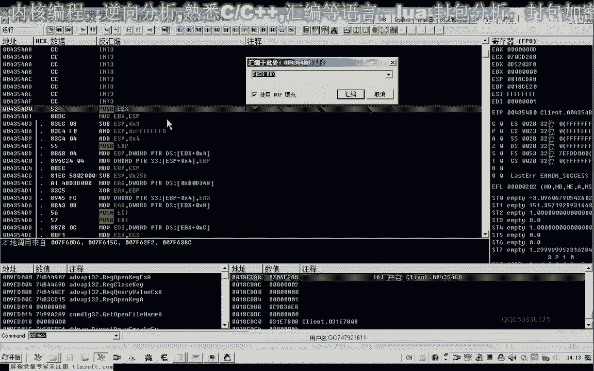

那么这里修改之后他出错了啊，那么证明这个参数的话，可能呢540c，那这里呢看起来它是三个参数，那么也可能它的ex这个参数呢有用到，那么我们移到后面来看一下，这个扣比较大啊，有很多循环啊。

前面来看的话是零碎，它的返回值，那么下一次我们分析的时候呢，先在这里下个段，看其他有什么地方啊，调用它，可能它的参数呢嗯还有其他的意义。

那么我们再次转到刚才的这个地址，那我们再进去看一下，在这里呢我们先退回来，在这里呢我们修改一个键盘啊，跳过它，然后我们进到里边呢，我们下一个断点。

那么这个时候呢有可能是这个插件呢它引起了一些冲突，那么我们把多余的这个插件呢把它移除掉，这个是高亮的这个插件啊，这个是命令条嗯，还有这个时装o d来把他留下啊，那么其他的这些插件的话。

暂时对我们没有多大的用处啊，那么我们先把它移动一下，移动到这里来进行一个备份啊。

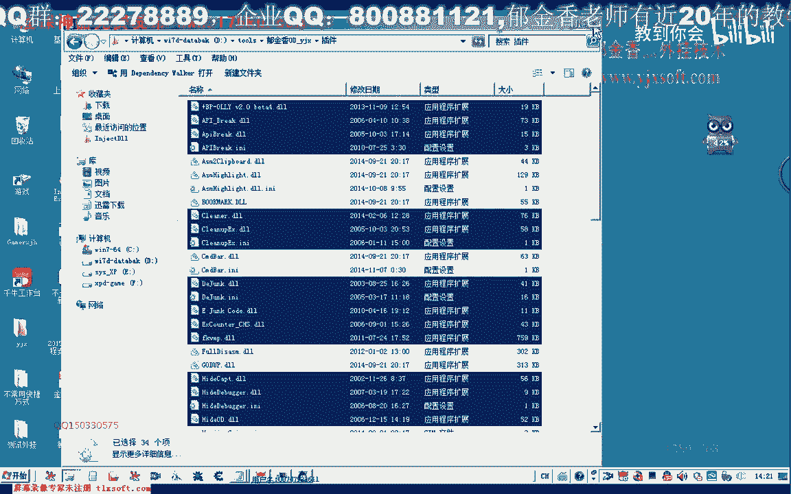

然后我们再次附加我们的游戏。

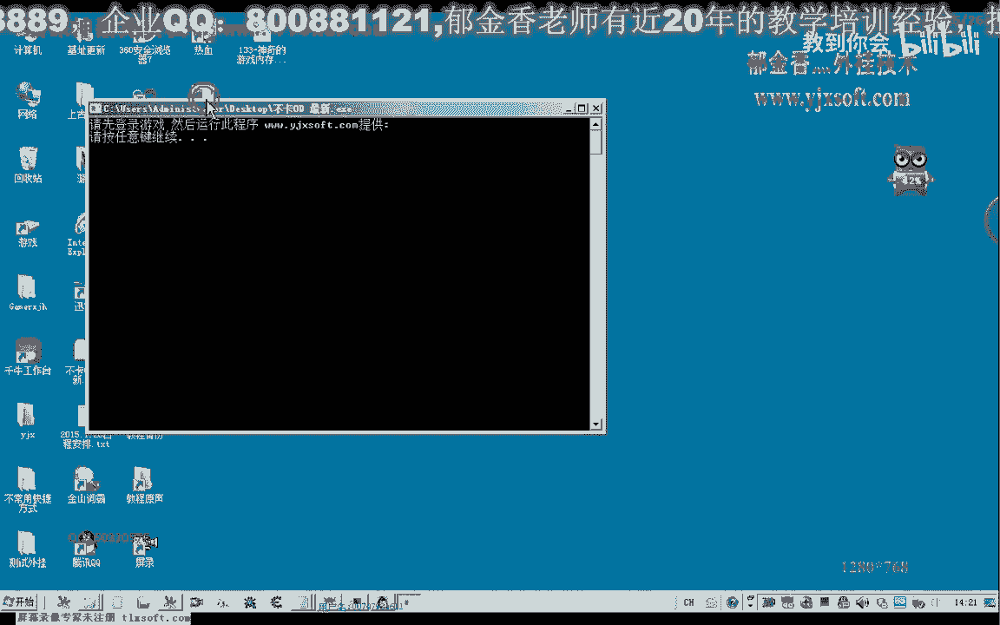

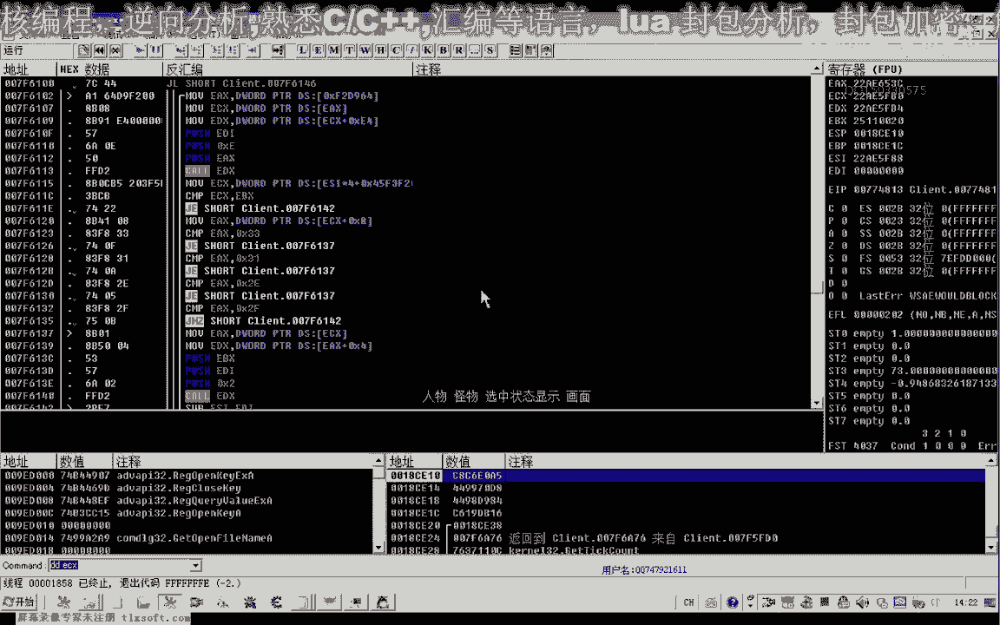

首先这里我们把它改为下吧，那么实际上这个时候的话，我们的效果的话基本上已经达到了啊，那么这里所有的玩家实际上都已经隐身了啊，只是他的这个武器呢还没有隐身啊，那么我们嗯切换到这里的时候，他还是会出错啊。

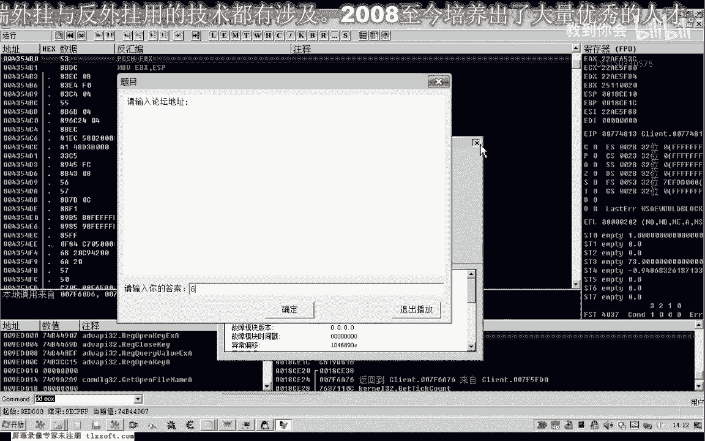

啊那么我们看一下我们的断点，还有我们的硬件断点有没有设置，以及我们的内存断点了，都没有这个相应的错误哈。

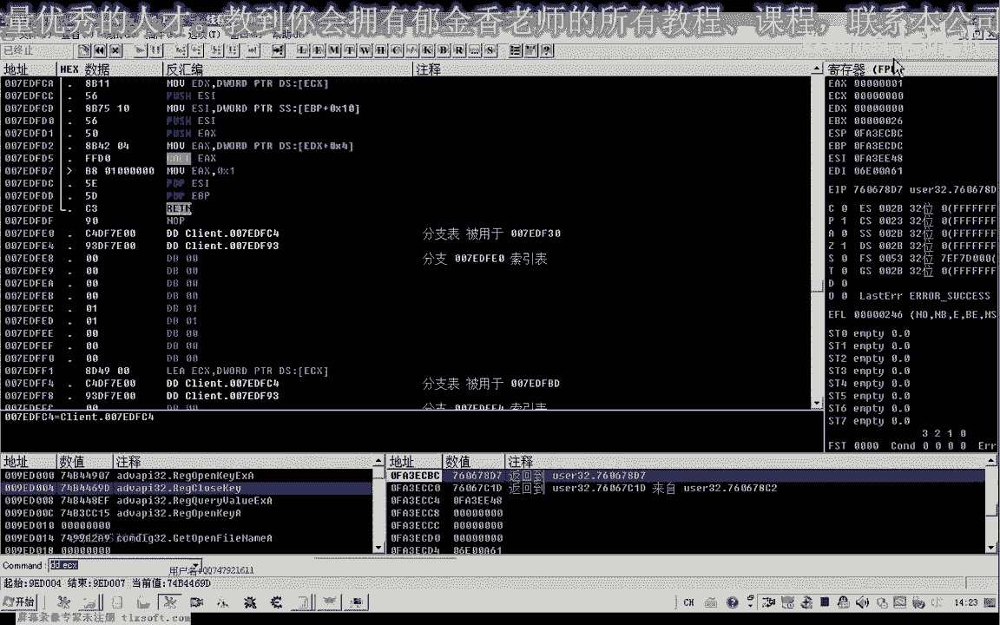

那么也有可能这个游戏呢它的这个全局的这个钩子呢，被我们给它卸载掉了啊，也就是我们用的这个工具哈，可能是这个工具有问题啊。

我们再来啊，再重新的附加一下，让我们再次哈附加一下游戏，转到刚才的地址。

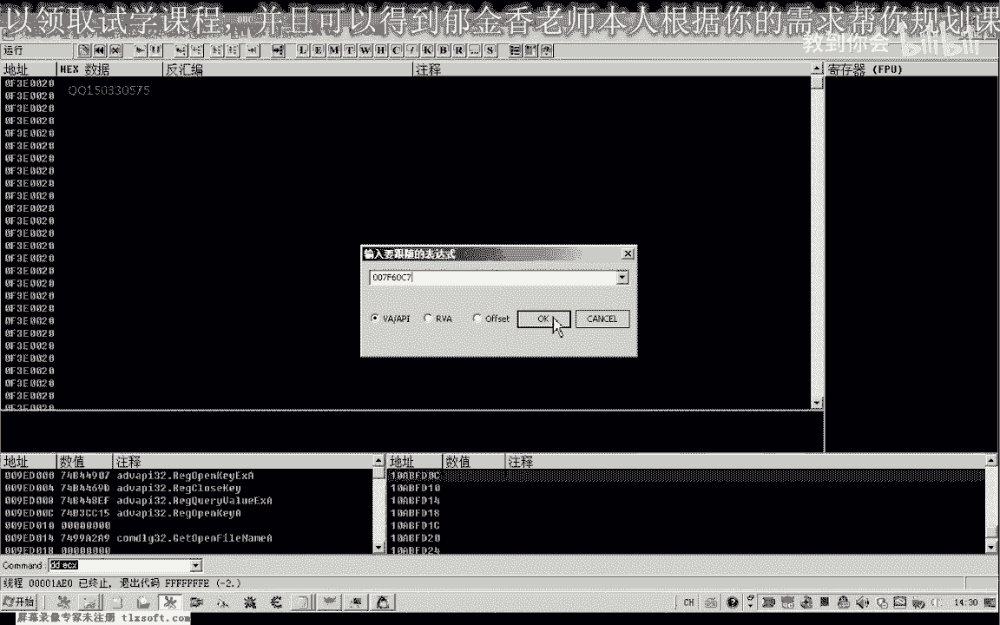

那么我们再次哈在这里来修改相应的这个跳转，然后再看一下嗯，我们进去啊，进去之后呢，这里我们不能够直接的修改啊，很明显，那么我们再来分析，按按减号再退回来，看一下它另外的呃几个地址。

那么这个地址我们是跳过了，再看一下第二个地址，那么这个地址呢我们也要把它备注一下啊，这个是我们人物角色绘制的，再重新进去一下啊，嗯这个过呢我们从这里呢也可以给它给它跳过哈，相关的这几个函数啊。

我们可以一起给他跳过，这个地方也可以修改，这是第二处跳过的。

那么上面这里呢是第一处，那么我们看一下，另外还有地方调用这个库，那么这里呢是第三个地方，那么之前呢它都会有一个判断啊，从这个地方开始，那么实际上我们看到啊，这前面这个库调用之后呢。

后面这里这个库呢它也用到了一个相同的一个呃，这个机制可能也是去骗你相应的这个对象，那么有可能是这种情况啊，可能必须要前面啊经过这个过来处理了这些数据之后呢，在用这个库来来调用，不会出错啊。

不然的话从这里调用的话。

它可能会出现一些未知的错误哈，那么这是一种猜想啊，那么我们也把这一段了啊，可以把它备注一下嗯，那么还有一个地方也调用了它，这是第四个位置，那么这里呢也有一个跳槽，好的，那么我们再次来重启游戏之后呢。

我们不修改这个扩，那么我们直接修改这个跳转来进行尝试。

那么首先呢我们转到第一个地方进行他的一个跳转的一个修改，那么这里呢我们改为降配，然后我们再这个时候的话，实际上呢我们的这个人物就已经把隐藏掉了，那么我们主要是来测试一下后面的这个功能。

但是我们发现修改这个地方的话，直接的修改的话，它也会出错啊，这个地方看来它是不能够直接修改的，他还有其他的一些观点。

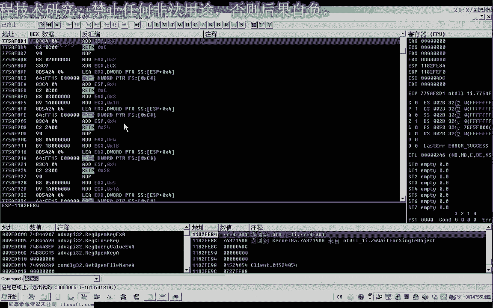

那么我们再转到第一第一个地址啊。

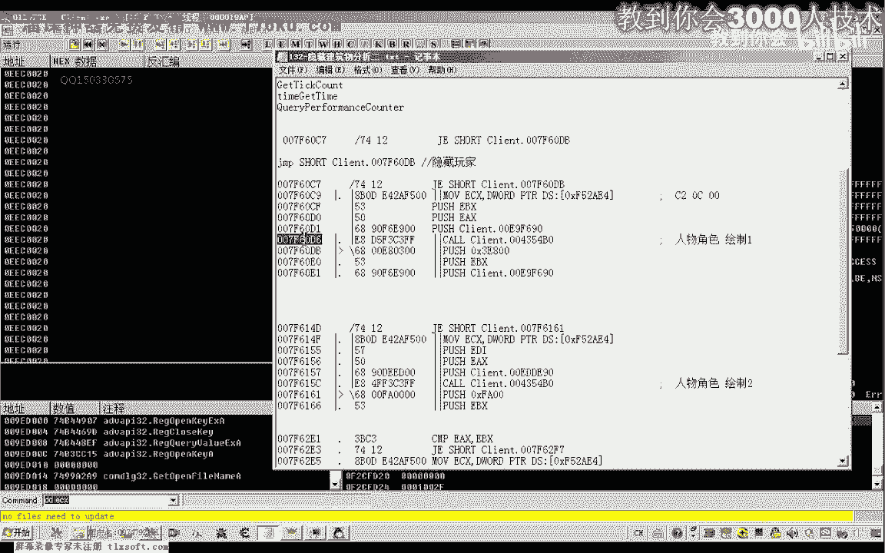

再进行一下测试，那么可能是我们的这个扩呢，它他处理的这个数据哈，有被其他后面的这些代码呢所利用啊，所调用这个相应的数据，那么如果我们这里直接loop掉的话。

那么可能后面他在读取我们之前的这个数据的时候呢，就可能产生这个相应的异常，那么也有可能呢是我们的这个游戏本质呢，它有相关的这个检测哈，对这一类的括号，那么有如果你在这里下了断点。

那么呢他直接就给你报异常了啊，那么也也是也可能有这方面它对于一个关键，的代码呢有一个保护啊，有一个检测这一类的，那么各方面呢都有可能，那么我们先刚才呢我们是跳转到这个地址啊，那么跳转到这个地址的话。

那么这个框呢它也可能调用到前面的这个数据，那么我们从这里来直接跳过啊，跳到这个地方来执行看一下，那么我们看一下这里，那么这里有个a d d e s p0 c，嗯这个是什么意思，我们看一下。

那么也就是说这个扩的话，它实际上是可以直接的落魄掉啊，他压了三个参数之后呢，这里呢是直接return的，那么这里的话我们直接要跳的话，要跳转的话，就应该要跳到这个位置，跳转到这个位置的话。

这里有一个a d d e s p，或者说我们连这个过来一起落不掉啊，然后呢在这里呢再加上这个跳窗，看这样会不会报错，运行一段时间，那么这个词至少来短时间没有报错啊。

那么这个时候呢也能够达到一个隐藏的效果，那么如果这个功能能够达到了其他的地方呢，我们就可以不修改，那么这么久都没有出错的话，那理论上是可能不会出错了啊，那么出错的话可能就是我们这里呢这个括。

它调用了到了前面的这个相关的这个数据啊，当然现在的他还是出错了啊，关于这个出错这个问题呢，我们留到了下一节课呢，我们在再具体的研究一下啊，那么这种错误的话要诊断的话非常的麻烦，也非常的费时间。

那么具体我们定位的这个功能的话，隐藏建筑的话，那么都应当是在这个循环里面了哈，看来的话嗯那么这个出错的这个问题呢，我们在后面一点呢，再解决，那么如果我们是修改代码的方式，我们不能够实现隐藏这个人物的话。

我们也可以从这个列表里边啊，这里有一个列表呃，应该是一个机制，它可能是一个数组啊，这个啊那么我们可以进到他的库里面去看一下他的这个e s p加四，这个参数放到了e c x这里来，再退回来看一下。

那么这里的话进去的话，你这个参数来是sp加4+8+4，那么加四的话它放到了ec x，而ec x呢它放到了e di里面去，然后呢在这里的它会像这个e d i里面来写出一个al的这样一个标记，e d i哦。

然后呢你不可能产生跳转，也可能不产生跳转，d i e，那么如果我们看产生跳转的情况，那就走到这里啊，也是要往这个e d i里面呢进行写入一个什么数字，然后再让e d i来加一。

那么这个呢只有我们后面再具体的分析，那么如果我们修改代码的方式，不能够实现相关的这个正常的一个隐藏的话，那么呢我们可以分析它的这个数据啊，看它是通过哪些数据来判断的，那么我们也可以尝试修改它的这个数据。

好的，那么我们下一节课再解决这个问题。

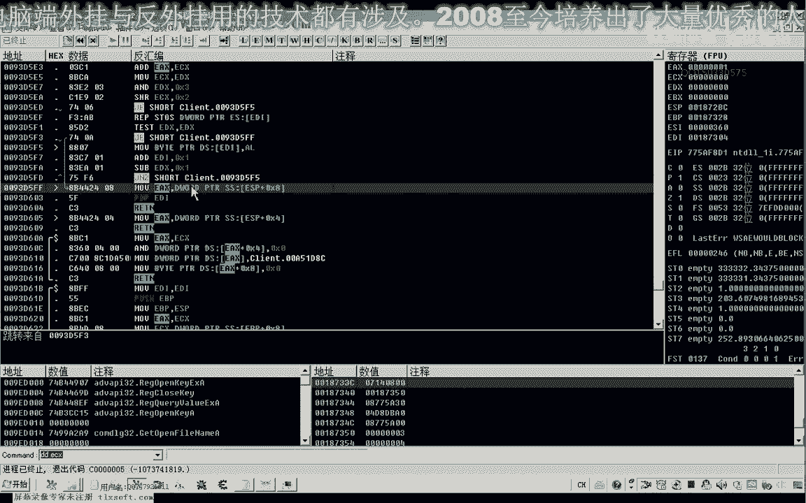