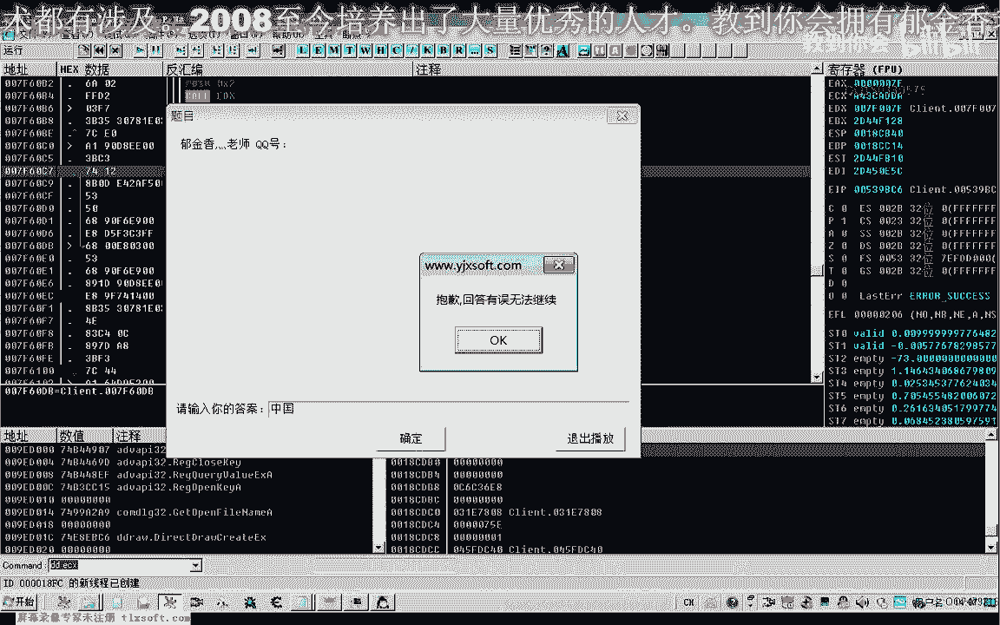

# 逆向工程课程 P121：隐藏人物分析 🕵️♂️


在本节课中，我们将继续分析如何隐藏游戏中的建筑物和人物角色。我们将通过调试和修改汇编代码，探索实现特定视觉效果的方法。


---


## 概述

上一节课我们开始分析隐藏建筑物的方法。本节课我们将从之前找到的代码位置继续深入，通过下断点、修改跳转指令等方式，测试哪些函数调用与人物和建筑的绘制相关，并尝试实现隐藏效果。

---

## 准备工作

首先，打开调试器并附加到游戏进程。


这是上一节课设置的断点。我们需要先将所有现有断点取消。


---

## 分析绘制循环

我们接着上一节课的数据继续分析。


从之前的位置重新下断点开始分析。首先，我们尝试跳过第一个 `CALL` 指令的执行。通过修改其附近的跳转指令，使其无条件跳转，从而绕过该 `CALL`。


```assembly
JMP [目标地址]
```


修改后运行游戏，观察发现没有任何视觉效果变化。我们继续向后分析代码。


---

## 测试多个函数调用



代码中后续有几个 `CALL` 指令，可能是绘制相关函数。

以下是测试步骤：

1.  在下一个 `CALL` 处下断点，观察栈指针 `ESP` 的变化。
2.  如果执行 `CALL` 前后 `ESP` 无变化，说明该函数不涉及参数操作，可以尝试将其 `NOP` 掉或跳过。
3.  取消断点，返回游戏查看场景变化。

按此方法测试了循环内的几个 `CALL`，均未发现建筑隐藏效果。但修改到某个特定跳转后，人物和怪物的选中状态血条消失了。

```assembly
; 修改前
JE [目标地址]
; 修改后
JMP [目标地址]
```

这提示该处代码可能与界面层显示有关，而非建筑绘制。


---


## 发现人物隐藏点


继续向前分析，在另一个 `CALL` 处修改跳转指令后，游戏内的人物角色被隐藏了，只能看到一个影子。


这是一个重要发现。我们重新进入游戏，并取消其他所有断点，单独测试此处的修改。


单独修改此处跳转后，确认可以隐藏当前控制的人物角色。


---

## 功能扩展测试


该 `CALL` 函数可能被多处调用。我们尝试直接在该函数开头返回 `(RET)`，以测试其影响范围。


```assembly
RET
```


修改后，切换到有其他玩家的区域进行测试。


测试发现，该修改隐藏了场景中所有的玩家角色，但他们的武器仍然可见。这说明武器绘制可能由其他函数负责。


---

## 错误排查


在测试过程中，游戏偶尔会出现错误。这可能是由于以下原因：

1.  插件冲突。
2.  修改的代码被后续指令依赖。
3.  游戏本身对关键代码有检测和保护机制。


我们尝试移除不必要的调试插件，仅保留核心功能，然后重新附加游戏进行测试。


---

## 深入分析与备选方案

通过分析，我们发现调用目标函数的位置不止一处。直接修改函数或某些跳转可能导致错误。


一种更稳定的修改思路是：不直接 `NOP` 掉 `CALL`，而是修改其逻辑，使其跳过关键操作但保持函数框架。例如，让函数执行到末尾的 `RET` 指令。

```assembly
; 跳过函数内部操作，直接到返回指令
JMP [函数内RET指令地址]
```

此外，如果修改代码的方式不稳定，我们可以转而分析其决策数据。函数内部可能会根据某个内存地址或寄存器的值来决定是否绘制。找到这个判断数据并修改它，是另一种实现隐藏效果的途径。


---

## 总结

本节课我们一起探索了通过逆向工程隐藏游戏内人物角色的方法。

*   我们通过调试定位了可能与角色绘制相关的函数调用。
*   通过修改汇编跳转指令，实现了隐藏所有玩家角色的效果。
*   分析了修改后游戏出错的可能原因，包括代码依赖和游戏保护。
*   提出了两种思路：一是寻找更稳定的代码修改点，二是分析并修改其内部用于控制显示的逻辑数据。


隐藏建筑物的功能尚未在本节课找到，这将是后续课程继续分析的目标。同时，如何稳定地实现人物隐藏而不引发游戏错误，也需要进一步研究。