# P122：133-隐藏人物建筑物分析OK - 教到你会 - BV1DS4y1n7qF

大家好，我是虞姬香老师，那么我们修改他的代码的话，呃它程序会崩溃啊，会出错啊，那么这节课呢我们接着上一节课的嗯，这个分析的接口呢啊继续啊分析，那么首先呢我们看一下转到这个地址。

那么当时我们是修改了4354比零，还有修改的这个跳转哈，呃都会出错哈，运行一段时间之后。

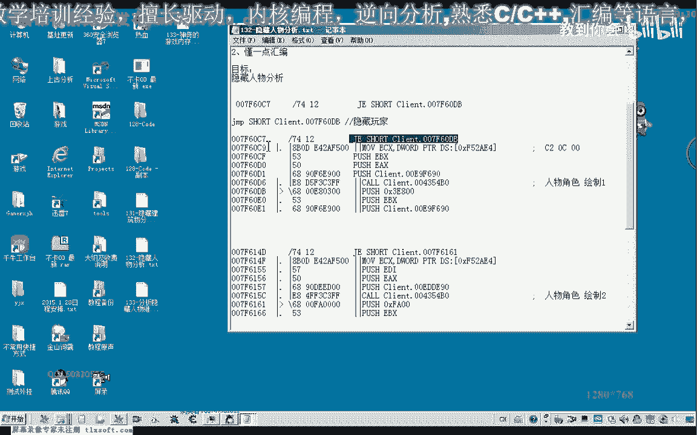

那么根据我们的分析的话，这个过来肯定是与我们人物角色啊，这个画面更新啊，相关的一些数据的一个处理，它一共有三个的三个参数，那么接下来呢我们再分析一下前边的扣哈，因为这两个库的话，我们在呃跳转之后呢。

我们发现的话他这个数据呢会出错啊，那么我们再尝试一下呃，更改之前的这个判断，那么我们再往前面找的话，就到了到这两个位置啊，那么我们从这个位置上面呢，呃它这里也有一个判断，这里的话从这里来看呢。

它是一个数组，那么我们先来看一下这个数组里面是什么东西，然后我们转进转进去看一下它的类型，那么这个是三幺啊，是玩家的对象，那么我们再看第二个，第二个是怪物，那么这个好像是我们周围的这个列表。

这个也是玩家好的，那么我们先让它跑起来，然后呢我们到我们的机子单元看一下。

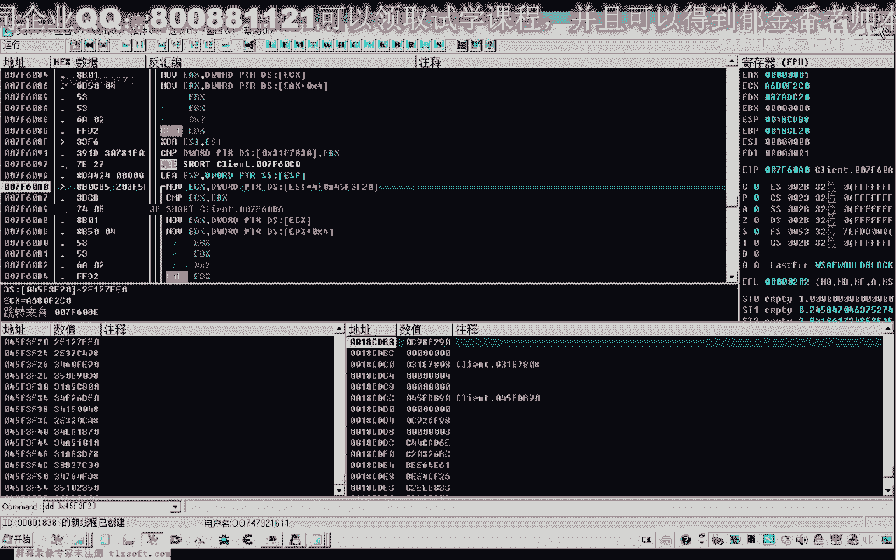

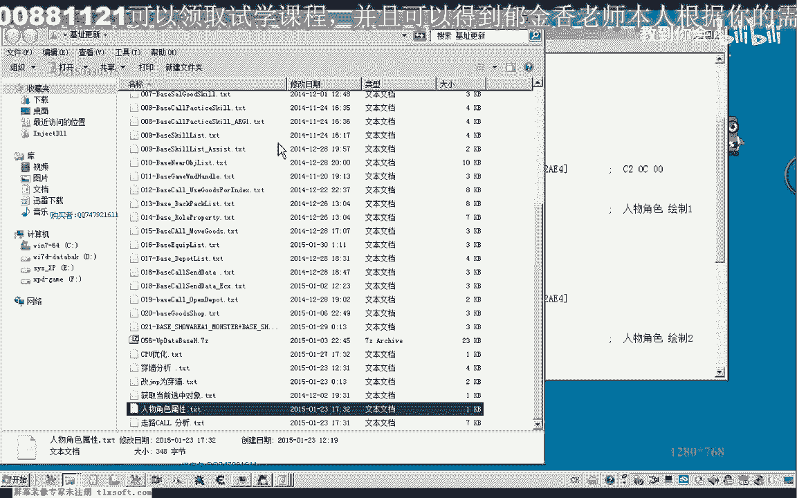

那么我们看一下更新的，呃周围的这个怪物对象，找一下，附近的这个对象，我们找一下，哦这里啊应应该是450f20 这一个，那么我们看一下这个，那么这个的话恰好这里显示的是我们的呃。

路径的怪物对象应该是附近的怪物呃，人物对象数组，对象数组，好的，那么既然是与它相关的话，那么也就是说在后面的话数据的一个处理的话，那肯定就是与我们的怪物，与我们的人物相关的这个数据。

那么我们把这个地方呢他这里比较的话，也就是说这个数组里面呢有没有这个怪物，那么如果我们直接让他跳转了，也就是告诉我们下面的这个呃扩的话，也就是说周围呢不存在这个怪物，那么我们再进去看一下。

那么所以说这个时候的话，可能是周围的这个人物和怪物呢全部都隐藏掉了啊，都隐藏掉了，但是隐藏掉了之后呢，它实际上还有一个，问题啊，那么就是我们在移动的时候呢，它也会受到影响。

当然这个功能的话虽然说有隐隐藏我们人物怪物的这个功能，但是呢呃具体的话应该说没有多大的作用啊，这个，好的，那么我们把它注释一下，这里呢我们能够呃隐藏周围的对象，当然周围对象在这里呢只是我们的人物啊。

怪物，还有就是玩家这几个对象呢，他们都隐藏，那么建筑物的这个隐藏的话，它也嗯可能还有呃另外的啊，那么我们再往前面找一下，那么这里呢也有一个判断，那么但是这个判断的话来源于就是我们的这个3117808。

这个机子的话，好像我们是没有见过，我们看一下。

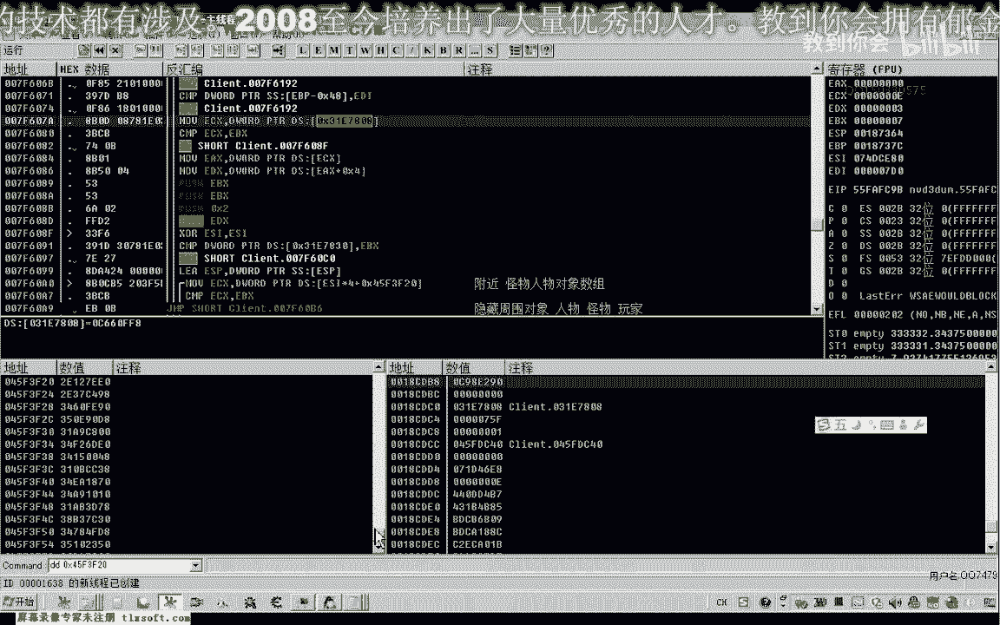

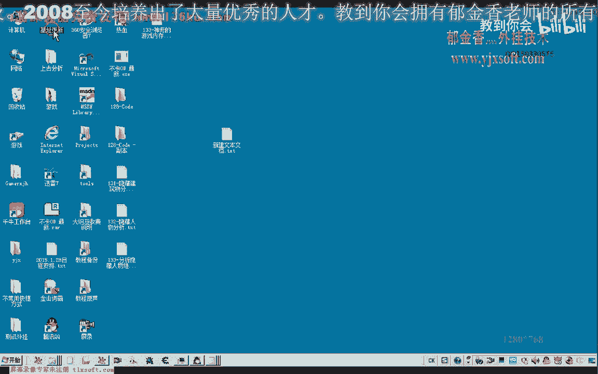

好那么这个机子的话我们当时没有见过呃，这里呢它也有一个比较啊，那么我们看这个括它有没有被执行呃，也有被执行哈，而且它执行的地址的话，我们看它每次会不会变哈，是这个地方这里，因为它是从这里的话。

他应该是从这个对象里面取得加四这个位置的，不断的在取，那么我们再次运行，注意这里edx的一个变化，那么我们运行几次之后的话都没有变化了，那么可能这个扩的话，他可能就是调用到这个地方。

那么我们在这里呢也给它加一个jump之后看有没有啊，跳过它嗯，啊那么这个e4 x它的这个类型的话，这里是等于八啊，那么等于八的话，我们也不知道是什么类型，那么我们看一下啊，e c x等于八。

那么1b x这里呢他是把我们的ebx进行压榨，那么一bx的话，那么我们就来看一下ebx是什么，那1b x这个时候是零啊，因为我们的零七型比较，那么这两个参数呢我们也给他注册一下，不是平。

那么我们再来看一下啊，下面这个这个库，那么这个库的话，它实际上是把我们的呃隐藏周围周围怪物人物的这个，那么实际上呢他是把周围的所有对象的话呃，都调用了它的一个呃，相当于是一个对象的一个成员函数哈。

加四这个位置的成员函数，然后这里呢也是传递的同样的一个参数，那么可能的话它调用的库的话可能也是同一个扩，那我们先把这个地方呢取消掉，在这里我们下一个断点看一下。

这个时候我们发现呢它调用的地方实际上不一样啊，这个是417b0 ，那么我们，再次运行一下啊，一dx，那么这个时候e d x呢它不断的在变化，好像是，那么我们再取一个e d x的值。

因为每一个对象它不一样呢，它对象的里面的成员函数的话就不一样，兵临，b0 f0 ，那么b0 和f0 的话，那么极有可能就是来看一下它e4 x呃，那么从这里来看的话，b0 的话可能就是我们的玩家。

那这里是三幺，那么我们的f0 呢，那么看一下f0 e4 x f的话，这里是二一，那么是怪物啊，那么也就是说这这个扩的话，它可能是处理我们呃这个怪物和人物的这个相关的一个数据啊。

刚才我们已经有过了呃这个测试了，那我们再往前面看一下这个地方，我们把它loop之后，看有什么效果，那么这个地方我们落魄之后呢，就不能够走动啊，呃但是我们有关的这个建筑的话，它很大一部分来隐藏了。

那么这个的话可能就是我们这个建筑隐藏的这个库，可以隐藏这个建筑啊，那么这个功能的话可能还要实用一点，但是这个建筑隐藏的话看一下，但是呢他又没有隐藏的完全哈，这里还能够看到一个虚影啊。

那么我们根据这个扩去看一下，那么我们看一下这个括他能不能够把它弄不掉啊，呃从这里呢我们按f7 进去看一下，那么131，那我们在这里下一个断点看一下它是不是，那么我们可以看到这个一dx呢他一直没有变化。

那么可以就是说从这里来判断的话，我们初步的判断了这个地址的话，它不会改变哈，可能都是我们建筑啊处理方面的，那么我们先把它备注一下，这里呢是我们的建筑物，相关的分析相关数据，相关显示数据。

那么处理的一个函数啊，那么这个函数我们不处理它的话，那么建筑物呢可能就不会被显示，那么所以说它能够绘制一部分这个建筑物出来，那么我们转到这个函数里面去，嗯，这个函数我们看一下再倒回来啊。

我们看一下它的参数的一个个数啊，注意观察e s p的一个变化啊，d a c，好按下f8 之后呢，这个时候啊线程被挂起来了，那么再次按下f8 ，那么按下f8 之后呢，我们执行到这个位置的时候呢，他从b呃。

他从a c变成了b8 ，那么也就是说它在原有的基础上面加了零碎啊。

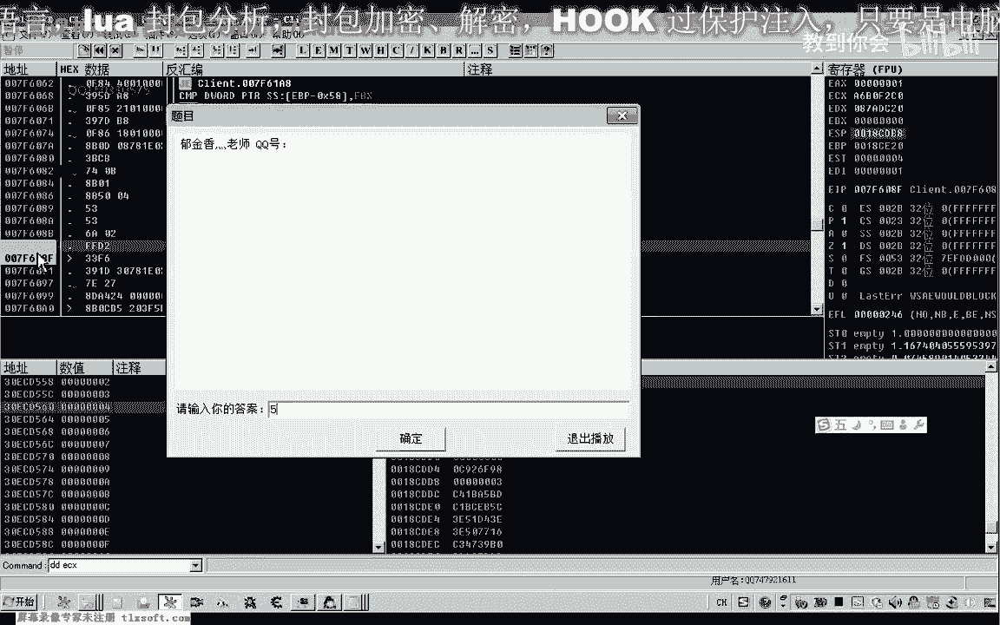

那么也就是说它的参数呢是三个啊，从这里实际上也能够大致的看得出，然后呢我们按f7 啊，跟着这个头部，那么我们尝试在这里更改，看会不会出错啊，然后再进游戏看一下，那么这个时候的话我们可以看到啊。

建筑物的话就没有虚影了，那么这个呢能够完美地隐藏我们的这个建筑物，那么所有的这个建筑物的话都被隐藏了，而且不影响我们挂机的这个功能，好的，那么关于人物的人物，怪物的隐藏的话。

我们之前有分析一个呃这个相应的一个距离哈，那么我们只要把那个距离改为零的话，实际上我们也能够达到完美的隐藏这个人物啊，那么实际上我们可以不不用啊。

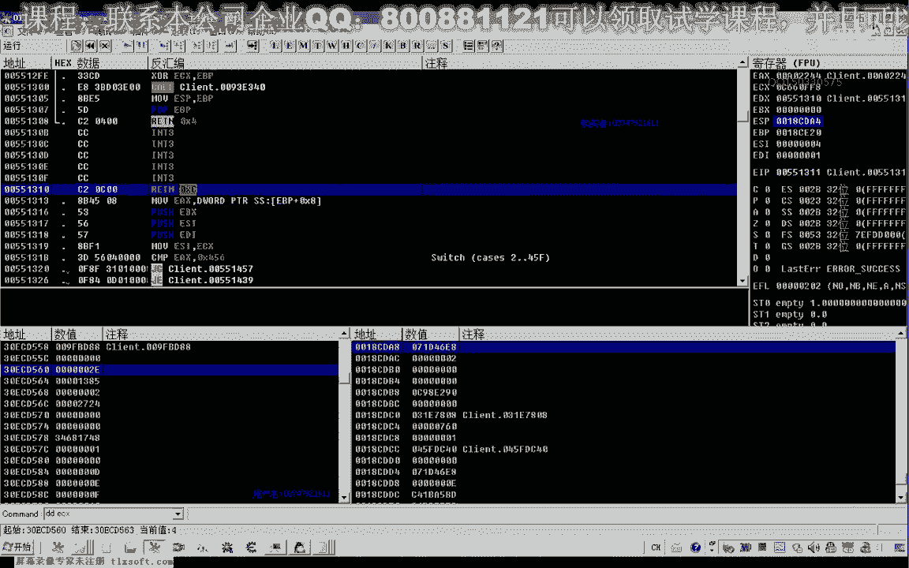

不用来更改这个代码就可以实现，那么所以说这个人物和怪物的这个隐藏的话。

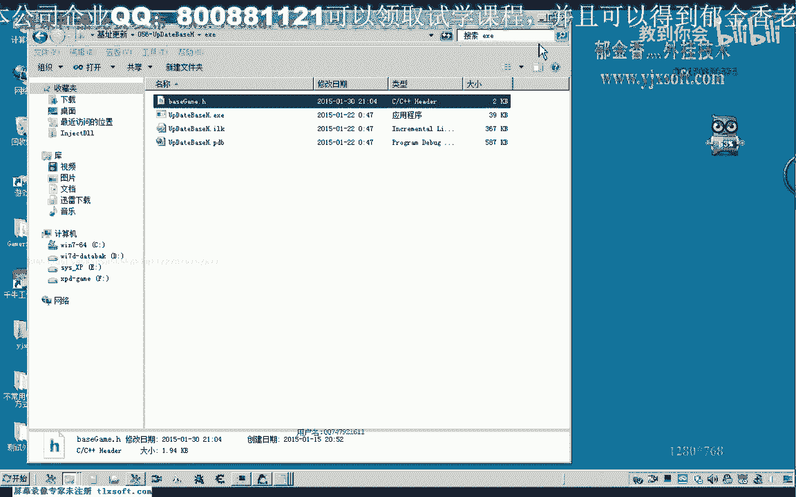

那么实际上在我们这一刻的话，实际上就已经完美的完成了。

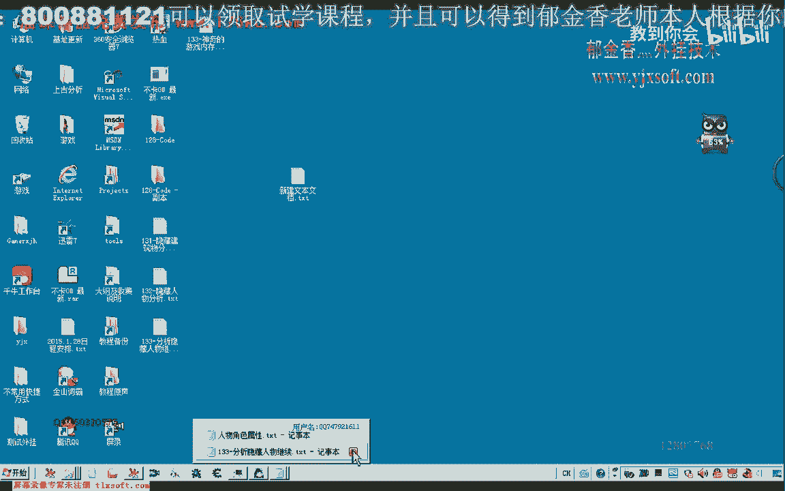

当然我们可以看一下之前的这个人物的这个隐藏，那么之前的121这个地方。

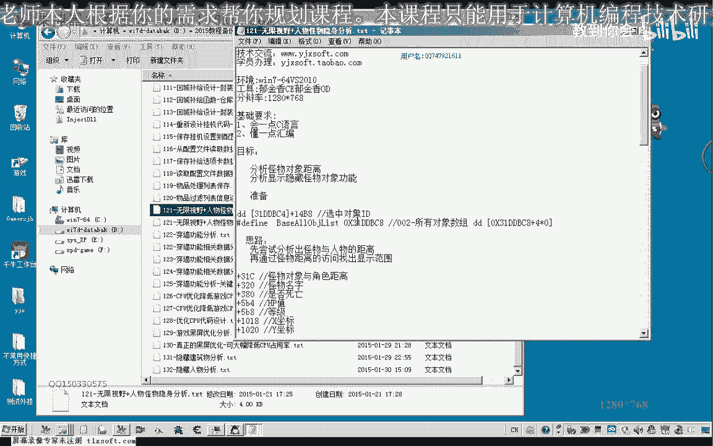

啊在这个课里面有这个相应的机制，我看之前的有没有找出来，这是相应的一个特征码，我们已经进去看一下。

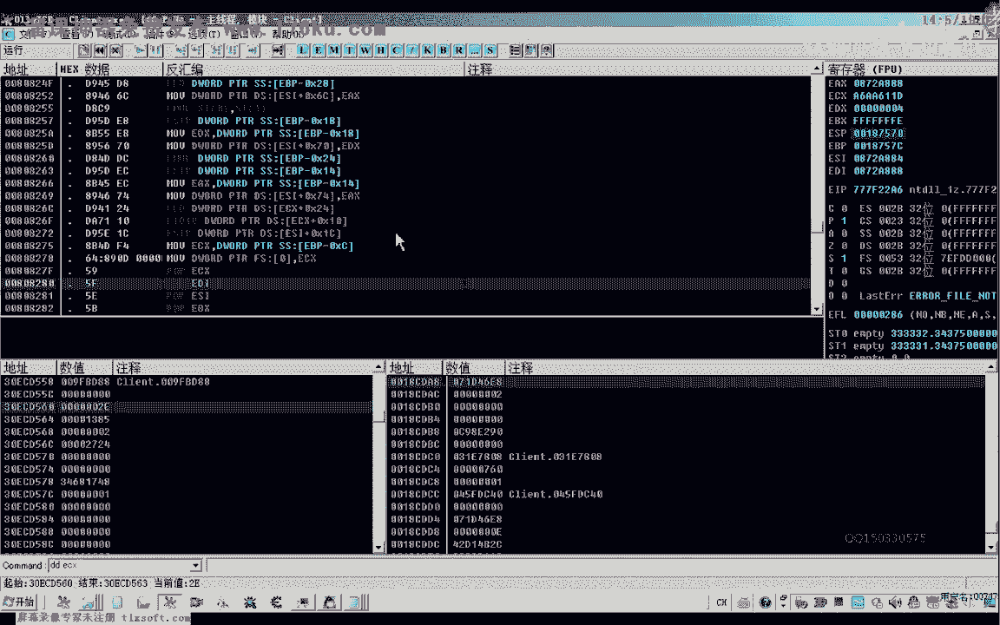

啊这个时候的话他应该说那个特征码呢有了一定的变化，那么这之前这里呢我们取了一个特征码啊，进行一下搜索，打开我们的c工具，那么看一下新的这个机子到什么地方来的。

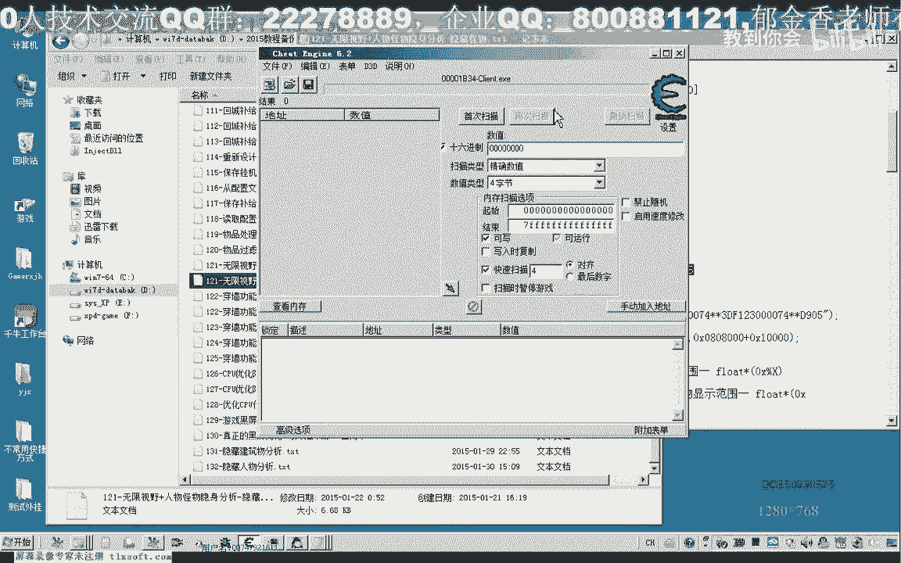

对了呃，这里呢我们已经有有更改这个有搜索它的这个机制呃。

把它这个相应的特征码已经添加到这个机子列表里面了，我们直接在这里看，您应当进行，那么也就是这个地方，我们用c来改一下，那么它是否点类型的，那么一共有两个，那么这个时候呢我们把这个300改为零。

那么我们再看一下，那么这个时候的话，周围的啊除了自己之外的话啊，其他的呃这个玩家全部都已经隐藏了哈，那么这个隐藏的话比我们的代码隐藏呢呃更加的方便一些啊，那些当然也可以通过这个数据的话。

可能也能够找到啊，其他这个完美隐藏的这个扩应该也能够找到啊，这样的话我们的这个怪物人物啊都隐藏了，但是我们的自动挂机的话，应当说呢他还是可以用的啊，自动挂机的，因为我们嗯挂机的打怪的这个代码呢。

他是读的内存，的数据啊，而不是这个显示的这个数据好的。

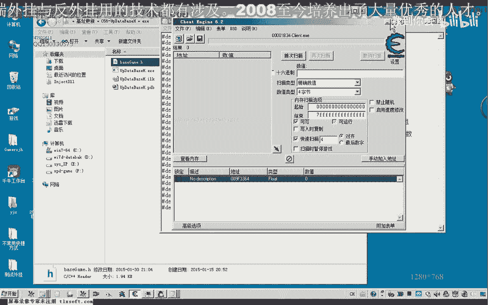

那么这一节课的话，我们就到这个地方啊，呃那么顺便呢我把这个相关的特征码给大家。

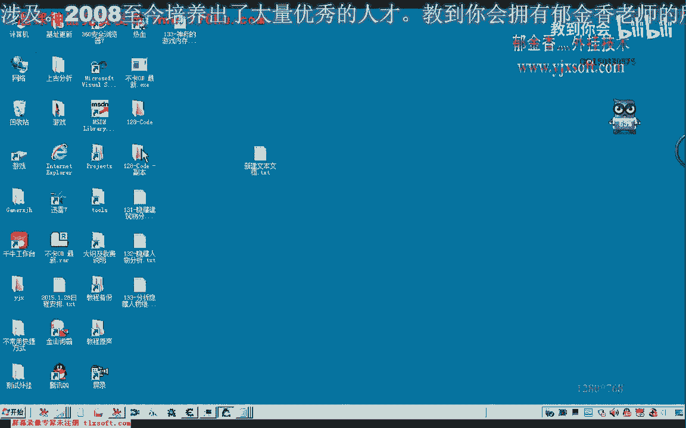

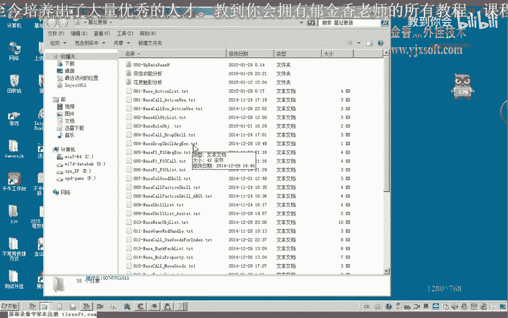

在这个地方啊显示怪不得，那么这是它相应的两个特征码，一个是这个地方啊，一个是这个地方，啊改为零隐藏，five 5，the four rg mtc。

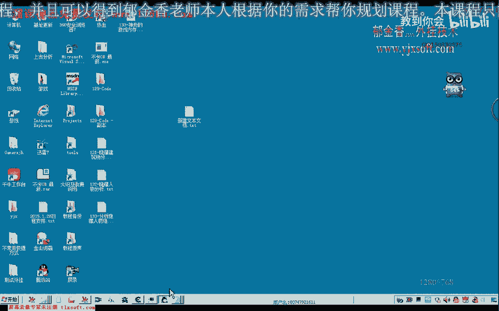

啊还有我们的隐藏我们的建筑物啊，那么隐藏建筑物的话，我们再按减号回来看，这个地方是隐藏我们的建筑物，那么这里我们恢复之后，那么恢复之后呢，这个建筑物就不会被隐藏了，那么如果我们要隐藏的话，这个地方。

这样就可以完美隐藏我们的这个建筑了，那么或者我们的改机器码的话，就是c201 c00 ，那么可以看到这里的啊，那么我们先把它恢复啊，就是这个地方，那么我们就把这一段特征码也复制一下。

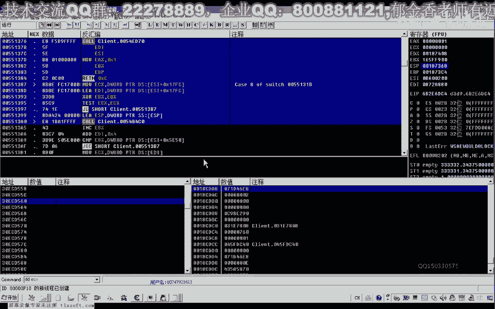

动画这里呢是隐藏我们的这个建筑物，那么这节课呢我们由于有前面的这个数据的一个分析的一个基础啊，所以说花的时间比较少，那么这节课呢我们就探讨到这里了，那么我们下一节课了再见。

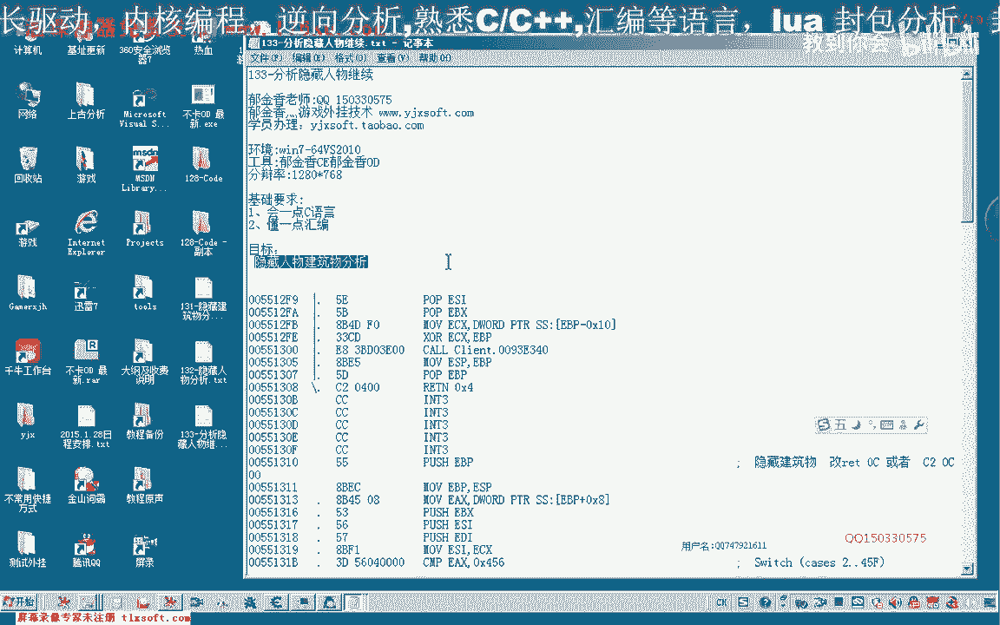

