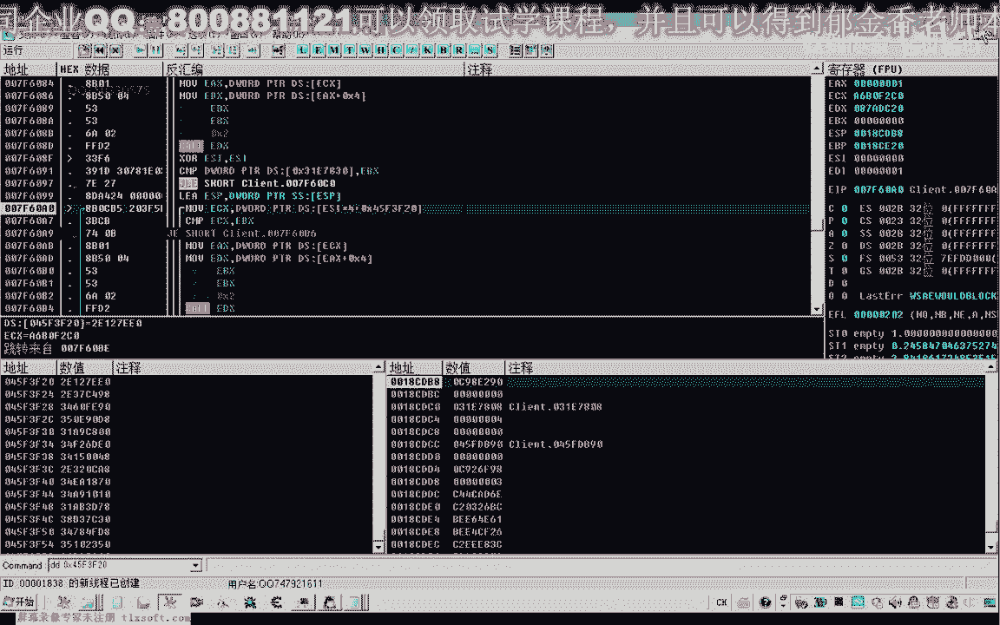
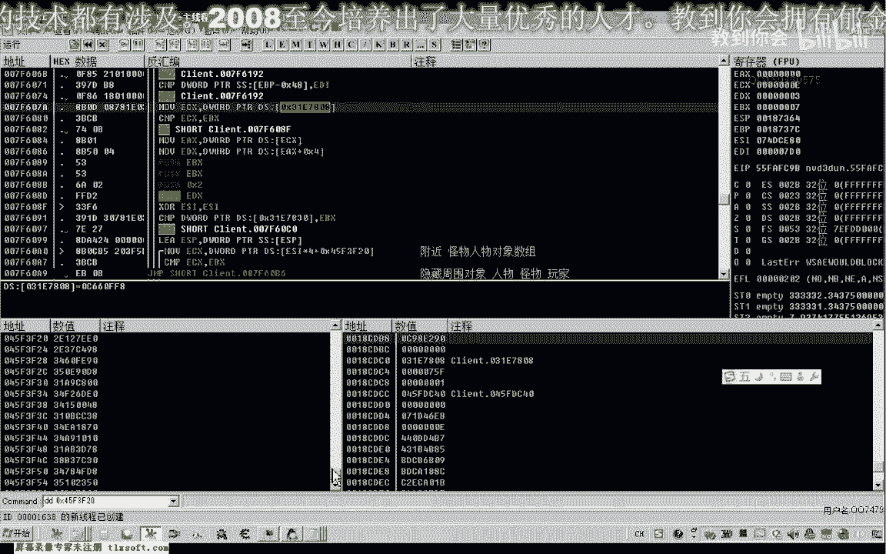
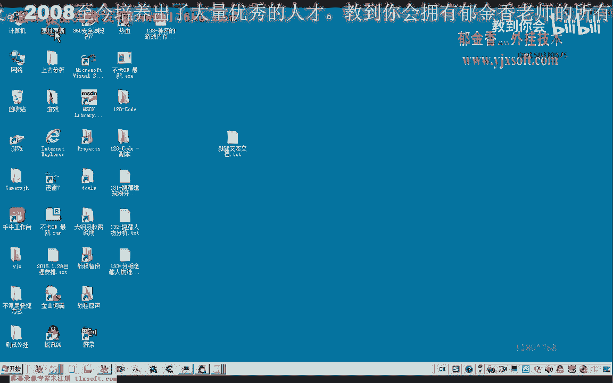
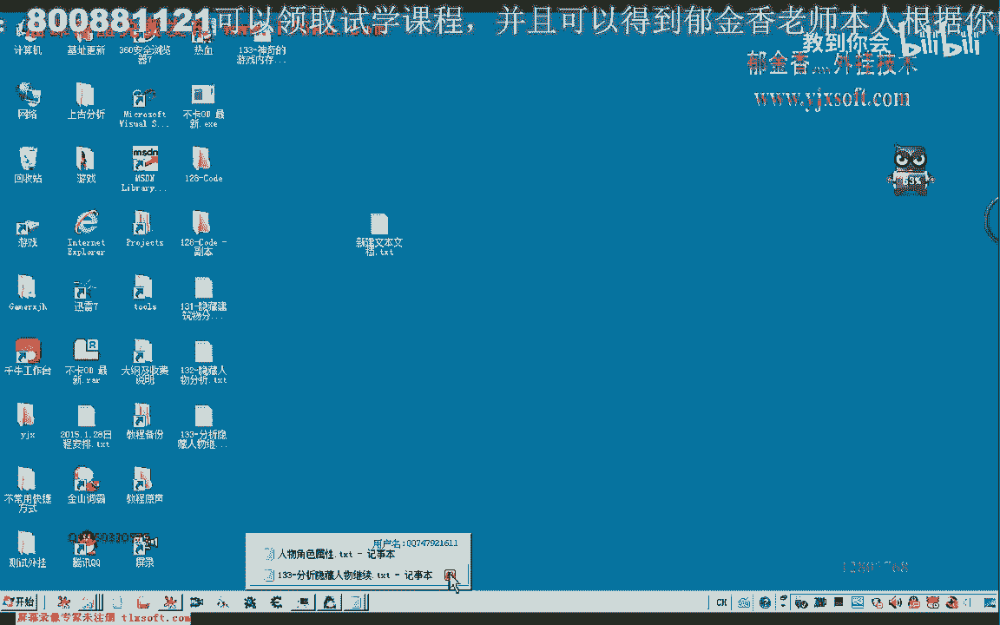
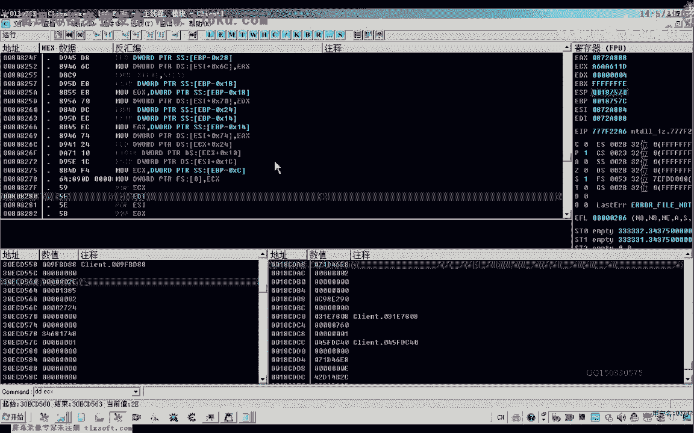
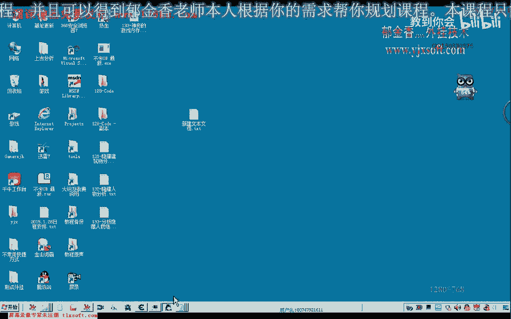

# 逆向分析课程 P122：隐藏人物与建筑物分析 🕵️♂️

在本节课中，我们将继续上一节课的分析，学习如何通过逆向工程找到并修改游戏代码，以实现隐藏游戏内人物和建筑物的功能。我们将分析关键的内存地址、函数调用和判断逻辑，并最终通过修改数据或代码实现目标效果。

---

## 回顾与问题定位 🔍

上一节我们介绍了分析接口的初步修改，但修改代码后程序会崩溃。本节中我们来看看如何定位并解决这些问题。

首先，我们转到之前分析过的地址。当时我们修改了 `4354B0` 处的跳转，但运行一段时间后程序会出错。

根据分析，这个地址的处理逻辑与人物角色和画面更新的数据相关，它有三个参数。接下来，我们尝试分析更前面的代码，因为修改跳转后数据会出错。

## 分析前置判断逻辑 🧩

我们再往前查找，到了两个关键位置。这里有一个判断，从代码结构看，它涉及一个数组。

以下是分析该数组内容的步骤：
1.  查看数组的第一个元素，类型是 `0x31`，代表玩家对象。
2.  查看数组的第二个元素，类型是怪物对象。
3.  初步判断，这个数组可能是我们周围单位的列表（包括玩家和怪物）。

我们让程序运行起来，然后在内存单元中查看。

我们查找更新周围怪物对象的函数，找到了地址 `450F20`。这里显示的是附近的怪物/人物对象数组。

既然相关，那么后续的数据处理肯定与怪物和人物数据有关。此处的比较逻辑是检查数组中是否存在某个单位。如果我们直接让其跳转（即绕过判断），就等于告诉程序“周围不存在怪物”。

我们进入该逻辑查看。跳转后，周围的人物和怪物可能全部被隐藏了。但隐藏后还有一个问题：角色移动也会受到影响。虽然这个功能能隐藏周围单位，但实际作用有限。

我们注释掉这里的修改。目前，我们能隐藏周围的对象（玩家、怪物、其他人物），但建筑物的隐藏可能另有其法。

## 探索建筑物隐藏逻辑 🏗️

我们再往前查找，发现另一个判断，其来源是地址 `3117808`。这个地址我们之前没见过。

这里也有一个比较，并且会被执行。我们观察其执行地址和 `EDX` 寄存器的值，运行几次后发现 `EDX` 没有变化，说明这个调用可能固定指向某个函数。

我们尝试在此处添加一个 `JMP` 指令跳过它，然后观察效果。跳过这个调用后，角色无法移动，但大部分建筑物被隐藏了（尽管还能看到虚影）。这很可能就是处理建筑物隐藏的关键函数。

我们根据这个调用地址进去查看。在函数内部下断点，发现 `EDX` 值一直不变，初步判断这个地址固定，专门处理建筑物的显示数据。

我们备注一下：**此处是建筑物相关显示数据的处理函数**。如果不处理这个函数，建筑物就不会被绘制出来，因此它能绘制部分建筑物虚影。

## 深入分析并完美隐藏建筑物 🎯

我们转到这个函数内部，观察其参数。通过观察 `ESP` 寄存器的变化，可以推断它有三个参数。

我们在函数头部尝试修改代码，然后返回游戏查看效果。修改后，建筑物的虚影完全消失，所有建筑物都被完美隐藏，且不影响自动挂机功能。

## 优化人物与怪物的隐藏方案 👥

关于人物和怪物的隐藏，我们之前分析过一个相关的“距离”参数。只要将该参数改为零，实际上也能达到完美隐藏的效果，无需修改此处代码。

以下是实现完美隐藏的步骤：
1.  找到之前课程中分析出的特征码和基址。
2.  使用工具（如CE）修改内存数据。

我们查看之前人物隐藏的地址（`P121` 课程内容），找到相应的特征码。由于游戏更新，特征码可能已变化，需要重新搜索。

打开CE工具，搜索新的基址。

我们已经将新的特征码添加到基址列表。直接在此处查看并修改，将类型为 `float` 的两个值从 `300` 改为 `0`。

修改后，除了自身以外的所有玩家和怪物都被隐藏了。这种通过数据隐藏的方式比直接修改代码更方便。自动挂机功能仍然可用，因为打怪逻辑读取的是内存数据，而非显示数据。

## 关键特征码总结 📝

本节课涉及几个关键修改点，以下是相关的特征码：

1.  **隐藏人物/怪物（距离修改）**：
    *   特征码位置：之前课程中分析的地址。
    *   修改方法：找到两个 `float` 类型数据，将其值改为 `0`。
    *   效果：隐藏自身以外的所有玩家和怪物。

    
    

2.  **隐藏建筑物（代码修改）**：
    *   关键调用地址：本节课分析的函数。
    *   修改方法：修改该函数的机器码为 `C2 01 C0`，或直接NOP掉关键调用。
    *   效果：完美隐藏所有建筑物。

    
    

恢复代码后，建筑物将重新显示。若需隐藏，则应用上述修改。

## 课程总结 🎓

本节课中，我们一起学习了如何通过逆向分析定位游戏内隐藏人物和建筑物的逻辑。

*   我们首先回顾了之前修改导致崩溃的问题，并向前追溯分析逻辑。
*   然后，我们分析了处理周围单位列表的判断，并找到了隐藏人物的替代方案（通过修改距离数据）。
*   接着，我们发现了专门处理建筑物显示的函数，并通过修改其代码实现了建筑物的完美隐藏。
*   最后，我们总结了实现这两个功能的关键特征码和修改方法。

由于有前面的数据分析基础，本节课的探讨效率较高。通过修改数据而非代码，可以实现更稳定、方便的功能。

我们下节课再见！

