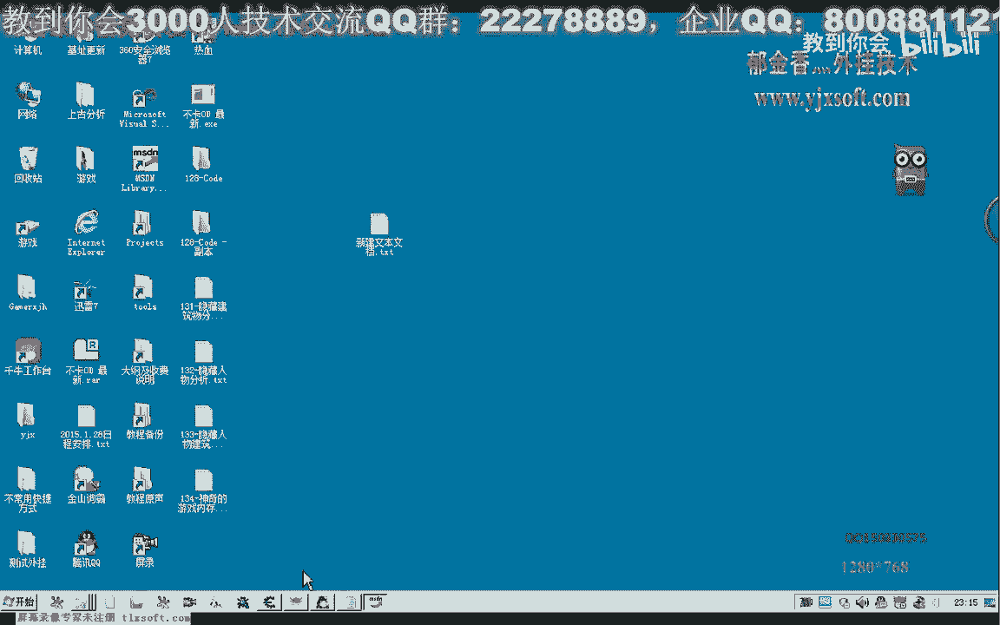
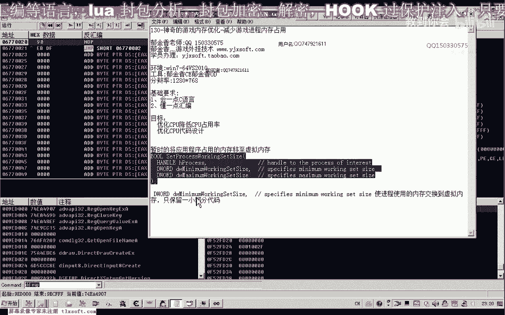
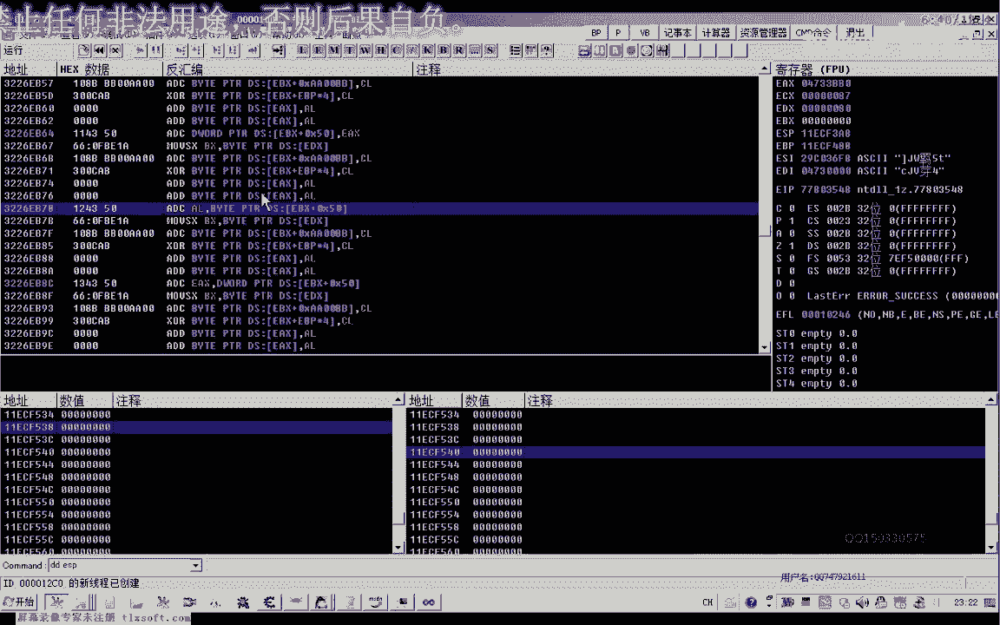
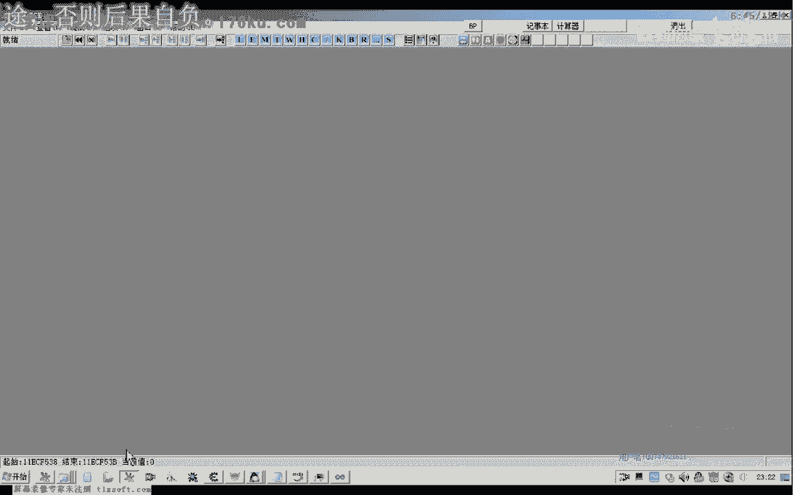
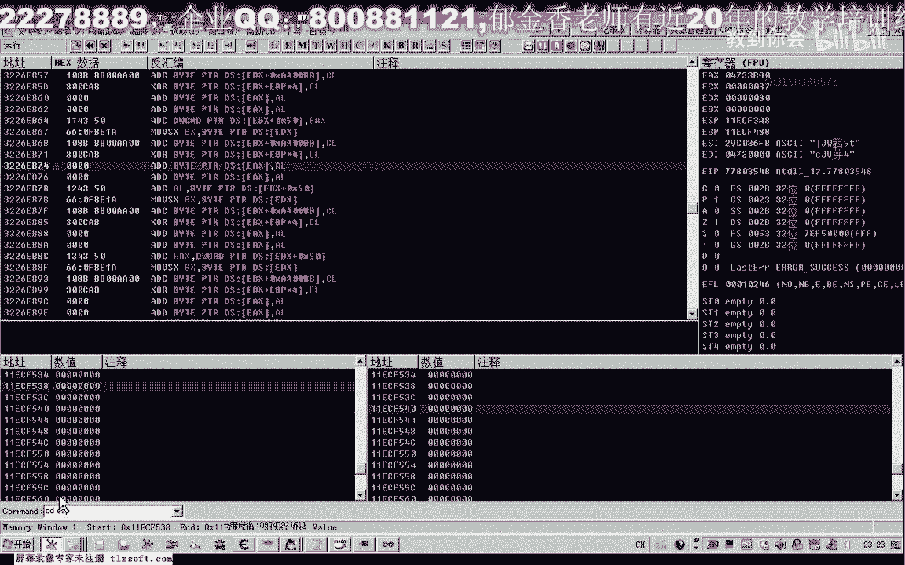
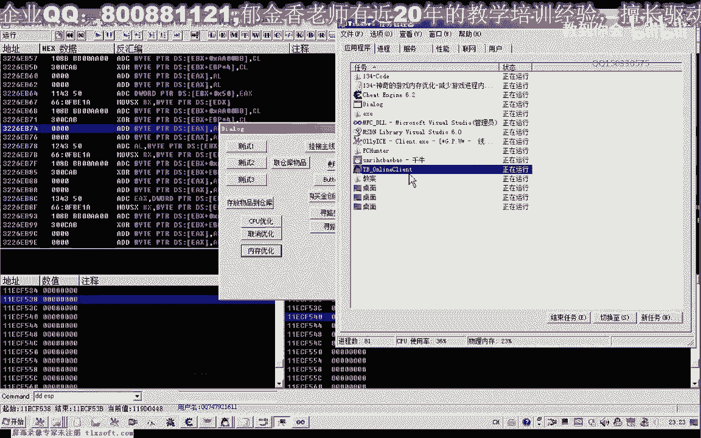

# 课程 P123：神奇的游戏内存优化 🧠



在本节课中，我们将学习一个用于优化游戏进程内存占用的 Windows API 函数。我们将了解其工作原理、使用方法以及注意事项，并通过一个简单的代码示例来演示其效果。

## 概述

内存优化函数是一个 Windows API，其本质是将物理内存中的数据交换到虚拟内存（通常位于硬盘上）中。这并非真正减少内存使用量，而是通过置换不常使用的数据来更高效地利用物理内存。

上一节我们介绍了内存优化的基本概念，本节中我们来看看具体的实现方法。

## 函数原理


根据官方文档说明，当该函数的第二个和第三个参数同时设置为 `0xFFFFFFFF`（即十进制的 `-1`）时，函数会将进程的物理内存数据置换到虚拟内存中。




其核心作用是创建一个页面文件并保存到硬盘上。如果某些数据不经常被使用，这种方法可以有效地释放物理内存空间。


## 代码实现

以下是调用该函数进行内存优化的一个简单示例。我们将在游戏加载完成后使用它。

```cpp
// 获取当前进程句柄并调用优化函数
HANDLE hProcess = GetCurrentProcess();
// 调用内存优化函数，传入三个 -1 参数
OptimizeMemoryFunction(hProcess, -1, -1);
```





注意：该函数建议在游戏加载好后仅使用一次，反复调用可能对硬盘造成额外负担。


## 操作演示





我们通过一个实际案例来观察效果。优化前，游戏进程的内存占用约为 618 MB。

执行上述优化函数后，内存占用显著下降至几十 MB。这是因为大量数据被置换到了硬盘上的虚拟内存中。

然而，随着游戏运行，系统需要访问相关数据时，会逐渐将数据从硬盘换回内存，因此内存占用会缓慢回升。这个过程如果频繁发生，硬盘指示灯会频繁闪烁。


## 注意事项

在使用此优化技术时，需要注意以下几点：

*   **一次性使用**：该效果在首次调用时最明显，后续调用效果有限。
*   **硬盘影响**：频繁的数据置换会增加硬盘读写，可能影响硬盘寿命。
*   **虚拟内存依赖**：此功能依赖于系统设置的页面文件（如 `pagefile.sys`）。如果虚拟内存被禁用或设置得过小，此函数可能失效。
*   **参数简写**：函数调用时可以传入三个 `-1` 作为参数，其中第一个 `-1` 代表当前进程句柄。

## 总结


本节课我们一起学习了如何通过一个特定的 API 函数来优化游戏进程的内存占用。我们了解到，该技术通过将物理内存数据置换到硬盘虚拟内存中来暂时减少内存占用，但并非永久性减少内存使用。使用时需注意其一次性效果以及对硬盘的潜在影响。理解其原理有助于我们更合理地运用这一优化手段。