# 课程 P124：D3D9_HOOK黑屏优化分析及地址定位 🎮

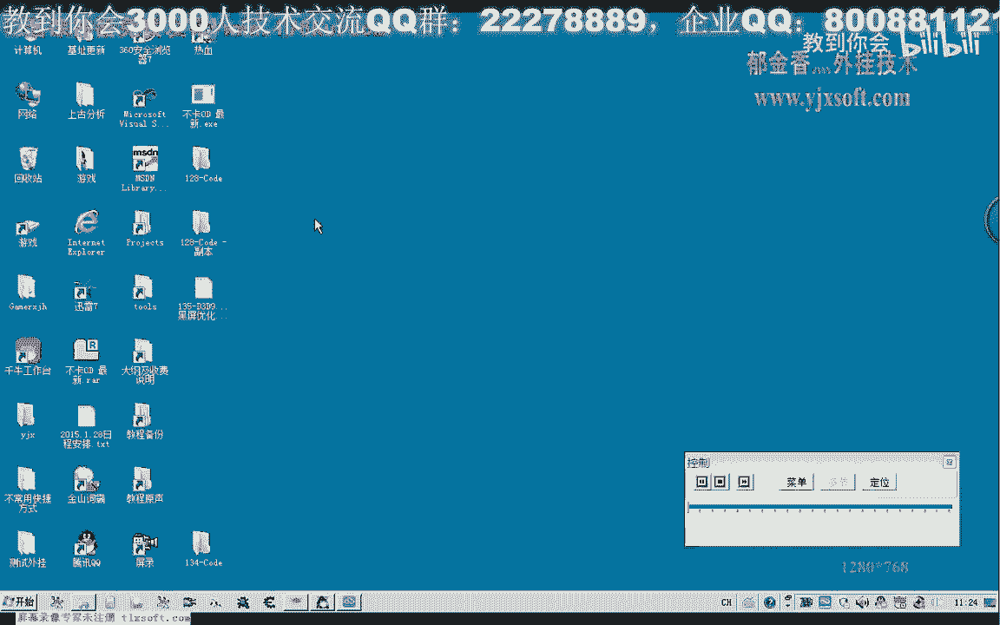

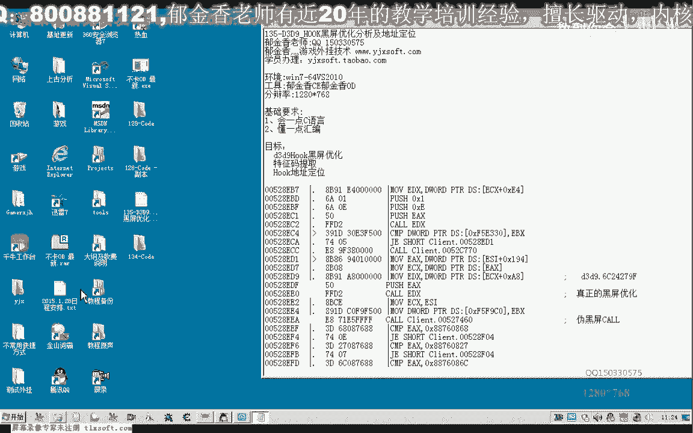

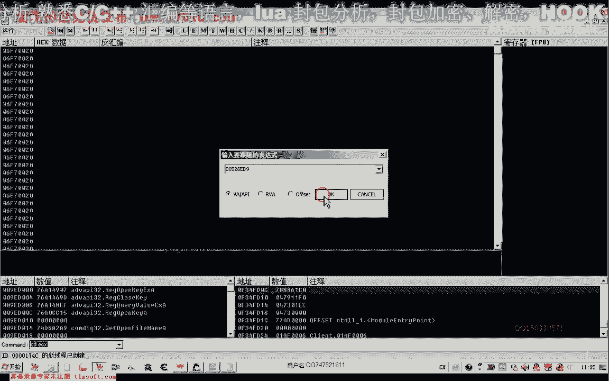

在本节课中，我们将学习两种实现D3D9黑屏优化的方法，并详细讲解如何定位实现这些优化所需的关键内存地址。黑屏优化的核心原理是阻止游戏渲染图形，从而显著降低CPU占用率。

## 两种黑屏优化实现方式 💡

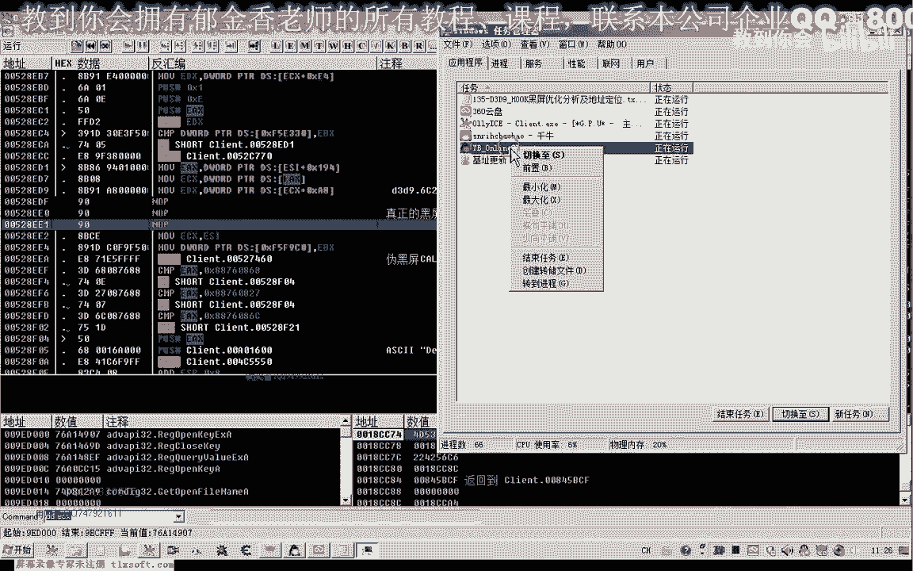

上一节我们介绍了黑屏优化的概念，本节中我们来看看两种具体的实现路径。

实现黑屏优化主要有两个切入点：
1.  在主线程中通过HOOK技术，跳过关键的图形绘制调用。
2.  直接修改`d3d9.dll`动态链接库中的函数代码，使其提前返回。

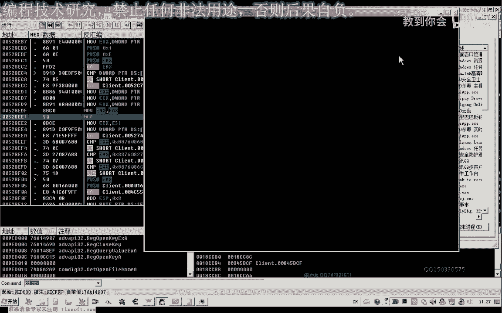

这两种方式的实现原理相同，都是通过阻止图形更新和绘制来达到节省CPU资源的目的。

## 方法一：主线程HOOK实现 🧵

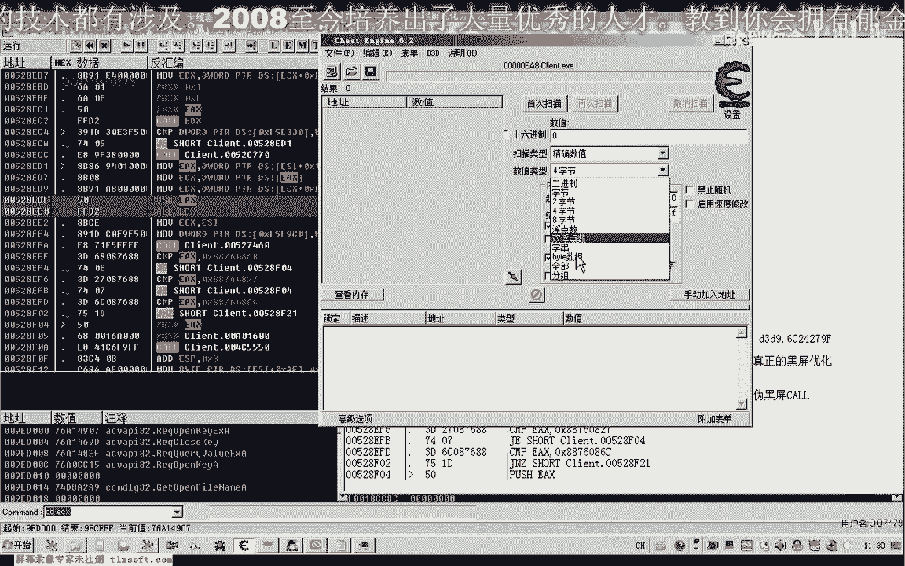

首先，我们分析第一种在主线程中实现的方法。

以下是实现步骤：
1.  使用调试工具定位到负责图形更新的关键代码段。
2.  将该代码段进行NOP（空操作）填充或修改为无害指令（如 `mov eax, eax`）。
3.  修改后，游戏将不再渲染画面，CPU占用率会随之下降。

这种优化方式比另一种通过强制CPU休眠的优化方法效果更好，因为它不会导致数据处理延迟。

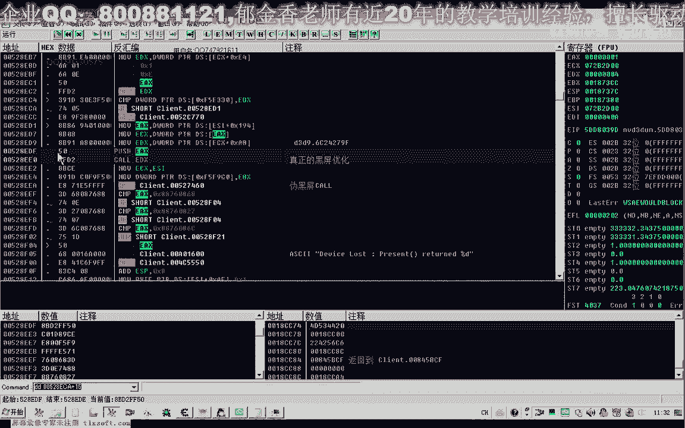

### 特征码定位与偏移计算 🔍

为了实现自动化，我们需要通过特征码来定位这个关键地址。

以下是定位流程：
1.  从关键代码段前的稳定区域提取特征字节序列。
2.  使用特征码在内存中搜索，找到匹配的地址。
3.  计算从特征码地址到目标修改地址的偏移量。公式为：
    `目标地址 = 特征码定位地址 + 偏移量`
4.  例如，若偏移量为 `0x15`（十进制21），则最终地址为定位地址加上该值。

定位成功后，我们需要修改的目标是连续的三个字节，将其全部替换为 `0x90`（NOP指令）即可。

## 方法二：修改D3D9动态链接库 🔧

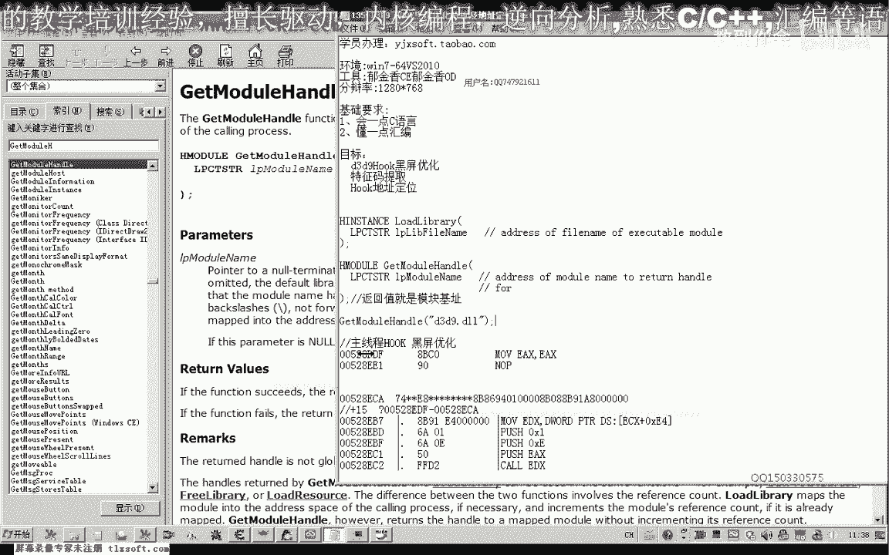

接下来，我们探讨第二种直接修改`d3d9.dll`的方法。

由于`d3d9.dll`是动态加载的，其基地址每次启动游戏都会变化。因此，我们不能使用硬编码的地址。解决方案是动态获取模块基址，然后加上固定的函数偏移。

### 动态获取模块地址与计算

以下是获取和计算目标地址的步骤：
1.  使用Windows API函数获取`d3d9.dll`的模块句柄（即基地址）。
    *   常用函数有 `GetModuleHandle(L"d3d9.dll")`。
    *   模块句柄的返回值就是该DLL加载到内存中的基地址。
2.  通过逆向分析，找到目标函数相对于DLL基地址的固定偏移量。
3.  使用公式计算出目标函数的绝对地址：
    `目标函数地址 = GetModuleHandle("d3d9.dll") + 函数偏移量`

### 函数修改

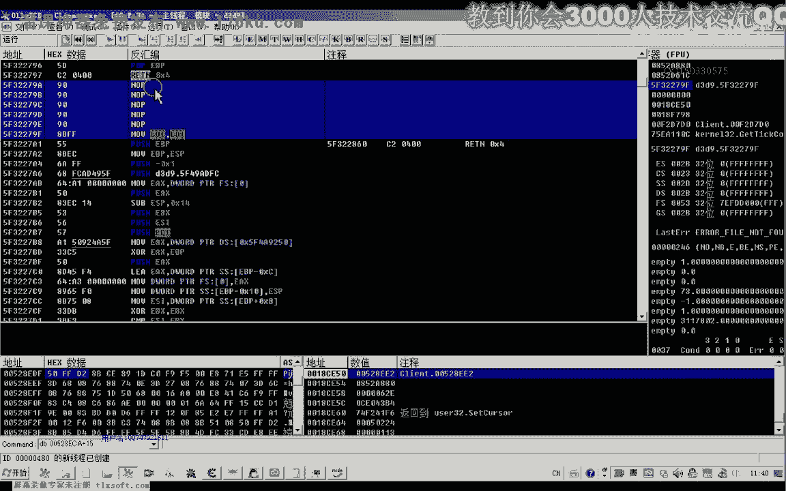

定位到目标函数后，我们修改其入口处的代码。
该函数通常以 `push ebp; mov ebp, esp` 开头。我们只需将开头的几个字节替换为 `c2 04 00`，即汇编指令 `retn 4`，使函数立即返回并清理一个参数，从而跳过后续的所有绘制操作。

在修改前，务必备份被覆盖的原始字节，以便后续恢复。

## 代码实现与作业 📝

最后，我们将上述逻辑整合到代码中。

我们需要定义两个宏或函数来生成最终的可写地址：
*   `BLACK_SCREEN_MAIN_HOOK_ADDR`: 通过搜索主线程特征码并加上偏移量生成。
*   `BLACK_SCREEN_D3D9_HOOK_ADDR`: 通过 `GetModuleHandle` 获取基址再加上偏移量生成。

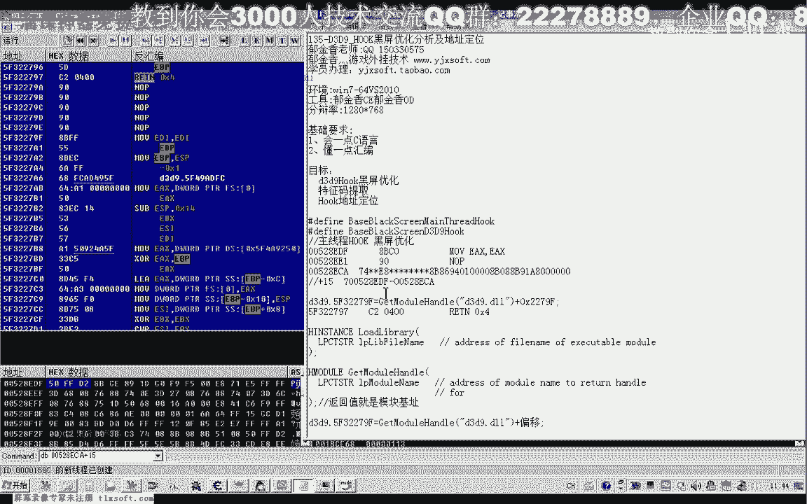

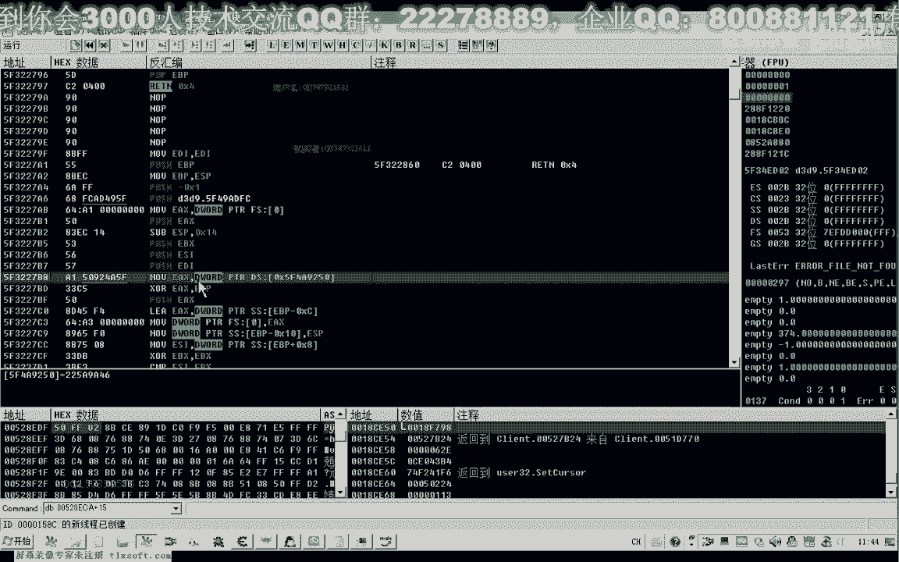

对于主线程HOOK，写入的数据是三个 `0x90`。
对于D3D9函数HOOK，写入的数据是 `{0xC2, 0x04, 0x00}`。

**本节课的作业**：请参考第56课的代码框架，编写程序自动完成上述地址的计算与代码改写操作。

## 总结 📚

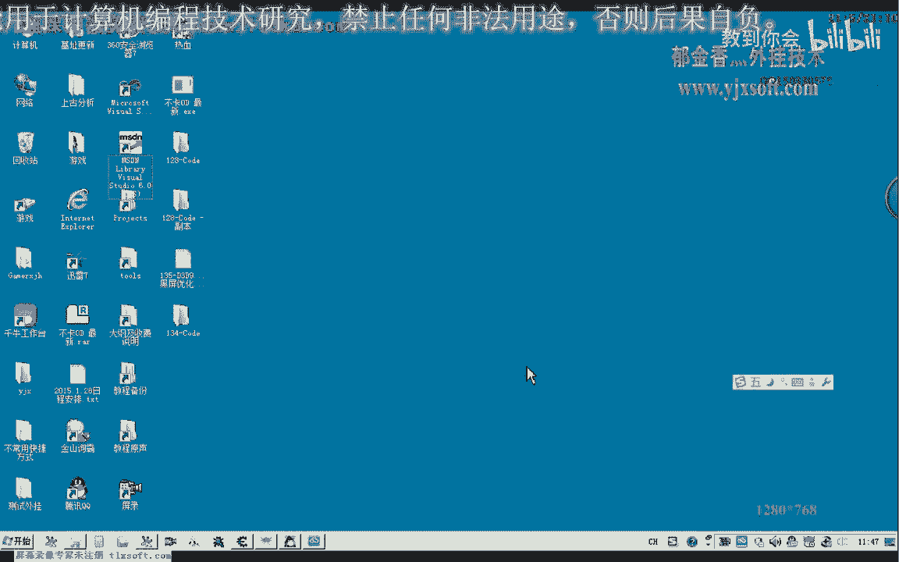

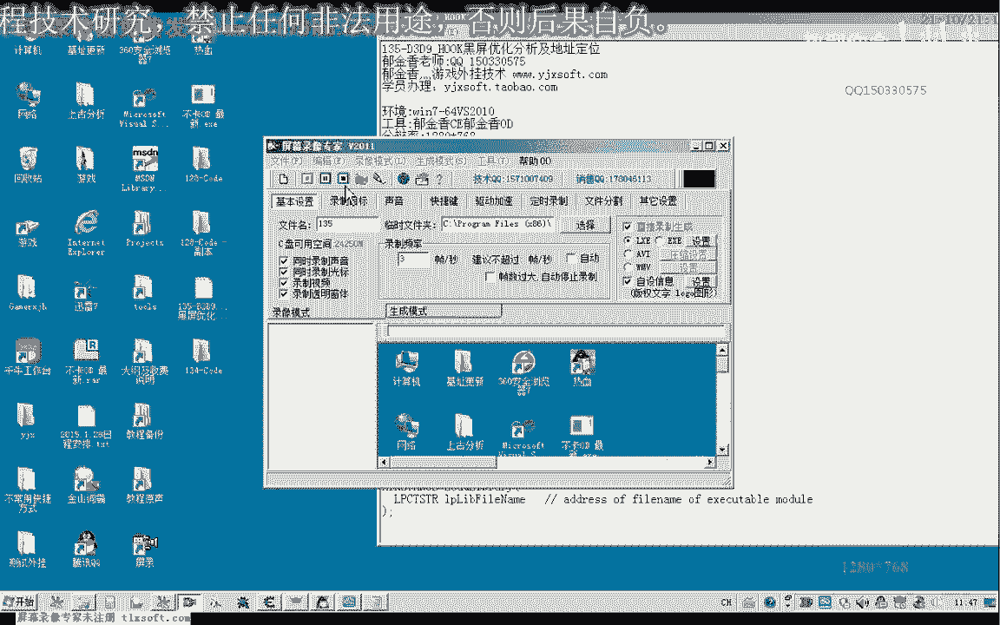

本节课中我们一起学习了D3D9黑屏优化的两种实现方式：主线程HOOK和直接修改D3D9动态链接库。我们深入探讨了如何通过特征码定位和动态基址计算来找到关键的内存地址，并明确了具体的修改字节。掌握这些方法，你就能有效地实现游戏的黑屏优化，降低资源消耗。下一节课，我们将共同完成相关的代码实践作业。