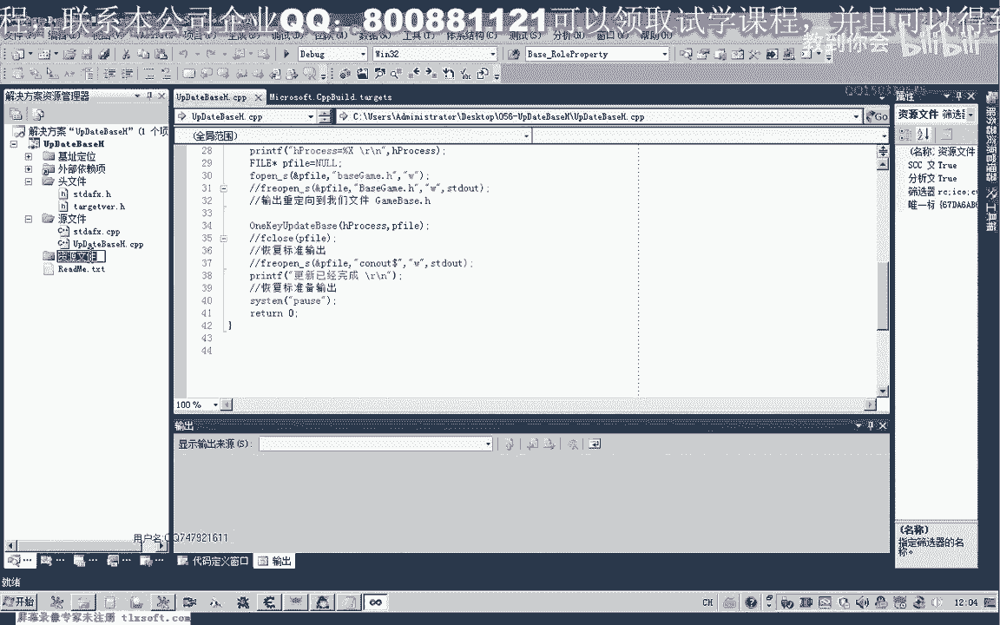
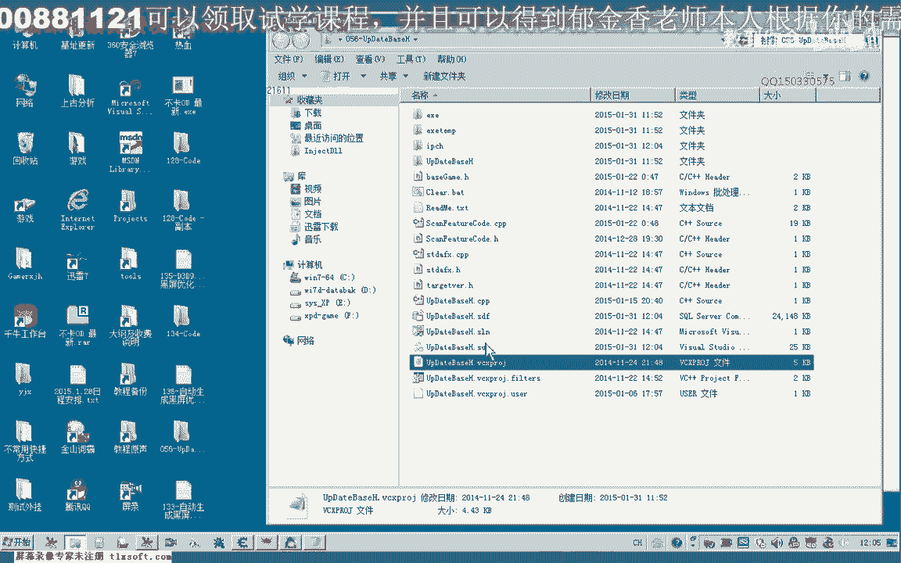
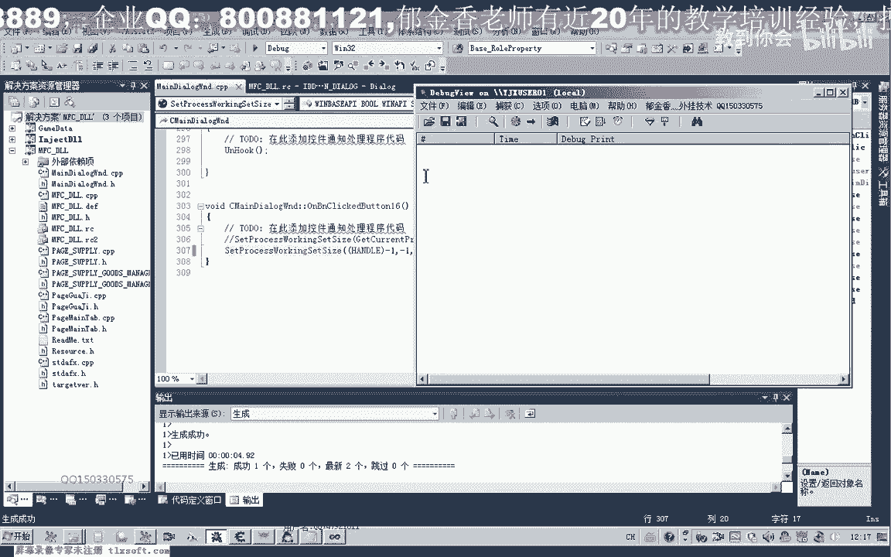
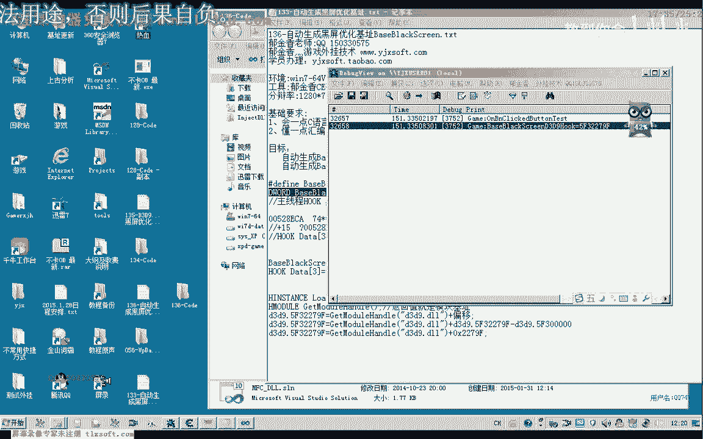
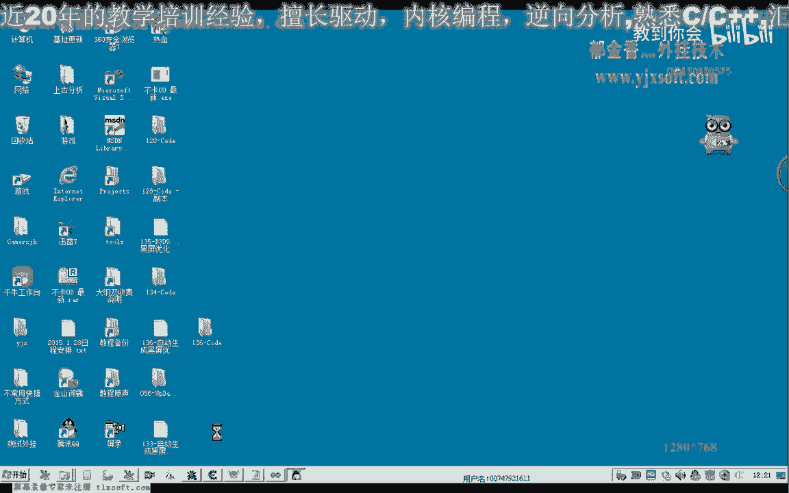
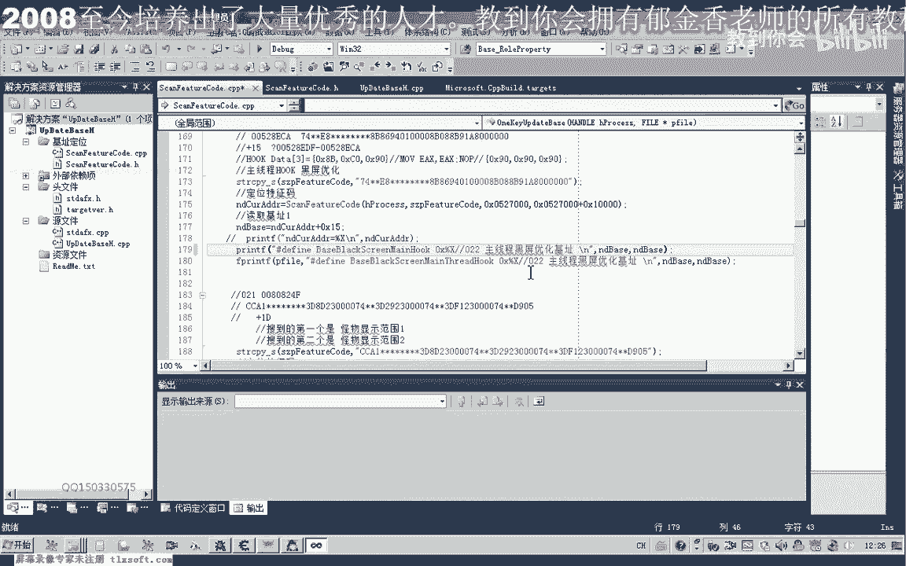
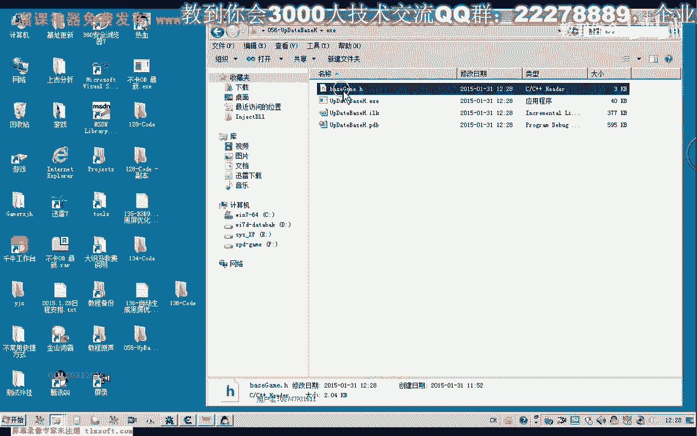

# 课程 P125：136-自动生成黑屏优化基址 BaseBlackScreen 📝





在本节课中，我们将学习如何自动生成实现黑屏优化所需的两个关键基址。上一节我们分析了实现黑屏优化的两种方式：主线程Hook和动态链接库Hook。本节我们将重点讲解如何通过代码自动定位并生成这两个基址，为后续的Hook操作做好准备。

## 回顾与目标 🎯

上一节我们介绍了两种黑屏优化的实现方式。第一种是通过搜索特征码 `8B3090` 来定位主线程中的指令。第二种是通过三个 `NOP` 指令（`90`）来实现Hook。无论采用哪种方式，都需要先准确定位到目标基址。本节的目标就是编写代码，自动生成这两个基址。

## 自动生成主线程黑屏优化基址 🔍

首先，我们来生成主线程黑屏优化所需的基址。这个基址的定位依赖于搜索特定的特征字符串。

以下是实现步骤：

1.  **复制并修改现有代码**：我们参考第56课的基址定位代码。该代码之前已能定位21个基址，现在我们需要添加第22个基址用于黑屏优化。
2.  **设置特征码与偏移**：将黑屏优化的特征字符串和对应的偏移量复制到代码中。特征码为 `8B3090`，我们需要搜索它。
3.  **优化搜索范围**：为了提高搜索效率，我们不是从进程起始地址（如0x400）开始搜索，而是在一个已知地址（例如 `528`）附近的小范围（如增加1万字节）内搜索。这样可以大大加快速度。
4.  **计算最终地址**：搜索到特征码地址后，还需要加上一个15字节的偏移，才能得到最终的目标基址。
5.  **代码调整**：与之前一些需要读取指针的基址不同，这个地址是直接使用的。因此，我们不需要调用读取内存的函数，而是直接将搜索到的地址加上偏移即可。
6.  **验证与输出**：将计算出的基址输出到文件或屏幕，供后续Hook使用。

核心的地址计算逻辑可以用以下伪代码表示：
```cpp
DWORD SearchedAddr = FindPattern(“8B3090”, StartAddr, SearchRange);
DWORD FinalBase = SearchedAddr + 0x0F; // 加上15字节偏移
```

通过以上步骤，我们就能成功生成主线程黑屏优化的固定基址。




## 动态生成动态链接库中的基址 ⚙️

接下来，我们处理第二种方式所需的基址。这个基址位于动态链接库中，其地址不是固定的，每次游戏启动都可能变化，因此不能像上一个那样生成静态的“红”（即常量）。我们需要在动态链接库加载时动态计算它。

以下是实现方法：



1.  **定义全局变量**：在动态链接库的代码中，定义一个全局变量来存储这个基址。
2.  **动态初始化**：在动态链接库被加载时（例如在 `DllMain` 函数或初始化函数中），计算这个基址的值。
3.  **计算方法**：基址的计算公式为：**目标模块的基址 + 固定偏移**。我们需要先获取目标模块（如 `game.dll`）的句柄和基址，然后加上一个已知的偏移量。
4.  **类型转换**：注意相关API返回值的类型转换，例如将 `HMODULE` 转换为 `DWORD`。
5.  **调试输出**：可以打印出计算出的基址进行验证。

核心的计算公式如下：
```cpp
// 假设目标模块句柄为 hModule，固定偏移为 offset
DWORD DynamicBase = (DWORD)hModule + offset;
```




这样，无论游戏如何重启，动态链接库每次都能正确计算出当前的基址。


## 总结与下节预告 📚


本节课我们一起学习了如何自动生成黑屏优化所需的两个基址。

*   对于主线程的固定基址，我们通过**搜索特征码并计算偏移**的方式来自动定位。
*   对于动态链接库中的可变基址，我们通过在库加载时**动态计算“模块基址+固定偏移”** 的方式来获取。






基址定位是Hook操作的前提。下一节，我们将基于本节获取的基址，具体实现黑屏优化的Hook与反Hook（还原）功能。其核心操作就是向目标地址写入数据（如 `90 90 90`）或恢复原数据。请大家尝试提前完成这两个功能的函数编写。