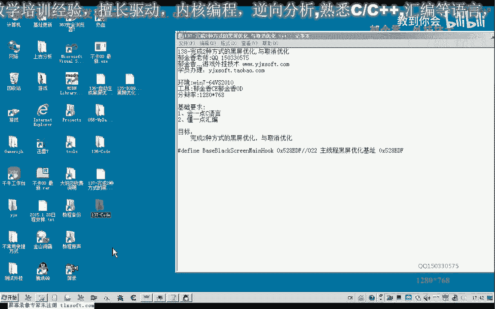
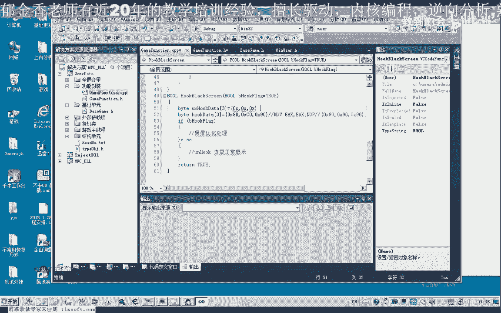
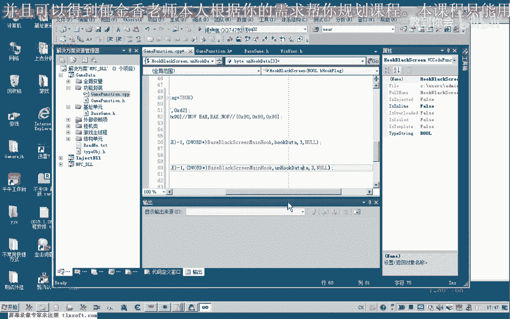
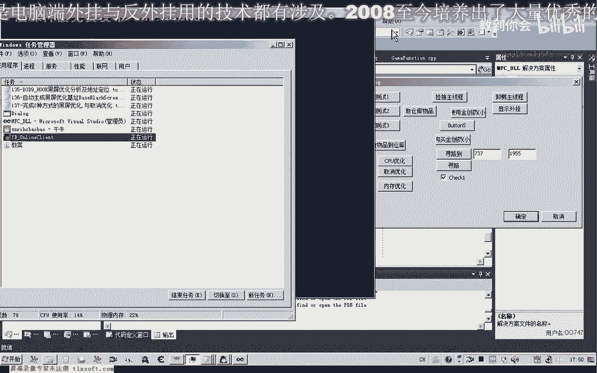
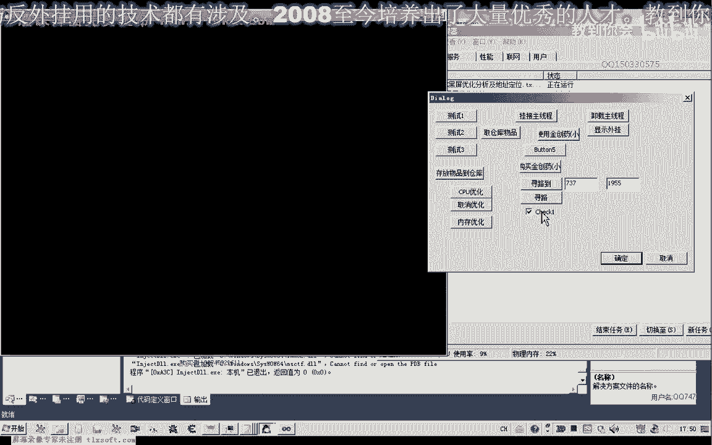
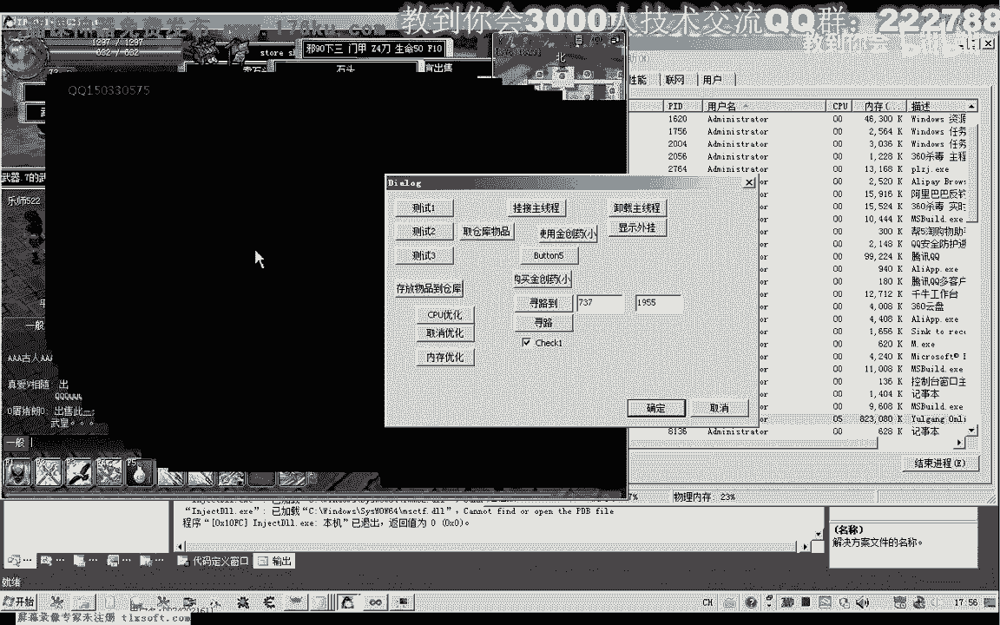
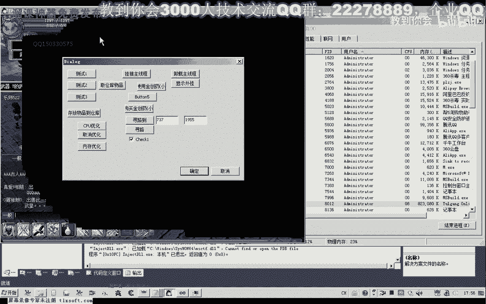
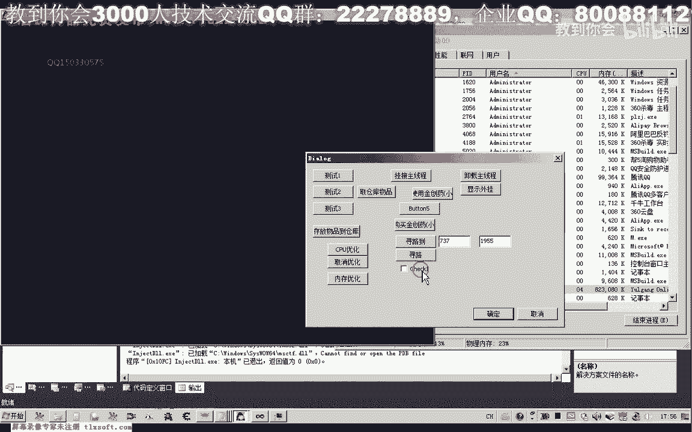
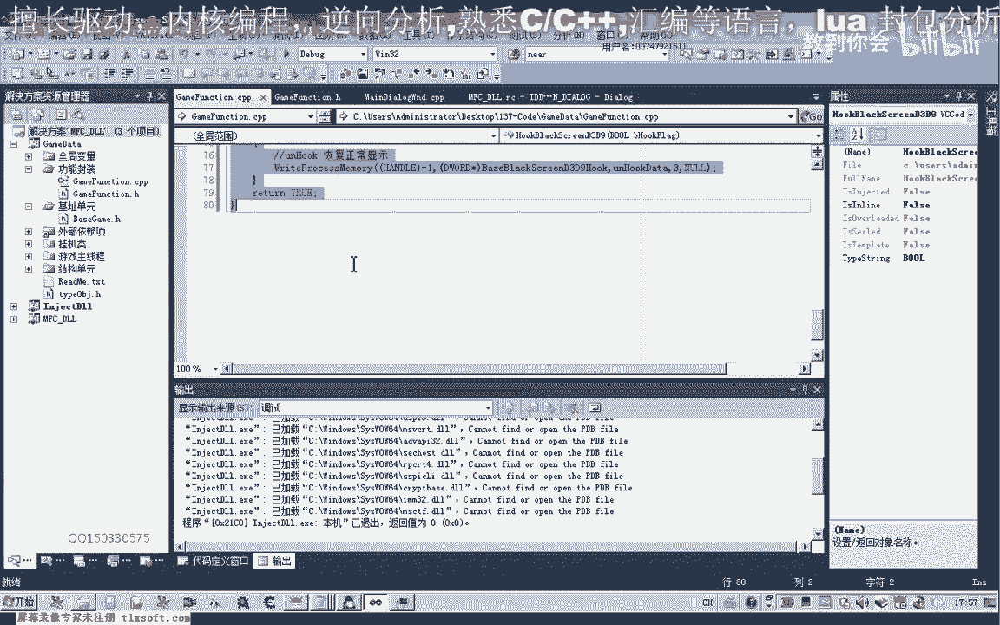
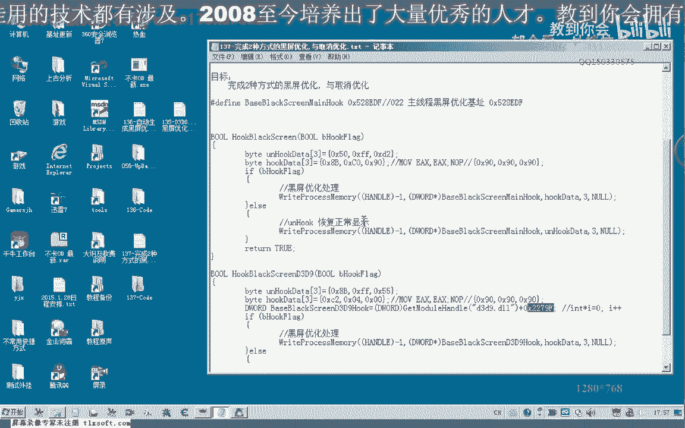

# P126：137-完成2种方式的游戏黑屏优化与取消优化代码设计 - 教到你会 - BV1DS4y1n7qF

大家好，我是郁金香老师，那么这节课呢我们嗯来完成了两种方式的一个黑屏优化啊，与其取消这个优化，那么首先呢我们，打开136克的代码。

那么首先呢我们把之前呃自动更新的这个图文件啊，把它复制过来，因为这里边呢以我们最新的这个基地址，好了，然后呢转到我们相应的机子单元，那么这里呢能够找到我们合格的地址，那么我们可以开始写第一个函数。

那么但是为了区分好的话，我们把它放到这个功能封装这里，那么这里呢我们可这里的函数呢我们可以直接调用化，无用呢，呃挂在我们的主线程单元啊，像这什么函数，那么在这里呢我们写一个hot函数，bug黑屏来。

那么黑屏的时候呢，这里呢我们把这个hook呢圆hook呢写在一起啊，这里我们给他写一个hook的标志，the flag，那么写好之后呢，我们相应的代码呢我们需要转到cp p单元来完成。

那么这个符号呢可能就会出现重新从定义，那么设计的思路的话，还是进行on ho，那么如果标志为真的话，我们在这个位置进行了黑屏处理，放开，那么如果标志了五角，那么我们在这里呢进行了hook on ho。

恢复显示，那么在这之前的话，我们需要来打开135克的代码啊。

获得他的一个修改的一个数字，或者是136克，这里也有准备，这里是要hook的这个数据，hook代替。

那么机子有了我们第一个写的时候呢，我们需要一个hot代替，就是我们要hook的这个代码啊，这些代码或者是全九零，或者是前面的这个指令啊，move ex到ex还有logo，这两条指令呢加起来一共是三字经。

当然这里呢呃你by条类型，然后呢我们进行写入就可以了，但是呢这是我们hook的这个数据，hook代替我们讲，那么另外我们还需要一个数组用来还原。

应该叫fia on hot dt或者叫恢复恢复显示的这个数据，那么也是三个字节，那么这三个字节的提取的话，我们需要来，到135克的分析里面能提取相应的代码。

那么首先呢我们可考的是这个位置，那么它原始数据呢是50f f第二，那么我们需要来把这个五零，f f d2 啊，放在这个地方，这里是50f f d2 ，好的那么放到这个地方之后呢，我们就可以开始处理了。

那么hook的时候呢，我们是写入数据，on hook的时候呢，我们也是写入数据，只是写入的数据的不同，那么这里呢所以我们去外滩啊，呃跨进程呢写入就可以了，那么之前我们讲了有一个伪距比啊。

当前进程的聚丙它都是-1，那么所以说在这里呢我们可以直接的转换一下安全就可以，不用调用这个函数了，直接写不移就可以了，嗯然后后面是我们要写入的机子，应该是头文件的这个啊，我把它复制一下b，嗯嗯。

那么这里呢我们把它转换成指针类型，要写入的数据的话，就是我们的hook bey，好，后边呢是我们要写的字节数啊，三个字节就可以了，嗯然后最后这里呢我们实际上写入的字节呢我们可以制空就可以了。

那么另外我们要恢复的时候呢，我们也很简单，直接在这里呢写入on hook代替就可以了。

好的，那么这是我们第一个函数，那么写好了之后呢，我们先编译生成一下，这里呢少一个分号啊，这里在报错，啊默认参数呢只能够投文件的时候呢，我们在那里定义一个默认的参数就可以了，再看一下什么地方有错呃。

需要再重新再编译一下，好的编译成功之后呢，我们直接就可以调用这个函数，那么调用的时候呢，我们可以在测试呃，测试窗口呢添加我们的添加一个框架啊，复选框控件，按这个框架来给他关联一个变量，布尔类型的直接。

好测试关联的这个变量，那么我们双击进去，在他的单机事件里面呢，我们给它添加代码，首先我们把窗口的呃数据来更新到我们的变量里面，然后呢直接用它来调用，就可以，hole black ray啊。

然后直接把这个控件的值传进去，用它来做一个参数，这样呢就能够进行的一个黑屏的一个优化，那么实际上这个呢也不叫黑屏的优化，应当是说呃关闭我们的显示的一个更新啊，这样可能更有活力一些。

因为它是实际上不是说是关闭的，这个这个时候我们看到整个画面就不动了，那么实际上呢它是一个显示画面的话已经关闭了，那么这里的话占用率的话是非常低的，这个时候但是呢它不影响我们的走动啊，跑动啊这一类的。

比如说我们在这里左上角这里点一下，或者是调用了寻路的函数，它应当呢还是在跑，但是这个时候你看一下，我们如果这个窗口与遮挡之后呢。

它的画面，呢就不会更新了，当然如果我们是把这个呃啊hook了。

你看一下它实际上是实际上是在走路的，然后比如说我们再关闭一下，再点一下这里他应该也在走路啊，我们再把这里关掉啊，可以看到了它能够正常的行动，能够正常的使用，好的，那么第一个函数呢我们已经测试成功了。

那么第二个函数我们应当怎么写，那么我们还是呃先转到定义声明这里吧，那么我们这里来写成两个函数，那么这个呢我们把它改一下名字，或者后面这个呢我们给它加一个后缀法，d3 d请推这个户口。

那么第三第九在这个赫课呢，我们在他前面的基础上来进行一个修改，复制一下前面的这段代码，那么这里加上一个第三第九，那么在后面这两个人我们都不需要改改的，只是我们hook的这个数据。

那么我们从第135课提取它的这个代码，那么我们可以看到应当是这个位置把比f f5 ，这是它的原始数据，也就2号这个数据，8p f f，然后呢我们的第二个数据hook代替这里的呃，应该是return啊。

c200 c20400 ，c2 ，零四，零零，那么这就是它的这个hook的这个数据，好的，那么我们第二次啊，第二种方式呢我们也进行一下尝试，在这里呢当然我们也可以另外添加一个框架。

也可以来直接就用这个框架把之前的这个复制一下，然后呢，复制一下第三第九，当然还有一点需要改，就是他要写入的这个机子的话，实际上不一样，也就是这个地址，那么这个地址的话，因为它是动态加载的呃。

我们需要动态来的定位这个d3 d9 的动态链接库，那么136克的时候，我们也给出了这个方法，也就是呢我们可以定义一个变量，等于它加上它就可以，当时我们是这样写的啊啊这一句的啊，复制出来。

好那么这里我们把它写写好之后呢，进行一下相应的替换就可以，每次我们都需要进行一下呃这个数据的一个定位，那么注意要注意的一点呢，是这里的它返回的数值我们需要转换一下，不然它是指针对型。

再来加上这个偏移的话，呃可能呢就会偏离我们原有的这个机制啊，因为我们知道呃不同的类型，比如说呃英特尔行二好，这个i加加之后，比如说i的初值等于零的话，那么这个时候i加加了实际上是加的四啊。

它这个这个指针类型的话是加到四，它是本身它类型的一个呃长度这样的加群，所以说这里呢我们一定要小心一点，啊这里我们需要重新再编辑一下，语法错误，这里多加了一个等号，然后这里我们调用的时候看有没有错。

再重新编译生成，好的，那么我们现在看一下cpu的占用率40%的样子。

那么我们关闭之后呢，所以有时候我们看一下它的占用率的话，只有23%左右吧，最高呢在4%，差不多下降了十倍的样子，然后呢这个时候如果窗口一刷新的话，它就是黑屏的啊。

这样我们也可以给他给他刷一下这些所有的显示了，他都不会来更新的，就是上一次它显示在窗口界面上的这个画面。

当然如果我们这里应该应该啊这个相应的画面遮挡的话。

那么呢它就不会更新啊。

好的那么这两种测试方式呢，我们看到它效果都是相同的，只是呢你呃后面一种呢它对不同的游戏啊，可能都有一定的通用性啊，对过程不同的游戏来可能都有一个通用性。

而前面一种呢它需要呢呃针对了我们具体的游戏了呃。

进行了具体的一个分析啊，这里，好的，那么我们保存一下我们的代码。

好复制一下，那么这一节课呢我们就讲到这里，那么第二种这个方式的话，应当来说这个函数的话它比较有通用性，但是这一点呢他就是说还要最好的是还要加上一个判断，就是防止了这个第三第九的中端链接过来。

他没有加载的时候，最好来做一些相应的提示信息，那么还有最好是做一个版本的一个检测，那也有可能这个动态链接库它版本不一样，那么所以说它这个偏移的话也可能是不一样的啊，那么这一点呢还需要自己下去测试啊。

那么这里的教的只是一种方法，但是呢要活学活用好的。

那么这节课我们就到这里，下一节。