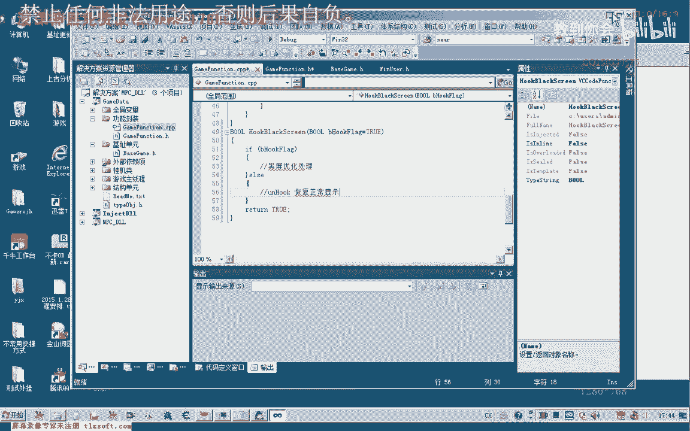
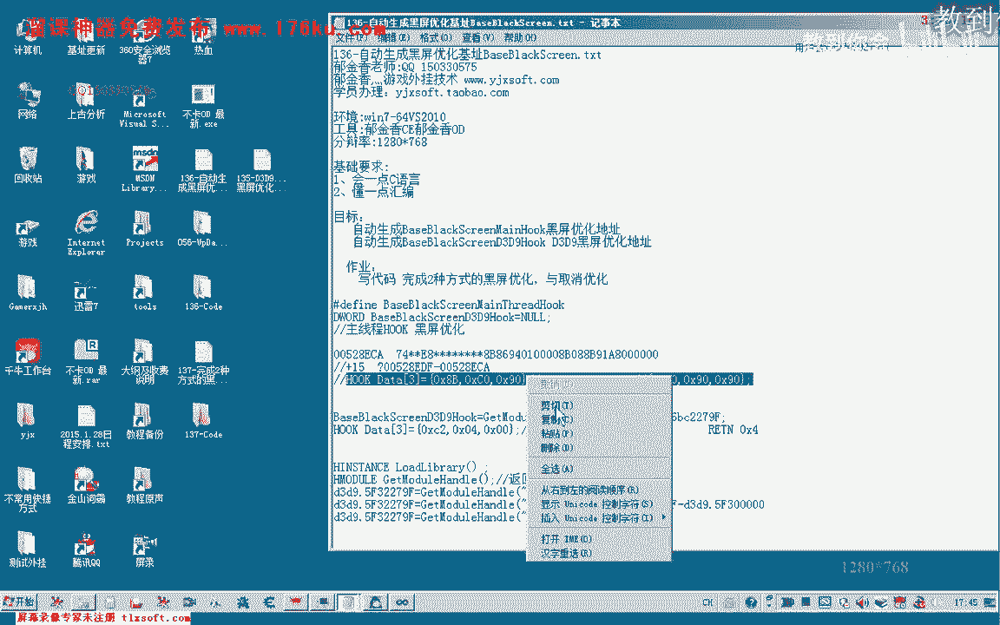
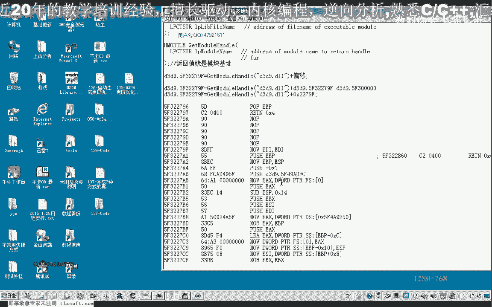
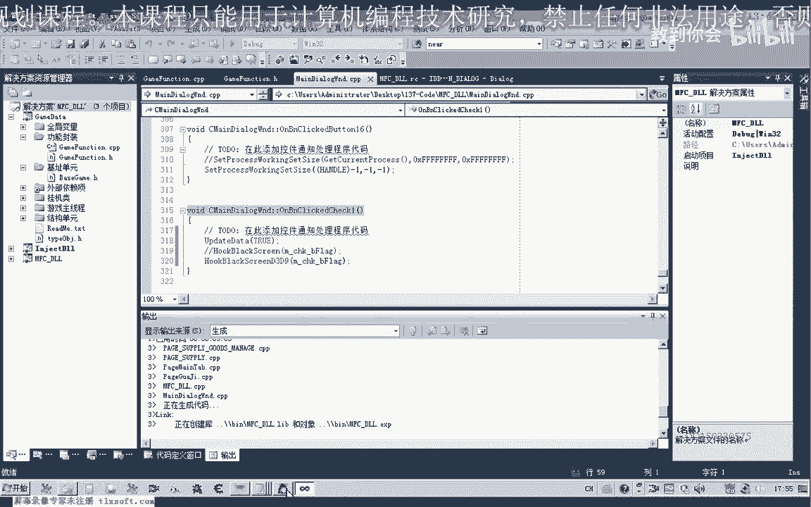
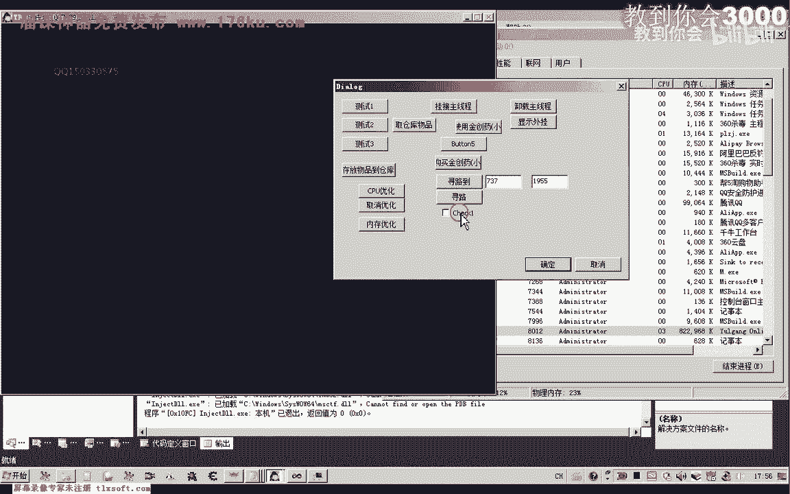
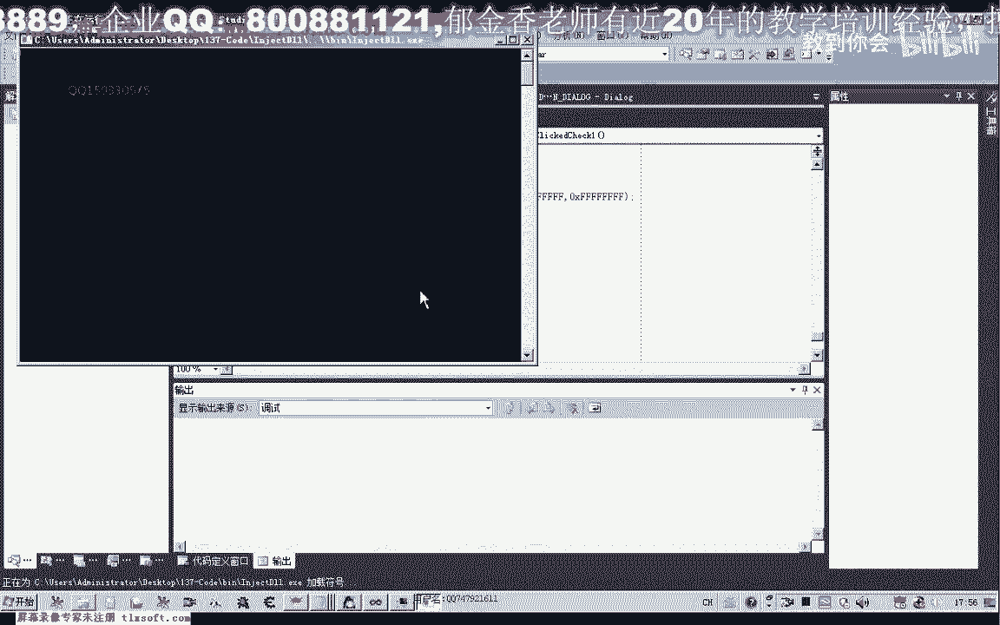
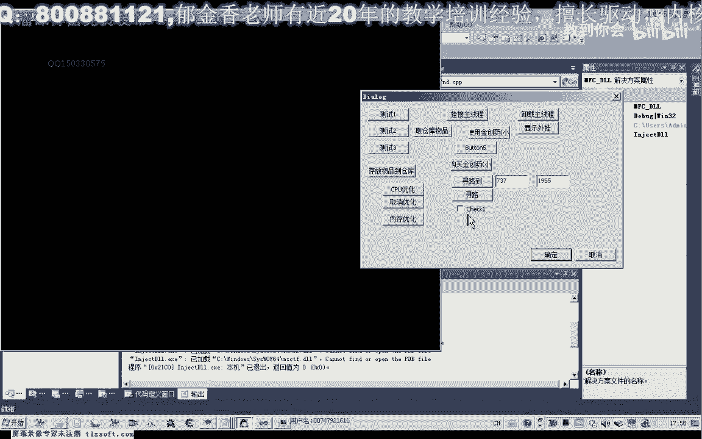

# 课程 P126：两种游戏黑屏优化与取消优化代码设计 🎮


在本节课中，我们将学习如何通过两种不同的方式实现游戏的黑屏优化（即关闭画面渲染以降低CPU占用），并设计相应的代码来取消此优化。我们将从已有代码基础开始，逐步完成函数的编写、测试与封装。

---

## 概述与准备工作

上一节我们分析了游戏渲染的相关机制。本节中，我们将动手编写代码来实现优化。

首先，打开上一节课（第136课）的代码工程。我们需要将最新的基地址数据复制到当前项目中。




接着，转到存放基地址的单元，找到我们所需的地址。准备工作完成后，便可以开始编写第一个优化函数。

---



## 第一种优化方式：Hook特定函数

为了代码结构清晰，我们将函数封装在专门的功能模块中。此函数最终会被主线程单元调用。

我们首先在头文件中声明一个函数，例如命名为 `HookBlackScreen`。为了区分开启与关闭优化，我们使用一个布尔标志 `flag`。

```cpp
// 函数声明示例
void HookBlackScreen(bool flag);
```




函数的设计思路是：根据 `flag` 的值决定执行操作。若标志为真，则进行Hook操作以实现黑屏；若标志为假，则进行Unhook操作以恢复显示。

在实现之前，我们需要参考第135课或第136课的代码，获取需要修改的指令数据。


以下是实现所需的核心数据：

*   **Hook数据**：用于替换原指令，实现关闭渲染。可能是全`0x90`（NOP指令），或特定的三条指令（例如 `mov eax, eax` 和 `ret`）。
*   **恢复数据**：用于还原被修改的指令，以恢复正常显示。我们需要从原程序代码中提取这三个字节的原始数据。


例如，原始数据可能是 `0x50, 0xFF, 0xD2`。我们将它保存为恢复数据。

在CPP单元中实现函数。核心操作是向目标地址写入指定数据。由于是修改当前进程内存，句柄可使用 `-1`。

```cpp
void HookBlackScreen(bool flag) {
    DWORD address = 0xXXXXXXXX; // 替换为目标地址
    BYTE hookData[3] = {0x90, 0x90, 0x90}; // Hook数据示例
    BYTE originalData[3] = {0x50, 0xFF, 0xD2}; // 恢复数据示例

    if (flag) {
        // 执行Hook，写入hookData
        WriteProcessMemory((HANDLE)-1, (LPVOID)address, hookData, sizeof(hookData), NULL);
    } else {
        // 取消Hook，恢复原始数据
        WriteProcessMemory((HANDLE)-1, (LPVOID)address, originalData, sizeof(originalData), NULL);
    }
}
```

编译成功后，我们创建一个测试界面来调用它。例如，添加一个复选框控件，并将其点击事件关联到该函数。


测试时，勾选复选框，游戏画面将停止更新（表现为“黑屏”或画面冻结），CPU占用率显著下降。但游戏逻辑（如角色移动、寻路）仍在后台运行。


取消勾选后，画面显示恢复正常。第一种方式测试成功。

---


## 第二种优化方式：Hook Direct3D 9 API


上一节我们实现了针对特定游戏函数的Hook。本节中，我们来看一种更通用的方法——Hook Direct3D 9的API。

我们创建第二个函数，例如命名为 `HookBlackScreen_D3D9`。其结构与第一个函数类似，但Hook的目标地址和数据不同。

我们需要从D3D9动态链接库中动态定位目标函数地址。这通常通过获取模块基地址加上一个固定偏移量来计算。

```cpp
// 动态获取D3D9函数地址示例
HMODULE hD3D9 = GetModuleHandle(L"d3d9.dll");
DWORD targetAddress = (DWORD)hD3D9 + 0xXXXXXX; // XXXX为特定偏移
```

Hook数据和恢复数据也需要相应更改。例如，Hook数据可能为 `0xC2, 0x04, 0x00`（即 `retn 4`），而原始恢复数据可能是 `0x8B, 0xFF, 0x55`。



在测试界面中，我们可以用另一个复选框或复用之前的控件来调用这个新函数。



测试效果与第一种方式相同：开启优化后，画面停止更新，CPU占用率大幅降低（例如从40%降至4%左右）；关闭优化后，渲染恢复。


---

## 两种方式对比与注意事项

我们已经完成了两种方式的代码实现与测试。现在对它们进行简单对比：


*   **第一种方式（Hook游戏函数）**：
    *   **优点**：针对性强，直接有效。
    *   **缺点**：通用性差，需要针对不同游戏进行具体分析，找到正确的函数和地址。

*   **第二种方式（Hook D3D9 API）**：
    *   **优点**：通用性较强，对于使用Direct3D 9的游戏都可能适用。
    *   **缺点**：需要处理动态链接库加载问题，且不同版本的D3D9库其函数偏移可能不同，需要做版本检测或兼容性处理。





在编写生产代码时，对于第二种方式，务必增加健壮性判断：


1.  检查 `d3d9.dll` 是否已成功加载。
2.  考虑不同系统或游戏版本下D3D9模块的差异。
3.  添加适当的错误提示信息。


---


## 总结 🎯


本节课中，我们一起学习了两种实现游戏黑屏优化（关闭渲染）的代码设计方法：


1.  **Hook特定游戏函数**：通过修改游戏内部渲染相关函数的代码，直接使其失效。
2.  **Hook Direct3D 9 API**：通过修改图形接口层的函数，实现更通用的渲染关闭。

两种方法的核心都是通过 `WriteProcessMemory` 在内存中替换指令，并通过一个标志位来控制开启与关闭。我们完成了从分析、编码到测试的完整流程。

需要注意的是，这里教授的是方法原理。在实际应用中，需要根据具体情况调整地址、数据，并增加必要的错误处理和兼容性判断，做到活学活用。


本节课到此结束。