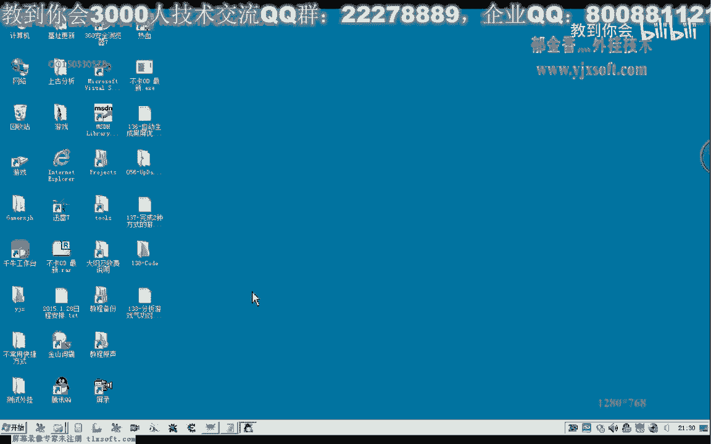

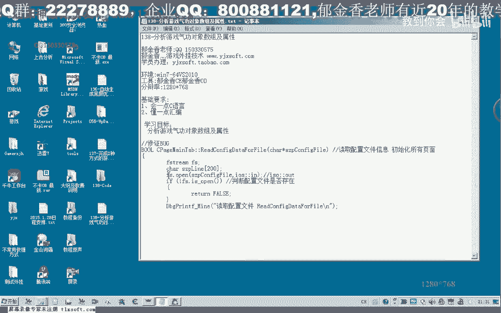

# 课程 P127：138 - 分析游戏气功对象数组及属性 🎮


在本节课中，我们将学习如何分析游戏中的气功对象数组及其属性。我们将从修复上一节课的代码Bug开始，然后使用调试工具定位并分析气功对象在内存中的结构，最终理解其数组的组织方式和关键属性。

---

## 修复代码Bug 🐛

上一节我们介绍了读取角色配置文件的代码。本节中我们来看看如何修复一个可能导致界面无法显示的Bug。

我们需要在读取文件前添加一个判断，确保文件成功打开后再执行后续循环。

以下是修复后的关键代码片段：
```cpp
// 假设 filePath 是配置文件路径
FILE* pFile = fopen(filePath, "r");
if (pFile == NULL) {
    // 文件打开失败，直接返回，避免后续无限循环
    return;
}
// 文件打开成功，继续执行后续读取和循环逻辑
```

---

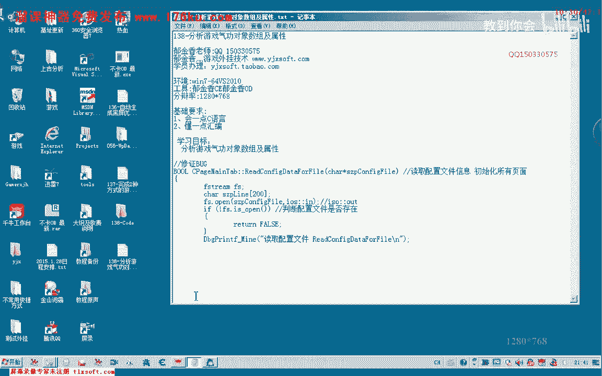

## 分析气功点数与对象 🔍

上一节我们修复了代码Bug，本节中我们来看看如何在游戏内存中定位气功数据。

首先，使用CE（Cheat Engine）附加到游戏进程。为了便于分析，建议选择气功点数较多的角色。

1.  以“移花接木”气功为例，假设当前点数为14。
2.  在CE中搜索14（字节类型）。
3.  在游戏中给该气功加点，点数变为15，在CE中搜索变动的数值（15）。
4.  反复此过程，可以筛选出存储气功点数的地址。

通过查看这些地址的内存区域，可以发现一个规律：它们以数组形式排列，每个字节代表一个气功的已加点数。例如，地址偏移可能对应如下结构：
```
地址A: 0x15 (移花接木 21点)
地址A+1: 0x14 (狂风万破 20点)
地址A+2: 0x0C (破天一剑 12点)
...
```
然而，这只是点数的数组。我们真正的目标是找到**气功对象本身**的数组，它包含名称、ID等更多属性。

直接搜索对象地址比较困难，因为对象可能在操作时动态生成。因此，我们转换思路，从游戏**发送给服务器的数据包**入手分析。

---

## 通过发包函数定位关键代码 📤

上一节我们尝试直接搜索对象未果，本节中我们来看看如何通过拦截游戏网络封包来定位关键代码。

使用调试器（如x64dbg）附加游戏，在发包函数上下断点。


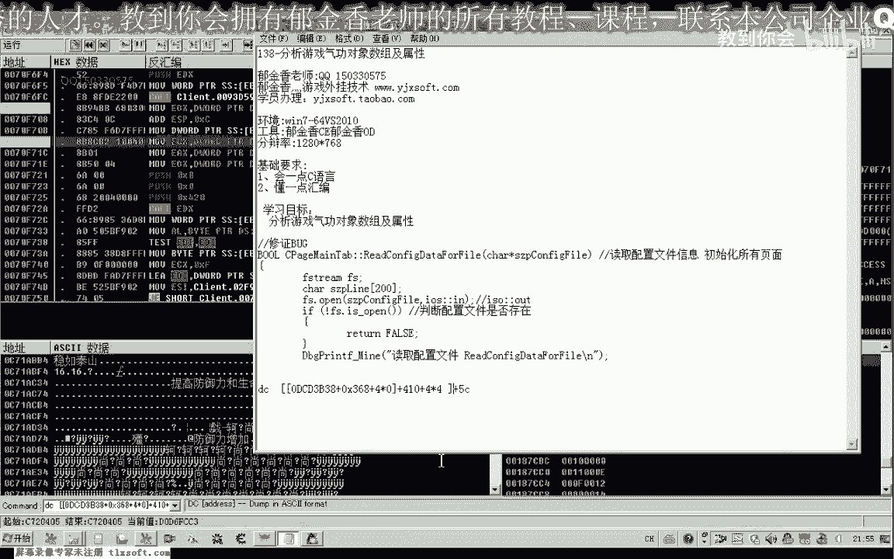

1.  在游戏中尝试给气功加点，断点触发。
2.  通过堆栈回溯（Return to Caller），找到调用发包函数的代码位置。
3.  在该位置上方，通常就是组织发送数据（包含气功ID等信息）的代码。

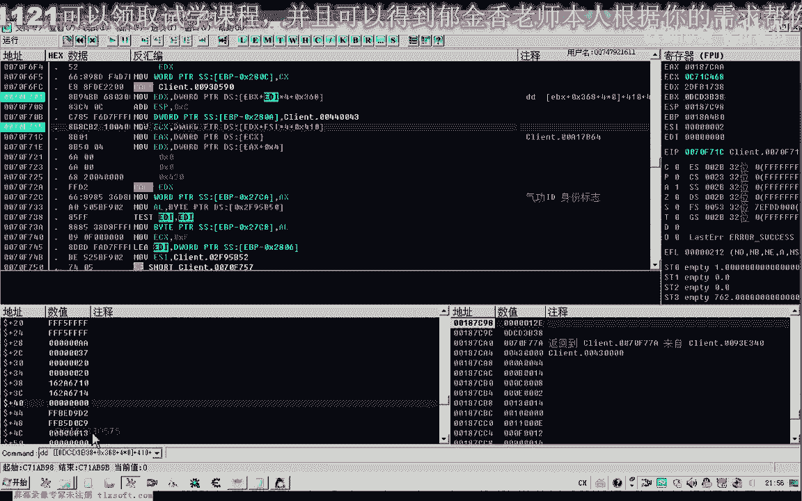

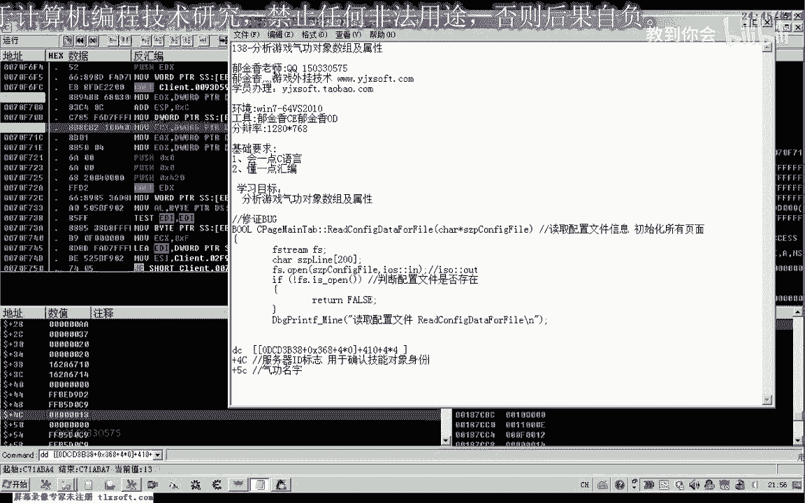

分析该段汇编代码，发现它从一个数组中取出数据。公式类似于：
```
对象地址 = [[基础地址 + 偏移A] + 偏移B] + 索引 * 4
```
其中，`偏移B` 经常是 `0x410`，这是一个在游戏中常见的数组基址偏移。

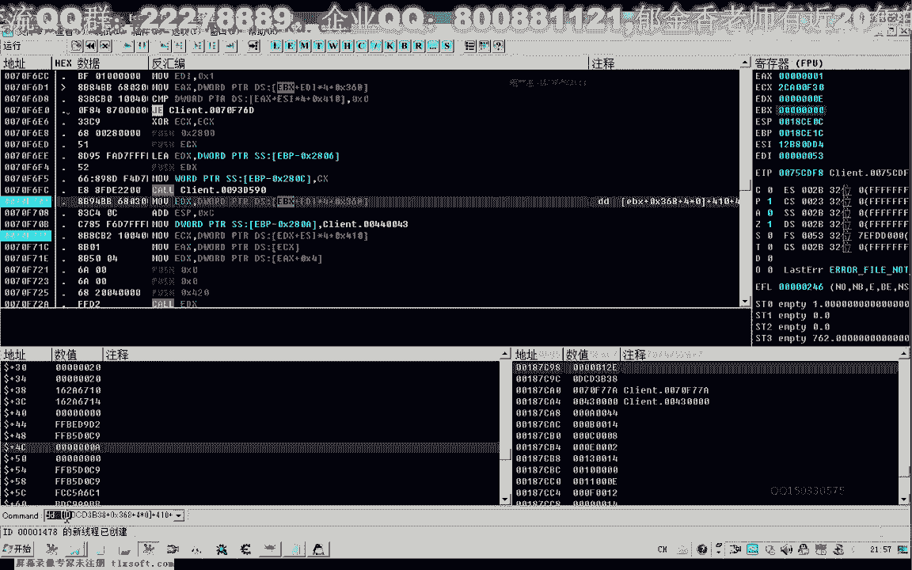

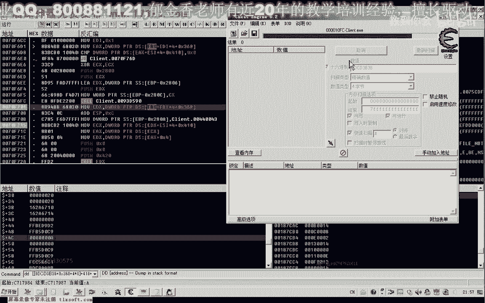

---

## 定位并分析气功对象数组 🧱

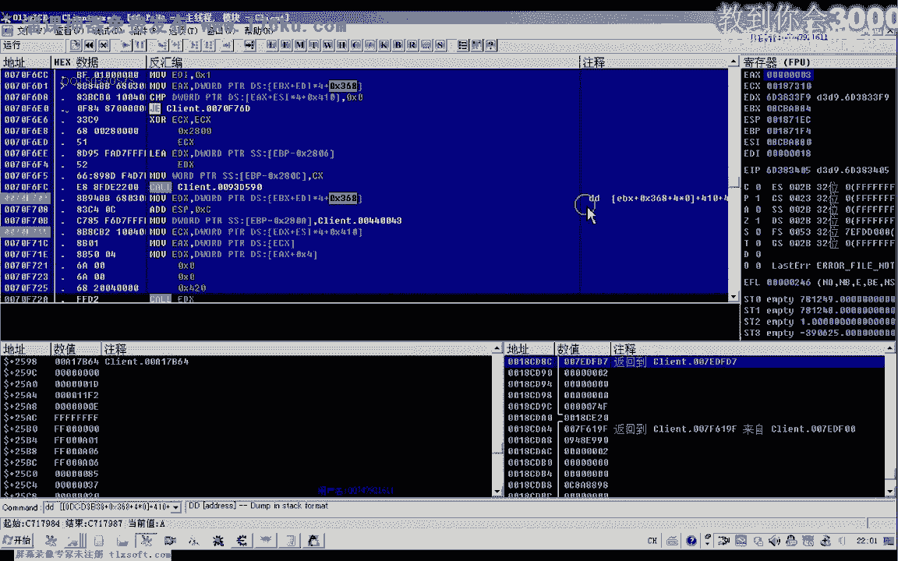

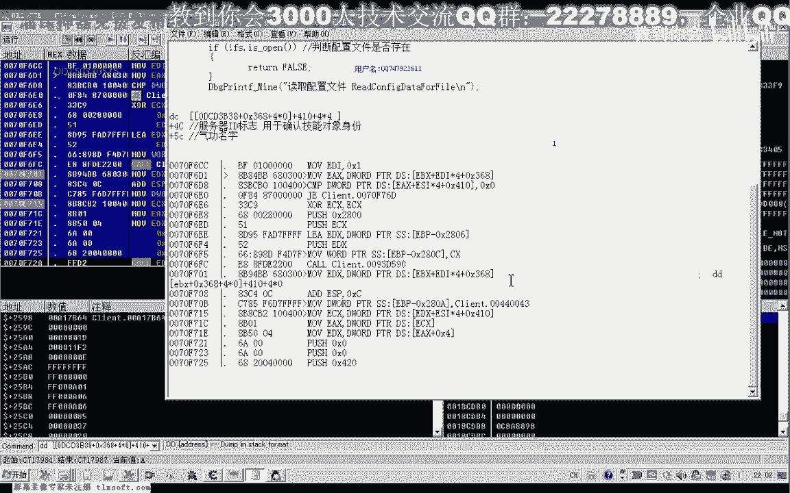

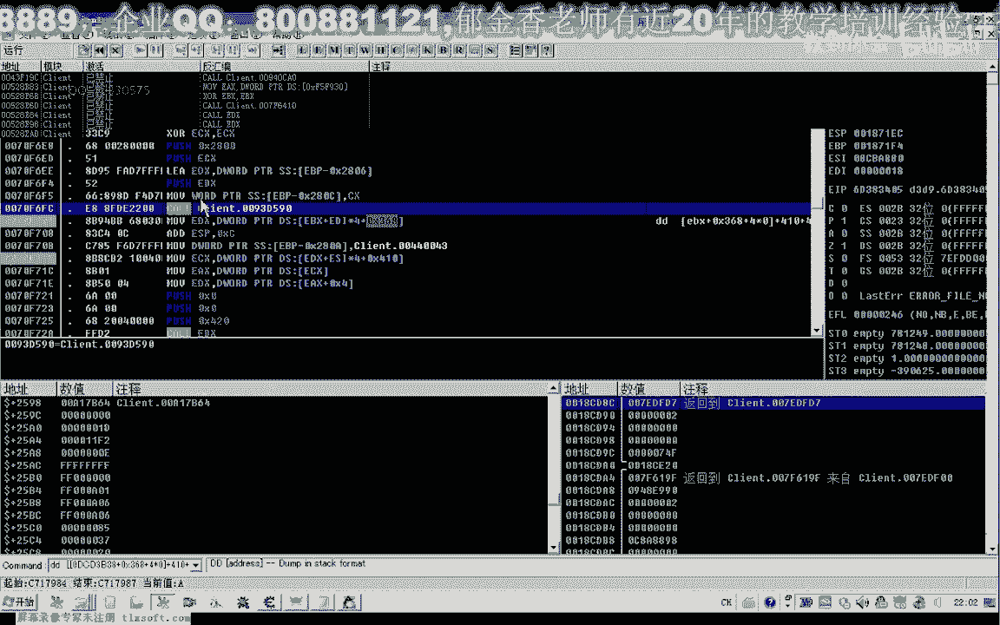

上一节我们找到了读取气功数据的代码，本节中我们来看看如何定位并分析完整的气功对象数组。

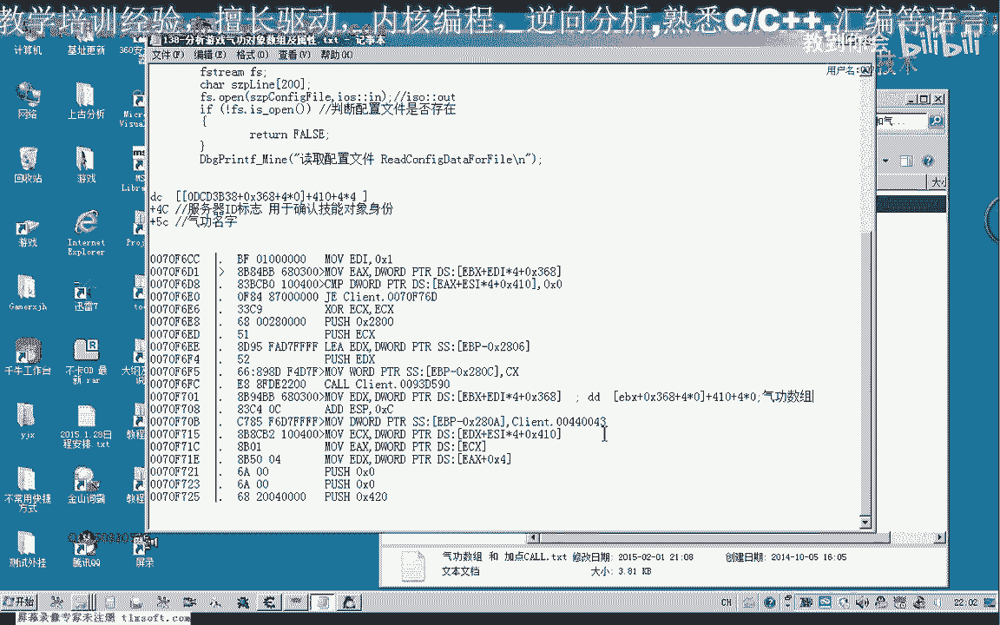

在调试器中单步执行，观察从数组中取出的数据。

1.  确认取出的数据是一个对象指针。
2.  查看该指针指向的内存，在偏移 `+0x5C` 处发现了气功的名称字符串（如“力劈华山”）。
3.  在偏移 `+0x4C` 处发现了一个标识ID，这个ID很可能用于在数据包中唯一标识该气功。

通过遍历这个数组（例如，索引从0到7），我们找到了所有气功的对象。每个对象结构大致如下：
```
对象基址：
+0x00: 未知数据...
+0x4C: 气功标识ID (例如 0x13)
+0x5C: 气功名称指针
...
```
这个数组的基址（公式中的`基础地址`）是动态的。要可靠地获取它，需要分析其来源。回溯代码发现，它最终来源于一个更大的“所有对象数组”列表。

---


## 总结与下节预告 📚

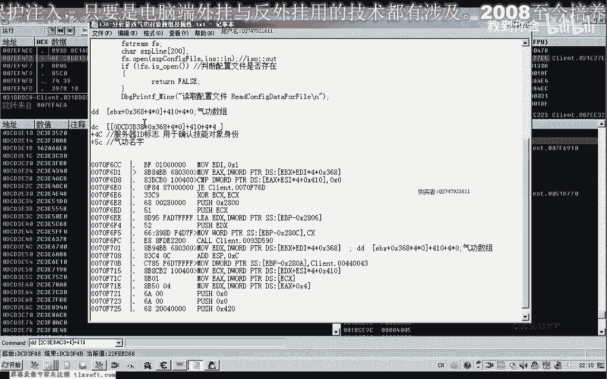

本节课中我们一起学习了：
1.  **修复了文件读取的Bug**，防止了界面卡死。
2.  **分析了气功点数数组**，了解了其简单的字节存储结构。
3.  **通过拦截发包**，定位了处理气功加点的关键代码。
4.  **定位并分析了气功对象数组**，发现了其通过多层指针（基址+0x368+0x410+索引*4）访问的结构，并识别了对象中存储**名称（+0x5C）** 和**标识ID（+0x4C）** 的关键属性。


直接搜索气功对象数组的静态基址比较困难，因为它被嵌套在更复杂的对象管理结构中。

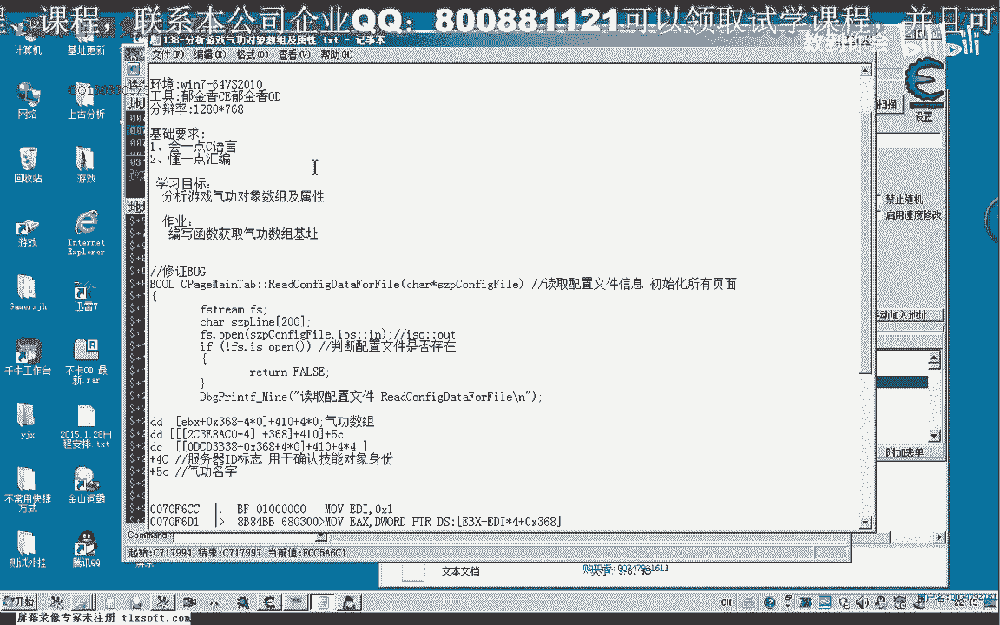

下一节课，我们将编写一个函数，通过特征码搜索或遍历“所有对象数组”的方式，动态地获取这个气功对象数组的基址，从而实现稳定的读取和修改。