# 课程 P128：139-动态定位搞定找不到的气功数组基址 🎯

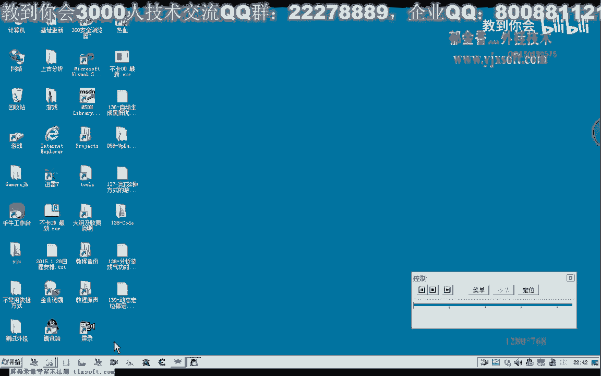

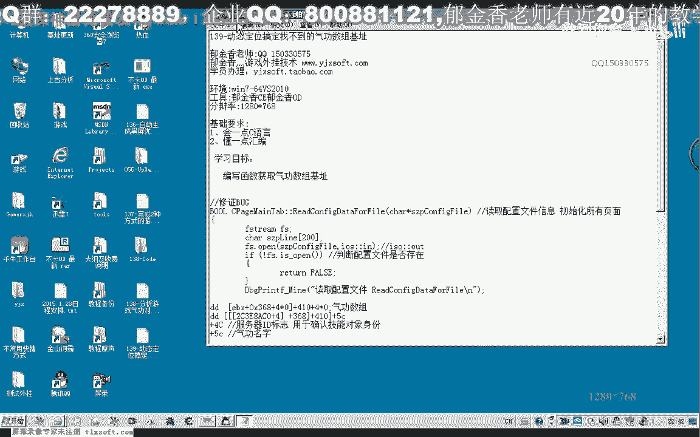

在本节课中，我们将学习如何通过编写函数来动态定位游戏中无法直接找到的气功数组基址。我们将从分析内存结构入手，逐步构建搜索条件，并最终实现一个稳定、高效的定位函数。

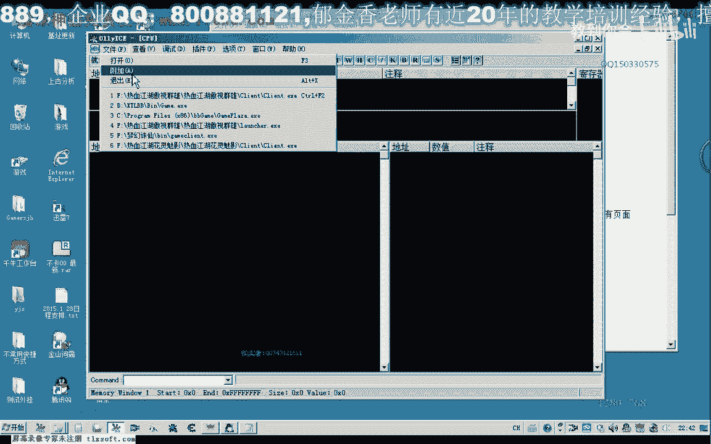

---

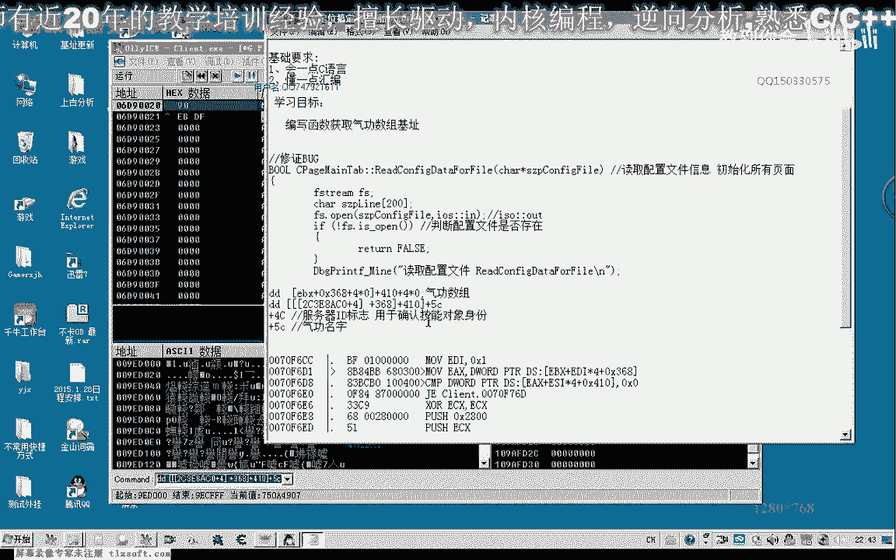

## 概述

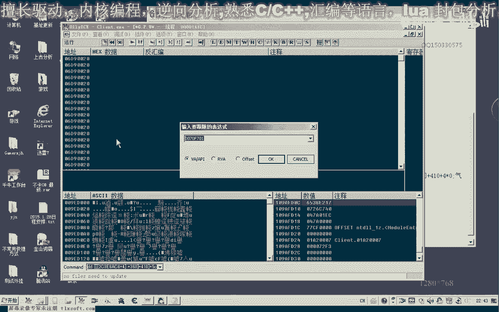

上一节课程中，我们在分析气功宿主时，未能直接找到其基址。本节我们将再次使用调试工具进行分析，如果直接搜索失败，我们将编写函数来动态定位目标数据。

首先，我们转到之前分析的地址。


如果选择动态定位，我们可以定位 `EDX`、`EBX` 对象，或者定位之前 `+4` 的对象。我们将根据实际情况选择最方便的对象进行定位。现在，我们再次尝试寻找其基址。

既然之前的 `EBX` 基址找不到，我们可以尝试寻找 `EDX` 这个对象，看看其他地方是否保存了相应的基址。

我们清空当前数据（这里应该是 `8`，前面有两个参数）。现在，我们查看 `EDX` 的值并复制下来，然后用工具搜索这个对象。

这个对象地址是 `31DEEF8`。它可能也是所有对象数组里的一个数字。我们按访问记录查看，发现它也是在 `311DDBZ8` 处，由 `EX` 的 `018Z` 指令断下的。因此，这里也不是我们要找的相应数据。

剩下的办法就是从这里开始查看其属性。我们从最近的开始找，从 `EF` 开始找可以节省时间，因为它离我们的对象应当最近。如果这里找到了，我们只需要加上一个 `0x410` 偏移即可（这是“运气疗伤”的偏移）。加上 `0xC` 我们查看一下，确认是“运气疗伤”。

我们有两种方法可以用来搜索到这个对象：
1.  直接读出这个对象，加上 `0x410`，再加上 `4` 的偏移（“神隐屏”）来判断它的第一个对象。
2.  判断第一个对象，因为它也有一个对应的类别。`+8` 这个位置等于 `0x1D`。如果这里等于 `0x1D`，我们再查看它之前对象的 `+8` 位置是多少。

我们记一下：气功对象的 `+8` 位置是 `0x1D`。这是我们的搜索条件之一。

我们在备注里搜索 `0x410` 这个偏移。这个对象等于 `0x1D`（条件一）。我们再来看 `Base` 这个地方，它等于 `0x1F`（条件二）。

我们再看一下 `+8` 这个位置的数字是否会变化，或者是否有特殊的数字。例如，这里有一个 `1`，但这看起来像是一个地址，具有特殊性，可能也是动态的。我们能够利用起来的可能也是这个地方。这个值通常是 `1`，但游戏更新后它也可能变化，因为它是对象的成员函数。唯一可能不变的是 `+4` 这个地方的地址。

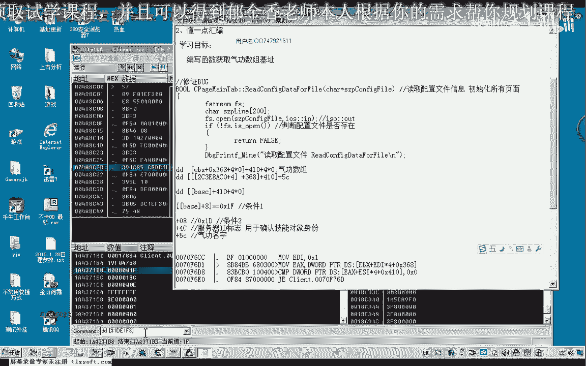

所以，这个地方应当与我们之前 `ESI` 的类型类似。我们还是从后面的对象里来找答案，即 `+0x410` 这个地方。

我们看一下它里面有哪些比较特殊的属性。加上 `0x410` 后，它是否有下标属性？我们看一下，第一个是 `1`，第二个的 `1` 也是 `1`，第三个是 `-1`。这几个值应当是固定的。我们复制一下。

如果加上它的成员函数列表，我们应当就能搜索到特征了。我们再来看第三个地方，也是 `0x1D`。当然，这是它的一个下标 `0EFF1`。这一片都是相同的判断。

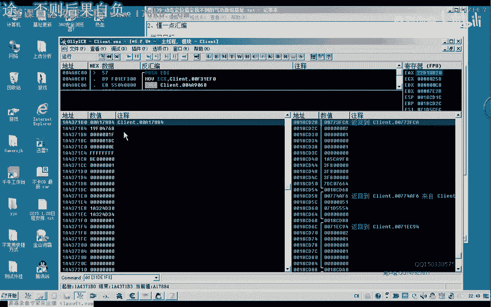

如果加上这个列表，肯定能够搜索到特征。它相当于是一个特征码，或者可以通过其对象的成员函数地址来进行判断。例如这个地址就比较有利。但在这里定义和判断起来比较复杂，我们也需要动态生成特征码，然后每次对对象 `+4` 的地方再进行判断。

我们先看一下简单的设计能否参考。我们再来看第三个对象，找一下它是否有下标属性。这里有一个 `A8` 是 `3`。我们加上 `4` 再加上 `A8` 看一下，那么 `4` 的下标也是 `3`。

理论上它还有一个树状的下标属性。我们从这个地址用工具搜索一下数字 `4`，也可以做成一个判断条件。我们新扫描，搜索数字 `4`，起始地址是 `2310D620`。`2311` 离得太远。我们再搜一下数字 `5`，没有。说明下标属性不存在，但不存在下标，它直接就是我们树状下标计算出来的结果。

我们先编写函数进行一下判断，定位 `BASE`。

打开我们第138课时的代码，移到测试页面。

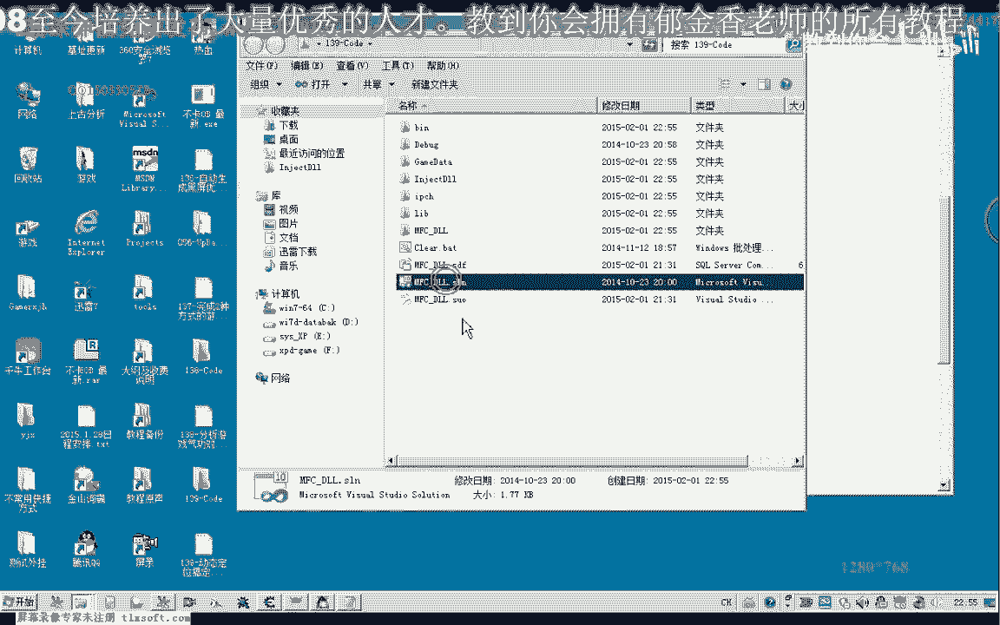

然后开始设计我们的代码，放在“测试1”这里。在设计代码时，我们需要对所有对象的列表进行遍历。我们先把它的基址取出来，然后这里需要一个循环。我们看一下，它的对象数组会有多大。

因为遍历的地方比较多，马上就会触发断点，先把断点删掉。整个树状数组，我们看一共应该有多大。这里应该是 `0x2710` 个元素。我们在这里也设置 `0x2710`。当然也可以把它设置成一个常量，即最大的数字。这里我们暂时可以固化使用，或者说也设置一个常量：

```c
#define SIZE_FOR_OBJECT_LIST 0x2710
```

当然，在这里我们也加上异常处理。如果访问出错，我们就进行处理。异常处理应该放在循环里面。一旦有异常，我们就继续执行下一次循环。

在这里我们遍历我们的对象。首先，我们需要建立一个变量 `nTempObject`，先把它赋值为 `0`。然后在这里先取出对象：


```c
nTempObject = *(DWORD*)(BaseAddr + i * 4);
```

这是我们对象的一个地址。取出来之后，接下来就是判断是否是我们要找的对象。

宿主对象基址有一个明显的属性：`+8` 在这个地方等于 `0xEF`。所以说我们要先取出对象的类型：

```c
DWORD dwType = *(DWORD*)(nTempObject + 0x8);
```

后边的话，这里我们最好把它设置成一个指针的形式。注意这里一定要加上括号，不然就成了一个指针的运算，得出来的数据就不对。

在这里我们再取出它 `+8` 的这个位置（恰好等于 `2`？ `+1` 是等于 `4`， `0`、`4`、`8`，这个位置我们取出类型）。取出来之后，我们就进行一个判断：

```c
if(dwType == 0xEF) // 条件1达成
```

如果 `0xEF` 这个条件达成了，再判断条件2。条件2是去 `+8` 这个地方，取对象的 `+8` 这个地方，它等于 `0x1D`。但这个条件2需要一个公式：前面的基址 `+0x410` 再 `+4`，实际上就是 `+0x410` 这个地方，再读取这个对象。

我们先把另外一个对象取出来，即对象1的第一个元素。我们把公式贴出来，也就是计算出这个元素的地址并取出来：

```c
DWORD dwPossibleObjAddr = *(DWORD*)(nTempObject + 0x410);
```

计算出来之后，等会我们再读取它里面的 `+8` 的位置。要取这个数据，我们需要先转换地址。`0x410` 这里，我们需要先转换成 `DWORD` 类型，再加上我们的偏移 `0x410`，最后再转换成指针类型：

```c
DWORD dwTargetObj = *(DWORD*)( (BYTE*)nTempObject + 0x410 );
```

这个时候我们就得到了第一个对象，也就是 `+0x410` 偏移处的对象地址（正常情况下，会是“金钟罡气”对象的地址）。

获得这个对象地址之后，我们再次取出它的 `+8` 位置的类型：

```c
DWORD dwTargetType = *(DWORD*)(dwTargetObj + 0x8);
```

我们在这里再次做一个判断，需要它等于 `0x1D`：

```c
if(dwTargetType == 0x1D) // 条件2达成
```

这个时候判断，可能也有相同的对象，这个地方也等于 `0x1D`。所以我们还需要更进一步的一个判断，来看一下需要什么。当然，我们最好是先看一下这个地方，如果这个 `0x1D` 就是标明我们气功的唯一对象ID类型，那么我们直接这样就可以找出来。现在我们担心的是还有其他对象也用到了 `0x1D` 这个对象ID来标示。

我们先运行一下，如果找到了这个地方，我们先把对象的地址打印出来。打印出来我们应该是哪一个基址？我们来看一下，应该是最之前的这个 `Base`。

我们在这里另外定义一个变量来存放，这个需要是一个静态变量：

```c
static DWORD s_dwQiGongBase = 0;
```

最先我们把它赋值为空或者是零。当然，在这里的时候，如果是找到了之后，我们就给它重新赋值。第二次的时候，我们给它进行一个判断。如果这个 `s_dwQiGongBase` 不等于空，那么我们直接返回就可以了。这个地方我们直接返回这个值。

现在，我们最好把它放在一个函数里面去，设计成一个函数 `GetQiGongBase()`。如果执行到最后都没找到，那么这里直接返回空；或者这里找到了，也是返回相应的数值。

我们再看一下我们的设计。这里还需要定义一个变量，用来临时存放这个可能的基址。我们取得的，如果运气好，就会取得相应的基址。当然，我们需要读出来。实际上我们这里需要把这个数值读取出来，赋值给这个指针。

或者这里直接这样写，之后我们要做一个判断：如果这个值等于 `0`，那么我们 `continue`，继续下一次循环。也就是说，它没有这个对象，这个地址是空的。如果不为空，我们进行赋值。

首先，我们是获得它的基址，`+4`、`+4` 这样加过去之后，我们需要用这个语句。这个语句，我们这里只是指向了某一个基址，指向了之后，我们通过指定的操作，需要读出这里面对象的数据。

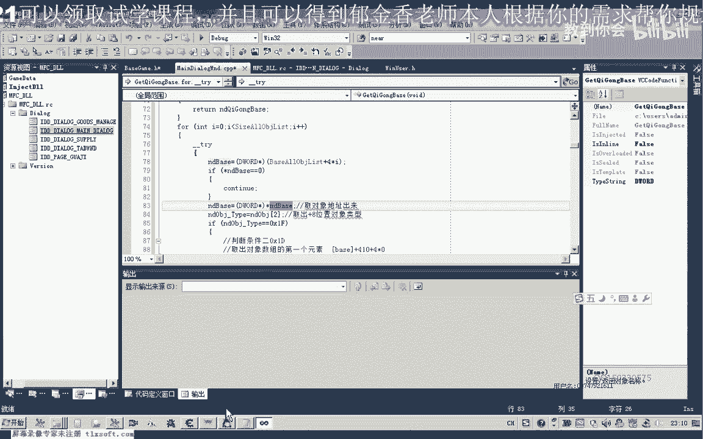

例如这个 `ERCF8`，读出来之后，这是另外一个对象的地址。

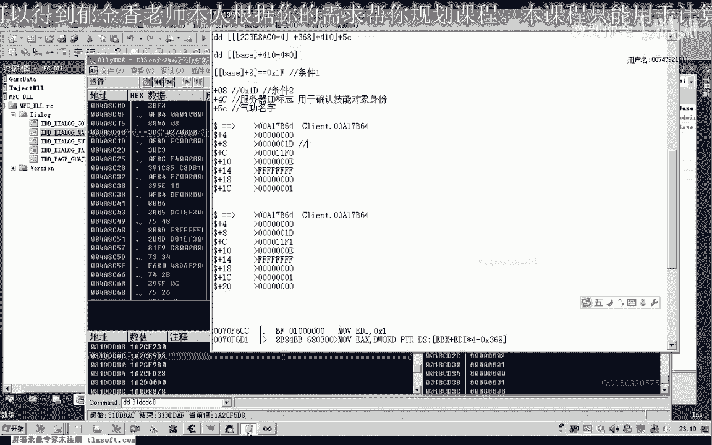

就存放在这里面了。存放在这里面之后，这里我们再对它进行一个读取的操作，`+8` 这个位置读取出来，进行一个判断。如果等于 `0xEF`，那么我们接着后面的操作。


这里就应该是 `nTempBase` 加上我们的 `0x410`。`0x410` 之后，这个时候它转换了，实际上也是一个指针。`nTempBase` 这个时候已经变成了相应的地址，加上 `0x410`，然后再取对象的 `+8` 的位置。


如果这两个条件我们都达成，那么我们就给静态变量进行一个赋值，赋值为我们的 `nTempBase`。这个 `nTempBase` 就是我们之前所取出来的对象，也就是列表里面的某一个数字。如果这个是的话，那么它的 `+8` 这个位置就应当是 `0xEF`，然后它里面 `+0x410` 这个位置是 `0x1D`。取出来之后，这个时候我们就返回它。

好的，我们看一下是否能够取得我们正常的基址。如果不行的，我们还需要加上其他的条件。

我们编辑生成一下。这里我们需要强制把类型转换一下。我们测试一下，这里找到的数字是 `0`。我们看一下为什么会是 `0`，正常情况下都应该不是 `0` 的，可能是我们的代码有误。

首先，我们是取得对象的地址取出来，对象地址我们 `+8` 的这个位置取出来。我们首先看一下，在这里我们取出的数字对不对，`dwType` 遍历的类型。还有条件2，这里的 `dwTargetType`。

我们重新生成一下，先清零，然后这里就出错了。可能是我们只遍历到了这一部分数据，条件2这里取出来的这个类型一直为 `0`。看来是条件2一直没有达成。这里的这个类型...

我们再看一下我们的公式。条件1取出来的这里是正确的，我们应当把它放在这个地方。`0xEF` 这个判断成立了之后，我们再把它的这个类型打印出来，这是我们的条件1。如果条件2达成的话，应该是在这个地方。

看这个条件2的话，它一直取出来的是 `0`，没有达成。我们看一下语句，可能是出现在这个地方。首先我们 `nTempBase` 是取出了对象的地址，对象的地址加上了 `0x410`。那么这里的话，我们还应当要取一道：要取这个对象的话，需要有一个“读”的动作，需要先把它读取出来，然后再进行条件1的判断。

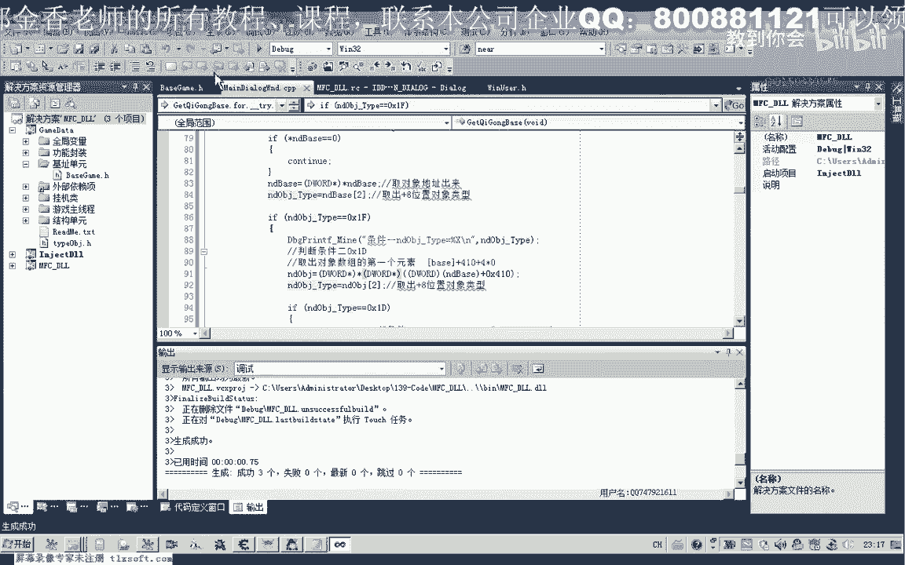

这个时候找到了一个 `ES3710`，我们附加一下游戏。

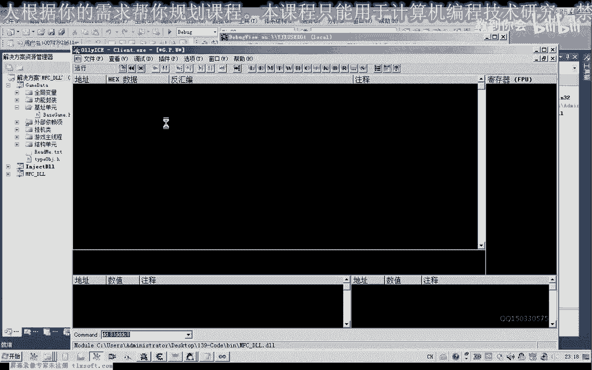

加上我们的 `0x410` 来看一下。但是我们发现的话，这个也不对，这里它为 `0x20`。我们再来看一下我们的信息，这里应该是 `ES`，我们这里写错了，`ES3710`，这里是 `0xEF`。那么 `0xEF` 再加上一个 `0x410`，那么这里可能就是我们的这个宿主。

再加上一个，我们用连线来看一下，“金钟罡气”。


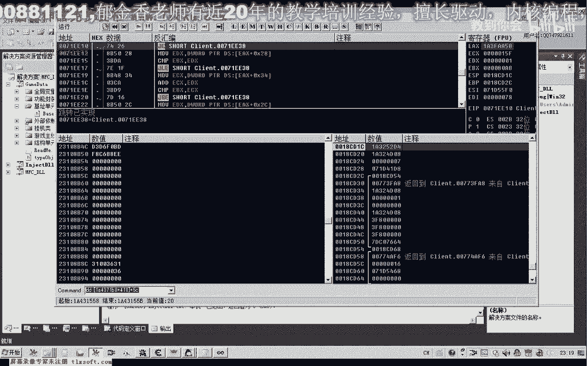


后来这里再加上一个 `0x410`、`0x410` “运气疗伤”、`0x410*2` “连坏分身”、`0x410*3` “狂风万破”。那么看来是不需要我们其他的一个条件的判断了，就是这两个条件我们就能够找到。

我们回到之前的这个地址，从这里做一下核对，看我们找到这个对象是否正确。这里我们之前有下一个断点，看来这个断点被取消掉了。幸好我们没有修炼这个气功，如果是修炼气功的话，这里就会异常退出。

我们在这里把它 Hook 住这个地址。好的，我们再想办法让它断下来，看一下我们的 `EBX` 找得对不对。然后我们在这里随便狂升几下，下标应该是 `6`、`7`... `1,2,3,4,6,6,7`，`7` 的话它的下标是 `6`。然后我们看一下 `EBX` 的一个数值。


这个时候的话，`EBX` 是前一个的数值。我们还需要这里有个 `EX`，看没有被执行到，气功ID。那么这里的话应该还有另外的一段数据。但是我们这里看一下我们原来的代码是什么，我们刚才复制出来的 `70870B`，然后这是我们的 `715715`，这里是这段指令。我们把它恢复一下，那么这里应该是这段指令才对，然后 `EX`。

所以说我们应该是找 `EDX` 取出来。我们看一下 `EDX` 的，恰好就是我们找的 `ES...`，再来对比一下。那么这里是 `ES37EB0`，恰好我们宿主的基址是找对了。找对了，那么就 OK 了。

那么这节我们就讲到这里，气功的基址我们就已经找对了。把它注释一下，这个地方通过什么样的方式来获取气功的对象。实际上我们不是找到的这个 `BASE`，而是找到的这个地址。我们已经把它的地址基址取出来了，那么我们就通过这个公式来获取它下面的这些数据。

在这个地方，我们注释一下，或者我们可以这样来表达：

```c
// 气功对象地址 = 基址 + 下标 * 0x410
// 气功ID = 气功对象地址 + 0x4C
```

当然还没有发现其他还有用的数据，我们暂时还没有发现。那么这几个我们暂时就只有分析到这里。

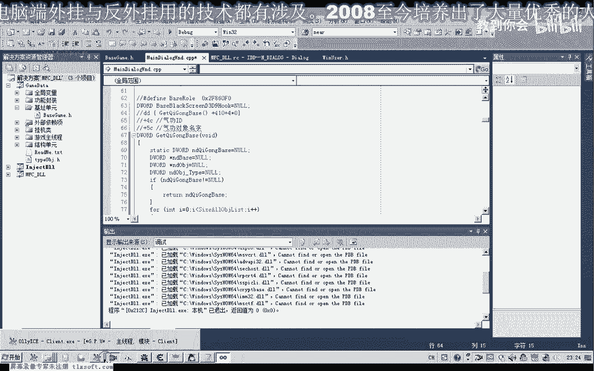

当然我们还可以来分析一下它的其他的属性，暂时还没有发现有用的属性。那这里有个 `1`，那么 `1` 会不会是表示它的可用这一类的？我们来看一下。那么这里的话，它一共 `8` 个，倒数第三个的话，它的下标是 `5`。我们看一下第五个是否可用，这里也是 `1`。

是否可用的话，它应当有一个标记。如果这里没有标记的话，我们可以把它与之前加点的这个数据关联起来，就能够获得它相应的下标所在的位置，已经加了多少个点。我们在后面的分析当中再来完成。实际上我们之前很早以前就已经有这个数据。当然我们上一期的分析的时候：

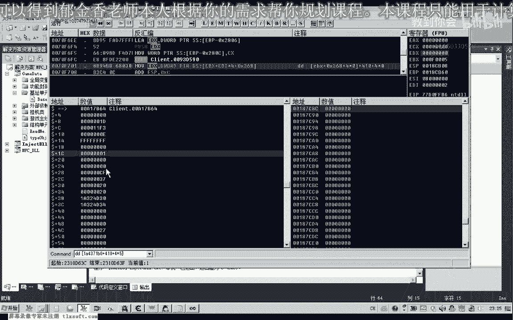


实际上已经找到了这几个数据，但是当时没有记录下来。好，那么这几个我们的这个数据的基址的话，已经通过我们的编程过去了。后边我们再来分析这个气功加点的相关的函数。

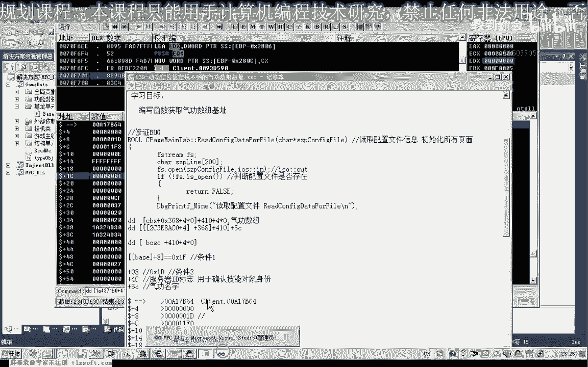

复制一下。

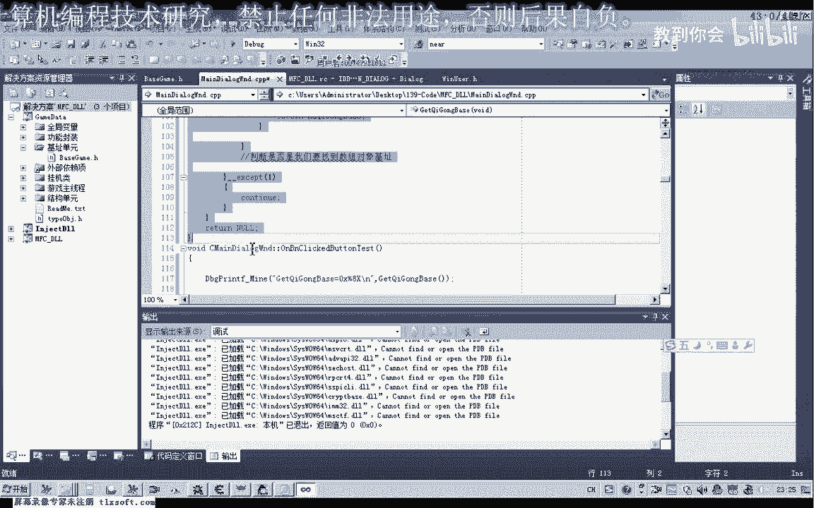


这样写的好处是什么？我们还有一个就是修正 Bug，不需要了。那么这里我们用了一个静态变量，它的好处是，不会反复地去遍历。一旦为空，只要注入游戏之后，我们只需要遍历一次，那么第二次的时候它不为空，我们直接就返回这个基址了，后面再多就省略了。这样的算法就非常优化。如果不加上在前面这一段的话，那么每次都会去找这个循环，这样的算法就非常低下。相当于我们在这里是给它缓存了一个基址。

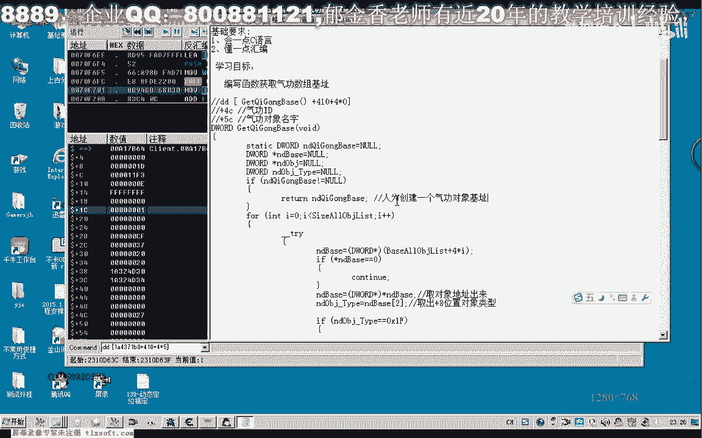


好的，那么我们下一节课再见，这节课我们就到这里。


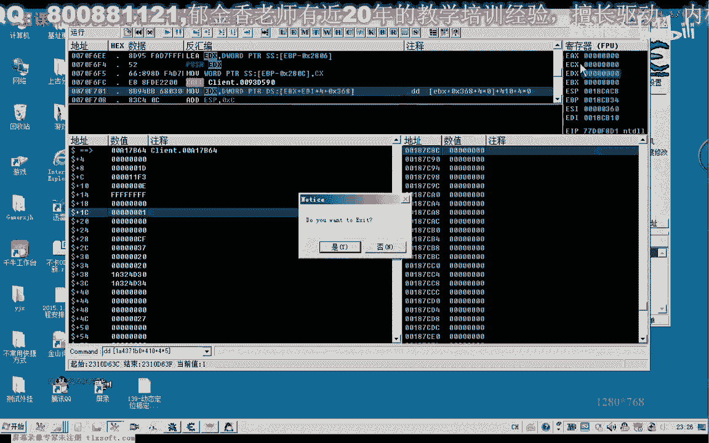

【过去的事物】。

---


## 总结


本节课中，我们一起学习了如何通过动态定位的方法解决找不到气功数组基址的问题。我们分析了内存结构，确定了两个关键搜索条件（对象类型 `0xEF` 和其内部 `+0x410` 偏移处对象的类型 `0x1D`），并编写了一个遍历对象数组、使用静态变量缓存结果的函数来高效稳定地获取目标基址。这个方法避免了每次重新扫描，提升了代码性能。