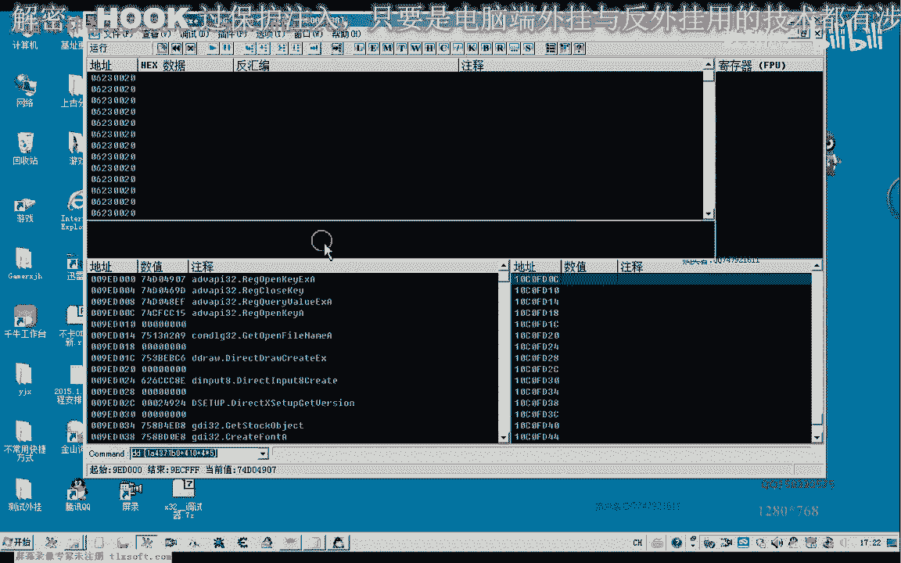
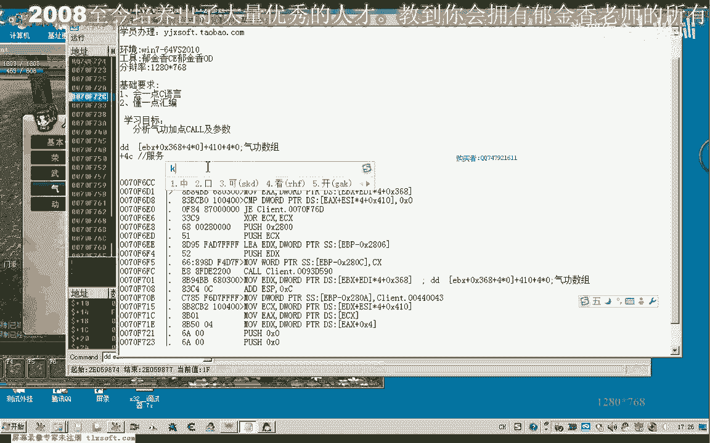
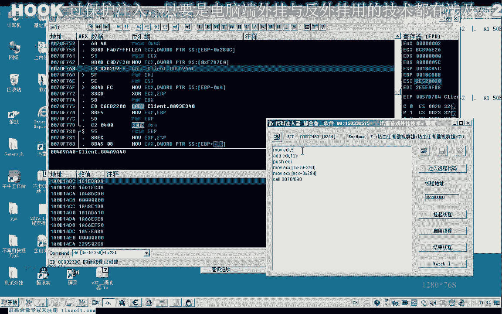

# P129：140-分析气功加点CALL及参数 - 教到你会 - BV1DS4y1n7qF

大家好，我是郁金香老师，那么这节课呢我们继续分析一下气功加点的扩及参数，那么在分析的时候呢，我们需要准备一个账号，那么至少呢它这里呃气功剩余的点数的话至少要两点以上啊，这个最好啊。

多有一些这个剩余的点数好的，那么我们先用我们的调试器啊。

附加到游戏里边，那么我们接着上一节课呃的分析呢。

就可以持续的进行一下分析，那么上一节课我们在分析气功数组的时候呢，呃我们，分析到了这个地方哈。

那么我们转到这个地址去啊，借助分析。

那么我们呃返回3~4层的样子，好像是这个地方，那么当然当时我们分析的这个ax的话，来源于我们的呃气功的一个身份的一个标志，我们按一下ctrl a啊，分析一下，那么我们再次在这个地方下段啊。

然后呢我们点一下第二个气功，这里我们点一下啊加点，然后呢会断在这个地方，我们看一下ex呢是e f它的一个来源是什么，那我们来看一下ec x好像是来源于这个ec x，看一下ec x。

那么ec x里边他读了读出来之后，好像在取得这个ax，啊这个ax应当是我们这个e d x这个函数的返回值，不应当是这里的这个数值啊，因为这个扩它有一个返回值。

然后呢这里来返回到这个x那么我们要需要进到这个库里面去看一下，实现这个相应的一个修改，也就他就不会修炼成功，那么这个点出来就不会啊，不会被剪掉，那么我们就可以反复的呢呃进行测试啊，这个时候。

呃那么我们继续在在前面啊这个地方进行下段，然后呢我们再次嗯在这里加点，让它断下来，断下来之后我们再看一下ec x的数值啊，同样是刚才的这一个嗯。

那么我们看一下他最后返回的数值呢是ef是这个地方好像是四岁，这个地方啊，恰好是四岁，最后他取出来了，进到这个库里边，那么我们也可以进到这个库里边去看一下啊，这里是进货。

然后呢我们从这里能够看到它的确呢呃是来源于e si，是来源于上层的ec x最后来加了4c，这个地方加了4c，那么我所以说我们从这里的，话能够找到他最后的一个返回值，就是呃对象加4z这个地方。

那么这也是算是它的一个参数的一个来源，那么我们直接呢可以给它填填充啊，相应的这个数字在这里好的，那么我们再让它运行起来，那么这算是我们相应的一个参数啊，提供数据。

当然这个气功数组呢我们已经通过啊其他的这个功能call的方式来，来获取了这个相应的数组的这个机制，那么我们只说他的这个对象是在这个地方是服务器，我们暂时给它取名为服务器的身份标识，服务器的id好的。

如果我们从这里来看的话，我们要分析的这个参数的话还比较多啊，需要分配的是我们这个ecx这个参数，这里的话，那么我们也可以再一次啊加一下点，可以简单的看一下这个这个时候的ec x，d b e c x。

那么我们也能够看到这个地方呢，它是呃还有这个地方呢都是我们对象的i d，那么我们用dd用四字节来看一下，那么这里呢有一个ef，那么这里呢也有一个ef，那么这样我们填充这个数据的话。

还要去分析花的时间更多一些，那么我们直接呃返回到上一层，把这个断点我们暂时取消掉啊，那么取消掉之后呢，我们，这里对象通过420啊，实际上它是通过420这个地方来获得了这个对象的i d。

那么这一点我们再次下个断点，让他断一下，断一下之后呢，我们返回到返回到上一层，看一下我们上一层的这个库，那么上一层的话是在这个地方啊，那么我们在这个地方来下一个断点呃，再次的点击这个加点的这个call。

那么我们看一下e d i的数值，d i呢这个时候是姚二机，那么我们实际上后面呢可以看到一大片啊，呃就是u2 c12 d12 e f什么什么的，这一片人都会转到这个库来执行。

那么这一片的话我们把它复制出来，看有多少这个比较长，呃12c大概的话我们看一下，那么这里的气功的话，七个八个在后面也是八个，16而且是连这里也有16，那么这一片标记的话与我们这里哈气功第一个气功数组。

第二个气功数组啊，恰好加起来是32个，那么可能这个i d的话与我们的这个气功数组的下标呢，它可能有一些联系啊，嗯那么我们在这个连环飞舞这里呢加一下点，看一下它的参数，那么这个时候呢我们发现的是121啊。

刚才是12d啊，高29~2点一，那么也就是说这个的话可能就是我们的12c，但是他已经加满了，不能再加了，那么这个呢是f12 ，这个是130，那么这个应该就是131啊，这个时候我们看一下。

那么也就是说它是在一个它有一个基础的数值，从幺日c从12b开始啊，从12c开始，就应该说啊，他是他的下标零，那么我们这里的参数的话可以这样来表达啊，那么这个e di的话。

哦这里是有一个e d i减一二线，那么我们从这里来看一下，那么我们看一下现在的di等于多少啊，e d i减掉12c之后呢，他与这个ef做比较啊，那么实际上啊这个时候的ecx呃才是真正的一个下标啊。

才是下标，那么他这里这里减这个yc实际上就是为了获得的这个下标，而这个ef的话恰好是我们的三一啊，也就是说0~31它的下标是，他在这里比较的话是比较他有没有超出这个数组的一个下限啊。

因为他最大的这个气功数组是两个数组，两个数组加起来的话，一共每一个数组来气功数组依然是16个气功数组，20 16或一共是32个，那么0~31呢恰好就能够表示啊32个下标。

那么所以说呢呃那么这里减掉123，那么这个参数呢，实际上e d i就等于我们的12c加上我们的一个下标，嗯嗯，好那么这就是e d i的这个参数，那么另外呢还剩了一个e c x的一个参数呃，我们需要。

那么它来源于我们的e s i，那么我们看一下e s i又是什么，e si的话，这个时候呢等于零系啊，暂时我们不知道是一个什么数字，但是呢我们肯定要找到它的一个来源，那么我们先看一下这个e s i的数值。

它变化嘛啊，如果不变化的话，我们暂时来先测试一下，看这个是不是我们所要的加点的这个扩，那么我们再次在这个地方看一下，看一下e s i的数值，那么这个时候我们发现了e s i的数值没有变啊。

呃只是我们e d i的这个数值变了，那么我们接下来呢可以先测试一下是否这个用这个扩能够加点，要测试的话，我们的呃需要来把这里这个修改后的代码呢需要撤销掉啊，不然的话它同样不能够修改成功，好的。

我们打开代码输入器，按减号再退回来，退回来之后，我们先计算这个e d i的数值，moe d i等于12c或者是我们e d i呢呃等于我们的下标，然后呢在a d d e d来加上一个12c就可以了。

或者它的原始，这这两句都可以走，可都可以的，都是表达同一个意思啊，那么这里呢是第一个下表啊，那么我们要让，第二个这个第二个这个气功加点的话，我们这里下边就应该是唯一，那么第三个呢我们在下边呢应该是为二。

那么我们这里的v2 ，再加上我们的yc，然后再mod c x，然后0070f670 ，好的，那么我们来做一下测试，那么我们发现了这个地方啊，它就已经可以使用了，那么如果我们换一个，这个01234。

然后换第五个试一下，那么这里呢他也能够学相应的气功，那么这里我们换1e啊，当然这个下标越界之后可能就会出错了啊，当然也也没有用啊，这个下标越界之后那么好的。

我们接下来再分析一下这个ecx这个数据的一个你si的一个来源，向上找一下，那么我们在分析之前呢，我们再次呃为了方便分析，我们把这个地方的代码来再次把它喝可一下，不然的话我们的这个呃气功的点数啊。

一会儿就用完了，我们就没有办法测试，那么我们直接来可以对，这个数据来啊，进行一个，断点的一个下一个访问的一个断点，然后我们从这里能够找到它是来源于我们上一层的这个参数啊。

e c x看一下e4 x来于一bp加八，也就是来源于这个地方的参数，我们回溯一下，那么这个时候的话我们又到了哪里了，好像是到了主线层这里了，呃地面贴图的这个绘制，到了这个地方。

它的ex的一个来源来源于最初的是0x4 c这个地方，那么我们再往前面找一下dx 4 c这个地方来源于什么地方，它来源于一dx，而一dx呢来源于我们的1d x的一个数组啊，ex乘四。

而这个一dx呢又来源于我们的e4 x，那么这样的话嗯还不是很好找，那么我们另外再换一个地方，看有没有其他的这个尺寸，那么到这里的话，我们的e4 x呢也是这个数值。

那么这个e4 x的话好像要来源来源的话要简单一些，它来源于我们的e d i加284这个地方，那么我们看一下t i加二，一个是284，那么这个地方来恰好也是放放着我们这个usi misx数据的来源。

那么我们再把e d i的数字来替换出来，我们把之前的按键断点删掉，然后呢再对这个e d i嗯，下一个访问断点，那么也可以直接再往前找一下，看能不能找到，那么我们直接放下这个断点，可能会快一些。

那么这里呢是一个循环，这类循环的话我们就不要找了，他可能是找到数组里面去了，e x，那么这个ex的话来源于我们的一dx加四，那么这样又找到这个循环里边去了，那么我们借助c一来找一下有没有其他的地方。

注意把后面的这个空格呢要删掉。

那么从这个无d里边a c e里面找了，我们直接的找到一个机制，那么这个机子的话应该应当是，那么这个机制呢它可能也是我们所有对象的啊，一个机制三要体，我们从这个地方来来找一下，可以下一个访问撞击。

ebx分析一下，那么这里的话我们实际上能够看到呢，它也是一个循环，从上边跳下来，嗯，嗯这个eb x的来源的话，可能这就是它的一个初始值啊，b c8 的这个啊可能是，所以说我们这个数组的话呃。

应当呢不是真正的这个机子，我们把它删掉，那么我们再来看一下另外的一个机制，呃另外呢这个机子呢是0f51350 ，那么我们对它下一个访问断点，那么这个时候呢会在这个地方断下。

我们直接来就找到的是一个机制气功，加点cosx查询，好了，那么我们找到这里的话，就已经找到了，找到的话，但是呢还有一个公式，那么这个地方呢也是可能还有其他的地方都能够找到这个库。

那么这个地方呢调用的次数最多，我们把它复制一下，那么把其他的这个行问段里面删掉，刷刷掉之后呢，我们还有一个公式啊，e d i加284这个地方，把它替换出来，好像就是这个数字啊，那么我们再次修炼啊。

找一下，啊，再次下段哈，然后返回到我们的把端点取消掉，返回到上一层，在这里了，我们下一个断点再来看一下它e c x的这个数值，e s i应该是d8 a d8161 d a地板恰好就是这个数值。

好的我们让它跑起来，那么完整的这个写法的话，我们再把代码注入器里面的代码复制一下，那么insx的来源是来源于这个机制，然后呢再让我们的ex in six，再加上s284 ，那么这就是我们最终的这个数字。

这里呢是它的一个下标，那么比如说我们这里是二啊，再次调用微笑，当然我们要测试的时候呢，是跟刚才一样，需要进去把这个相应的代码修改了，需要把它恢复一下，那么这里我们跟这个连环飞舞加点。

好这里呢我们最后几点呢，我们加到这是第七个啊，下标我们改为七，012346啊，这个是七哈，最后的，那么第七个呢它的下面是六才对啊，不然它加满了，那么我们这里改为的时候呢，就应该是这个转攻为守，好的。

那么这节课呢我们就讲到这里啊。

那么这就是我们最终的啊这个气功啊修炼的扣，当然呃大家可以下去之后来分析一下，那么这个这个的参数呢大家自己留成一个坐力哈，大家下去分析一下作业，然后呢肯定也，但是这个肯定要复杂一点。

肯定要去骗你一下我们的这个气功数组，取得相应的这个参数才可以确立之后呢，我们要找到这个对象提供对象，然后要要把相应的这个命令的指令呃，还有这个气功对象的一个身份标识了，我们需要添加到。

这个缓冲区结构里面，那么这个就当成是一个作业啊，大家自己下去完成一下，嗯。

