# 课程P129：140-分析气功加点CALL及参数 🎮

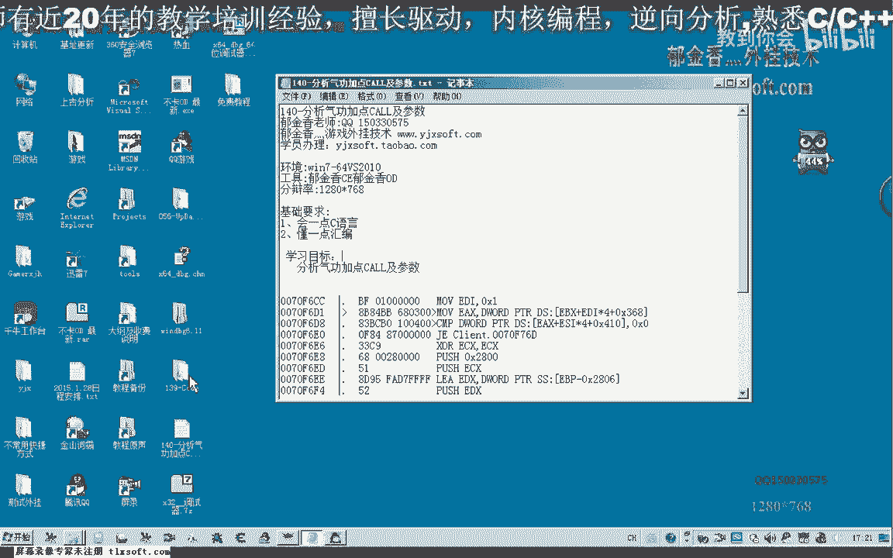

在本节课中，我们将学习如何分析游戏中的“气功加点”功能所调用的CALL及其参数。我们将使用调试器，通过逆向工程的方法，定位关键代码、理解参数结构，并最终整理出可用的调用方法。

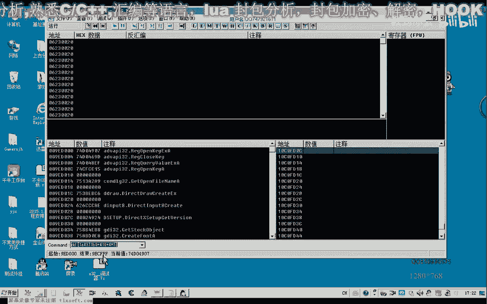

---

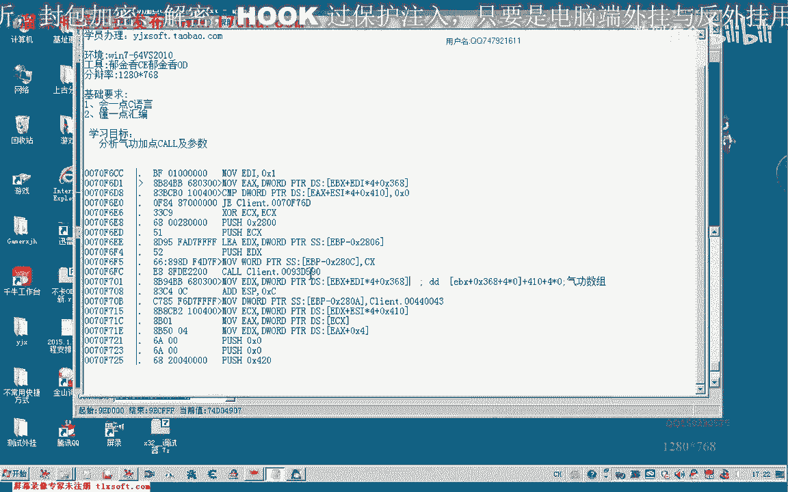

## 准备工作 🛠️

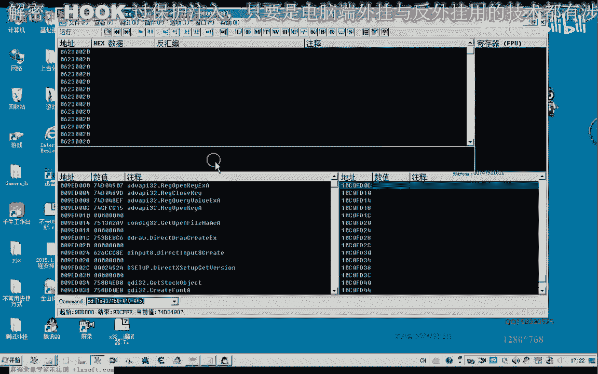

开始分析前，需要准备一个游戏账号。该账号的气功剩余点数至少需要两点以上，点数越多越便于反复测试。

首先，使用调试器附加到游戏进程。


我们将延续上一节课的分析进度，继续深入。


---

## 定位气功数组与关键CALL 🔍

上一节课我们分析到了气功数组的相关地址。


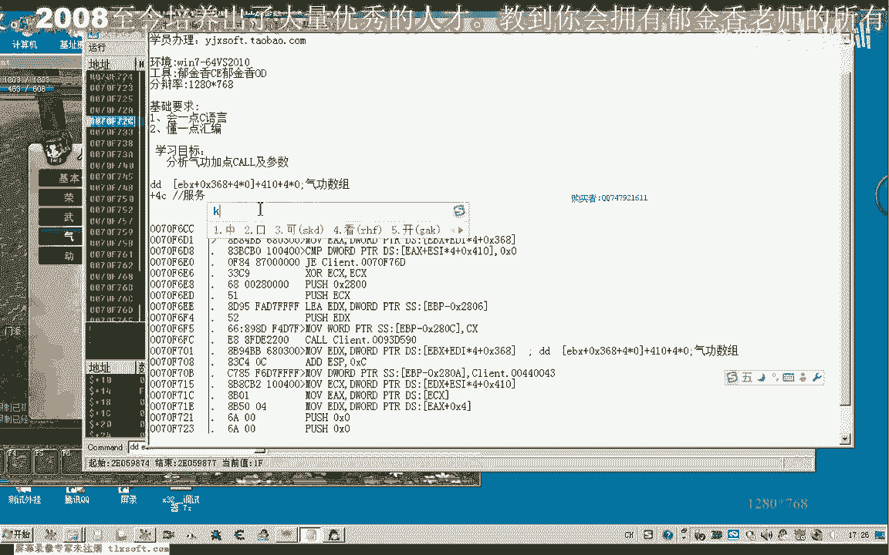

我们转到该地址进行进一步分析。


通过回溯调用栈约3-4层，我们找到了一个关键位置。当时我们分析出 `EAX` 寄存器的值来源于气功的身份标志。我们按下 `Ctrl+A` 进行分析，并在该地址下断点。

然后，在游戏中点击第二个气功进行“加点”操作，程序会断在断点处。此时观察 `ECX` 寄存器的值，它似乎是 `EAX` 的来源。`EAX` 应该是上层某个函数的返回值。

我们需要进入这个CALL内部查看其实现，以便修改其逻辑，使得加点操作不会真正消耗点数，从而可以反复测试。

---

## 分析参数来源 📊

我们继续在前一层调用处下断点，再次执行加点操作并中断。观察 `ECX` 的数值，发现它最终来源于上层 `ECX` 寄存器的值加上 `0x4C` 的偏移。

进入该CALL内部查看，确认数据的确来源于 `ESI`，而 `ESI` 又来自上层的 `ECX` 加上 `0x4C`。因此，我们可以确定一个参数来源于 **对象基址 + 0x4C**，我们暂时将其命名为“服务器的身份标识”或“服务器ID”。


---

## 分析气功下标参数 🔢

我们需要分析的参数较多，其中 `ECX`（或 `EDI`）是关键。再次执行加点并查看 `ECX` 的值，发现它包含对象的ID信息。

我们返回到上一层CALL，取消当前断点，在更早的调用处（地址 `0x420` 附近）下断点。这个CALL负责获取对象ID。

中断后，观察 `EDI` 寄存器的值。我们发现 `EDI` 的值是一段连续的数字（如 `0x12c`, `0x12d`, `0x12e`, `0x12f`...），其数量恰好与气功数组的数量（32个）对应。

通过在不同气功上加点测试，发现 `EDI` 的值遵循一个规律：**基础值 + 下标**。基础值是 `0x12C`，下标从0开始。因此，`EDI` 的计算公式为：

```
EDI = 0x12C + 气功下标
```

其中，气功下标范围是 0 到 31，对应32个气功槽位。

---

## 分析ECX（ESI）参数来源 🧩

另一个关键参数是 `ECX`，它来源于 `ESI`。我们观察 `ESI` 的值在执行过程中是否变化。通过多次测试，发现 `ESI` 的值保持不变，而 `EDI` 的值随气功下标变化。

为了测试CALL是否有效，我们首先需要撤销之前对CALL内部的修改（否则加点不会成功）。然后，我们可以构造参数进行调用测试。

使用代码注入器，我们构造如下调用（以给下标为0的气功加点为例）：

```
MOV EDI, 0x12C        ; EDI = 基础值 + 下标0
ADD EDI, 0            ; 明确加上下标0，等同于 MOV EDI, 0x12C
MOV ECX, [ESI]        ; ECX 来源于 ESI 指向的值
CALL 0x0070F670       ; 气功加点CALL的地址
```

测试发现，调用成功，气功点数被扣除。我们可以通过改变 `EDI` 中的下标值（0x12C + N）来给不同的气功加点。

---

## 追溯ESI的最终来源 ⛓️

接下来，我们需要找到 `ESI` 的最终来源，以便完整地构造调用。

我们对保存 `ESI` 值的内存地址下“访问”断点，回溯其写入过程。发现它来源于上一层函数的 `[EBP+8]` 参数。

继续向上层回溯，最终发现 `ESI` 的值来源于一个全局的游戏对象数组机制。通过多次下访问断点和分析，我们定位到一个关键的基址，我们称之为“气功对象基址”。

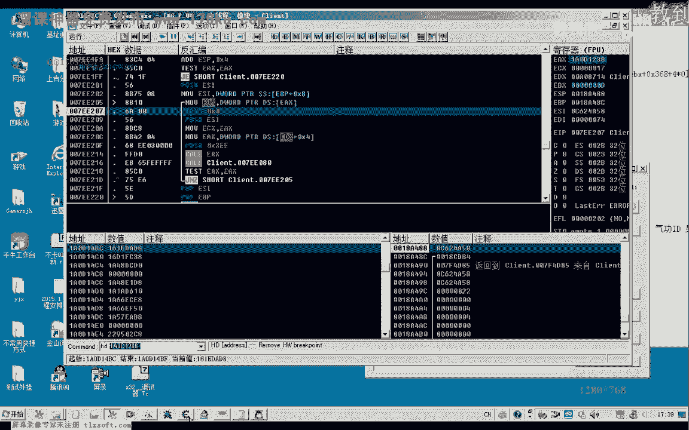

最终确定，`ESI` 的值来源于以下公式：

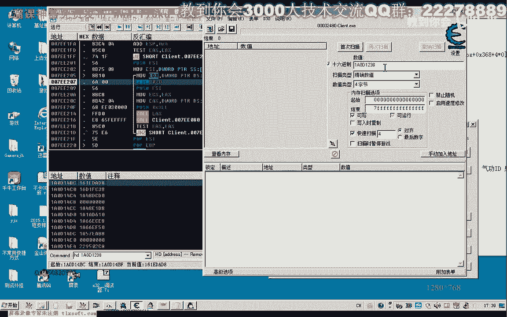

```
ESI = [气功对象基址] + 0x284
```

其中，“气功对象基址”是一个需要通过指针遍历找到的全局地址。

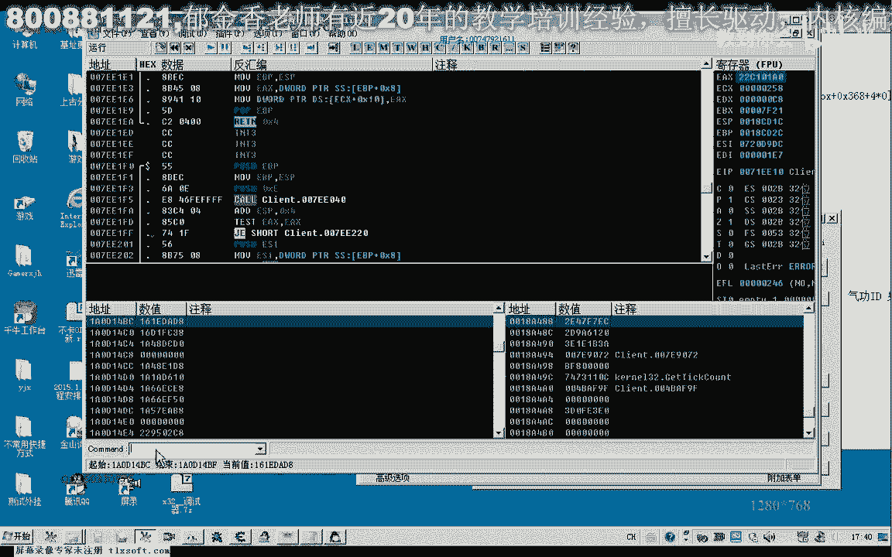

---

## 完整调用示例与总结 📝

综合以上分析，一个完整的气功加点CALL调用需要以下参数和步骤：

1.  **获取气功对象基址**：通过游戏全局结构找到。
2.  **计算 ESI**：`ESI = [气功对象基址] + 0x284`
3.  **计算 EDI**：`EDI = 0x12C + 气功下标` （下标 0~31）
4.  **设置 ECX**：`ECX = [ESI]`
5.  **调用CALL**：`CALL 0x0070F670`

以下是给下标为6的气功加点的代码示例：

```
// 假设气功对象基址已存储在变量 g_pSkillObj 中
MOV ESI, [g_pSkillObj]   // 获取基址
ADD ESI, 0x284           // ESI = 基址 + 0x284
MOV ECX, [ESI]           // ECX 参数
MOV EDI, 0x12C           // 基础值
ADD EDI, 6               // EDI = 0x12C + 6 (下标6)
CALL 0x0070F670          // 执行加点CALL
```

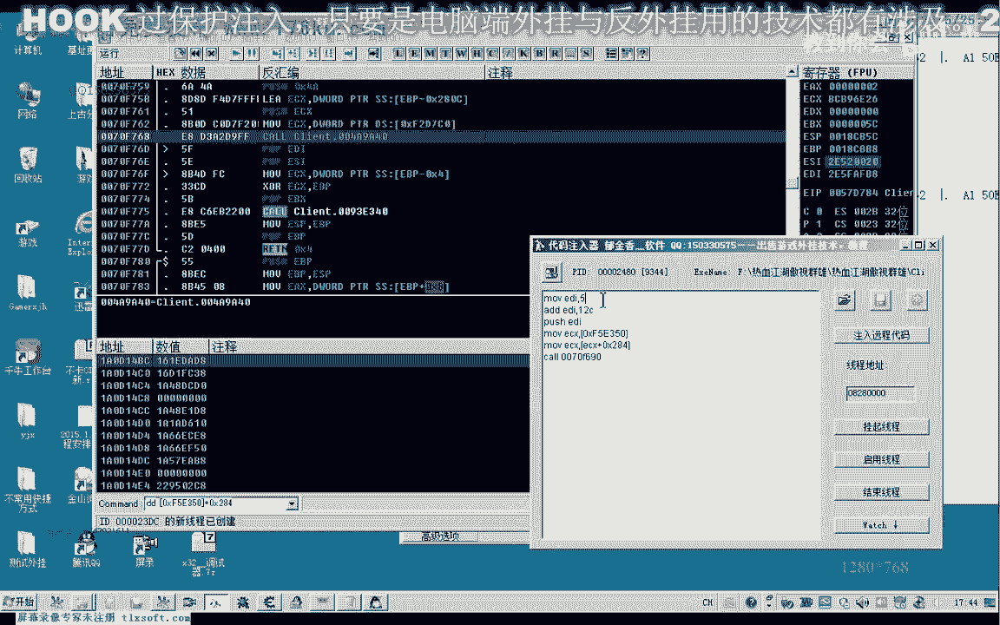

---

## 课后作业与练习 📚


本节课我们一起学习了气功加点CALL的分析方法、参数构造及调用过程。

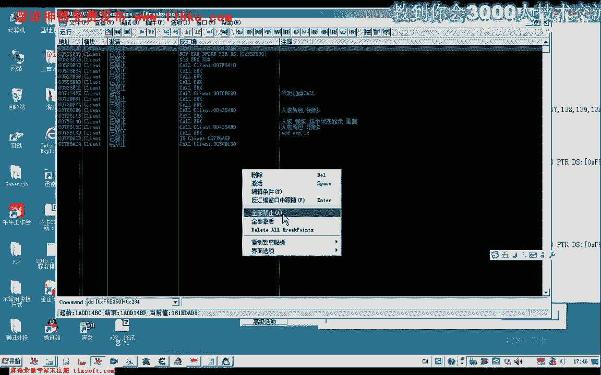

作为练习，请你独立完成以下任务：
1.  在游戏中定位并验证“气功对象基址”。
2.  编写一个完整的函数，能够根据给定的气功下标，成功调用加点CALL。
3.  （进阶）思考如何将此调用整合到自动化的脚本或程序中，并注意安全调用，避免下标越界。


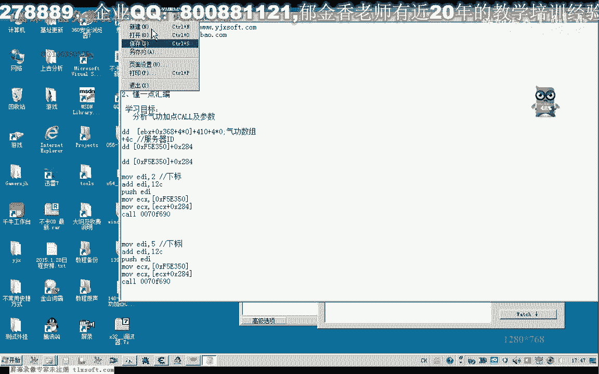


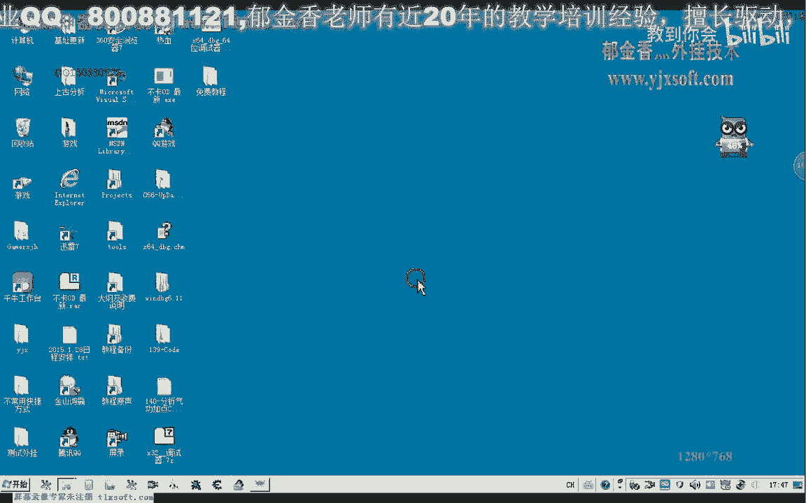


通过完成这个练习，你将更深入地理解游戏函数的逆向分析与调用。