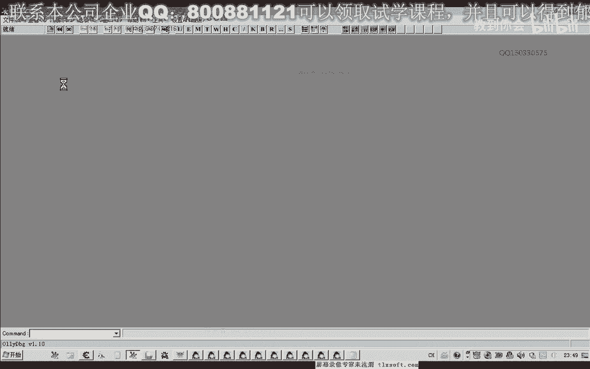
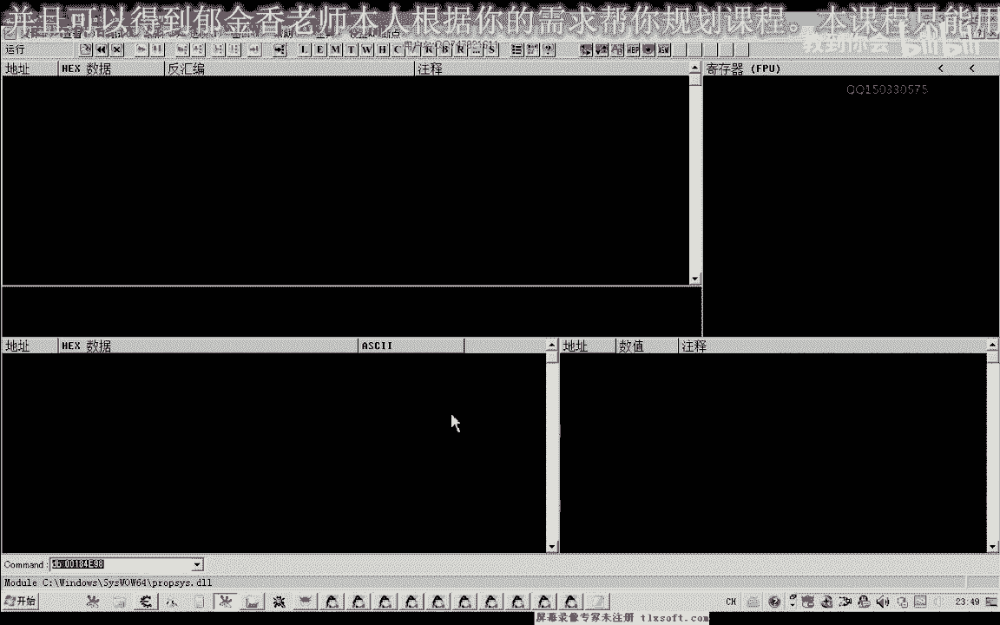
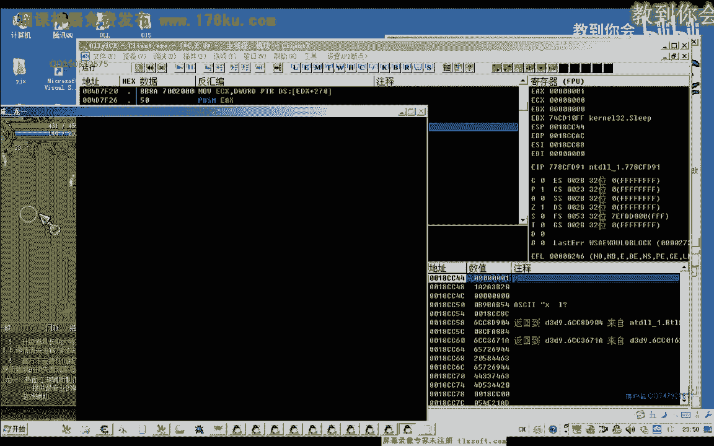
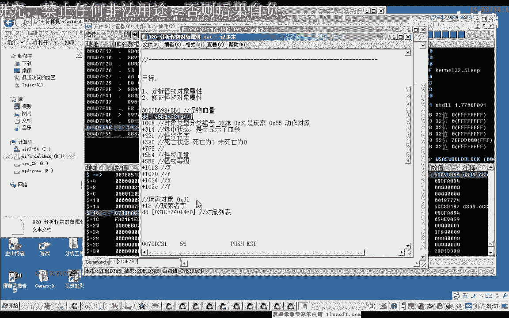
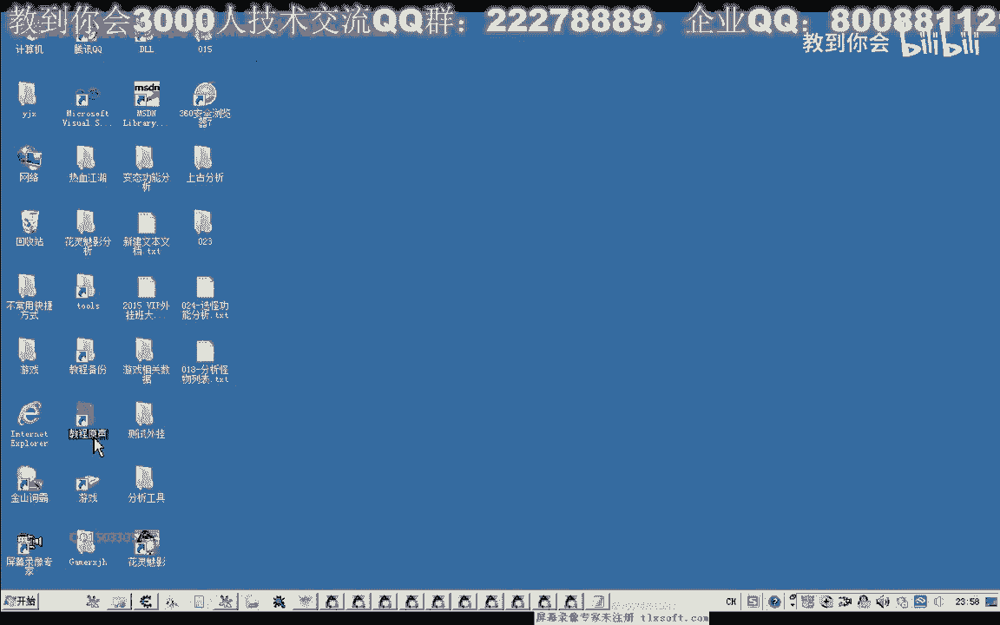
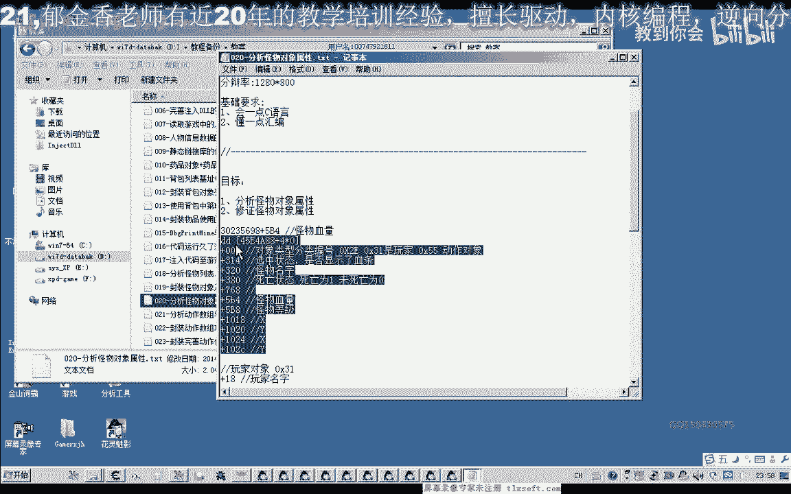
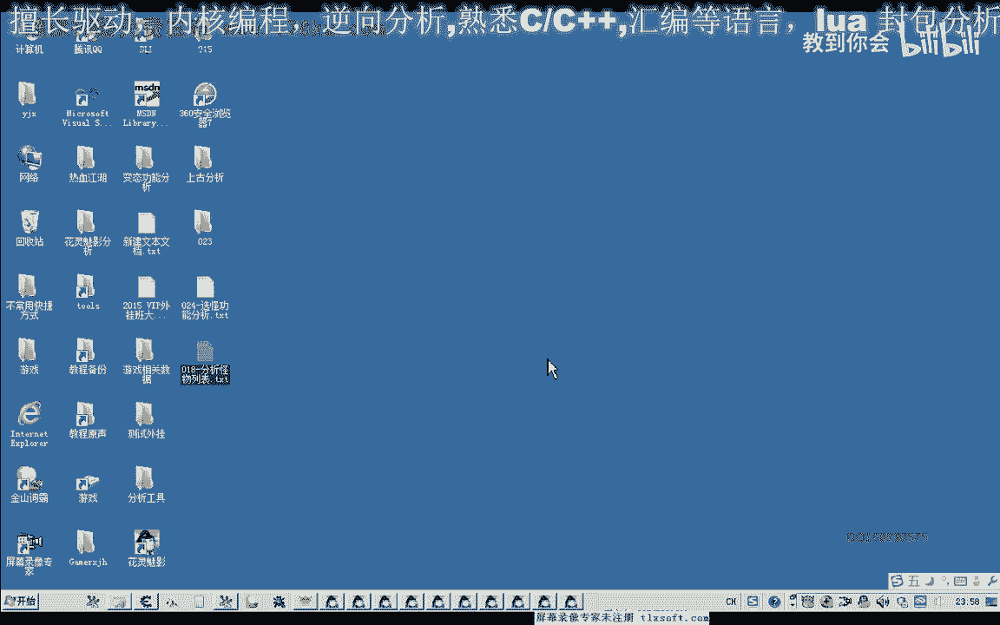

# 逆向教程 P13：024-选怪功能分析 🎯

在本节课中，我们将学习如何通过逆向工程分析游戏中的“选中怪物”功能。我们将探讨该功能可能的实现方式，并使用调试工具定位关键的内存地址和代码。

---

## 概述

选中怪物功能通常有两种实现方式。第一种是向某个全局变量写入目标怪物对象的地址。第二种是向对象内部的某个属性（例如怪物ID或标识符）写入特定值。这两种情况都很常见。

我们将使用调试器来搜索并确定游戏具体采用了哪种方式。无论哪种情况，只要在选中或切换怪物时，相关变量或属性的值就会发生变化。我们可以利用这一点进行分析。

---

## 分析步骤

### 第一步：定位变动的数据

首先，我们尝试搜索未知的初始值，因为此时我们不知道具体的数值是多少。首次扫描后，只要我们不改变选中的目标，该数值就不会变动。

这种未变动的数值可以多次扫描，但速度较慢。

更快的办法是主动更改选中的目标。选中一个怪物后，搜索**变动的数值**，这样可以快速过滤掉大量无关数据。

以下是具体的操作流程：


1.  首次扫描未知的初始值。
2.  更改一次选中的怪物，然后搜索变动的数值。
3.  再次更改选中的怪物，继续搜索变动的数值。
4.  重复此过程，不断缩小范围。





我们也可以选中自己的角色（数值可能变为0）或取消选中（数值可能变为-1）来辅助搜索。最终，我们会得到几个可能性较高的内存地址。

### 第二步：分析写入指令



将可疑地址添加到监视列表，并对第一个地址查找“访问了该地址的代码”。然后尝试选中一个怪物，观察哪些汇编指令被执行。

我们会发现，大部分代码是对堆栈进行操作，这种可能性较低，因为堆栈地址（如从`0x18`开始的地址）通常是临时的。同时，我们也会注意到有些地址的数值在不停变化，即使我们没有进行任何操作，这些地址也应被排除。

经过筛选，最终可能只剩下两个关键地址。其中一个地址在选中怪物时，有明确的写入指令（如`MOV [ECX+14], EAX`），这很可能就是向“选中怪物变量”写入数据的代码，需要重点分析。

### 第三步：验证功能

关闭调试器，重新附加到游戏进程，然后转到上一步找到的写入指令地址。

在此处设置断点或修改代码进行测试。例如，尝试修改写入的值，观察游戏内选中怪物的行为是否发生变化。

测试发现，当向该地址写入特定怪物的ID时，角色会攻击该怪物，而不再攻击显示血条的怪物。这证实了此处就是实现选中怪物功能的关键代码。

写入的值来源于寄存器`ESI`，而`ESI`指向怪物对象。通过分析怪物对象结构，我们发现偏移`+0x8`处是一个标识对象类型的值（例如，`0x21`代表怪物，`0x31`代表玩家）。这正是用于区分目标类型的标识符。

### 第四步：确定上下文对象

我们还需要弄清楚，是向哪个对象的地址写入了怪物ID。回溯代码发现，写入的基础地址（`ECX`）来源于一个上层对象。

分析这个上层对象的内存结构：其偏移`+0x8`处的类型标识是`0x31`（玩家），偏移`+0x18`处存储着玩家自己的名字。因此，这个基础地址就是我们自己角色（玩家）的对象地址。

**核心概念总结如下：**

*   **玩家对象地址**： 存储着我们自己角色的数据。
*   **选中怪物偏移**： 玩家对象地址 **+ 0x14** 处存储着当前选中怪物的ID。
*   **怪物类型标识**： 怪物对象地址 **+ 0x8** 处的值（如 **0x21**）标识了它是一个怪物。

```cpp
// 伪代码示例
DWORD playerObjAddr = GetPlayerObjectAddress();
DWORD selectedMonsterId = ReadMemory(playerObjAddr + 0x14);
```

---

## 功能扩展：显示血条

在之前的课程中，我们分析过怪物显示血条的功能。它与怪物对象偏移`+0x314`处的值相关。当该值为1时，怪物会显示血条。



因此，在实现选中怪物功能时，可以同时向怪物对象的这个地址写入1，以触发血条显示。

---



## 总结

本节课中，我们一起学习了如何逆向分析游戏的选怪功能。我们通过搜索内存变动定位了关键地址，分析了写入怪物ID的汇编指令，并最终确定了该功能依赖于玩家对象中的一个特定偏移（`+0x14`）来存储选中目标的ID。



我们还回顾了怪物对象的类型标识（`+0x8`）和血条显示开关（`+0x314`）等关键属性。下一节课，我们将基于这些分析结果，对选怪功能进行代码封装和实现。



---