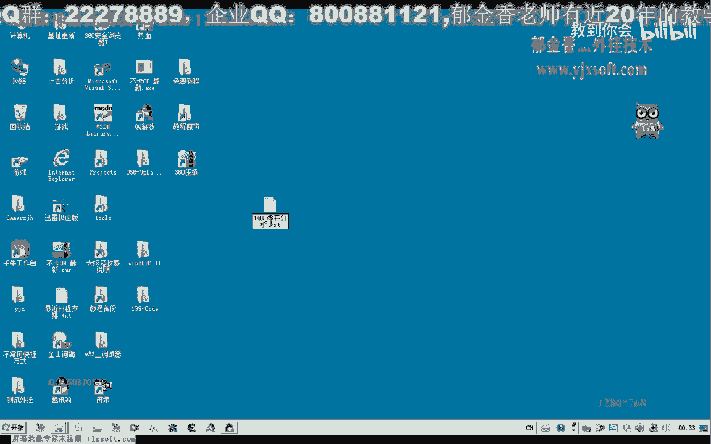
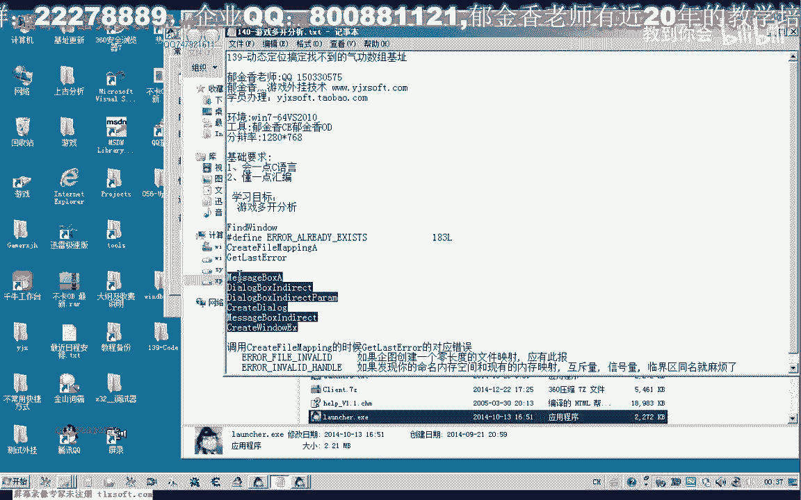
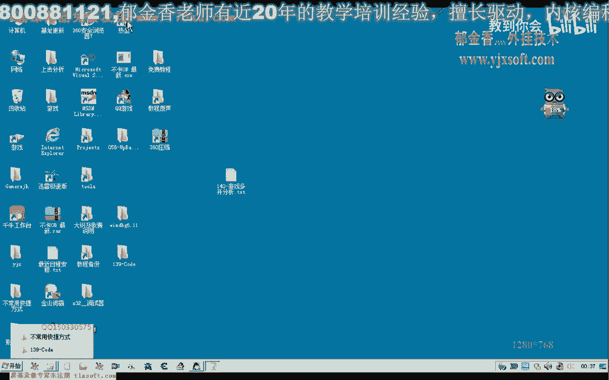
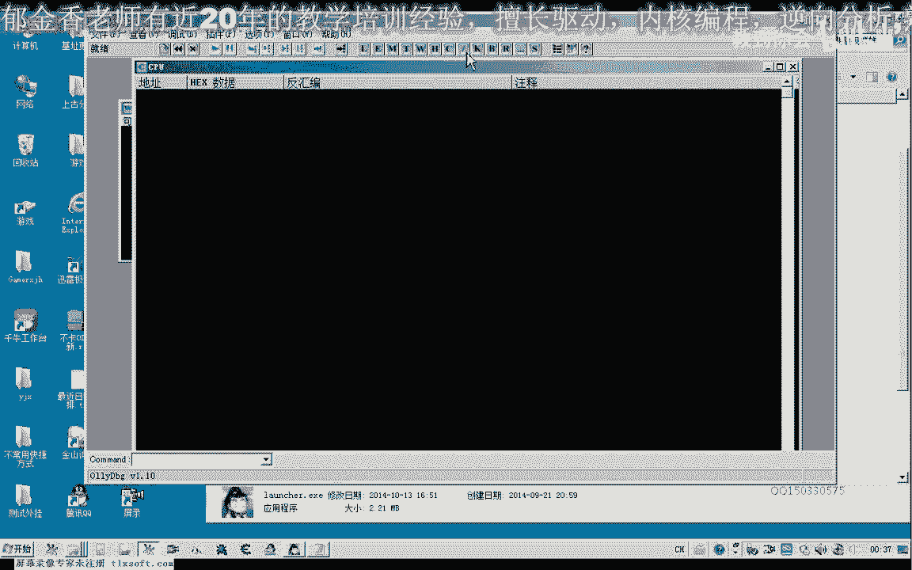
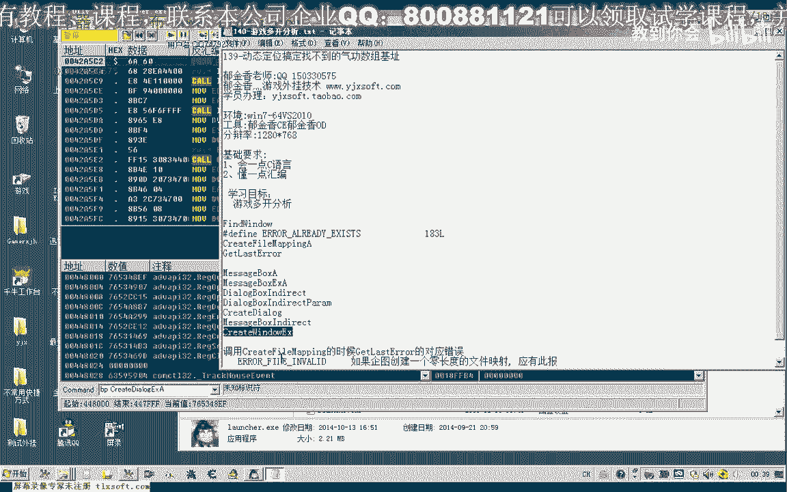
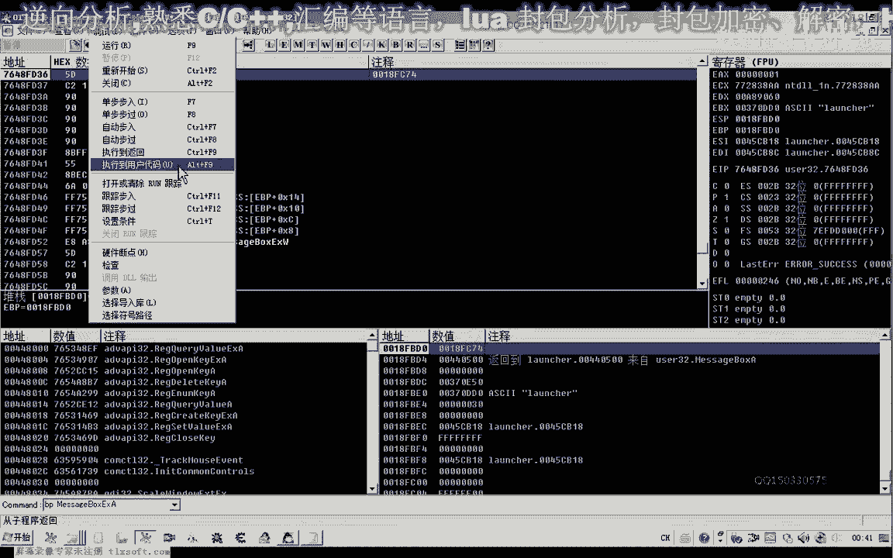
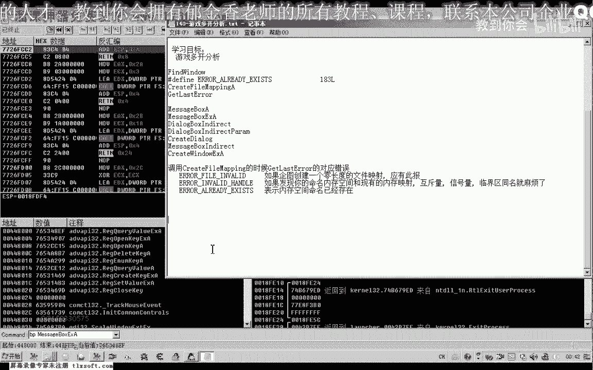
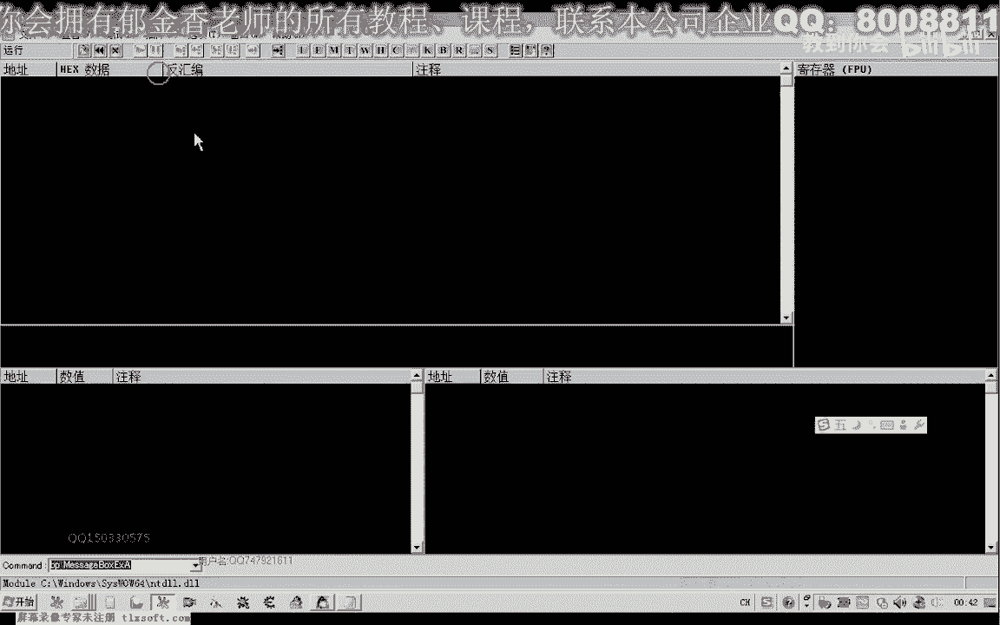
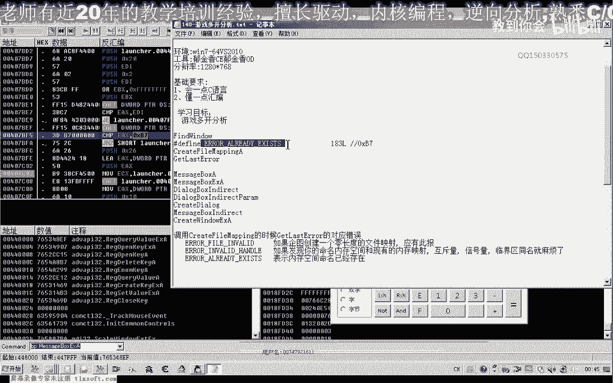

# 逆向工程课程 P130：游戏多开分析 🎮

在本节课中，我们将学习如何分析一款游戏程序阻止多开的机制。我们将通过逆向工程的方法，定位到程序检测已运行实例的关键代码，并探讨绕过此限制的思路。

## 概述

游戏多开限制通常通过多种技术实现，例如枚举窗口、查找窗口标题或类名，以及创建共享内存等。本节课，我们将针对一个具体的游戏登录器进行分析，它会在检测到游戏已运行时弹窗提示，阻止第二个实例启动。

## 多开检测的常见方法



游戏程序阻止多开通常会使用以下几种方法进行检测：





*   **枚举窗口**：使用 `EnumWindows` API 遍历所有顶层窗口。
*   **查找窗口**：使用 `FindWindow` 或 `FindWindowEx` API，通过窗口标题或类名查找特定窗口。
*   **进程枚举**：使用 `CreateToolhelp32Snapshot` 等函数枚举系统进程。
*   **共享内存/互斥体**：使用 `CreateFileMapping` 或 `CreateMutex` 创建命名的共享对象。如果创建失败（错误码指示已存在），则说明已有实例在运行。

## 定位弹窗代码

当尝试启动第二个游戏登录器时，程序会弹出一个提示窗口。在Windows编程中，创建此类消息框常用的API是 `MessageBox` 及其变体。



以下是创建消息对话框的相关API函数：

*   `MessageBoxA` / `MessageBoxW`
*   `MessageBoxExA` / `MessageBoxExW`
*   `MessageBoxIndirectA` / `MessageBoxIndirectW`
*   `DialogBoxParam` / `CreateDialogParam`
*   `CreateWindowExA` / `CreateWindowExW`

理论上，我们可以对这些函数下断点。当程序弹窗时，断点将被触发，通过调用栈回溯，我们就能找到触发弹窗的判断逻辑所在的位置。



## 动态调试与分析



上一节我们介绍了定位弹窗的思路，本节中我们来看看具体的调试过程。



我们使用调试器加载游戏登录器，并对 `MessageBoxA` 等函数下断点。运行程序后，断点成功命中，我们看到了弹窗。

通过执行“执行到返回”操作并分析调用栈，我们逐步回溯代码，最终定位到一片可能负责检测的关键代码区域。该区域包含一个对 `CreateFileMappingA` 函数的调用。

`CreateFileMappingA` 函数用于创建或打开一个命名的文件映射对象。其关键特性在于：如果尝试创建一个已存在的命名对象，函数会失败，并通过 `GetLastError` 返回特定的错误代码。



以下是相关的代码逻辑示意：
```c
// 尝试创建或打开一个命名的文件映射
HANDLE hMap = CreateFileMappingA(INVALID_HANDLE_VALUE, NULL, PAGE_READONLY, 0, 1, “Global\\MyGameInstance”);
if (hMap == NULL) {
    DWORD dwError = GetLastError();
    if (dwError == ERROR_ALREADY_EXISTS) { // 错误码 0xB7 (183)
        // 对象已存在，说明游戏已在运行
        MessageBoxA(...); // 弹出阻止多开的提示
    }
}
```
分析汇编代码后发现，程序正是利用了这一机制。它尝试创建一个具有特定名称的共享内存。如果创建失败且 `GetLastError()` 返回 **`0xB7`**（即 `ERROR_ALREADY_EXISTS`），程序就判定已有实例运行，继而执行弹窗代码。

## 尝试绕过检测

找到了检测逻辑的核心，即对 `GetLastError()` 返回值是否等于 `0xB7` 的判断，我们就可以尝试修改程序行为。

以下是两种简单的修改思路：

1.  **修改判断条件**：将汇编指令中比较错误码是否为 `0xB7` 的指令，改为一个永远不会成立的值（例如 `0xB1`）。
2.  **修改跳转指令**：直接修改关键的条件跳转指令（如 `JNZ` 或 `JZ`），使其强制跳转或不跳转，从而绕过弹窗流程。

我们在调试器中尝试了第二种方法，修改了关键跳转。修改后，第二个登录器窗口成功启动，绕过了第一道多开检测。

## 总结与后续


本节课中我们一起学习了游戏多开检测的一种常见实现方式——通过**命名共享对象**进行实例检测。我们掌握了从弹窗入手，利用调试器回溯关键代码，定位到基于 `CreateFileMapping` 和 `GetLastError` 的判断逻辑，并尝试通过修改汇编指令来绕过此限制。

需要注意的是，本次分析仅绕过了**登录器层面**的多开检测。成功打开第二个登录窗口后，在尝试登录游戏客户端时，程序依然报错。这说明游戏**客户端内部**很可能还存在另一套或多套检测机制。

在下一节课中，我们将继续深入分析，探索客户端内部可能存在的其他多开防护手段。