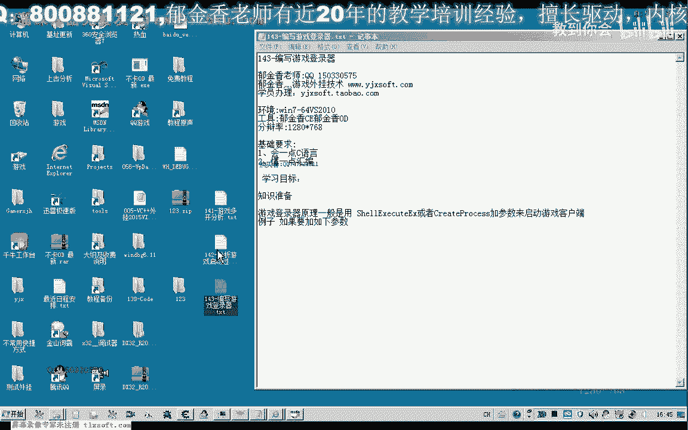
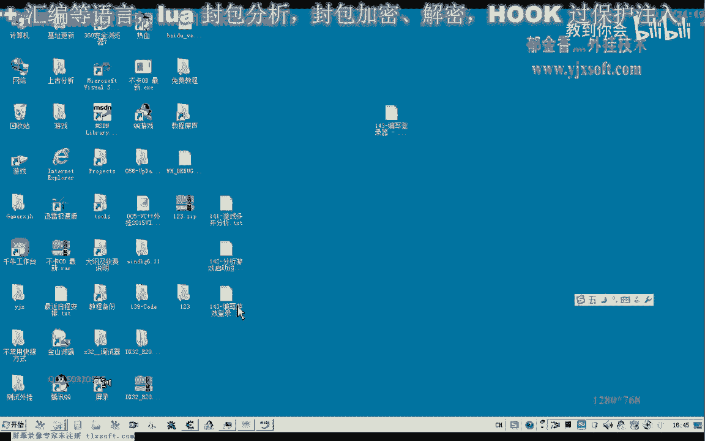
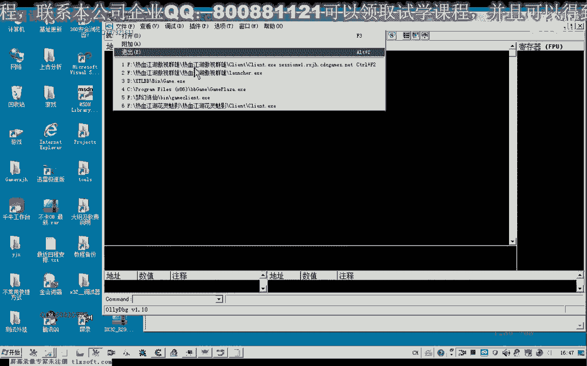
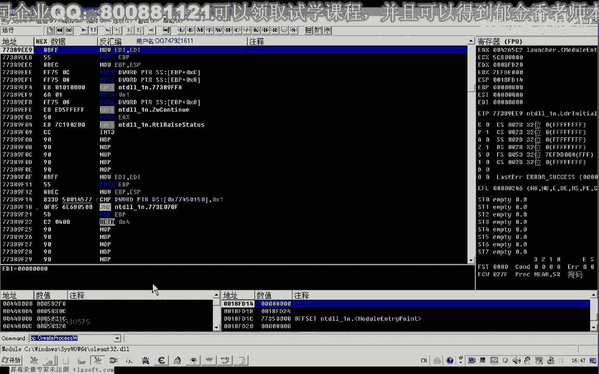
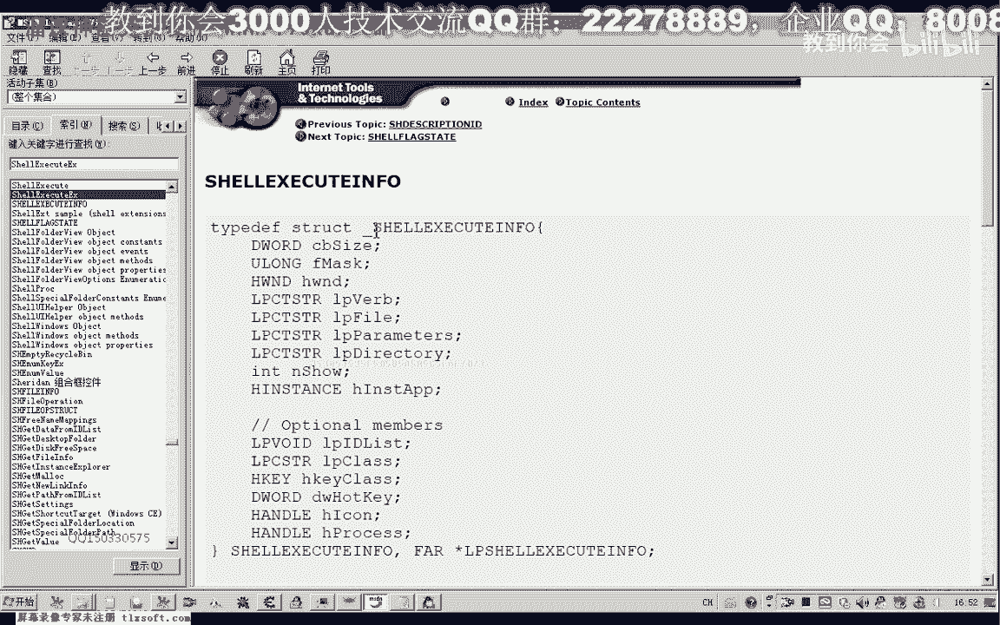
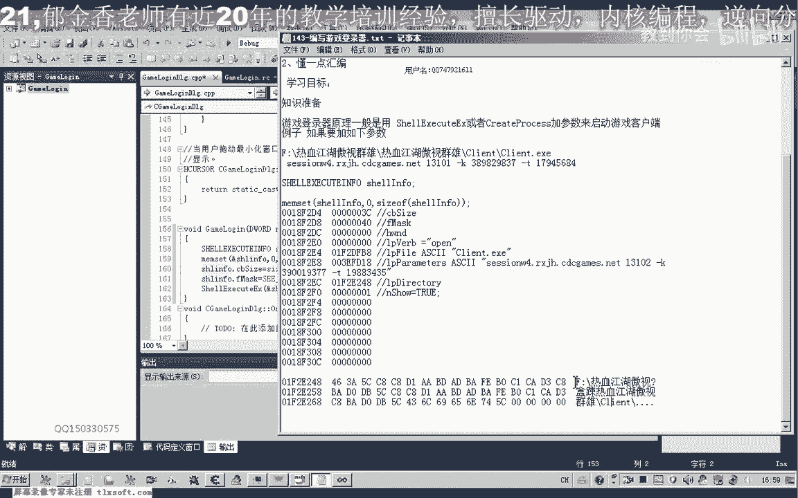
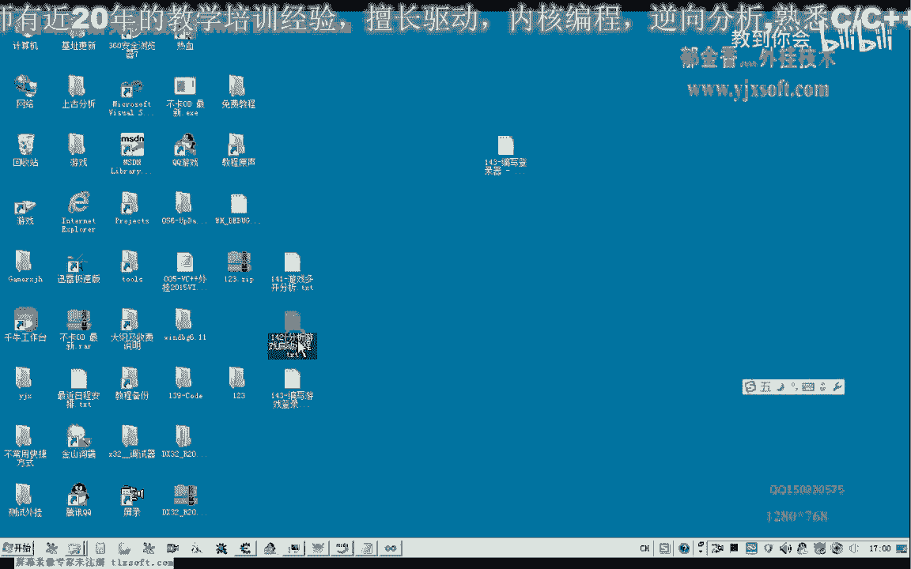

# 课程 P132：编写游戏登录器 🎮



在本节课中，我们将学习如何分析并编写一个简单的游戏登录器。我们将通过理解游戏客户端启动的原理，并调用关键的 Windows API 函数来实现这一功能。

---






## 回顾与分析 📝

上一节我们分析了游戏登录的流程，了解了游戏客户端启动的基本原理。我们知道，通过调用特定的 API 函数并传递正确的参数，可以启动游戏。

因此，理论上我们可以自己编写一个登录器。首先，我们需要获取并理解游戏启动时传递的参数。

---

## 获取启动参数 🔍

为了获取启动参数，我们使用调试器加载游戏的登录器，并分析其调用 `ShellExecuteEx` 函数时传递的数据。

以下是分析步骤：
1.  在 `ShellExecuteEx` 函数处设置断点。
2.  运行程序，在选择游戏大区时，程序会对参数进行初始化。
3.  点击“游戏开始”后，程序会调用 API 启动客户端，此时我们可以查看具体的参数。

通过分析，我们得到了一个 `SHELLEXECUTEINFO` 结构体，其中包含了启动游戏所需的关键信息，如文件路径、参数和工作目录。



---

## 编写登录器程序 💻


有了参数数据后，我们就可以开始编写自己的登录器了。我们使用 Visual Studio 创建一个基于对话框的 MFC 应用程序。

以下是创建界面的步骤：
1.  创建一个新的 MFC 应用程序项目，选择基于对话框。
2.  调整对话框大小，并添加按钮控件，例如“网通一区”、“网通二区”、“网通三区”和“登录”。
3.  为这些按钮添加相应的事件处理函数。

---

## 核心代码实现 ⚙️

登录的核心是调用 `ShellExecuteEx` 函数。我们需要先定义一个 `SHELLEXECUTEINFO` 结构体变量，并用获取到的参数填充它。

以下是关键代码结构：

```cpp
void CMyLoginDlg::OnLogin(int nZoneIndex)
{
    SHELLEXECUTEINFO sei = {0};
    sei.cbSize = sizeof(sei);
    sei.fMask = SEE_MASK_NOCLOSEPROCESS; // 例如 0x40
    sei.hwnd = NULL;
    sei.lpVerb = _T("open");
    sei.lpFile = _T("GameClient.exe"); // 游戏客户端路径
    sei.lpParameters = _T("-zone 4"); // 启动参数，随大区变化
    sei.lpDirectory = _T("C:\\Game\\"); // 游戏工作目录
    sei.nShow = SW_SHOW;

    ShellExecuteEx(&sei);
    
    // 等待游戏进程结束
    if (sei.hProcess)
    {
        WaitForSingleObject(sei.hProcess, INFINITE);
        CloseHandle(sei.hProcess);
    }
    
    // 登录器隐藏或退出
    ShowWindow(SW_HIDE);
    // ... 其他清理代码
}
```





**代码说明**：
*   `sei.cbSize`: 必须设置为结构体大小。
*   `sei.lpParameters`: 此参数需要根据所选游戏大区进行动态更改。例如，网通一区、二区、三区对应的服务器地址或编号不同。
*   `sei.lpDirectory`: 需要设置为游戏客户端的实际工作目录，确保使用双反斜杠 `\\` 表示路径。
*   `sei.nShow`: 设置为 `SW_SHOW` 以正常显示游戏窗口。
*   调用 `ShellExecuteEx` 后，我们使用 `WaitForSingleObject` 等待游戏进程结束，这样登录器会在游戏退出后才关闭。

---

## 测试与完善 🧪

编写完成后，我们编译并运行程序进行测试。

测试流程如下：
1.  点击对应大区的按钮（如“网通四区”），程序会初始化对应的启动参数。
2.  点击“登录”按钮，调用 `ShellExecuteEx` 启动游戏。
3.  登录器界面会隐藏，并在后台等待游戏进程。
4.  当游戏客户端退出时，登录器进程才会随之结束。

如果测试成功，意味着我们的基础登录器已经可以工作。要完善它，我们还需要：
*   为每个大区获取并设置正确的 `lpParameters`。
*   动态获取游戏客户端的安装路径，而不是硬编码。
*   优化界面和用户体验。

---

## 总结 📚

本节课中，我们一起学习了如何分析游戏启动参数，并动手编写了一个简单的游戏登录器。我们掌握了使用 `ShellExecuteEx` API 启动外部程序的方法，并实现了登录器等待游戏退出的逻辑。

核心要点包括：
*   理解 `SHELLEXECUTEINFO` **结构体**的填充。
*   掌握 **`ShellExecuteEx`** 函数的调用。
*   使用 **`WaitForSingleObject`** 实现进程等待。


通过本课的学习，你已经掌握了编写自定义登录器的基本技能。你可以尝试进一步完善它，例如从配置文件读取服务器列表，或增加自动更新功能。