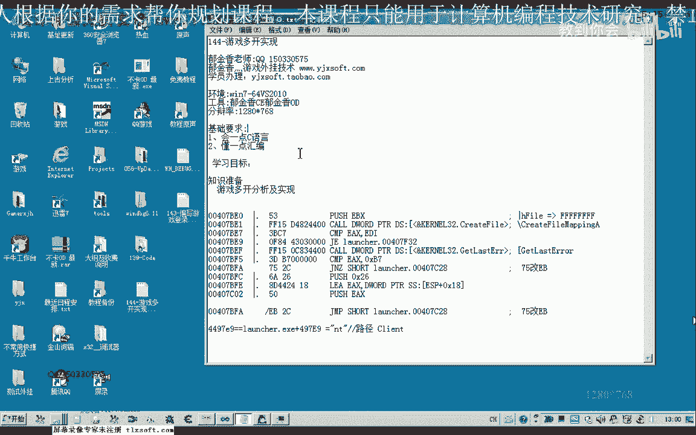
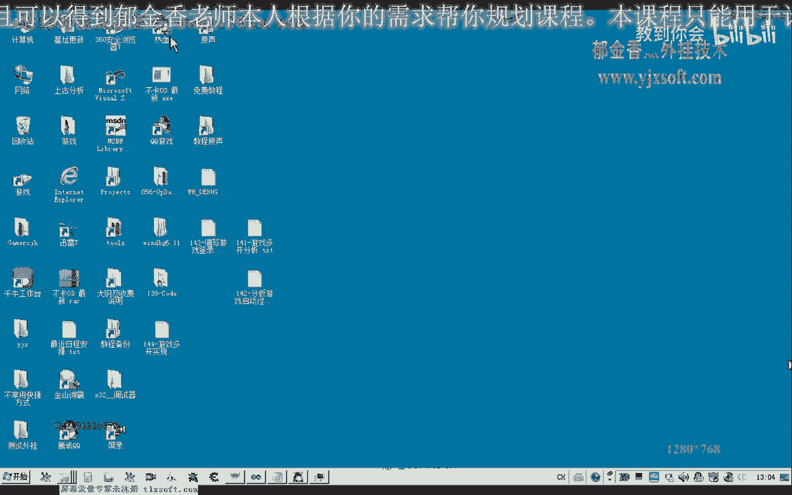
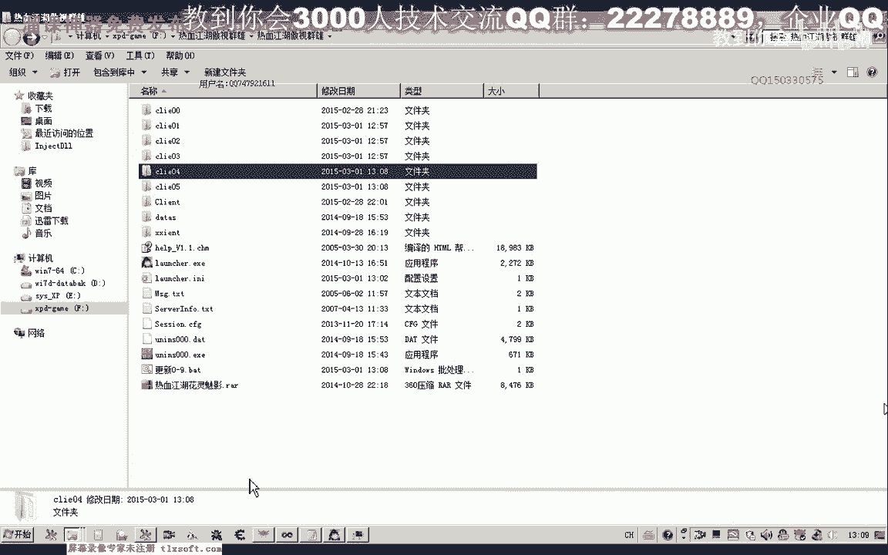
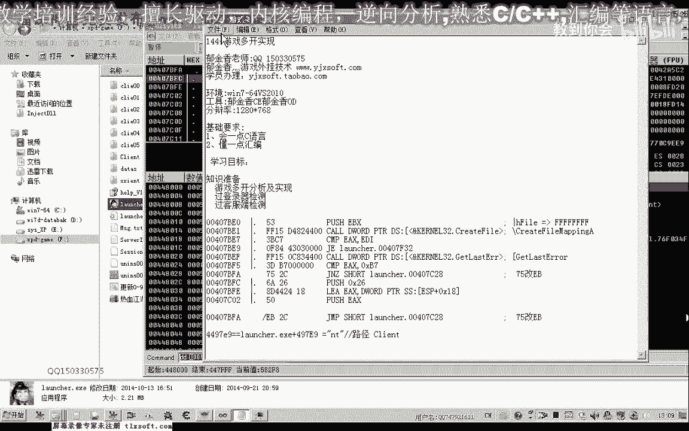
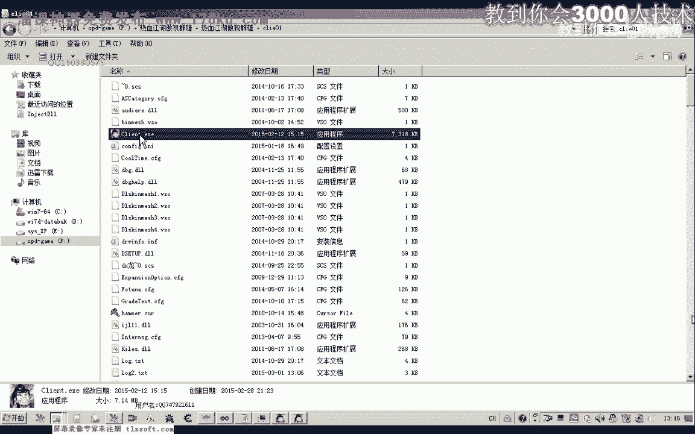
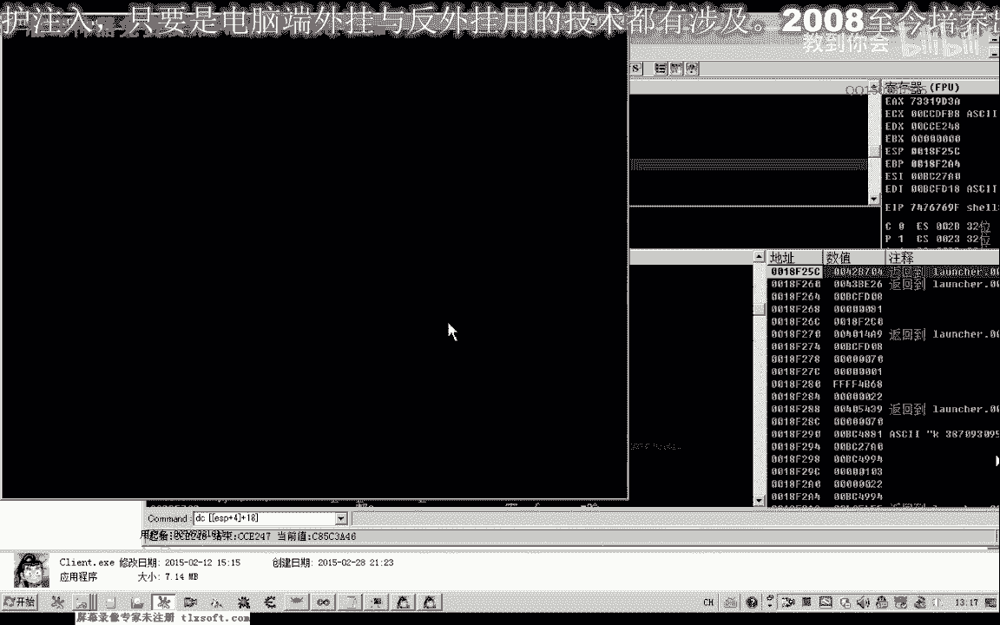

# 课程 P133：游戏多开实现 - 绕过登录器检测 🎮

在本节课中，我们将学习如何通过修改游戏客户端和登录器的代码，绕过其多开检测机制，从而实现游戏的多开功能。我们将从效果演示开始，逐步分析其实现原理，并介绍关键的技术步骤。

## 概述

我们首先展示了一段测试代码的效果。这段代码在启动游戏客户端的同时，实时修改了其部分代码，从而绕过了登录器的多开检测。通过这种方式启动的客户端，可以正常登录游戏，而不会触发多开的限制提示。

接下来，我们来看第二个游戏实例。此时，游戏不会出现任何多开提示，能够正常登录。如果结合游戏优化功能以降低CPU占用率，在内存充足的情况下，理论上可以实现十开、二十开，甚至更多。

## 实现原理分析




上一节我们展示了多开功能的效果，本节中我们来看看其背后的实现原理。经过分析，游戏的检测机制主要涉及两个方面。

### 登录器检测绕过

如果我们正常启动游戏，不绕过其多开保护，当尝试打开第二个登录器时，程序会提示“请关闭运行中的程序”。这个检测逻辑位于一段特定的代码段中。

以下是绕过此检测的核心思路：
*   我们需要跳过一条 `jnz`（条件跳转）指令。
*   该指令原本用于比较一个值，如果比较结果不等于特定值（例如 `B7`），则跳转，表示客户端已打开。
*   我们的目标是将 `jnz` 指令修改为 `jmp`（无条件跳转）指令。
*   这样修改后，无论比较结果如何，程序都会执行跳转，从而绕过“已打开”的判断。

具体操作是将机器码 `75`（对应 `jnz`）修改为 `EB`（对应 `jmp`）。



### 客户端检测绕过

仅仅修改登录器检测还不够。游戏客户端本身也存在检测机制。经过测试，该检测可能是基于游戏客户端的运行路径。

如果检测到相同路径下的客户端进程已经启动，新的客户端将无法登录。因此，我们需要为每个新启动的客户端指定一个不同的运行路径。

## 技术实现步骤

以下是实现多开的关键步骤概述。

### 1. 修改登录器检测代码




我们需要在登录器的主线程代码加载后、但尚未执行检测代码之前，就完成对 `jnz` 到 `jmp` 的修改。这要求我们以“挂起”模式创建登录器进程。




**核心代码逻辑如下：**
```c
// 以 CREATE_SUSPENDED 标志创建进程，使其主线程暂停
CreateProcess(..., CREATE_SUSPENDED, ...);


// 在内存中找到检测代码地址（例如 0x407BFA），将 0x75 修改为 0xEB
WriteProcessMemory(..., 0x407BFA, &patch_byte_EB, 1, ...);


// 恢复进程线程，让其继续运行
ResumeThread(...);


// （可选）运行一段时间后，将代码恢复原状，以应对更强的检测
Sleep(...);
WriteProcessMemory(..., 0x407BFA, &original_byte_75, 1, ...);
```

### 2. 为客户端创建独立路径

为了绕过客户端的路径检测，我们需要为每个新启动的游戏实例准备一个独立的目录。

一个简单的方法是使用批处理文件（.bat）来实现。以下是批处理文件的核心思路：



```
@echo off
REM 创建多个独立的客户端目录，例如 client00, client01, client02...
for /l %%i in (0,1,3) do (
    mkdir "client0%%i"
    xcopy /E /I "原始客户端路径\*.*" "client0%%i\"
)
```

**解释：**
*   `mkdir` 命令用于创建新目录。
*   `xcopy` 命令用于将原始客户端的所有文件复制到新目录中。
*   理论上，只要目录名不同（例如使用递增数字或随机字符），就可以创建无数个副本。

### 3. 修改客户端启动参数



当登录器调用游戏客户端时，它会传递一个包含运行目录的参数。我们需要在启动每个新客户端时，修改这个目录参数，使其指向我们新建的独立路径（例如 `...\client01\` 而不是默认的 `...\client\`）。

在调试器中，这个参数通常可以在调用 `CreateProcess` 或 `ShellExecute` 的函数附近找到。我们需要在代码中动态修改这个路径字符串。

**核心代码逻辑如下：**
```c
// 格式化生成新的客户端路径，例如 "C:\Game\client%02d\game.exe"
sprintf(new_client_path, "C:\\Game\\client%02d\\game.exe", instance_id);


// 在启动客户端进程时，使用新的路径替换原始路径
```
这样，每个游戏客户端进程都运行在独一无二的路径下，从而绕过了基于路径的检测。

## 总结

本节课中我们一起学习了实现游戏多开的关键技术。我们了解到，多开检测通常分为登录器检测和客户端检测两层。通过将登录器检测代码中的 `jnz` 修改为 `jmp`，我们可以绕过第一层防护。通过为每个客户端实例创建独立的运行目录并修改启动参数，我们可以绕过第二层基于路径的检测。结合“挂起进程-修改内存-恢复运行”的技术，我们可以自动化完成整个多开流程。理解这些原理是进行相关安全分析和开发的基础。