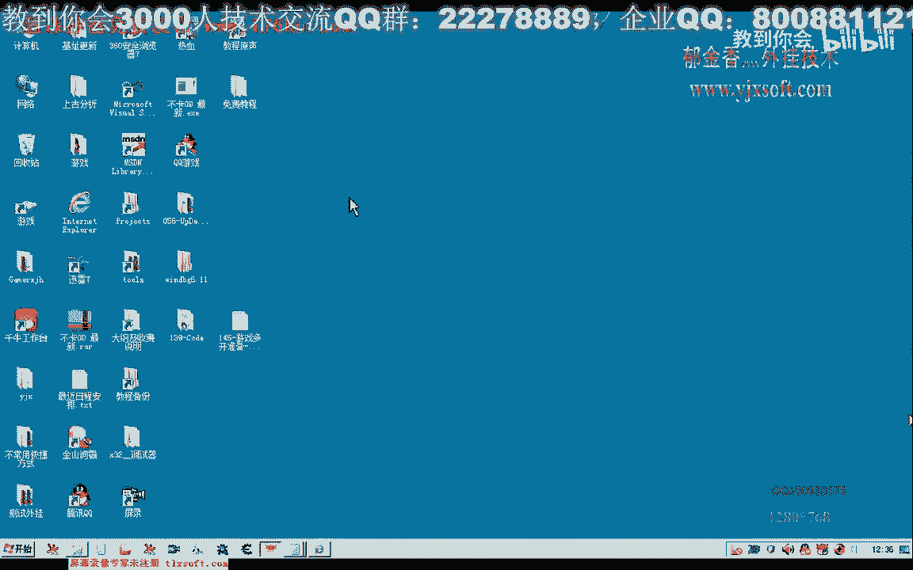
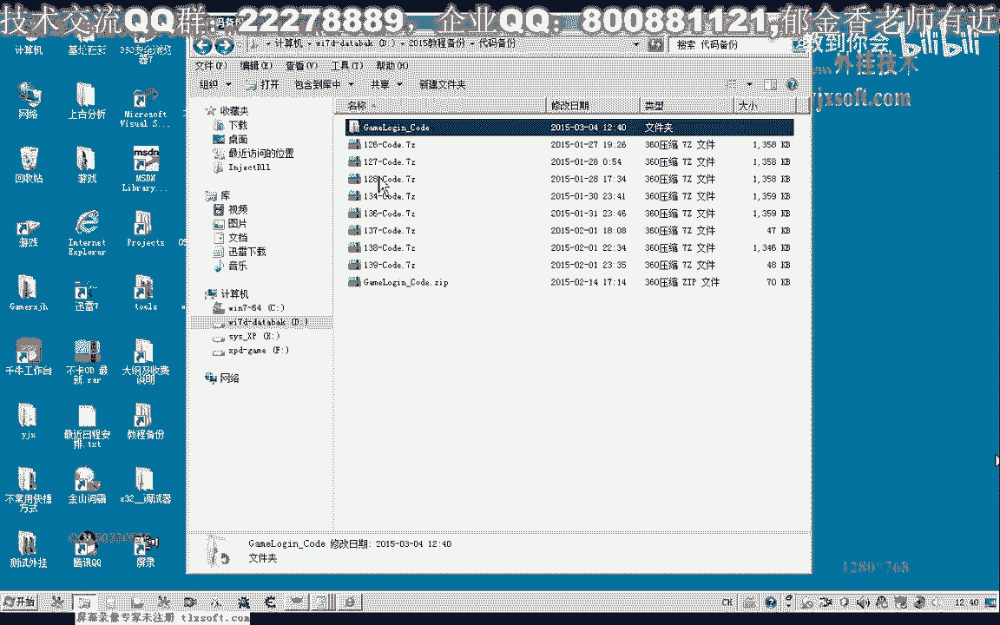
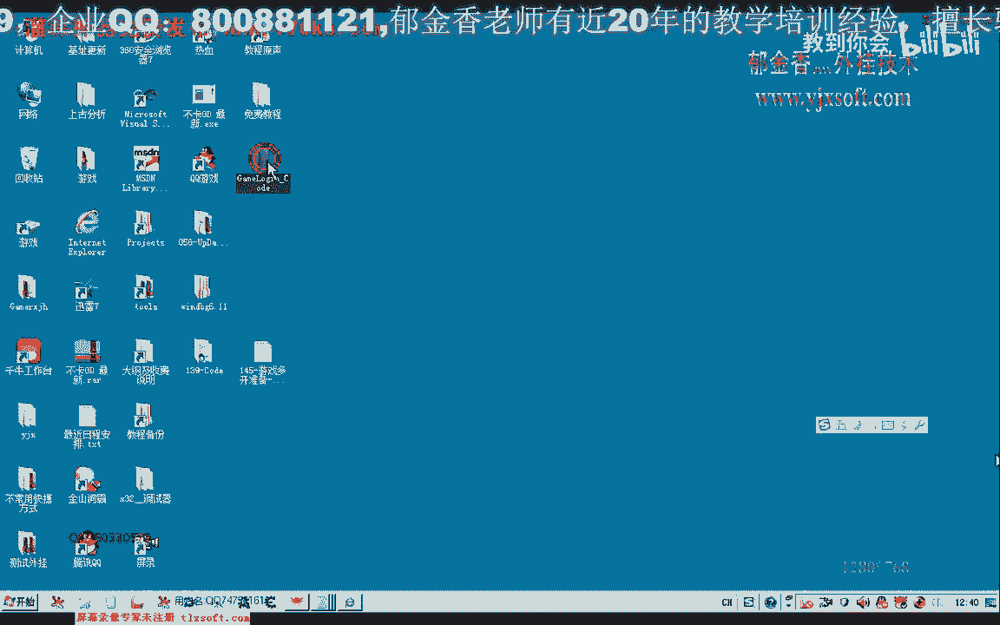
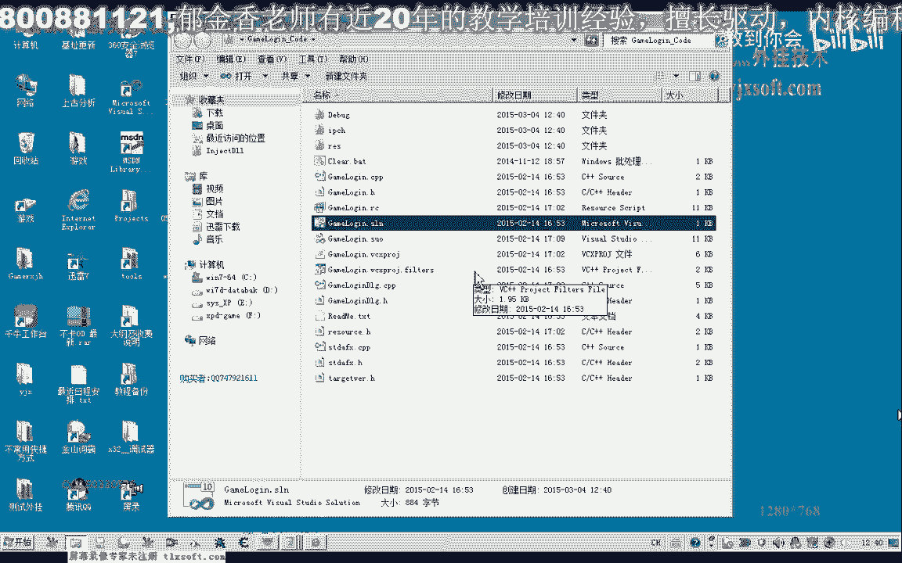
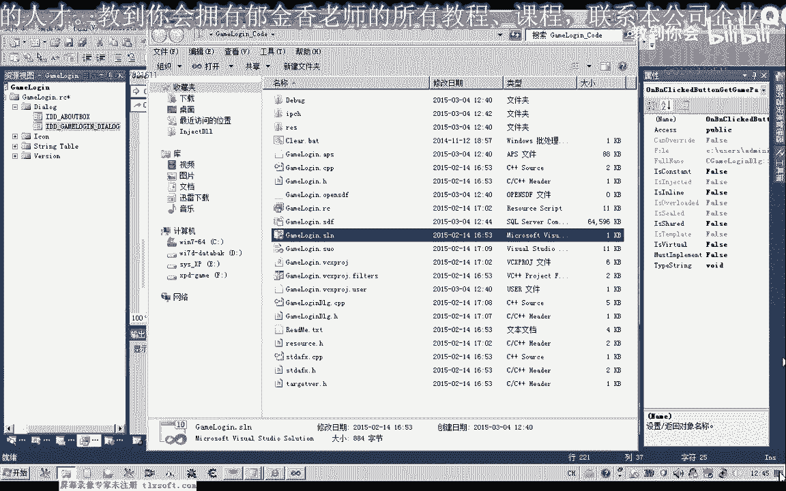
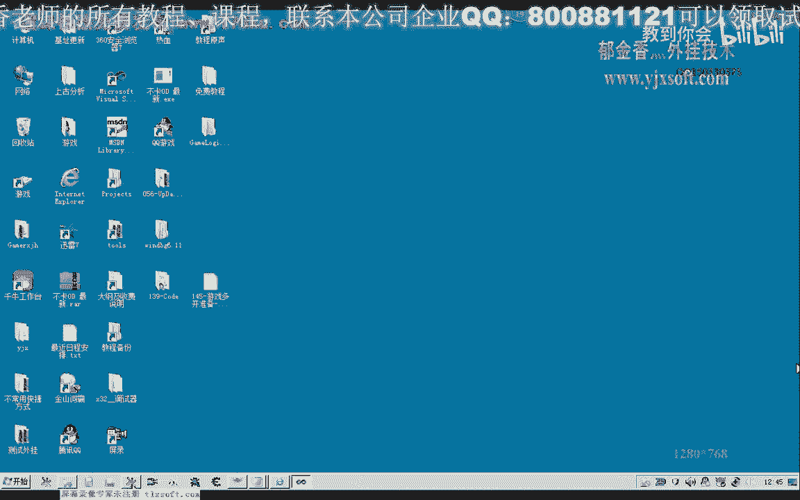
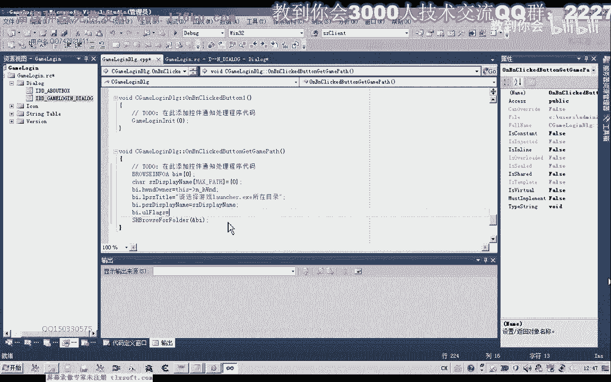
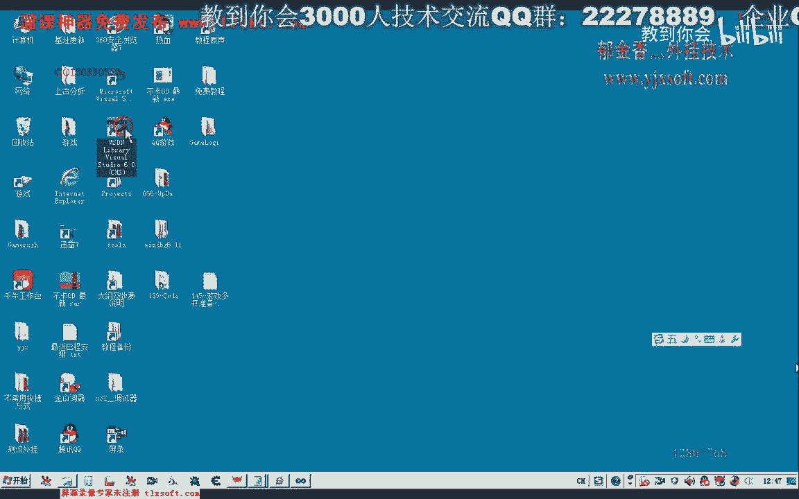
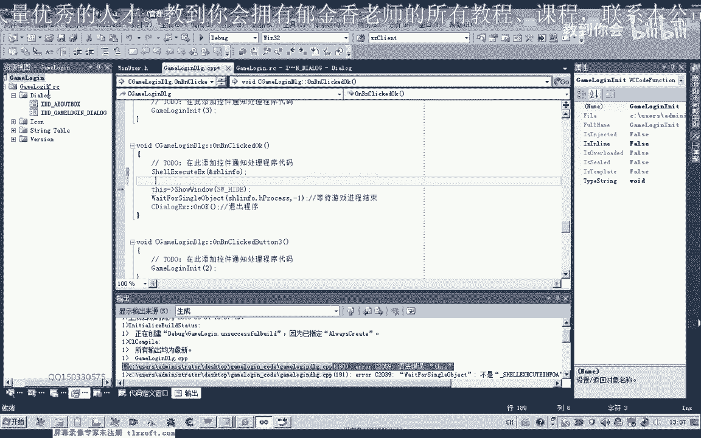

# 课程 P134：游戏多开准备 - 获取游戏路径 🎮



在本节课中，我们将学习如何通过编程方式获取游戏的安装目录路径。这是实现游戏多开功能的第一步，它比使用批处理文件更灵活、更精确。

## 概述

上一节我们介绍了使用批处理文件进行游戏多开的局限性，例如无法检测目录是否存在、无法进行文件版本对比等。本节中，我们来看看如何通过编写代码来获取游戏的准确路径，为后续的智能文件复制和目录检测打下基础。

## 核心概念与函数





为了实现路径选择功能，我们需要使用两个关键的 Windows API 函数：
1.  **`SHBrowseForFolder`**：显示一个浏览文件夹的对话框。
2.  **`SHGetPathFromIDList`**：将对话框返回的标识符列表转换为标准的文件系统路径。



## 实现步骤详解

以下是获取游戏路径的具体实现步骤。

### 1. 定义全局变量

首先，我们需要定义存储路径的全局变量，以替代之前代码中硬编码的路径，提高程序的通用性。





```cpp
// 定义全局变量
TCHAR g_szGamePath[MAX_PATH];      // 游戏主目录路径
TCHAR g_szClientPath[MAX_PATH];    // 客户端（如Client00）路径
```

### 2. 初始化浏览对话框结构





在按钮点击事件中，我们需要初始化 `BROWSEINFO` 结构体来配置文件夹浏览对话框。

```cpp
BROWSEINFO bi = {0};
bi.hwndOwner = m_hWnd; // 设置父窗口句柄，可为NULL
bi.lpszTitle = _T("请选择游戏启动器 (launch.exe) 所在的目录"); // 设置对话框标题
bi.ulFlags = BIF_RETURNONLYFSDIRS | BIF_EDITBOX | BIF_NEWDIALOGSTYLE; // 设置对话框标志
```

**标志说明**：
*   `BIF_RETURNONLYFSDIRS`：仅返回文件系统目录。
*   `BIF_EDITBOX`：对话框中包含一个编辑框，允许用户手动输入路径。
*   `BIF_NEWDIALOGSTYLE`：使用新样式的对话框，并显示文件和目录。

### 3. 显示对话框并获取路径

调用 `SHBrowseForFolder` 显示对话框，并使用 `SHGetPathFromIDList` 将用户的选择转换为路径。

```cpp
LPITEMIDLIST pidl = SHBrowseForFolder(&bi); // 显示对话框并获取项目标识列表
if (pidl != NULL) {
    // 将标识列表转换为路径字符串
    if (SHGetPathFromIDList(pidl, g_szGamePath)) {
        // 路径获取成功，g_szGamePath 中 now 存储了用户选择的路径
        OutputDebugString(g_szGamePath); // 输出调试信息
    }
    // 释放内存
    CoTaskMemFree(pidl);
}
```

### 4. 验证用户选择

为了确保用户选择的是正确的游戏目录（包含 `launch.exe`），我们可以利用 `BROWSEINFO` 的 `szDisplayName` 字段进行验证。该字段会存储用户在对话框中最后选中的项目名称。

```cpp
TCHAR szSelectedName[MAX_PATH];
bi.pszDisplayName = szSelectedName; // 指定缓冲区来接收选中的名称

// ... 显示对话框并获取路径后 ...

// 验证用户最后选中的是否是 launch.exe
if (_tcsicmp(szSelectedName, _T("launch.exe")) != 0) {
    MessageBox(_T("错误：请选择包含 launch.exe 的游戏目录！"));
    return; // 选择错误，退出
}
```

### 5. 构造客户端路径

获取到正确的游戏根目录（例如 `D:\Game\`）后，我们可以据此构造出客户端子目录的完整路径（例如 `D:\Game\Client00\`）。

```cpp
// 假设游戏根目录已存储在 g_szGamePath 中
_tcscpy_s(g_szClientPath, MAX_PATH, g_szGamePath); // 复制根路径
_tcscat_s(g_szClientPath, MAX_PATH, _T("Client00\\")); // 拼接客户端目录名
// 现在 g_szClientPath 为 D:\Game\Client00\
```

### 6. 路径的进一步处理

有时 `SHGetPathFromIDList` 返回的路径可能直接指向了 `launch.exe` 文件本身（如 `D:\Game\launch.exe`）。为了得到纯粹的目录路径，我们需要去除末尾的文件名。

```cpp
// 在路径字符串中查找 "launch.exe"
TCHAR* pFound = _tcsstr(g_szGamePath, _T("launch.exe"));
if (pFound != NULL) {
    *pFound = _T('\0'); // 在 "launch.exe" 起始处截断字符串
    // 现在 g_szGamePath 变为 D:\Game\
}
```

## 总结



本节课中我们一起学习了如何通过编程动态获取游戏路径。我们介绍了 `SHBrowseForFolder` 和 `SHGetPathFromIDList` 这两个核心 API 函数的使用方法，并实现了路径选择、验证和构造的完整流程。通过本课的内容，我们为游戏多开功能准备了准确的基础路径信息。下一节，我们将利用获取到的路径，实现智能的目录检测与文件复制逻辑。