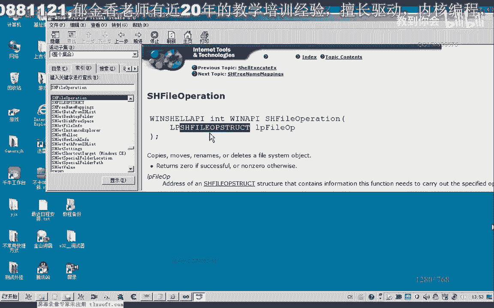
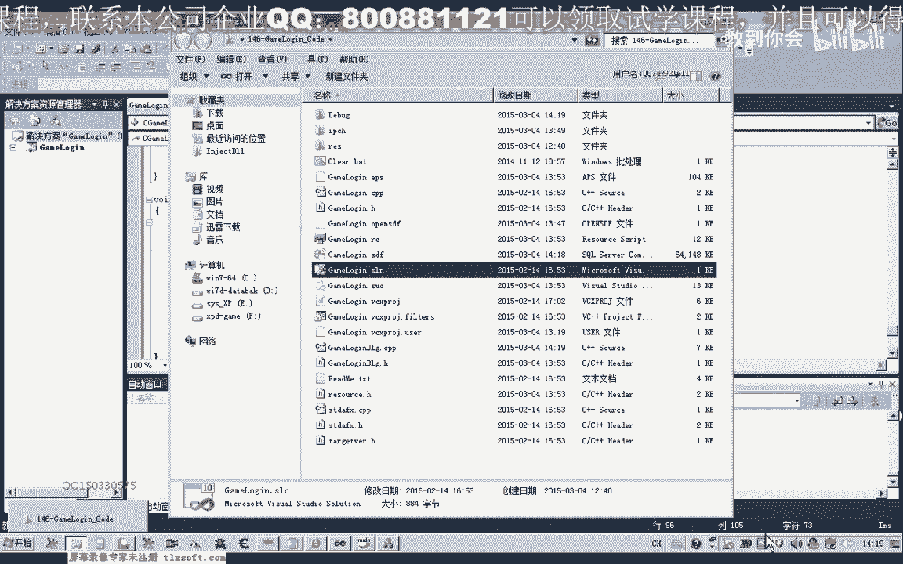
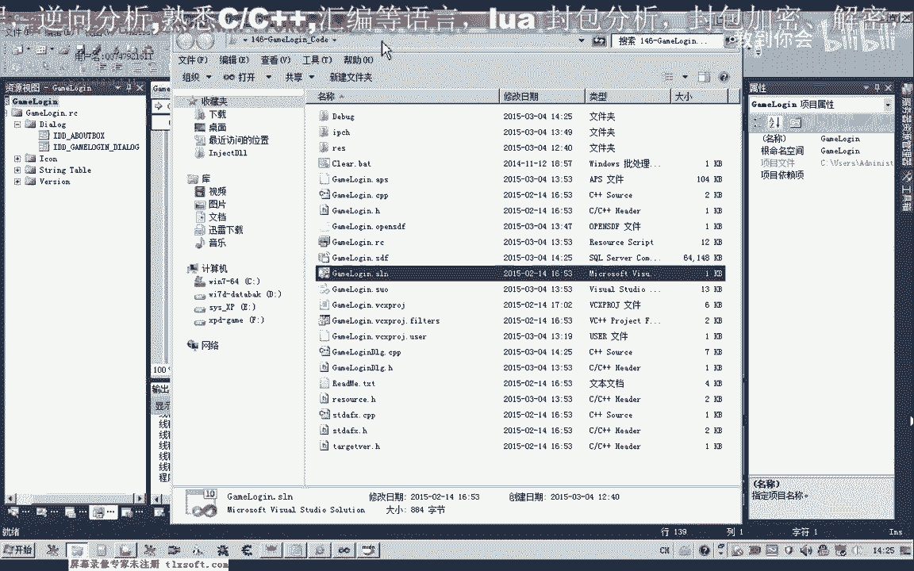

# P135：146-游戏多开准备-复制目录文件 - 教到你会 - BV1DS4y1n7qF

大家好，我是郁金香老师，那么由于这个游戏的多，看来需要复制这个游戏客户端的这个目录，那么所以说这节课呢我们自己来编写一个函数啊，嗯来复制，把我们游戏的这个客户端的这个目录呢啊。

复制到一个新的这个目录里面啊，以便我们在多开的时候会使用。

那么我们打开145克的代码，但。

那么实际上这个游戏的选区的话，这里呢我们已经不需要了啊，呃在这里的话我们呢还是最终呢通过创建一个新的进程，用游戏的这个登录器来来实现啊，实际上这些功能呢我们都都不需要了，嗯当然我们测试的时候呢。

我们可以在里边呢做一个相应的测试，那么这里呢我们直接选选就多开就可以了，嗯登录的时候呢，我们选择，u p c啊，然后呢或者是我们用一个列表框来表示它的一个多看，come on books。

这里呢我们就叫做启动游戏，哒哒哒哒哒，这个，然后我们相应的这个share in for，那么这个结构呢我们就在我们的这个combbox里边，它来进行一个相应的初始化，二，好当然这只是一个我们相应的设计。

那么在多开之前呢，我们需要做的准备呢，也就是要检测我们相应的这些目录呢，它有没有复制好，那么没有复制好的话，我们需要来一一的跟他进行一下复制，那么这里呢我们首先呢呃来编写，另外添加一个按钮。

用来做一个测试，呃检测航目录，嗯嗯嗯嗯嗯，那么在这之前呢，我们先自己来写一个相应的这个函数，第二，嗯，啊，那么这个函数呢它有两个参数，那么第一个参数呢这个是我们的呃，因为当时游戏的客户端啊，s t r。

啊这个相应的资源的这个路径，然后呢这个是我们目的地的啊，to di，然后我们需要来把这个路径里面的所有的文件以及子文件，将里面的文件呢全部来复制到我们的目标的这个目录里面去啊，这个函数的作用。

那么这样呢我们可以通过，可以通过一个api函数来实现，也就是一个文件的一个操作的这样的一个函数，那么最主要的呢是它的一个结构的一个参数，那么这个函数的调用呢很简单，我们只需要一个指令就可以了。

那我们先到msd里面看一下它的一个说明。

也可以到我们的论坛上查看相关的一些信息，那么来这里呢涉及到一个，s h file啊。

op struct这样的一个结构，那么我们在它之前呢，先定义这样的一个结构，那么这样的话理论上编译上我们编译呢我们就能够通过了，但是这个结构的话，我们还要给他做一些初始化，说实话我们可以用win设体。

那么也可以直接全部给它-0，那么当然这个结构里面呢，它还有我们的一些信息啊，这里呢也必须要有一个返回值，那么我们进到这个结构里面去看一下它的一些相关的信息，那么第一个呢也是指呃。

给他指定一个显示信息的一个呃这个所属的一个窗口啊，那么这个呢我们一般呢可以设置为空啊，表示我们的这个根目录啊，那么也就是说他在复制的时候呢，会显示一些进度条的这些信息。

那么呢我们可以来给他做一下相应的一个设置，那么最重要的两个设置了一个就是这个flow以及这个to啊，这两个相应的一个设置噗，然后他要考到复制到的一个目的地啊，我们需要给他做一个设置。

然后呢它有它的一个操作类型，那么我们在这里呢是要复制文件啊，所以说cfo cp，那么这个呢w f u n c了，这个我们需要进行一个设置，这个表示是复制的一个操作。

然后呢这里这个标志呢我们需要做一个设置，那么这里的标志的话，我们所需要的是要复制文件以及呃复制这个目录，那么所以说在这里呢我们需要做一下相应的选择，那么这个呢是好像是显示一个独立的一个，不显示名字啊。

这时候是显示了一个进度条的时候呢，不显示这个好像名字，那么这个人不是必须的，我们所需要的应该是，file固定，这里表示的只复制我们的文件啊，但是我们所需要的呢是要复制文件，还要复制这个目录。

那么在这里呢我们可以呢呃设置第一个标记就可以了啊，呃他允许了这个标记的是允许了呃，撤销啊，比如说我们呃当有同名文件的时候呢，他把它删除的时候呢，他不直接删除，好像是会把它放到这个回收站里面，好的。

那么我们只需要设置一个标记就可以了，默认的情况下呢，它会显示一个进度条，那么这个进进度条呢我们可以呢呃设置一些信息啊，他的这个标题啊，然后正在就是先切稍后，好的，那么我们先进行一下测试。

那么测试的时候呢，我们也需要呃存两个参数性能，那么传参数的时候呢，我们只需要传相应的这个目录就可以了，呃所以说在这里呢我们还要需要来做一点修改，嗯要给它加上一个参数。

表示把这个目录下的所有文件呢我们都复制过去，啊，那么这里呢我们需要来给他带一个通配服务，然后呢在这里呢我们就复制这个目录，那么这个检测的检测目录呢，我们就在下一节课呢再进行交流，那么在这里的话。

我们在这里啊，我们就复制相应的这个目录，在这里呢我们就调用之前的这个函数，然后呢是我们，这是我们的游戏目录，那么我们看一下还要做一些什么处理，跟pass应该是一个啊，跟clean pass。

那么目标的这个目录的一个路径的话，我们还需要呢来进行一下处理，那么目标的这个路径呢，我们需要随机地进行一个生成，啊，那么首先呢我们把这个游戏的游戏目录的这个地址呢把它复制过来，那么复制过来之后呢。

我们在后边呢给它添加了相应的这个字串，然后我们用用s p r i n t f把它进行一个格式化，哒哒哒哒，爱你爱到不对，那么格式化呢我们呃前面呢用零来给它对齐啊，补齐啊，只显示两个字节。

那么后面呢是我们的这个技术啊，在这里呢我们用mp amp表示，另外呢我们用一个静态的一个变量，那么每次呢我们呃这个格式化之后呢，让他自增一，当然这个也可以把它写在后边，那这样的话可能呢便于理解一些。

那么进行格式化之后呢，我们再把相应的这个字数来追加到后面，追加到我们的这个目标路径的后边，打开好的，那么追加到后面之后呢，我们把这一段信息呢呃目标路径显示出来，看一下，二，好那么我们再重新编译。

我们首先看一下我们生成的呃，这两个路径是否正确，twice嗯，然后呢，真好，好先运行测试一下，然后呢在这里呢我们检测一下目录，但是这里呢他没有打印出相应的这个调试信息，那么可能是没有执行到这个地方。

有可能啊，我们在它的头部再加一段调试信息，check，第，再重新生成一下，那么这一段的代码的话根本就没有被执行啊，那么这个时候的话我们看一下错误在什么地方。

那么首先我们看一下他空间世界里面的一个关联选项，应该是执行到这个目录里边来了，呃但是呢我没有看到任何的一个调试信息，再重新申请一下，嗯，那么这段代码的话没有被执行到啊，可能是他前面的一个关联。

那可能是没有关联的，好，我们你到前边来看一下，那相应的，but 1000，那么我们需要把之前的这个映射呢需要给它删掉，不然的话消息映射到另外一个这个地址里边去了哈，所以说它不会转到这里来执行好的。

我们再来看一下，嗯那么这个时候呢就正常了，正常之后呢，我们再对代码来做一下修改啊，这个提示信息呢就不要了，这一段我们也可以不要了，然后我们再重新编译生成一下，先设置一下有心步履，好那我选择正确之后呢。

我们再检测一下目录，那么这个时候呢我们可以看到提示信息，那么是复制这个目录下面的所有文件呃，到我们的傲视群雄林林里面啊，那么当然这里呢呃有一个字符对齐啊，是错的，因为我们在游戏里边的话。

它的一个路径点呢，这前面还有一段啊，cl i e n t，我们是把后面的nt两个字来替换成了零零啊，这样呢才是正确的啊，不然的话我们制服呢不能够对齐，那么不能够对齐的话。

可能呢它产生了这个入侵呢就不正确啊，当然我们理论上来说小于之前的这个容量的话，应该不会出错，但是不能够大于，大于之后的话，它可能影响到其他的数据，好的，那么我们再重新来测试一下。

那么这个时候呢生存的路径呢就是正确的了，而且第二次复制的时候呢，它就会简称另外一个例子呢，这里呢会产生一个路径的一个序列啊，当然这个检测的这个工作呢，我们现在还没有检测自己指定的这个目录是否存在。

那么我们先来测试一下复制啊，复试的这个函数，那么在复制之前呢，我们可以来把之前的这个目录可以删掉，或者是我们从这里呢，我们从零一啊，从一开始这个number的这个数值跳过零零的这个目录。

好然后我们再来检测，那么这个时候呢它会提示啊某一个步入了文件夹，不存在，该文件可能已经被移动或者是删除，是否要进行创建，那么四的话他肯定就会自动的创建啊，当然这个时候呢我们呃杀毒软件呢我们把它关一下啊。

这个时候呢它会显示一个进度条，然后呢复制过去啊，这是正常的情况啊，他会这样的做，然后呢第二个第三个他都会i9 i9 的进行一个复制，当然我们还有另外一种方法啊，我们可以来设置一些参数来进行一个控制。

那么比如说这个地方啊，呃flag这个地方呢我们可以了，让他没有任何的一个信息的一个提示，我们可以把这个标记了，加上它就不会有任何的一个提示啊，那么它会直接就会创建一个默认的一个目录。

那么也不会有这个进度条出现，那么在这里呢我们把它改为二层，从第二根目录开始进行测试，嗯那我们再来看一下呃，应该还有一些信息，这个是不显示，啊这个是建立目录的时候呢，不显示相应的信息，好像是要把呃这个。

啊要把这个标志加上，才是我们在检测目录的时候呢，呃忽略掉相应的检测，windo，忽略掉相应的一个信息，好的，那么我们这里呢再改一下，我们从第三根目录开始，那么这里呢已经建立了啊三个部落。

那么我们从零三这个时候开始，那么我们再来检测一下，那么这个时候呢它理论上就不会有任何的这个提示啊，还有这个进度啊，这个定进度呢我们也可以不显示啊，那么我们需要把这个标志啊加上啊。

然后呢我们把这个标志改为四，技术，这个杀毒软件我们可以退出，那么这个时候呢他不会有任何的提示信息，就不会有啊，零四，然后如果我们再点一下的话，它就是零五，那么这个时候呢他直接就复制过去了啊。

而不会有任何的提示信息，我们来看一下武器的步骤。

那么这个时候领土这个部落呢它也呃建立好了，而且它的大小的话应当符合我们的这个最新的客户端大小是一样的，那么如果我们再继续的话，它会来零六啊，会建立这样的一个目录，也会复制过去，那么再继续了就零七啊零八。

然后呢它就会建立相应的一个目录，当然我们要完善这个代码的话。

最好呢我们还要加上一个呃相应路径这个目录的一个检测，那么如果这个指定的文件它已经存在了呃，我们呢就不去呃进行相应的这样一个复制，如果这个文件不存在呢，我们再把相应的这个文件呢给他复制过去，好的。

那么我们接下来再加上一个文件检测的一个代码，那么这个呢我们有一个呃相应的一个函数可以用来检测啊，这个is啊，这个函数呢可以用来检测文件的一个属性，那么它的这个属性零呢表示检测文件呢是否存在。

那么这个参数如果为二的话，表示来检测这个文件呢是否可读，那么四呢检测它是否可以写，第五人表示检测这个文件是否可以读写，当然它的一个返回值啊，返回值如果它的返回值是-1的话。

就表示了文件不存在或者不具备他们指定的这个属性，那么我们可以通过这个这个函数来来进行一个检测，那么文件呢它不存在的时候呢，我们再来进行这个读取，那么只有它的返回值为-1的时候呢。

我们说的表示了这个文件不存在嗯，那么我们可以用游戏的这个ex e这个文件哈指定的呃，来表示了它是否存在，那么这里呢我们可以再建一个临时的一个变量，啊，那么建立好了之后呢，我们这里它有一个相应的一个路径。

那么我们先把这个路径呢啊录制过来，那么这个路径过来之后呢，我们再加上后面的这个文件名就可以了，然后呢再给他嗯追加一段这个字串进去，大，好吧，那么这个时候我们在访问他的时候啊，呃如果呢这个文件不存在。

那么我们再进行一个复制，当然要使用这个文件的话，我们也需要包含一个相应的头文件，好的，那么我们再次来看一下啊，把，那么我们把最后这个标志来去掉，那么这个时候来复制呢，它会显示出一个进度条。

那么第六个的时候，第九个的时候啊，这个时候呢呃因为呢相应的这个目录呢它不存在相应的文件呢，它没有检测到，所以说呢他才去啊进行了相应的这个复制，那么这个时候呢我们可以看到啊，可以看到。

好的，那么这节课呢我们就讲到这里，那么下一节课呢我们再进行呃多开的一个编写。

当然在这个时候呢，我们已经建立了这个相应的这个目录，那么如果这个目录它不存在的话，我们就给它建立，那么下一节课呢我们再接触这节课的内容，来继续的来探讨啊，接下来的代码的一个编辑，好的。

