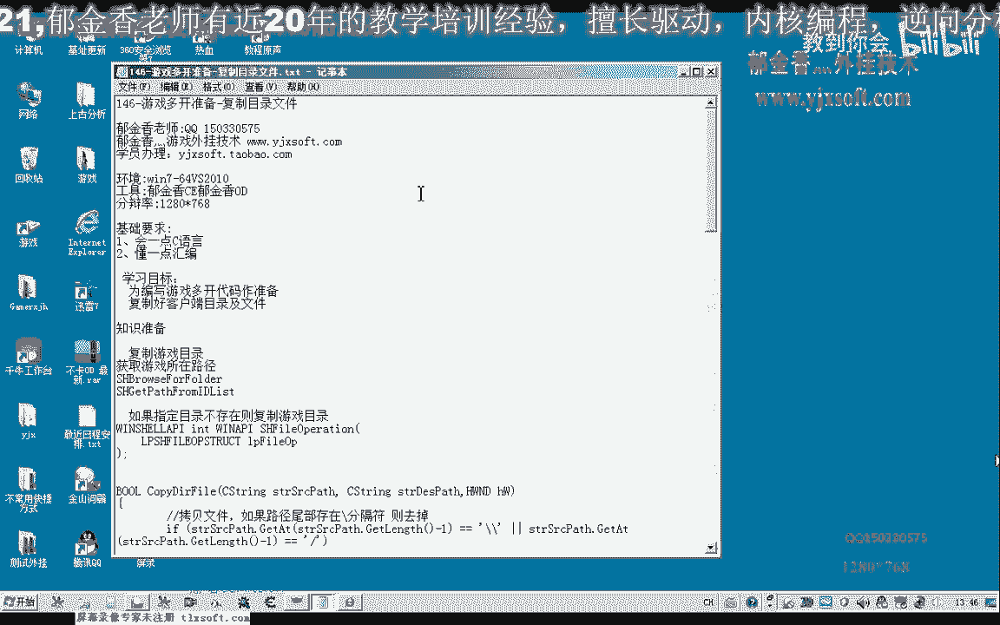
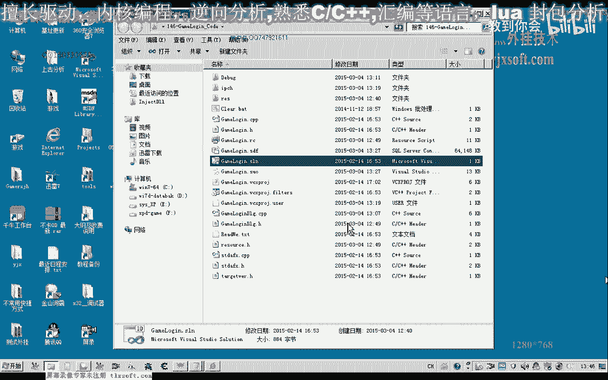

# 课程 P135：游戏多开准备 - 复制目录文件 📂➡️📂

在本节课中，我们将学习如何编写一个函数，用于复制游戏客户端的整个目录。这是实现游戏多开功能的重要准备工作，通过复制游戏文件到新的目录，可以为每个游戏实例提供独立的环境。

---


上一节我们介绍了多开的基本概念，本节中我们来看看如何具体实现目录的复制功能。

首先，我们需要在现有代码中添加一个新按钮，用于测试目录检测功能。在此之前，我们将编写一个核心的复制函数。

这个函数的主要作用是：将源目录中的所有文件及子文件夹，完整地复制到目标目录中。我们可以使用Windows API函数 `SHFileOperation` 来实现此功能。

以下是该函数的核心代码框架：

```c
// 定义 SHFILEOPSTRUCT 结构体
SHFILEOPSTRUCT fileOp = {0};
fileOp.hwnd = NULL; // 不显示进度窗口的父窗口句柄
fileOp.wFunc = FO_COPY; // 操作类型为复制
fileOp.pFrom = sourcePath; // 源路径
fileOp.pTo = destPath; // 目标路径
fileOp.fFlags = FOF_SILENT | FOF_NOCONFIRMATION | FOF_NOERRORUI; // 设置标志：静默、无需确认、不显示错误界面
// 执行复制操作
SHFileOperation(&fileOp);
```

在调用复制函数前，我们需要生成一个唯一的目标目录路径。通常，我们在原始游戏目录名后追加一个数字序列来实现。

以下是生成目标路径的示例代码：

```c
char destPath[MAX_PATH];
static int counter = 0; // 使用静态变量确保序号递增
sprintf(destPath, "%s%02d", originalGamePath, counter++);
```

为了确保不重复复制已存在的目录，在复制前我们需要检测目标目录是否已存在。

以下是检测文件是否存在的代码：


```c
#include <io.h> // 用于 _access 函数
// 构建需要检测的完整文件路径（例如游戏主程序）
char checkPath[MAX_PATH];
sprintf(checkPath, "%s\\GameClient.exe", destPath);
// 检测文件是否存在，返回-1表示不存在
if (_access(checkPath, 0) == -1) {
    // 文件不存在，执行复制操作
    CopyDirectory(sourcePath, destPath);
}
```

通过以上步骤，我们就能够检测并复制游戏目录，为后续的多开操作做好准备。

---


本节课中我们一起学习了如何编写目录复制函数、生成唯一目标路径以及检测目录是否存在。这些是构建游戏多开功能的基础步骤。下一节课，我们将在此基础上，继续编写多开功能的核心代码。