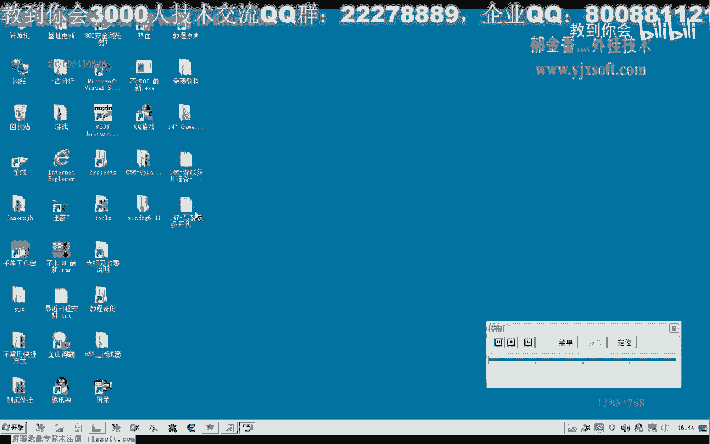

# 课程 P136：编写游戏多开代码 🎮



在本节课中，我们将学习如何编写代码来实现游戏多开。我们将从修改现有代码开始，逐步讲解如何使用特定函数创建并控制游戏进程，最终绕过游戏的多开检测机制。

---

## 修改启动代码

首先，打开第146课的代码。我们需要修改启动游戏的部分。因为目标是实现多开而非简单的登录器，所以需要注释掉直接启动客户端的两行代码。

```cpp
// 注释掉原有的直接启动客户端代码
// StartGameClient();
// Login();
```

启动游戏客户端的工作应由登录器完成，而非我们的代码直接调用。因此，我们需要先打开游戏的登录器。

---

## 使用 CreateProcess 创建登录器进程

上一节我们介绍了需要修改启动方式，本节中我们来看看如何使用 `CreateProcess` 函数来创建并控制登录器进程。

`CreateProcess` 函数有几个必要的参数：
*   **命令行**：指定要运行的程序。
*   **当前目录**：进程的当前目录。
*   **启动信息**：用于控制窗口显示等。
*   **进程信息**：用于接收新进程的信息。
*   **创建标志**：这是关键参数，我们需要将其设置为 `CREATE_SUSPENDED`（挂起状态）。

创建标志是关键。如果不设置挂起标志，进程一旦创建就会立即执行游戏的多开检测代码，导致多开失败。我们必须先以挂起状态创建进程，修改其内存中的数据后，再恢复进程执行。

以下是调用 `CreateProcess` 的基本步骤：

1.  准备必要的参数和结构体。
2.  构建登录器的完整路径。
3.  设置创建标志为 `CREATE_SUSPENDED`。
4.  调用 `CreateProcess` 函数。
5.  使用 `ResumeThread` 恢复挂起的进程。

```cpp
STARTUPINFO si = {sizeof(si)};
PROCESS_INFORMATION pi = {0};
DWORD dwCreationFlags = CREATE_SUSPENDED;

// 构建登录器路径，例如：game_path + "\\Launcher.exe"
TCHAR szLauncherPath[MAX_PATH];
_stprintf(szLauncherPath, _T("%s\\Launcher.exe"), szGamePath);

BOOL bSuccess = CreateProcess(
    NULL,                   // 应用程序名（使用命令行参数）
    szLauncherPath,         // 命令行
    NULL,                   // 进程安全属性
    NULL,                   // 线程安全属性
    FALSE,                  // 句柄继承选项
    dwCreationFlags,        // 创建标志（关键：挂起）
    NULL,                   // 环境变量
    szGamePath,             // 当前目录
    &si,                    // 启动信息
    &pi                     // 进程信息
);

if (bSuccess) {
    // 进程创建成功，处于挂起状态
    // 此处可以修改进程内存...
    ResumeThread(pi.hThread); // 恢复线程执行
    CloseHandle(pi.hThread);
    CloseHandle(pi.hProcess);
}
```

---

## 绕过登录器多开检测

成功创建挂起的登录器进程后，下一步是修改其内存数据，以绕过第一层多开检测。

登录器内部通常有一个标志位或特定数据用于检测是否已有一个实例在运行。我们需要找到这个数据的地址，并在进程运行前将其修改。

1.  使用工具（如CE）找到检测数据的地址。
2.  在代码中，使用 `WriteProcessMemory` 函数向该地址写入新数据。

```cpp
// 假设检测标志的地址是 0x449714
DWORD dwDetectFlagAddr = 0x449714;
BYTE bNewData = 0x00; // 修改为允许多开的值
SIZE_T bytesWritten = 0;

// 修改内存属性为可写
DWORD dwOldProtect = 0;
VirtualProtectEx(pi.hProcess, (LPVOID)dwDetectFlagAddr, 1, PAGE_EXECUTE_READWRITE, &dwOldProtect);

// 写入数据
BOOL bWriteOK = WriteProcessMemory(
    pi.hProcess,            // 目标进程句柄
    (LPVOID)dwDetectFlagAddr, // 要写入的地址
    &bNewData,              // 指向数据的缓冲区
    sizeof(bNewData),       // 要写入的字节数
    &bytesWritten           // 实际写入的字节数
);


// 恢复内存属性
VirtualProtectEx(pi.hProcess, (LPVOID)dwDetectFlagAddr, 1, dwOldProtect, &dwOldProtect);

if (bWriteOK && bytesWritten > 0) {
    // 写入成功，可以恢复进程
    ResumeThread(pi.hThread);
}
```


---

## 绕过客户端多开检测

上一节我们绕过了登录器的检测，本节中我们来看看如何绕过游戏客户端本身的检测。

客户端启动时，可能会检查特定的路径或文件。我们需要修改登录器内存中存储的客户端路径，使每个实例使用不同的路径启动。

1.  找到登录器中存储客户端路径的字符串地址。
2.  生成一个格式化的新路径字符串（例如，在路径末尾追加数字编号 `00`, `01` 等）。
3.  将新路径字符串写入目标进程的内存。

以下是生成和写入新路径的示例：

```cpp
// 假设路径字符串的起始写入地址是 0x449714 + 0x09
DWORD dwPathAddr = 0x44971D;
TCHAR szNewPath[MAX_PATH];
int iIndex = 0; // 可以从列表框等控件获取

// 生成新路径，例如 "X:\\Game\\Client\\game_00.exe"
_stprintf(szNewPath, _T("X:\\Game\\Client\\game_%02d.exe"), iIndex);

// 计算字符串长度（包含结束符）
SIZE_T pathLen = (_tcslen(szNewPath) + 1) * sizeof(TCHAR);


// 修改内存属性并写入
DWORD dwOldProtect = 0;
VirtualProtectEx(pi.hProcess, (LPVOID)dwPathAddr, pathLen, PAGE_EXECUTE_READWRITE, &dwOldProtect);


BOOL bWriteOK = WriteProcessMemory(
    pi.hProcess,
    (LPVOID)dwPathAddr,
    szNewPath,
    pathLen,
    &bytesWritten
);

VirtualProtectEx(pi.hProcess, (LPVOID)dwPathAddr, pathLen, dwOldProtect, &dwOldProtect);
```


---


## 完善与自动化

为了使多开工具更易用，我们可以添加一些自动化功能：

以下是可选的完善步骤：
*   **自动递增索引**：每次成功启动一个客户端后，自动将路径索引加1，以便下次启动时使用新路径。
*   **默认选择**：在列表框中默认选中第一个可用的索引。
*   **错误处理**：检查 `WriteProcessMemory` 等函数的返回值，并使用 `GetLastError` 获取详细错误信息以便调试。


```cpp
// 示例：启动成功后递增索引
if (bSuccess && bWriteOK) {
    // 更新界面或变量，为下次启动做准备
    m_iCurrentIndex++; // 假设 m_iCurrentIndex 是当前路径索引
    UpdateData(FALSE); // 更新控件显示
}
```

---

## 总结 🎯

本节课中我们一起学习了编写游戏多开代码的核心步骤。

我们首先修改了代码，将直接启动改为通过 `CreateProcess` 创建进程。关键在于使用 `CREATE_SUSPENDED` 标志挂起新进程。接着，我们分两步绕过检测：先修改登录器内存中的检测标志，再修改其内部存储的客户端路径字符串。最后，我们探讨了如何通过自动递增索引等方法来完善工具。


通过结合挂起进程、修改内存和恢复执行这一流程，我们能够有效地绕过游戏的多开限制，实现真正的多开功能。