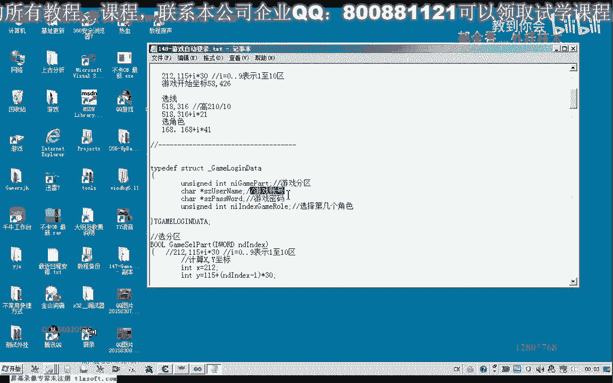
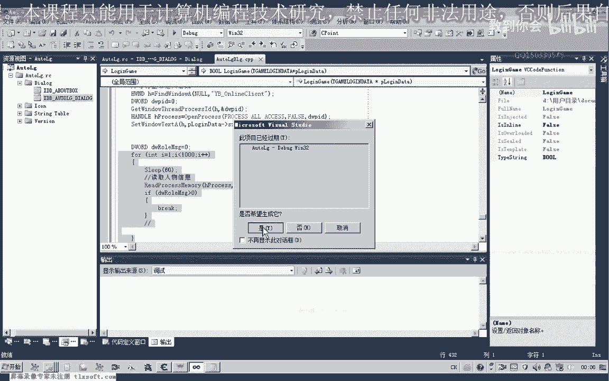
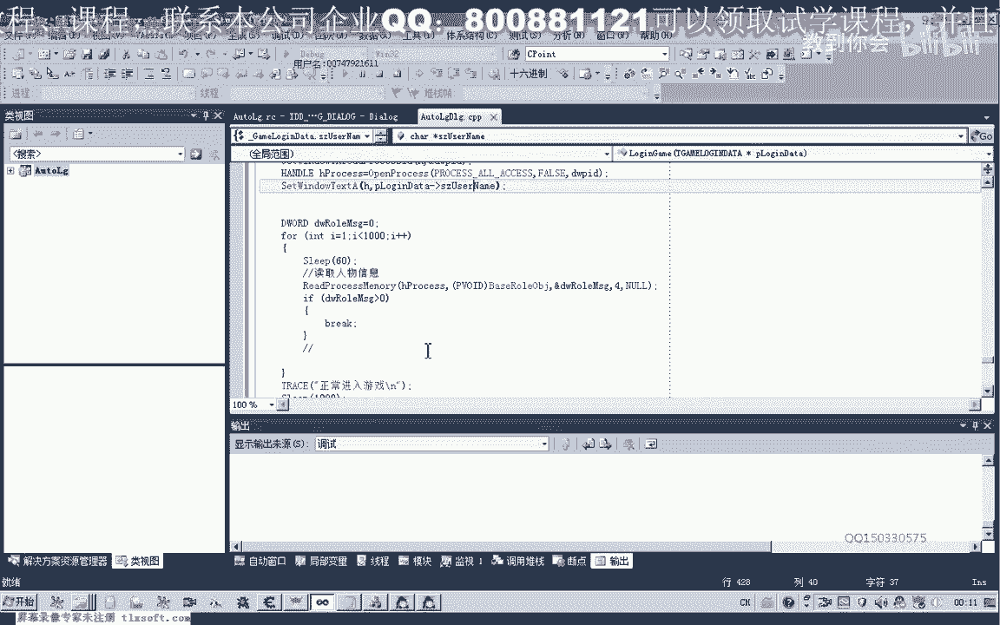

# 课程 P137：游戏自动登录原理 🎮

在本节课中，我们将学习游戏自动登录的基本原理与设计思路。我们将以一款游戏为例，讲解如何通过模拟鼠标和键盘操作，结合进程控制，实现从启动登录器到进入游戏世界的全自动化流程。

## 概述

游戏自动登录的核心是通过程序模拟用户操作。这通常涉及启动游戏客户端、选择服务器、输入账号密码以及处理游戏内的角色选择等步骤。我们将使用代码来模拟这些点击和输入行为，并讨论如何优化等待时间以提高效率。

## 自动登录的设计流程



上一节我们概述了自动登录的概念，本节中我们来看看具体的实现步骤。整个过程可以分解为几个关键阶段。

以下是实现自动登录的主要步骤：

1.  **启动并处理游戏登录器**：首先需要启动游戏登录器进程，并进行必要的处理以支持多开。
2.  **模拟选区操作**：通过鼠标模拟点击，选择目标游戏服务器。
3.  **启动游戏客户端**：点击“开始游戏”按钮，等待游戏主窗口启动。
4.  **自动输入账号密码**：在游戏登录界面，通过键盘模拟输入账号和密码。
5.  **处理角色选择**：自动选择游戏角色并进入游戏世界。
6.  **优化与判断**：引入循环判断逻辑，以缩短不必要的固定等待时间，提高登录效率。

## 关键技术点详解

### 1. 多开与进程控制

为了实现多开，我们需要对游戏登录器进程进行特殊处理。这包括创建进程、挂起线程、修改内存数据以绕过检测，以及恢复线程运行。

相关代码可能涉及 Windows API 调用，例如：
```c
// 伪代码示例：创建并挂起进程
CreateProcess(..., CREATE_SUSPENDED, ...);
// 修改特定内存地址的数据
WriteProcessMemory(..., 0x1B, ...);
// 恢复线程运行
ResumeThread(...);
```

### 2. 鼠标与键盘模拟

自动登录的绝大部分操作依赖于对鼠标和键盘的精确模拟。我们需要获取目标按钮（如服务器选项、开始按钮、输入框）的屏幕坐标，然后发送鼠标点击或移动事件。

同样，输入账号密码需要模拟键盘按键序列：
```c
// 伪代码示例：模拟键盘输入
keybd_event(VK_TAB, 0, 0, 0); // 按下Tab键切换焦点
keybd_event(VK_TAB, 0, KEYEVENTF_KEYUP, 0); // 松开Tab键
// 模拟输入字符串
SendInput(...);
```

### 3. 等待与判断逻辑

简单的固定时长等待（如 `Sleep(2000)`）效率低下。更优的做法是主动判断游戏状态。例如，在点击“开始游戏”后，循环检测游戏主窗口是否出现；在选择角色后，循环尝试读取游戏内存中的人物信息，一旦读取成功即代表登录完成。



```c
// 伪代码示例：循环判断登录是否完成
for(int i = 0; i < 600; i++) { // 尝试约1分钟（600*100ms）
    if (ReadPlayerInfo() == SUCCESS) {
        break; // 登录成功，退出循环
    }
    Sleep(100); // 等待100毫秒再次尝试
}
```

### 4. 数据管理与批量处理

为了支持批量登录多个账号，我们需要将账号信息（如分区、账号、密码、角色）结构化存储。可以将这些信息保存在配置文件或数据库中，程序运行时依次读取并执行登录流程。

```c
// 伪代码示例：定义账号信息结构体
struct AccountInfo {
    char server[50];
    char username[50];
    char password[50];
    char character[50];
};
```

## 总结

本节课我们一起学习了游戏自动登录的基本原理和实现框架。我们了解到，自动登录的核心在于**模拟用户操作**和**智能状态判断**。通过结合进程控制、鼠标键盘模拟以及高效的循环检测逻辑，我们可以构建一个稳定、高效的自动登录系统，为后续的自动化游戏行为（如自动挂机、自动任务）打下基础。



在下一节课中，我们将深入细节，逐步分析如何提取游戏界面数据、精确设计模拟操作的函数，并进一步完善整个自动化流程。