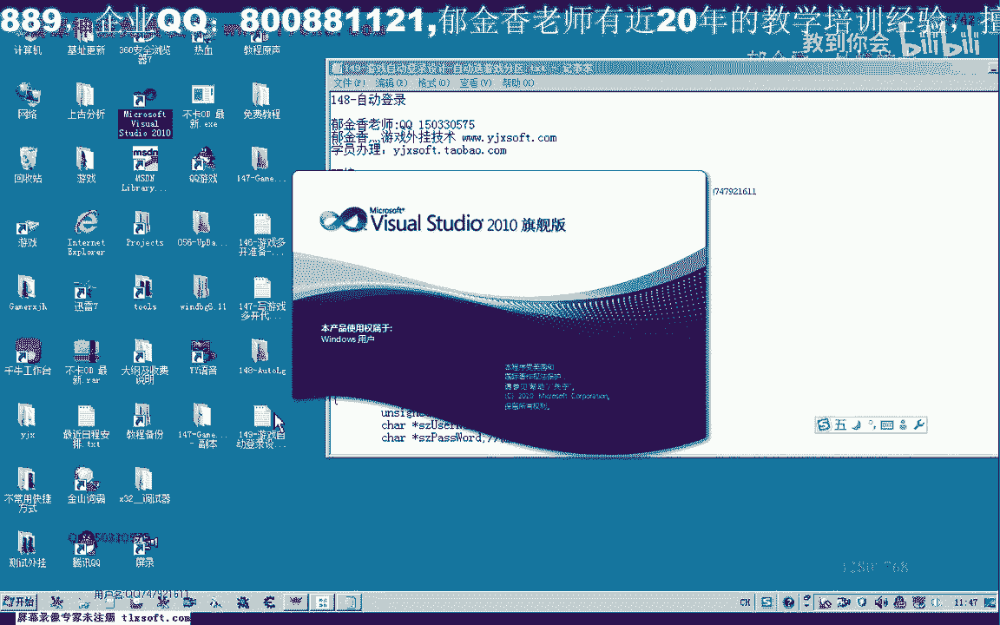

# 课程 P138：游戏自动登录设计 - 自动选游戏分区 🎮

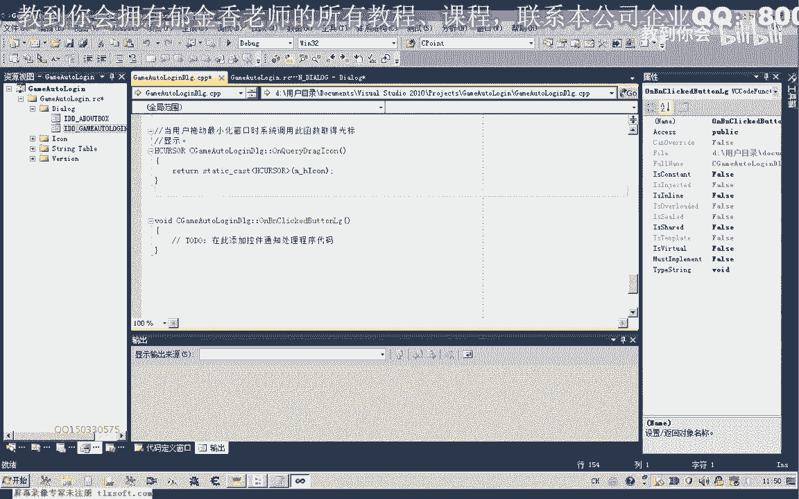

在本节课中，我们将学习如何编写自动登录功能中的游戏分区选择模块。我们将通过模拟鼠标操作，实现自动点击指定游戏分区的功能，为后续的账号密码自动输入打下基础。

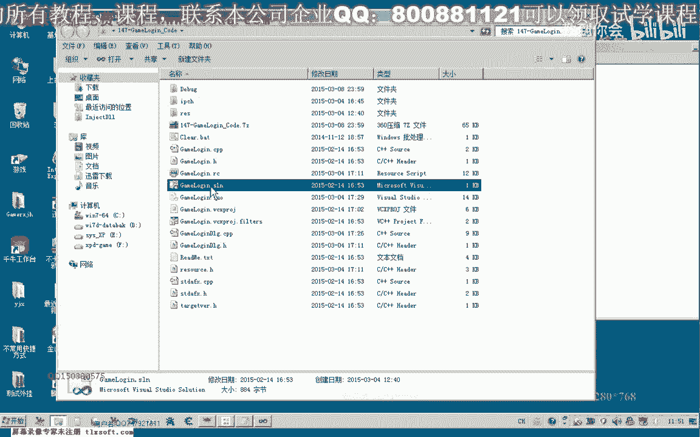

---

## 工程搭建与代码移植

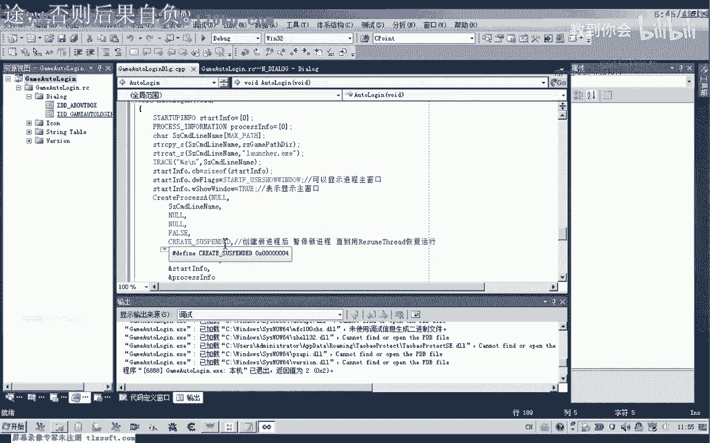

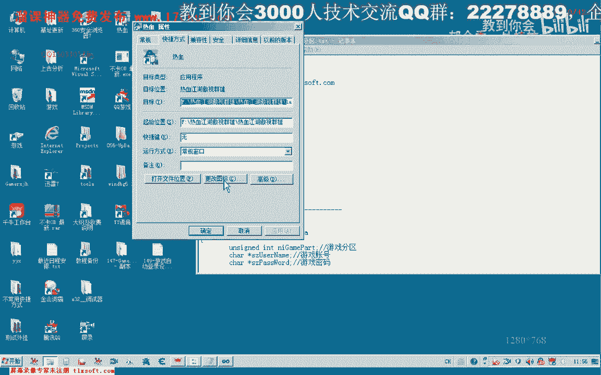

首先，我们需要在 Visual Studio 2010 中新建一个名为“自动登录”的工程。为了方便代码的移植和复用，我们将把所有与自动登录相关的功能封装成独立的函数。

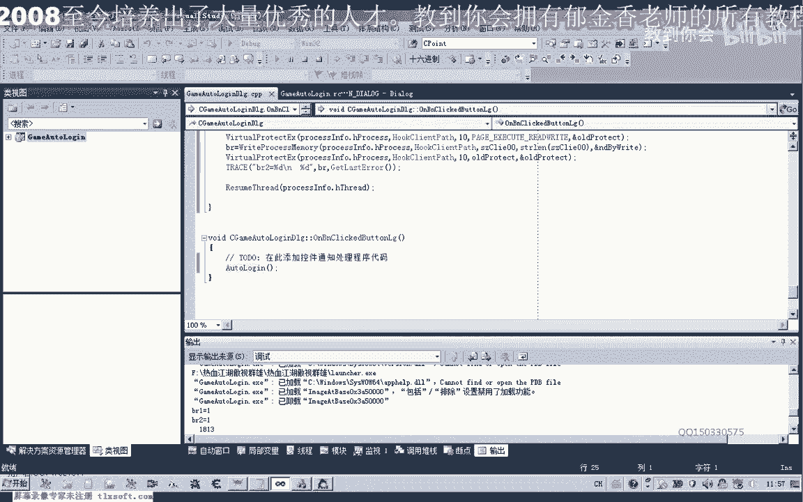

上一节我们介绍了工程搭建，本节中我们来看看如何移植已有的多开功能代码。

我们将从第147课的代码中，移植与游戏多开相关的部分。以下是移植的核心步骤：

1.  复制游戏多开相关的代码段到新工程。
2.  处理编译时出现的变量未定义错误，将相关参数修改为静态变量。
3.  在按钮事件中关联并调用相应的函数，确保客户端能够正常启动。

完成以上步骤并编译通过后，我们可以测试客户端是否能被正常打开。如果路径设置有问题，需要检查并修正。

---

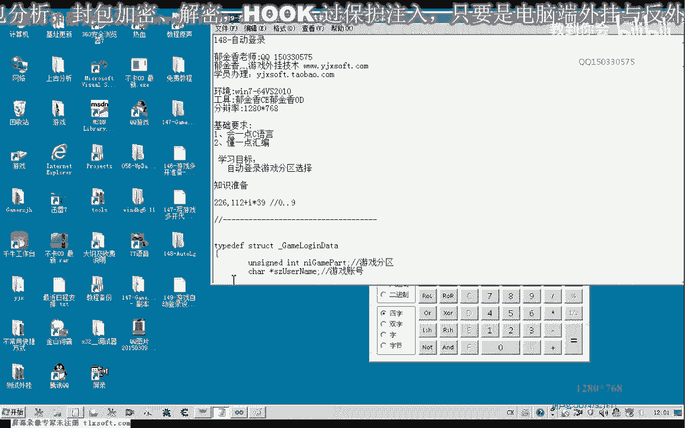

## 获取分区坐标位置

客户端成功打开后，下一步是编写代码来自动选择游戏分区。当前登录界面显示有十个分区，我们需要获取每个分区可供鼠标点击的屏幕坐标。

上一节我们确保了客户端能启动，本节中我们来看看如何定位分区按钮的坐标。

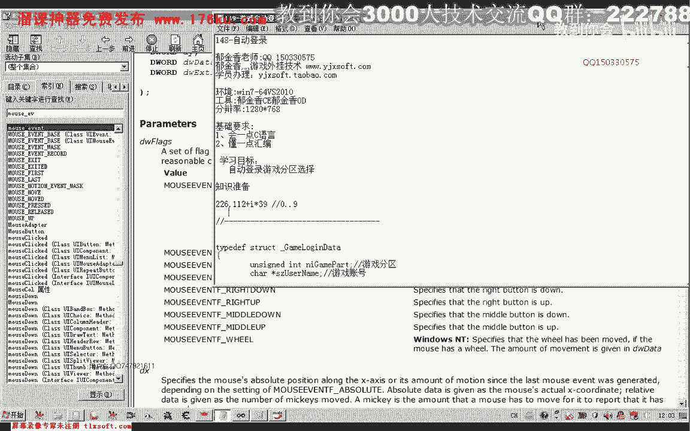

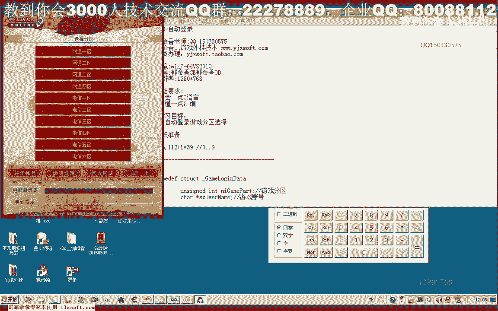

获取坐标有多种方法。一种相对简单的方法是使用系统自带的画图工具。将登录界面截图保存后，用画图工具打开，将鼠标悬停在目标分区（如“网通一区”）上，工具左下角会显示当前光标位置的坐标。

以下是获取坐标的步骤：

1.  截图并保存登录界面。
2.  用画图工具打开图片，将鼠标移动到“网通一区”按钮上，记录坐标（例如：`(226, 112)`）。
3.  观察第一个分区和最后一个分区的Y坐标，计算差值。例如，第一个分区Y坐标约为100，最后一个约为400，差值约为300像素。
4.  由于有十个分区，可估算出每个分区之间的垂直间距约为 **`300 / 10 = 30`** 像素。

因此，第 `i` 个分区（`i` 从0开始）的Y坐标计算公式可以近似为：
**`y = 112 + i * 30`**
其中，`(226, 112)` 是第一个分区（`i=0`）的基准坐标。

---

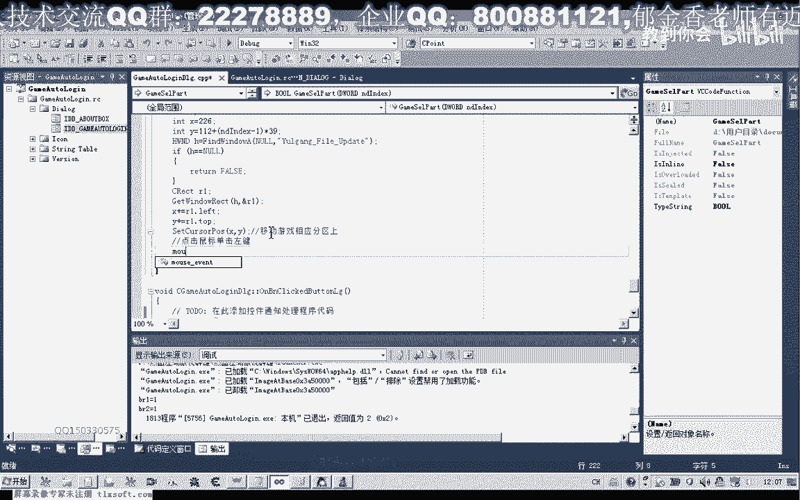

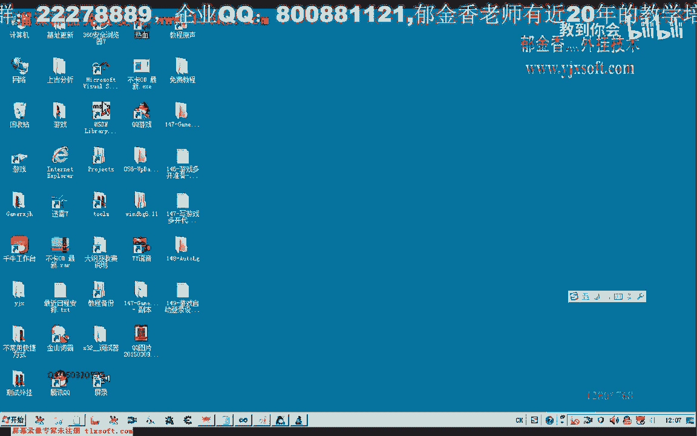

## 编写分区选择函数

获取坐标计算方法后，我们可以开始编写自动选择分区的函数。这个函数的核心是模拟鼠标移动和点击。

上一节我们分析了坐标的计算方法，本节中我们来看看如何用代码实现鼠标模拟操作。

我们将创建一个函数 `SelectGameZone`，它接收一个分区索引参数（例如1到10）。函数内部主要用到两个Windows API：
*   `SetCursorPos`：设置鼠标位置。
*   `mouse_event`：模拟鼠标按下 (`MOUSEEVENTF_LEFTDOWN`) 和弹起 (`MOUSEEVENTF_LEFTUP`) 事件。

需要注意的是，我们之前获取的坐标 `(226, 112)` 是相对于登录器窗口左上角的。而 `SetCursorPos` 设置的坐标是相对于整个屏幕的。因此，我们需要进行坐标转换。

以下是函数实现的关键逻辑：

1.  **获取窗口位置**：首先使用 `FindWindow` 找到登录器窗口句柄，再用 `GetWindowRect` 获取该窗口在屏幕上的矩形区域（包含 `left`, `top`, `right`, `bottom` 信息）。
2.  **计算绝对坐标**：将窗口相对坐标转换为屏幕绝对坐标。公式为：
    **`screen_x = window_rect.left + 226`**
    **`screen_y = window_rect.top + 112 + (zone_index - 1) * 30`**
    （假设 `zone_index` 从1开始，代表第几个分区）
3.  **移动并点击鼠标**：调用 `SetCursorPos` 将鼠标移动到计算出的绝对坐标，然后调用两次 `mouse_event` 分别模拟鼠标左键按下和弹起动作。
4.  **优化用户体验（可选）**：为了不让鼠标指针在屏幕上 visibly 跳动，可以在移动前用 `GetCursorPos` 保存原始位置，完成点击操作后再用 `SetCursorPos` 移回原位。

编写完成后，可以创建一个测试按钮，调用 `SelectGameZone(1)` 来测试是否能正确选中“网通一区”。

---

## 整合与流程控制

分区选择函数测试成功后，需要将其整合到自动登录的主流程中，并确保执行时机正确。

上一节我们完成了核心的分区选择函数，本节中我们来看看如何将它融入完整的登录流程。

自动登录的完整流程需要更严谨的等待和判断机制，不能简单地使用固定的 `Sleep` 延时。以下是整合时需要注意的要点：

1.  **等待登录器就绪**：在启动客户端后，不能立即选择分区。应使用一个循环，不断检测登录器窗口是否创建并完全加载。可以使用 `FindWindow` 结合短暂的 `Sleep` 进行轮询，直到窗口句柄有效为止。
2.  **前置登录窗口**：在模拟点击前，最好使用 `SetForegroundWindow` 将登录器窗口设置为前台，确保点击操作能正确送达。
3.  **等待“开始游戏”按钮**：选择分区后，登录界面会发生变化，出现“开始游戏”按钮。在点击该按钮前，同样需要等待其就绪。我们可以记录“开始游戏”按钮的坐标（例如 `(664, 428)`），在分区选择后，等待一段时间，再将鼠标移动到此坐标并点击。
4.  **坐标校准**：在实际测试中，如果发现点击位置有偏差，需要重新校准基准坐标 `(226, 112)` 和分区间距 `30` 这两个参数。

将以上逻辑串联起来，就形成了一个从启动客户端 -> 等待窗口 -> 选择分区 -> 点击开始游戏的初步自动化流程。

---

## 总结与下节预告

本节课中我们一起学习了游戏自动登录设计中“自动选择游戏分区”模块的实现。

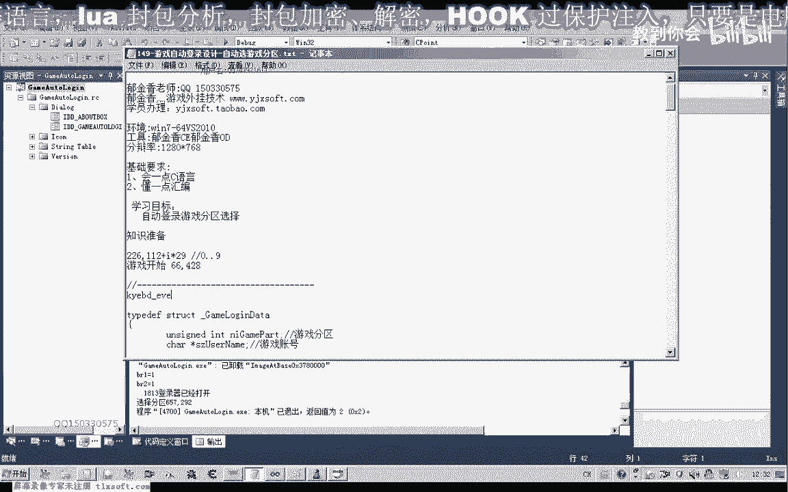

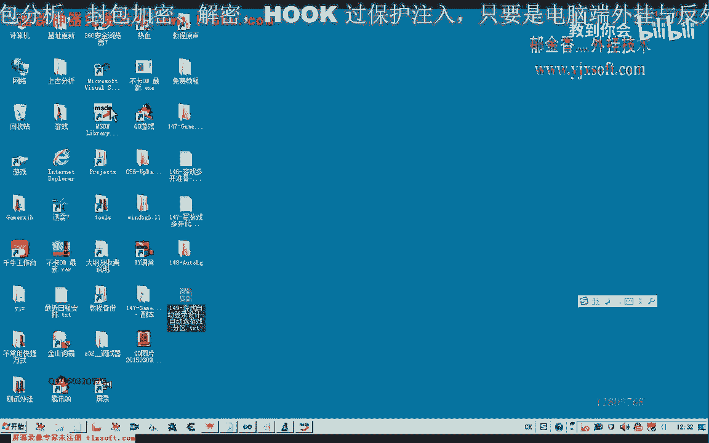

我们首先移植了基础工程，然后学习了如何获取和计算游戏分区的屏幕坐标。接着，我们利用 `SetCursorPos` 和 `mouse_event` 这两个Windows API编写了分区选择函数，实现了鼠标的模拟移动与点击。最后，我们讨论了如何将这一功能整合到完整的流程中，并加入了必要的等待和窗口控制逻辑，使自动化脚本更加健壮。

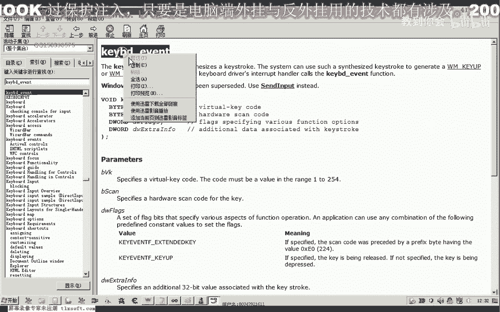

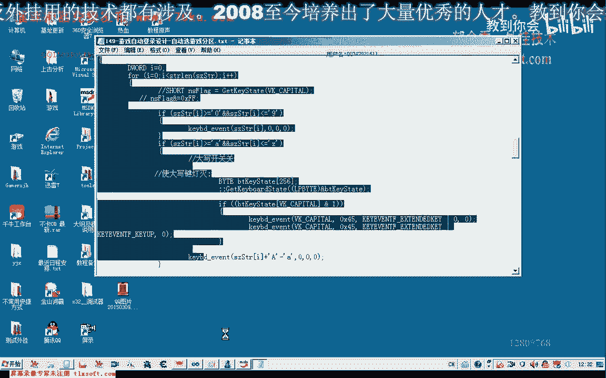

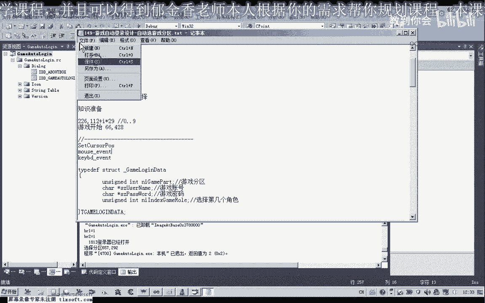

目前，我们已经能够自动启动游戏并选择分区。下一节课，我们将完成自动登录的最后一步：**模拟键盘输入，实现账号和密码的自动填写**。这将主要用到 `keybd_event` 这个用于模拟键盘操作的API函数。