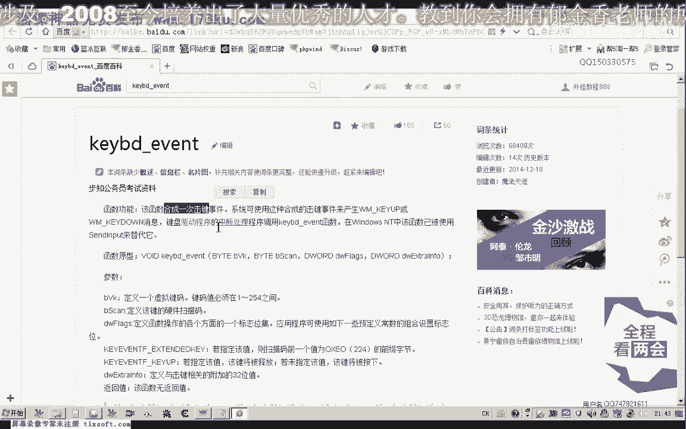
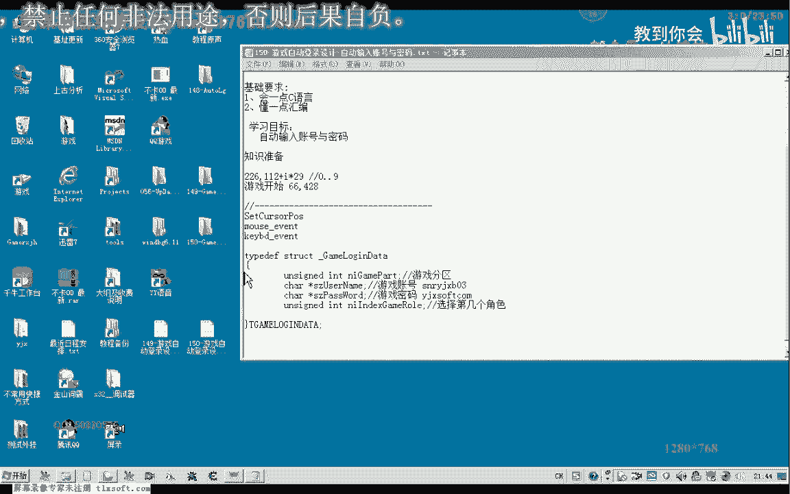
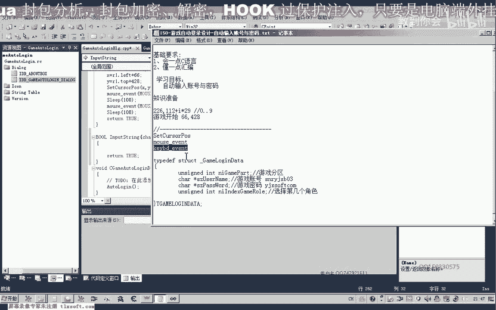
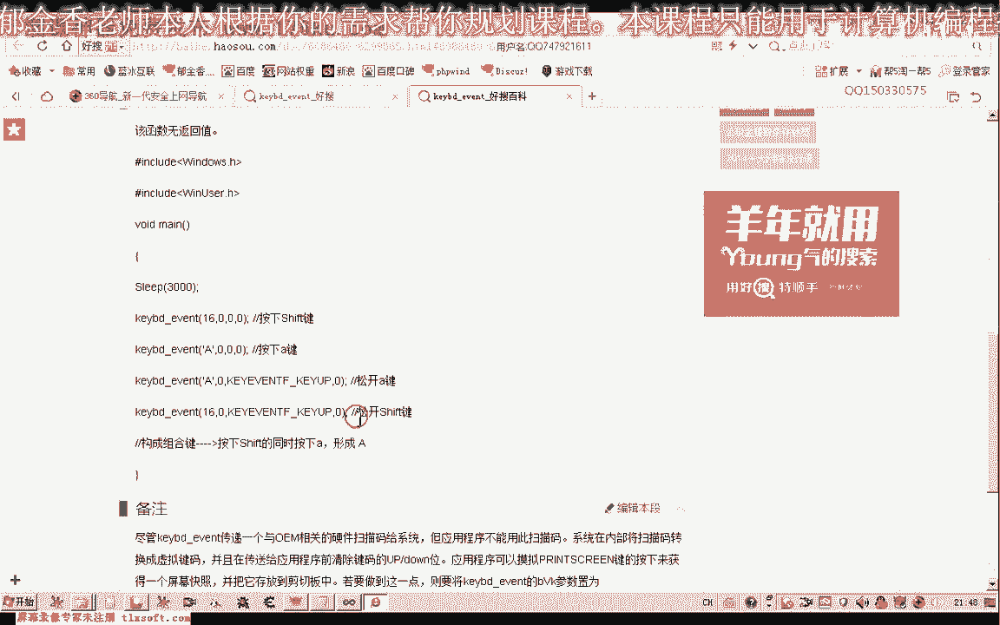
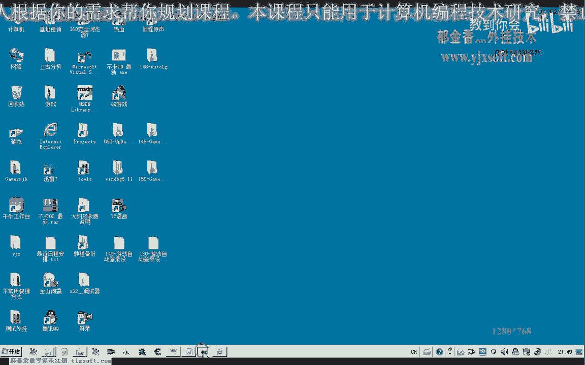

# 课程 P139：游戏自动登录设计 - 自动输入账号与密码 🔑

在本节课中，我们将学习如何为游戏设计自动登录功能，核心是实现账号与密码的自动输入。我们将使用键盘模拟技术，而非直接读写游戏内存，因为后者通常涉及加密数据且通用性不强。本节课的重点是掌握如何使用 `keybd_event` 函数来模拟键盘输入。


## 概述与原理



上一节我们介绍了自动登录的整体框架。本节中，我们来看看如何具体实现账号密码的输入。

自动输入账号密码通常不通过直接读写游戏内存（例如使用CE工具）实现，因为密码等数据通常是加密的，直接查找困难且方法通用性差。因此，更通用的方法是模拟键盘操作。



我们将使用Windows API中的 `keybd_event` 函数来模拟按键。这个函数可以合成一次键盘事件（包括按下和释放）。


```c
VOID keybd_event(
  BYTE      bVk,        // 虚拟键码
  BYTE      bScan,      // 硬件扫描码（通常为0）
  DWORD     dwFlags,    // 操作标志，如 KEYEVENTF_KEYUP 表示释放
  ULONG_PTR dwExtraInfo // 附加信息（通常为0）
);
```

它的第一个参数是虚拟键码（范围1~254）。我们的账号密码通常由字母和数字组成，因此本节课主要模拟输入这些字符。




## 定义登录信息结构

为了方便管理，我们首先定义一个结构体来存放登录所需的信息。

```c
struct LoginInfo {
    char szZone[32];     // 游戏分区
    char szUserName[64]; // 游戏账号
    char szPassword[64]; // 游戏密码
    int nRoleIndex;      // 角色索引（例如0代表第一个角色）
};
```





我们以账号 `sn_yjxp03` 和密码 `yujinxiang` 为例，说明如何输入。

## 编写字符串输入函数

我们需要设计一个核心函数，其功能是将一个字符串（账号或密码）通过模拟按键的方式输入到游戏中。

以下是该函数需要处理的关键逻辑：

1.  **遍历字符串**：逐个字符处理。
2.  **字符分类判断**：判断当前字符是小写字母、大写字母还是数字。
3.  **模拟按键**：根据字符类型，调用 `keybd_event` 模拟按下和释放对应的键。
4.  **大小写处理**：输入大写字母时，需要配合 `Caps Lock` 或 `Shift` 键。

以下是输入函数的实现框架：

```c
void InputString(const char* str) {
    int len = strlen(str);
    for (int i = 0; i < len; i++) {
        char ch = str[i];
        // 判断字符类型并模拟按键
        if (ch >= 'a' && ch <= 'z') {
            // 处理小写字母：确保CapsLock关闭，然后模拟按键
            // 虚拟键码需要转换为大写字母的键码
            BYTE vk = ch - 'a' + 'A'; // 转换为对应大写字母的虚拟键码
            keybd_event(vk, 0, 0, 0);          // 按下
            Sleep(50);
            keybd_event(vk, 0, KEYEVENTF_KEYUP, 0); // 释放
        } else if (ch >= 'A' && ch <= 'Z') {
            // 处理大写字母：确保CapsLock打开，或配合Shift键
            // 此处简化处理，直接模拟按键（假设CapsLock已打开）
            keybd_event(ch, 0, 0, 0);
            Sleep(50);
            keybd_event(ch, 0, KEYEVENTF_KEYUP, 0);
        } else if (ch >= '0' && ch <= '9') {
            // 处理数字：直接模拟数字键
            keybd_event(ch, 0, 0, 0);
            Sleep(50);
            keybd_event(ch, 0, KEYEVENTF_KEYUP, 0);
        }
        // 其他字符（如符号）暂不考虑，因为账号密码通常只包含字母和数字
        Sleep(30); // 字符间短暂间隔，模拟真人输入速度
    }
}
```

**注意**：关于大小写锁定键（Caps Lock）的精确控制（打开或关闭）我们将在下一节课完善。本节课的示例代码做了简化。

## 整合到自动登录流程

现在，我们将字符串输入函数整合到完整的自动登录流程中。

以下是自动登录函数的关键步骤：

```c
void AutoLogin(const LoginInfo& info) {
    // 1. 等待游戏登录界面加载完成（此处用Sleep简单模拟）
    Sleep(8000);

    // 2. 输入账号
    InputString(info.szUserName);

    // 3. 按下Tab键，切换到密码输入框
    keybd_event(VK_TAB, 0, 0, 0);
    keybd_event(VK_TAB, 0, KEYEVENTF_KEYUP, 0);
    Sleep(500);

    // 4. 输入密码
    InputString(info.szPassword);

    // 5. 按下回车键，确认登录
    keybd_event(VK_RETURN, 0, 0, 0);
    keybd_event(VK_RETURN, 0, KEYEVENTF_KEYUP, 0);
}
```

在主函数中，我们初始化登录信息并调用自动登录函数：

```c
int main() {
    LoginInfo info;
    strcpy(info.szZone, "电信一区");
    strcpy(info.szUserName, "sn_yjxp03");
    strcpy(info.szPassword, "yujinxiang");
    info.nRoleIndex = 0; // 选择第一个角色

    AutoLogin(info);
    return 0;
}
```

## 测试与问题排查

编译并运行程序后，可能会遇到一些问题，例如：

*   **字符重复输入**：可能是 `keybd_event` 的 `dwFlags` 参数使用错误，导致按下和释放事件被识别为两次独立按键。确保释放时使用了 `KEYEVENTF_KEYUP` 标志。
*   **Tab键无效**：检查虚拟键码 `VK_TAB` 是否正确，并确保按下和释放事件成对出现。
*   **大小写错误**：输入大写字母时，如果CapsLock状态不正确，会导致输入小写。这是我们需要在下节课完善的地方。

修正代码并重新编译后，程序应能成功完成账号和密码的自动输入。

## 总结与下节预告

本节课中我们一起学习了游戏自动登录设计中账号密码输入的核心实现。我们掌握了以下内容：

1.  使用 `keybd_event` Windows API函数模拟键盘按键。
2.  编写 `InputString` 函数，将字符串分解为字符并模拟输入。
3.  区分处理小写字母、大写字母和数字的输入逻辑。
4.  将输入功能整合到自动登录流程中，包括使用Tab键切换输入框和回车键确认。

目前我们的实现还有可完善之处，主要是**大小写锁定键（Caps Lock）的精确控制**。下一节课，我们将解决这个问题，并进一步实现自动选择游戏分区、服务器、线路以及游戏角色的功能。这些功能将通过模拟鼠标点击和键盘操作来完成。


---
**下节课预告**：我们将实现自动选区与角色选择功能。🚀