# P14：025-完善选怪功能 - 教到你会 - BV1DS4y1n7qF

大家好，我是郁金香老师，q1503367 ，欢迎大家参加郁金香技术编程培训，那么这节课呢我们继续来完善啊，选中怪物，选中npc啊，选中玩家，那么在选中呃另一个对象之前呢，它还有一个动作。

也就是要取消掉啊，之前的一个对象的一个选中，那么也就是我们如果要写这个飞机相应的功能的话，它有几个步骤，网在一起的时候，我们要注意这些，首先呢它要取消之前选中的对线，然后呢这是选中当前对线。

还有两个过程，当然如果我们只是写一个相应的一个i d到我们这个网站对象的偏移，这里的话，那么呢它就只有一个步骤，写到1498这里，那么这个呢我们上一节课已经做过测试了，直接往这个地方写的话。

它也是可以的，但是呢他有一点不完美，也就是那个血条的话，它不会显示出来，还有相应的一个呃就是这种标志吧，啊被选中的这个标志了，他不会被选中出来，那么现在呢我们加上这一步呢，它就实际上是三个步骤。

然后呢我们要往这个地址里面呢，要写入我们的一个对象的一个相当于是一个i d，咳，啊取消之前的一个选中对象，然后是写入这个i d，然后选中我们当前的录像大致是这样一个过程，那么我们再来分析一下啊。

嗯当时我们分析的选中怪物的话，显示这个选中的标志，它就是显示一个血条，它的权益在314这个位置，那么我们今天呢我们来分析玩家啊，看他的314这个位置是不是也有这样一个状态，那么首先呢我们打开c。

附加到游戏里面，那么复起来之后呢，我们看一下嗯，这个时候呢是选中自己的和这两个平台会有一个标志，那么这个时候呢我们可以搜一下啊，数11，但是为了达到一个最好的一个过滤的一个效果呢。

我们先把玩家对象的一个地址先把它拖出来啊，那么玩家对象的一个地址的是从2d b这里开始了啊，现在那么我们就从这个地方来开始收益，就那么搜出来哪一个呢还是比较多啊，那么只有前面那几个呢。

这段来说我们比较近，那么我们再选中另外的怪物对象，那么这个时候呢它这个标志呢无疑问，那么这个时候以2d b开始的话，我们看啊就只有这一个了嘛，就只有这一个了，那么他们之间的一个偏移是多少。

那么我们在这里下一个访问的断点就能够看到我们这一片，它的偏移呢是二点c，那么我们再看一下详细的信息，e a x来恰好就是我们对象玩家的一个对象啊，那么这个二点升的这个偏移就出来了。

那么也就是说我们不同的对象啊，它的这个选中状态，它是不同的，那么如果我们以后啊要写其他的，要选中其他的一个对象，比如说我们是选中其他的玩家对象，p社对象，那么我们要去另外找这个相应的偏移的话。

这样封装起来比较麻烦一点，那么我们看有没有能不能找到一个扣啊，来直接调用某一个空啊，能不能够来选中某一个对象啊。

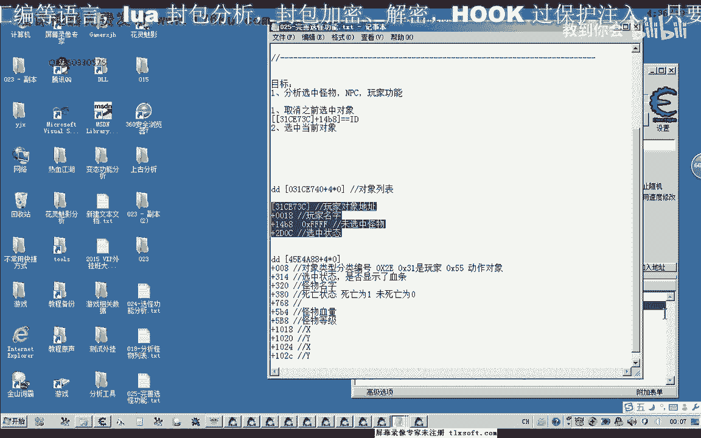

那么我们可以做一下尝试，打开我们的o d。

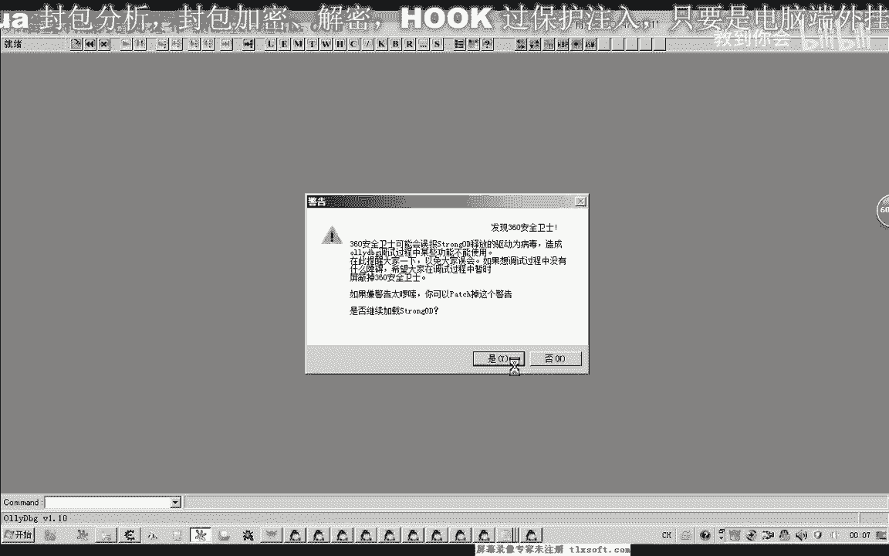

好，嗯，帮我打开之后呢，我们附加到五器里面，我们要先需要先把c里面的这个调试器呢要把它呃关掉，那么关掉之后呢，我们开始附加。

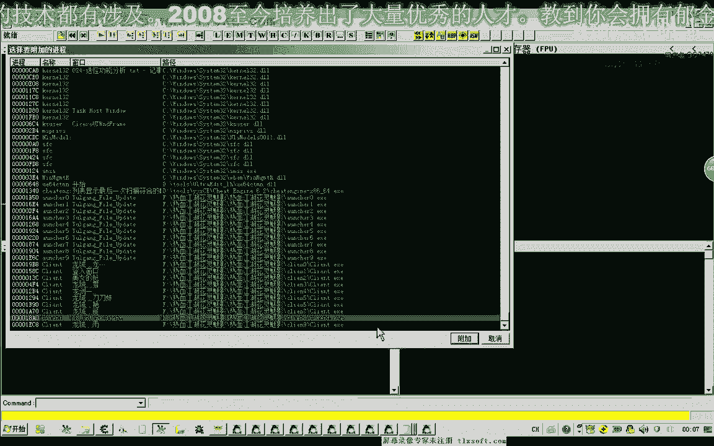

好那么附加进去之后，我们把刚才的这个地址来计算一下。

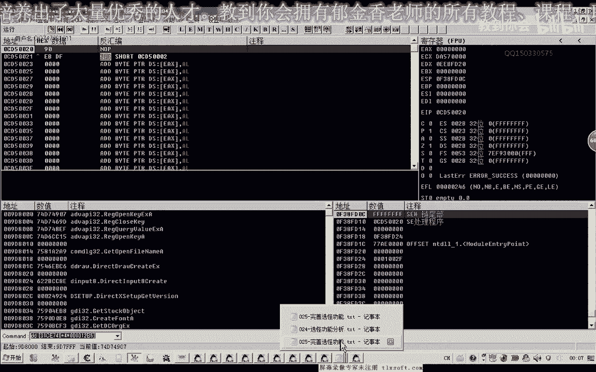

那么也就是这个地址加上我们的2d0 c嗯，就是一些代表着我们来选中啊。

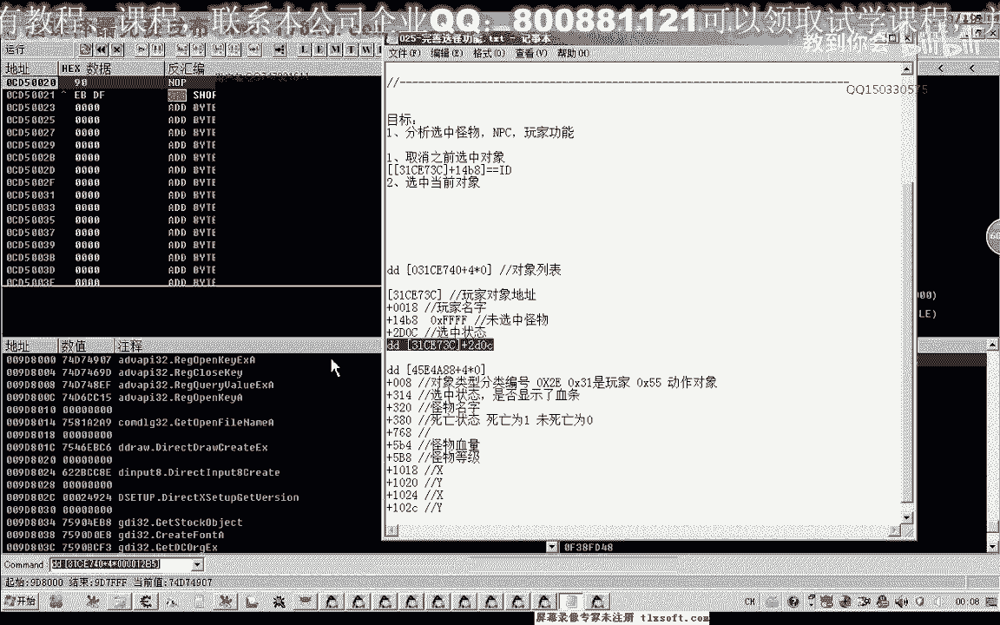

搞什么，那么这里呢我们看一下啊，没有选中自己，那么我们更改数值为一的话，这个时候呢它就会显示选中了自己，那么如果我们用鼠标选中自己的时候呢，它会往这个地址来写出一个呃一的一个标志，往这里写。

那么我们可以下一个内存写入的一个断点，看他会不会断下来，点自己的血条，那么这个时候它就断下来了，在这里呢选中选中吧，在这个地方选中了自己，那么在这个地方选中了自己，那么在他之前或者是之后。

那么应该有一个选中或者是取消在一个破一个选中或者是曲线，那我们看一下in d x一往前面走一下，哦哦那么我们看一下啊，先看一下上层库，那么上层课的这个可能性可能是最大的，那么上乘客的话。

我们执行到返回呢，它将执行到这个地方，那么就先让他跑起来，直接到这，那么他就是在这个扩展里面呢，望他写出了一个一让我们这个对象写出来一个e，那么我们就试着来调用一下这个库，看看是不是选中我们自己。

那么我们再下一个断点，下断点的目的呢，我们是取出这个ei的这个值i好的，我们再点击一下这个血条，点击血条，那么在这里呢它会先断下，把这个断掉了，取消掉，然后呢我们执行到返回返回来会返回到这个位置。

啊因为刚才我们是写英文，这个时候呢它是写入的一个零，这个过嘛，这个库呢它应该是取消，取消选中的事情，刚才我的那么这里显灵了这个地方，我们发现，那么再往后面，那么再按f81 直执行。

因为这个断点我们已经取消掉了，那么过了这个课之后呢，我们发现呢这里唯一了一了，然后跑起来，而且我们发现的话，这两个库这一前一后，这两个货的话参数都都是差不多的，01450，这个是00450啊。

这里都是coe x cos x，那么这种情况的话，这个是零，那么我们就往这相应的这个二点在这里写出来一个零，那么这里是一，它也往这里写出来一个一啊，那么这里就是取消选中。

这里呢就是应该是一个选项选中自己，那么是不是呢，我们可以先来做一个测试啊，那么这一次呢我们看一下这个ecx它的一个来源，14x还来源的话是来源于这个对象列表里。

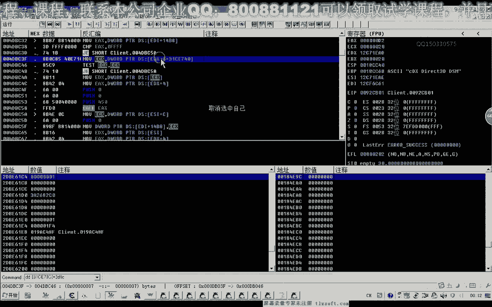

那么这个对象列表的话，在前面几个的话，我们也有过分析对象列表，这里边也有我们的玩家，有背包对象，还有动作的对象啊，还有人物啊，同一个对象它是一个总的一个列表。

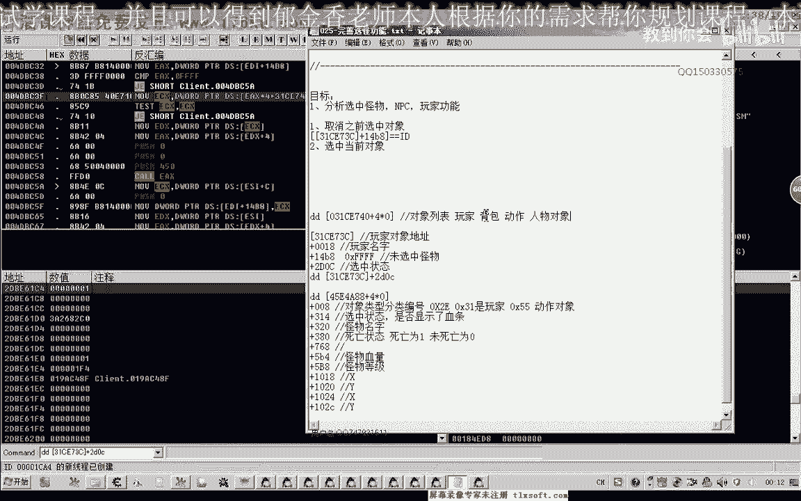

那么我们再从这个地方下段再来一步一步的分析，再选中这个血条，那么在选中选择之后，我们看一下，现在ex了，它等于1249，那么这个1649是什么呢，我们先，好不过了之后呢，e4 x呢它取了一个对象出来。

所以这个对象的话我们看一下三四比八，恰好就是我们自己从这里面取出来，就是这个三四平八，而这个12049呢我们看一下，恰好就是我们这个0c这个位置，你在我们之前呢，我们把它叫做id呃。

实际上呢它是这个对象列表的一个下标下标。

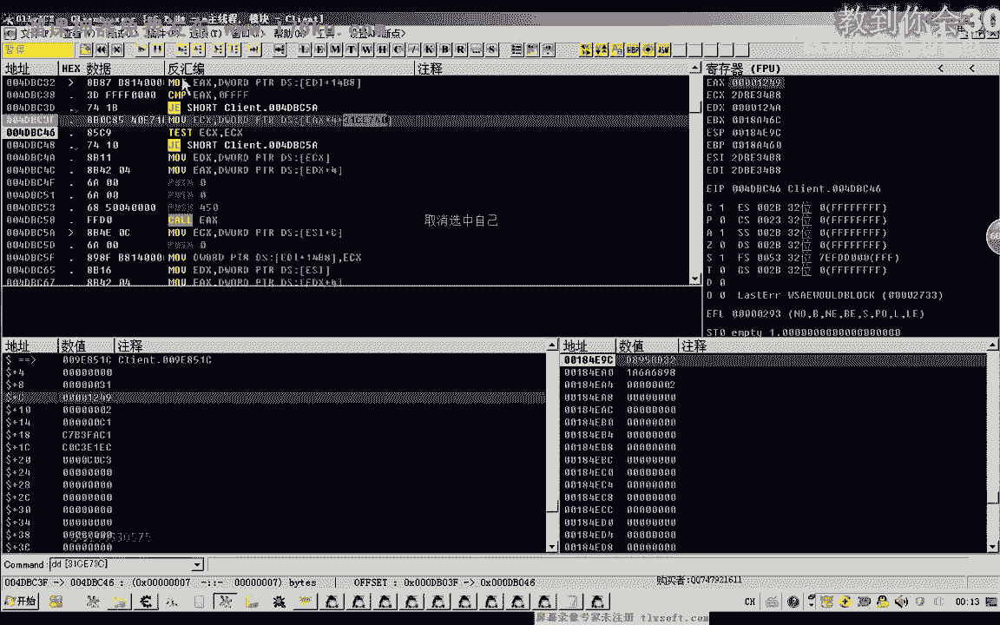

那我应该把它回复一下，嗯，以后我们就知道啊，在对象的家里，现在这个位置实际上是我们这个数组的一个下标，这是一个下标这个编号，那么它取出来这个对象之后呢，这里就是我们的相当于就是把这里面的地址取出来。

就是这个三次，比方，这是1s x分之一，那么取出来之后我们看他怎么走呢，首先它判断取出来的值是不是为零，如果是零的话，就跳到后面这些，那么顾问里面，那么我们呢就一步一步的执行取出来，转到一个库里面去。

那么转到之后呢，我们相应的这个二点售这个选项状态栏就会指明了，然后我们又往后面又执行，执行到这里的时候呢，我们发现这个e i的指令，它也是我们自己，然后我们发现了它叫什么同一个空啊，这里调用了同一个库。

那么然后呢这里就11了，好的我们也按照他这个思路来写一下，首先我们把这个代码复制一下，那么ex呢我们说的它是一个对象的ip，那么我们自己看看id是多少，我们看一下叫你先进的位置，1249，第四次。

那么取出来之后呢，后面呢我们就可以一步一步的把汇编指令复制出来，按下空格键，是看好后面的指令呢，我们都可以，不是你可以自己写啊，然后再是一个0450，然后这是cox，那么这就是取消啊，取消选中。

那么实际上按照他的这个写法的话，他不是要取消自己，他应该是要先取消掉之前选中的这个对象，因为这个ex的话，我们看一下，它恰好是从这个e d i a加上一个一四平八这里取出来的。

那么我们完整的写法应该还要加上一句，加上前面这一句，这样写，那么这个e d i的话啊，我们闭着眼睛猜可能都知道啊，他就是我们的这个玩家对象的封印，这里的14p啊，这个偏移我很熟悉啊，啧好的。

那么我们再把e d i这个值初始化一下，那么就是现在这个样子了，那么这样呢我们就能够取消掉前一个选中的一个对象，无论是前一个选中的对象是谁，都能够这样取消选中。

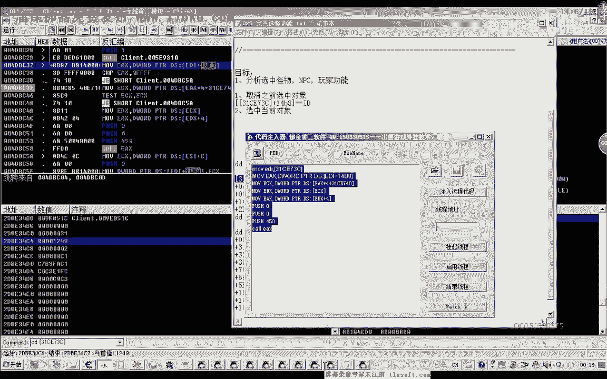

那我们来试一下，那么这个时候是选中了自己输入到主线里面，取消这个时候取消掉了，如果我们选中的是零，等一下也取消掉吧，取消选中，那么取消选中了之后呢，我们要选中我一个对象应该怎么办。

那么这个参数呢我们按照它的一个写好的话啊，这里呢就值1111的话就是选中，我们再来试一下，那么就是当前的那个i t它已经存在了，我们一起改变，那么选中，首先我们取消，然后我们再选中啊。

那么这个实际上它不是一个真的选中，它只是这个一个标志，一个标识而已啊，标识而已，那么如果我们要真的要选中一个对象的话，我们还要加上这一句，加上这一句，那么这一句的话我们需要通过编程的话片音来完成。

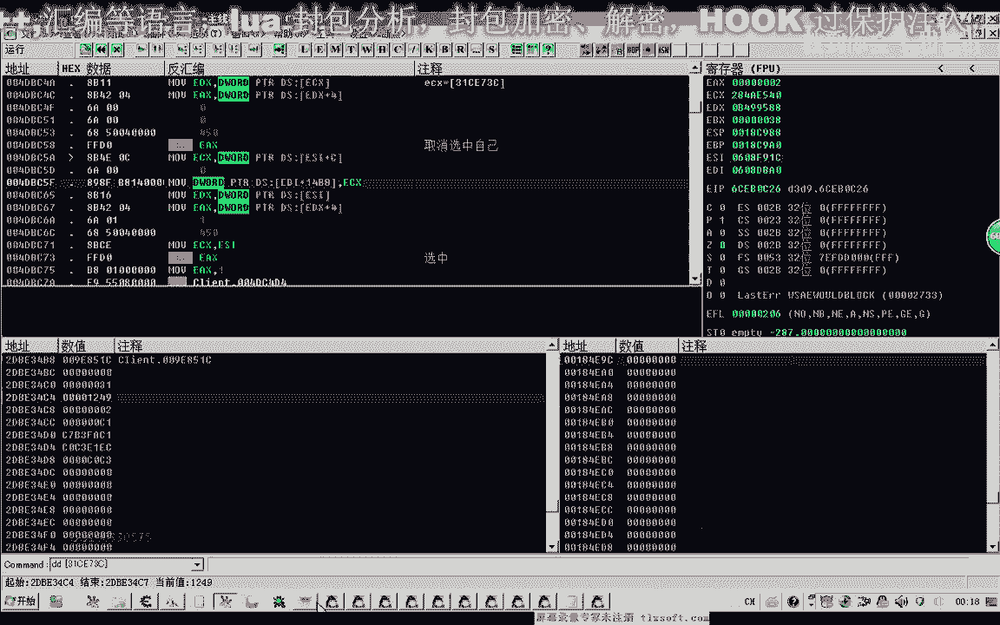

那么完整的步骤呢，我们先写一个逻辑啊，清理一下，那么先取消啊，取消这个是可以的吧，这里选择取消，选中血条，然后通过骗离我们的怪物，或者是其要选中其他的对象呢，骗离了之后呢，我们把它写到。

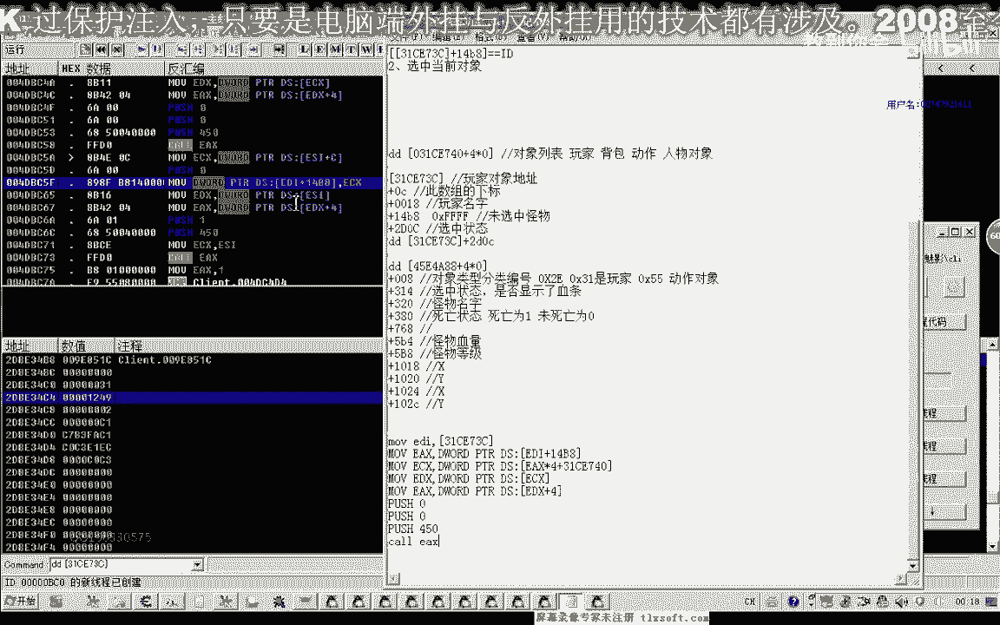

把他的i d啊，也就是我们这前面这个数组的一个下标写上。

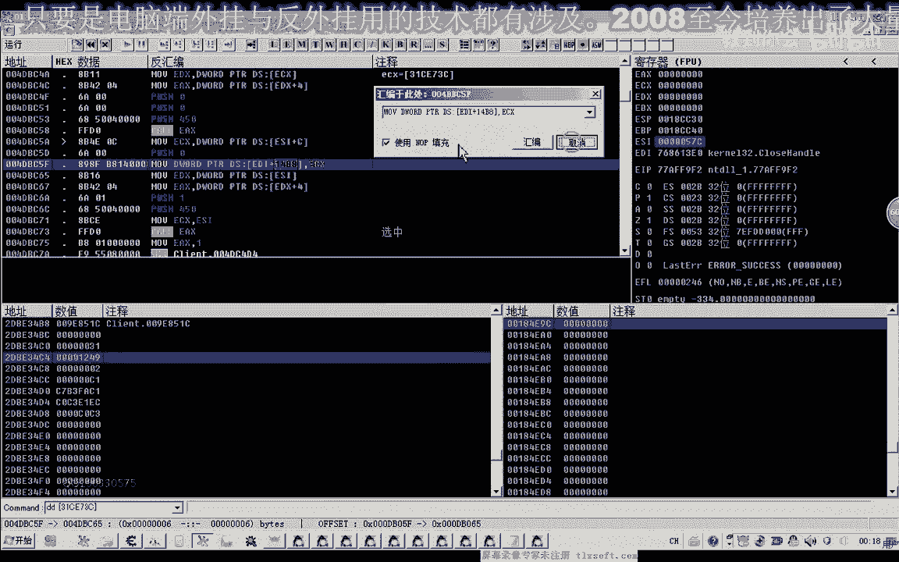

我写到我们的一四比八这个地方，然后呢，我们再选中把这个id的一个血条来给它显示出来，也可以用上这一句，这样写一下就可以了。

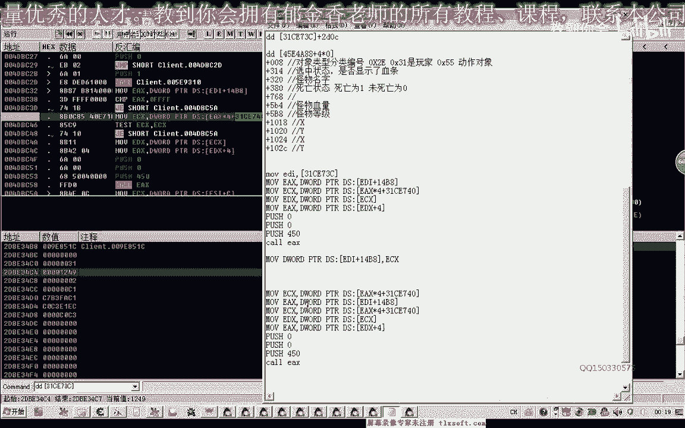

那我们来看一下它是怎么写的，你si，他e s i的一个来源的话在前边。

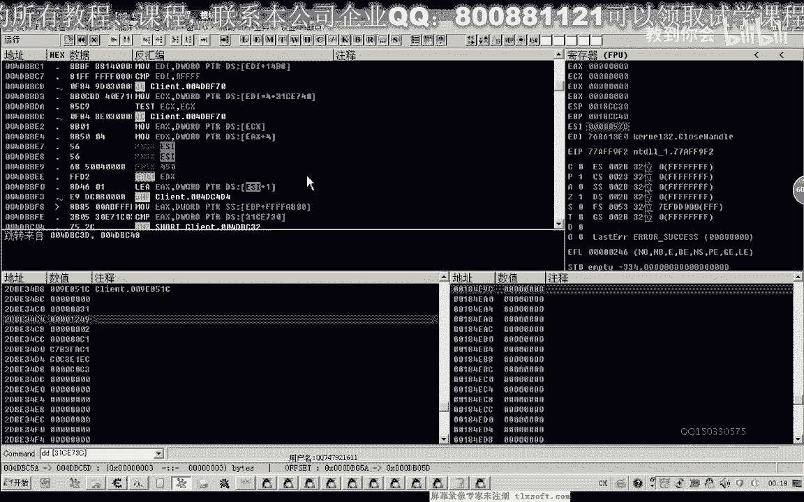

啊可能是传了一个对象进来，但我们这里我们自己要写的话，我们就通过一个片名来完成一个考点，那么这里写入之后呢，我们选中这个对象再改为一啊，这改为机，那么前前面是一个对象的i d。

那么我们也可以来做这个系列啊。

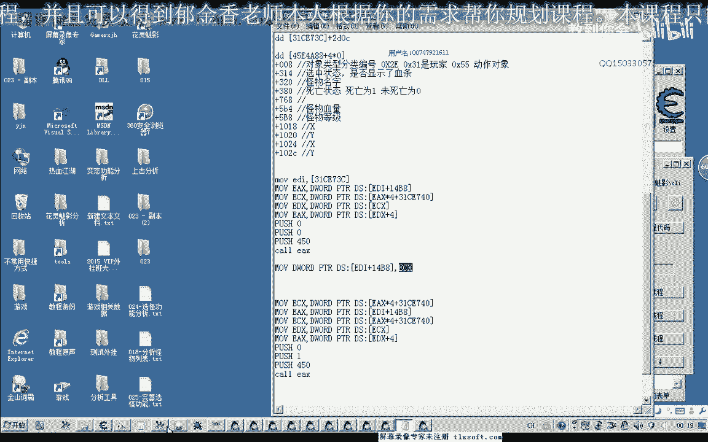

先加上一下142，那么现在我们选中的对象呢是加二比三啊。

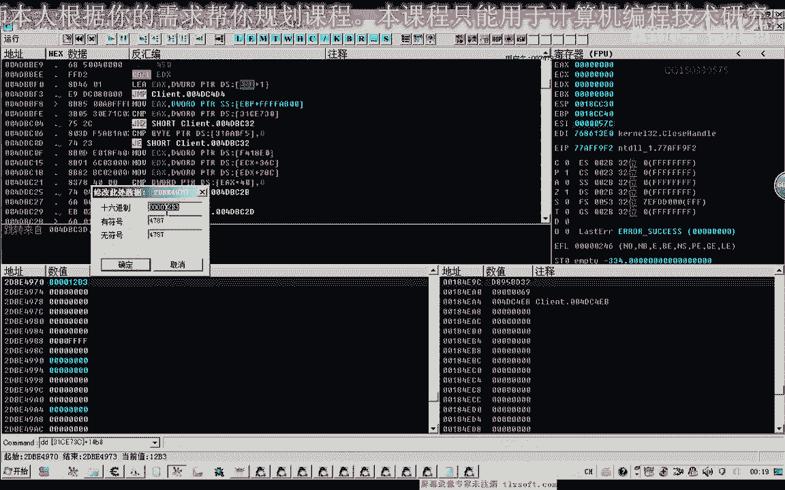

这个怪物我看一下，然后第三个是在头顶楼啊，12b3 ，那么我们可以把代码来稍微改一下，幺二比三就是b2 b3 ，那么就选中他，取消之前的mac，选错了，那么我们就可以这样写，复制出来。

你再看一下逻辑有没有错啊，首先呢幺二比三往一边写，六部写入了之后呢，这里呢应该我们先把这个压力平放到e x里，123，那么这里先用e x，那么在这里呢是ex层次，就把它取出来，取出来之后。

这种车只要一句就可以了，那么取出这个对象，然后呢一个显示的一个状态，取出对象，它的函数法，求函数介值，然后显示状态，这里要是没杀掉，这是之前的那一个取消掉，读出来啊，那我应该是这样写的。

那么我们切换到游戏，那我们看一下，我们先选中另外一头牛，然后再注入我们的代码，我们发现了这个牛头呢被取消掉了，而且选中的是汤，而我们这个时候呢他也能够啊去打这个怪啊。

因为这里我们的确啊写入了我们的这个i d的，那么测试成功之后呢，下一节课呢我们对这个代码呢再进行一个相应的封装。

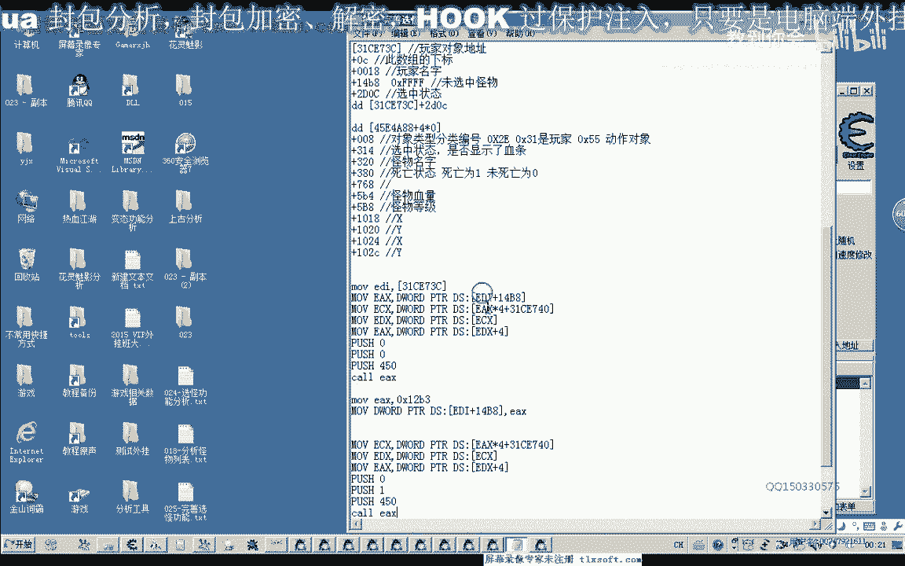