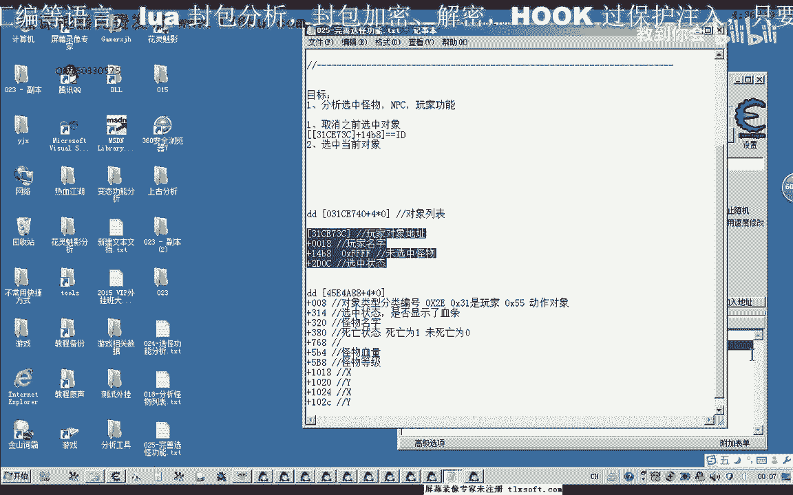
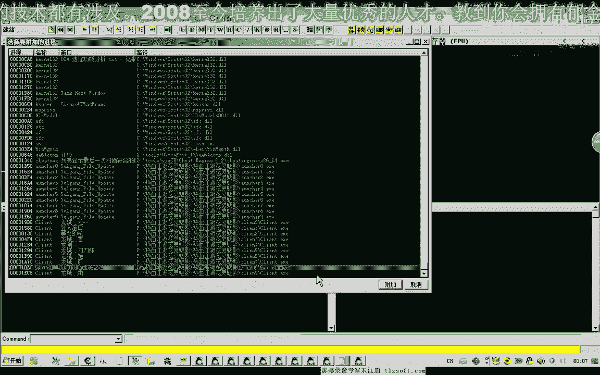
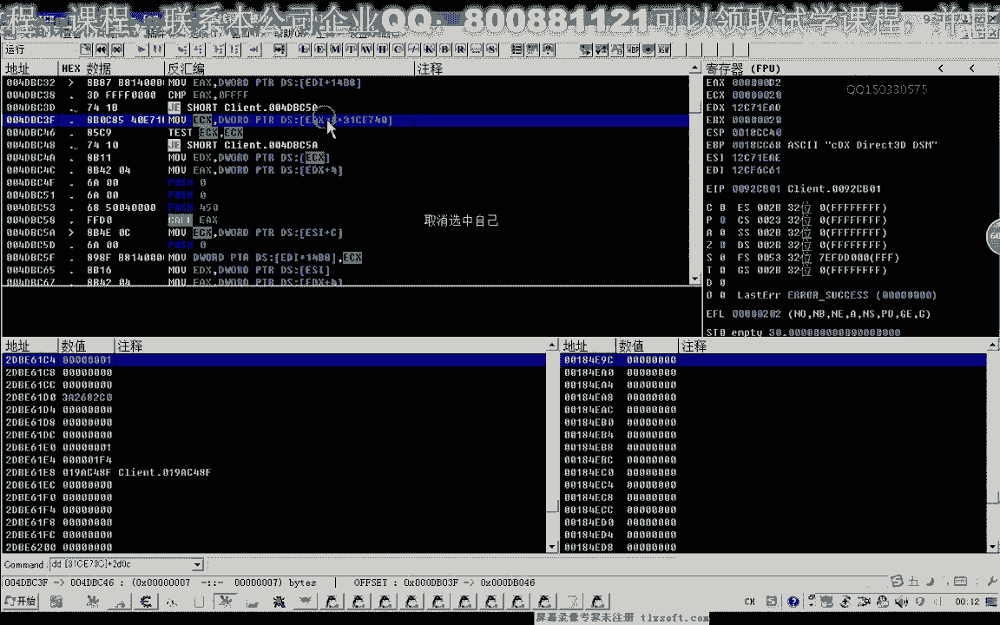
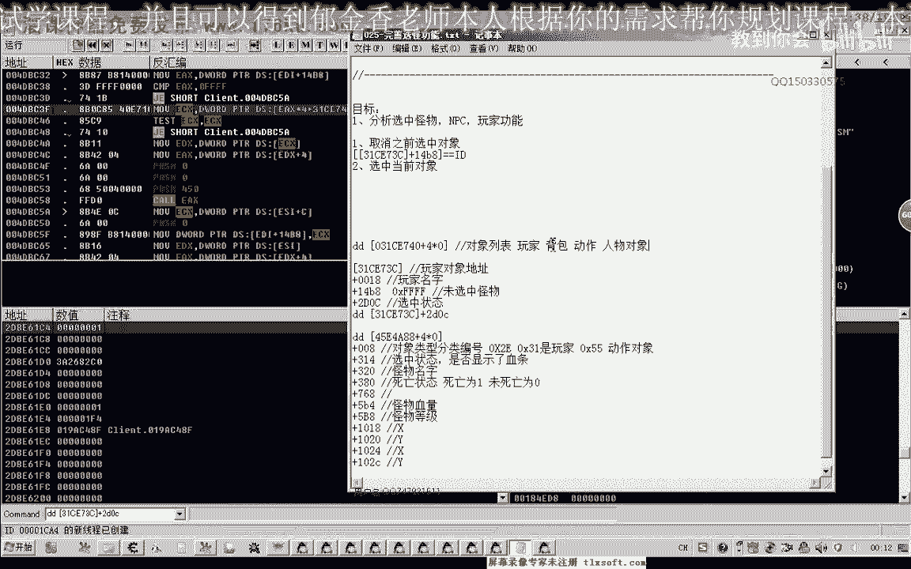
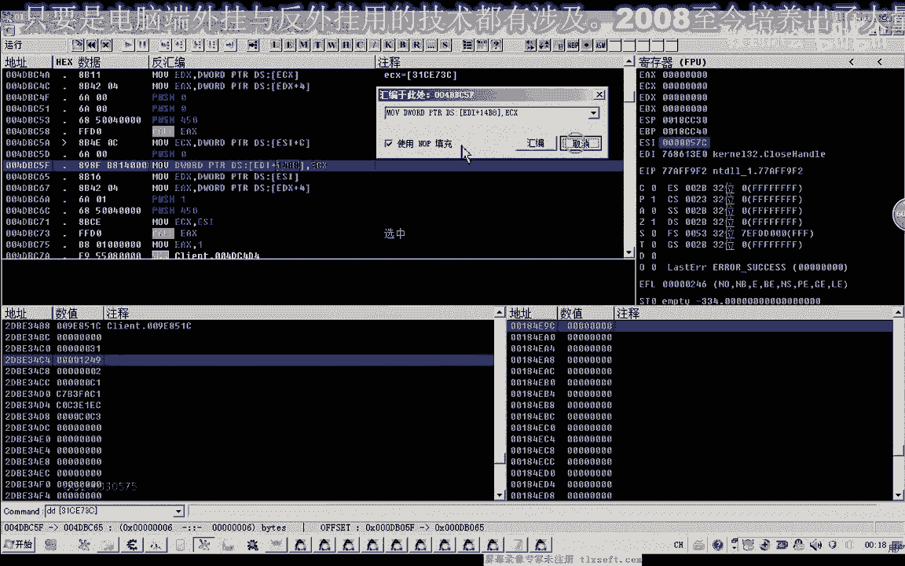
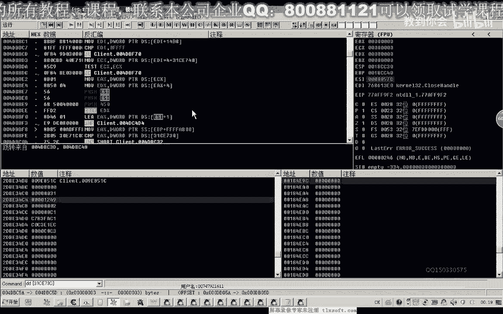
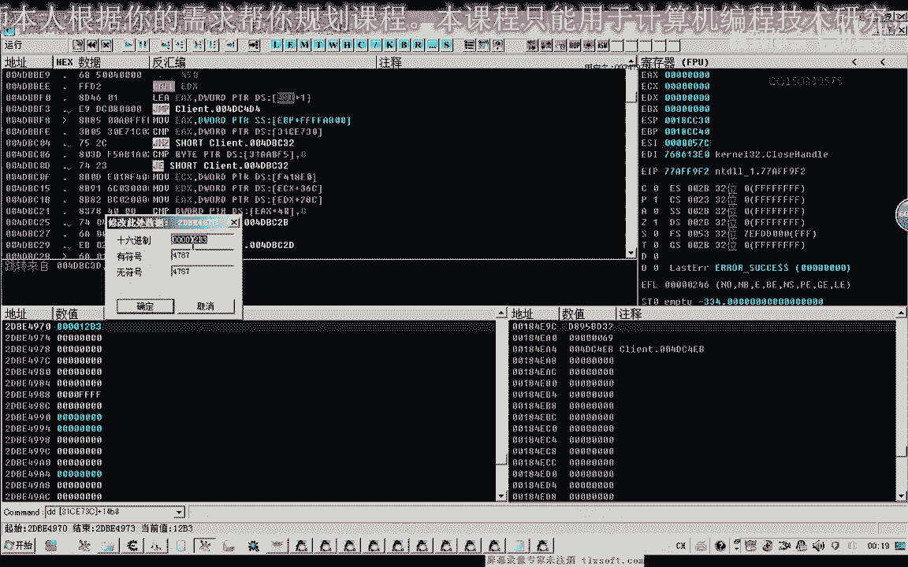

# 课程 P14：025 - 完善选怪功能 🎯

在本节课中，我们将学习如何完善选中怪物、NPC和玩家的功能。我们将分析游戏内部的数据结构，找到选中状态的关键偏移地址，并通过调用游戏内部的函数来实现完整的选中与取消选中逻辑。

---

## 概述

选中游戏中的对象（如怪物、NPC、玩家）通常涉及多个步骤。简单地向目标地址写入对象ID可能无法正确显示选中标志（如血条）。本节课将深入分析，找到完整的调用流程，实现一个功能完善的选中功能。

上一节我们测试了直接写入对象ID的方法，本节中我们来看看如何通过调用游戏内部函数来实现更完美的选中效果。

---

## 分析选中状态偏移

首先，我们需要找到控制对象选中状态的内部数据。通过调试器分析发现，对于玩家对象，其选中状态的偏移地址是 `+0x2D0C`。




**核心偏移公式：**
```
玩家对象基地址 + 0x2D0C = 选中状态地址
```



当向此地址写入 `1` 时，会显示选中标志；写入 `0` 时，则取消选中。


---

## 寻找内部调用函数

直接修改内存地址虽然有效，但为了确保所有选中效果（如血条显示）都能正确触发，最好调用游戏自身的函数。

通过下内存写入断点，我们追踪到游戏在选中或取消选中对象时，会调用两个关键的函数。它们的参数相似，但功能不同：
*   一个函数用于**取消选中**（写入 `0`）。
*   另一个函数用于**选中对象**（写入 `1`）。

这两个函数都需要一个关键参数：**对象在游戏内部对象数组中的下标（Index）**，而非直接的对象地址。

---

## 理解对象下标（Index）

在游戏的对象列表中，每个对象都有一个唯一的下标（Index）。这个下标存储在对象基地址的 `+0x0C` 偏移处。



**下标获取公式：**
```
对象下标 = 读取内存(对象基地址 + 0x0C)
```



选中功能函数正是通过这个下标，从全局对象列表中取出对应的对象地址，然后进行后续操作。

---


## 构建完整的选中逻辑

一个完整的选中新对象的流程应包含三个步骤：

以下是实现选中新对象的三个步骤：

1.  **取消当前选中对象**：调用“取消选中”函数，清除之前对象的选中状态。
2.  **写入新对象ID**：将新目标对象的**下标（Index）** 写入到游戏指定的选中目标地址（例如 `+0x1498`）。
3.  **选中新对象**：调用“选中对象”函数，为新对象设置选中状态并显示血条等标志。

**伪代码逻辑描述：**
```cpp
// 1. 取消之前选中的对象
call CancelSelectFunction(ObjectIndex_Previous);

// 2. 将新对象的Index写入目标地址
WriteMemory(TargetSelectAddress, ObjectIndex_New);


// 3. 选中新的对象
call SelectFunction(ObjectIndex_New);
```

---

## 代码实现与测试


根据逆向分析得到的汇编指令，我们可以用代码模拟这一过程。以下是一个示例框架：


**关键代码示例（概念）：**
```cpp
// 假设已知的函数地址和偏移量
DWORD dwCancelFunc = 0xXXXXXX; // 取消选中函数地址
DWORD dwSelectFunc = 0xYYYYYY; // 选中函数地址
DWORD dwPlayerBase = 0xZZZZZZ; // 玩家对象基地址
DWORD dwTargetAddr = dwPlayerBase + 0x1498; // 写入新对象ID的目标地址



// 步骤1：取消当前选中（参数为之前对象的Index）
__asm {
    mov ecx, [dwPlayerBase + 0x0C] // 获取当前选中对象的Index
    call [dwCancelFunc]
}




// 步骤2：写入新对象的Index（例如 0x12B3）
DWORD dwNewObjectIndex = 0x12B3;
WriteProcessMemory(..., dwTargetAddr, &dwNewObjectIndex, ...);

// 步骤3：选中新对象
__asm {
    mov ecx, dwNewObjectIndex // 传入新对象的Index
    call [dwSelectFunc]
}
```




将上述逻辑注入游戏进行测试，可以成功实现：取消原有选中目标，并正确选中新怪物，同时其血条和选中标志均正常显示。

---

## 总结

本节课中我们一起学习了如何完善游戏中的对象选中功能。关键在于理解并遵循游戏自身的逻辑流程：
1.  找到控制选中状态的内部偏移（`+0x2D0C`）。
2.  定位并调用游戏内部的“取消选中”与“选中对象”两个函数。
3.  理解并使用“对象下标（Index）”而非直接地址作为函数的参数。
4.  按照“取消旧对象 -> 写入新ID -> 选中新对象”的三步顺序执行。


通过这种方式实现的选中功能，比直接写内存更加稳定和完整，能够确保所有视觉反馈（如血条）正确触发。下一节课，我们将对这些代码进行封装，使其更易于管理和使用。