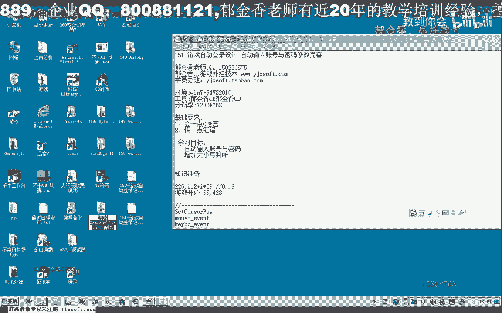
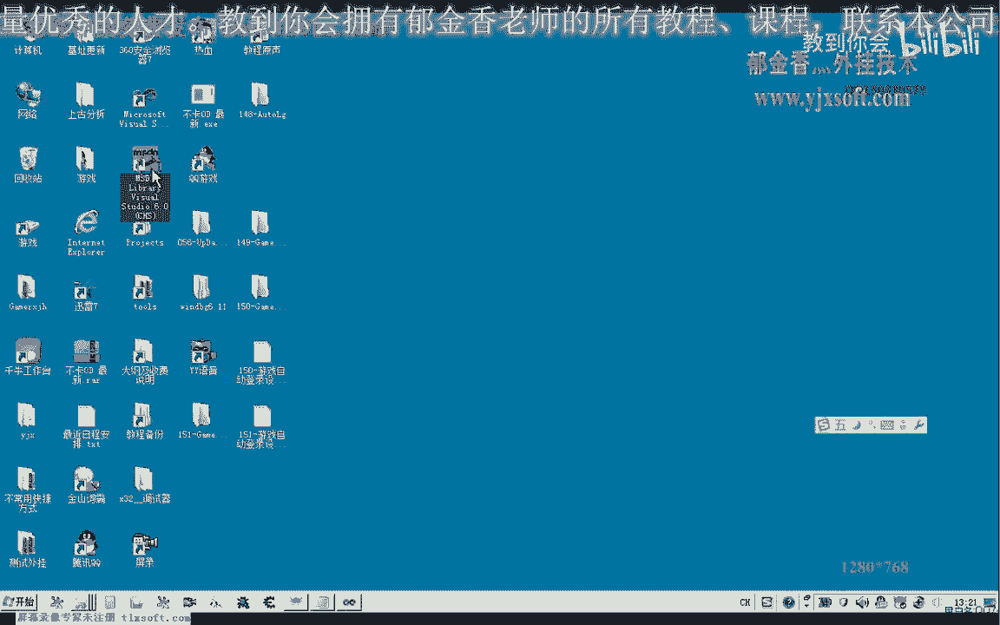
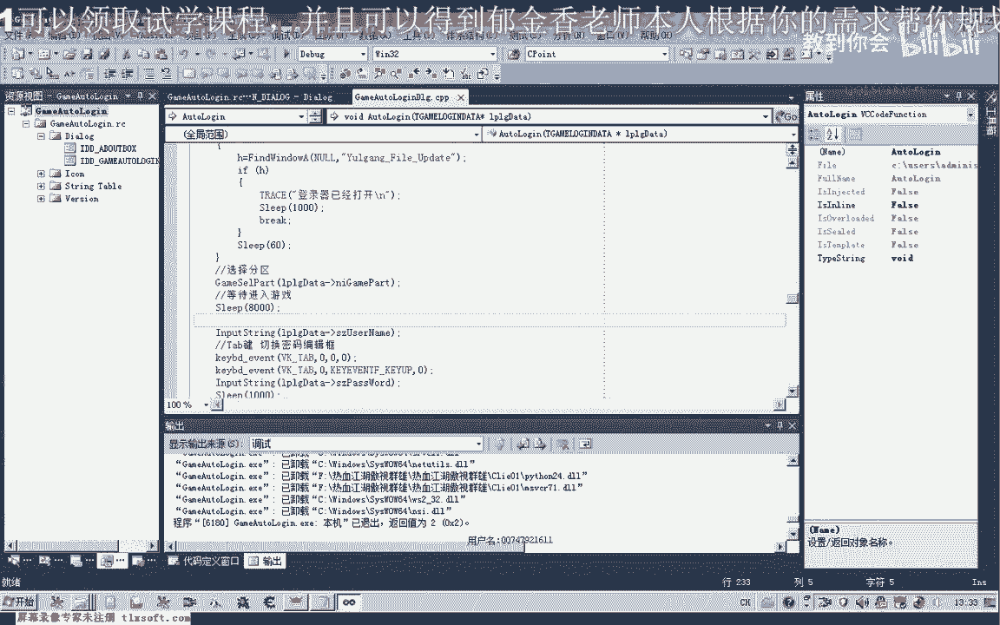

# 课程 P140：游戏自动登录设计 - 自动输入账号与密码修改完善 🔧



在本节课中，我们将学习如何完善游戏自动登录脚本中的账号密码自动输入功能。我们将重点解决因键盘大小写锁定状态导致的输入错误问题，并探讨如何更智能地判断游戏登录界面是否已就绪。

---




上一节我们介绍了自动输入账号密码的基本框架。本节中，我们来看看如何通过检测键盘状态来确保输入的准确性。

## 检测键盘大小写锁定状态

在自动输入字符串时，如果键盘的大小写锁定灯是亮着的，那么输入小写字母时可能会意外地变成大写，导致账号密码错误。因此，我们需要在输入前判断大小写锁定键的状态。

我们可以调用 Windows API 函数 `GetKeyState` 来获取特定虚拟键的状态。

**核心代码：判断大小写锁定键**
```cpp
// 方法一：使用 GetKeyState 函数
SHORT keyState = GetKeyState(VK_CAPITAL);
// 判断低字节是否为1，1表示大小写锁定开启
bool isCapsLockOn = (keyState & 0x0001) != 0;
```

`GetKeyState` 函数返回一个 `SHORT` 类型的整数。其低位字节如果为1，则表示该键的切换状态是开启的（例如，大小写锁定灯亮起）。

以下是测试该函数返回值的步骤：
1.  当大小写锁定灯熄灭时，`GetKeyState(VK_CAPITAL)` 返回值（与1进行位与运算后）为 **0**。
2.  当按下大小写锁定键，灯亮起时，返回值变为 **1**。

## 另一种检测方法

除了 `GetKeyState`，还可以使用 `GetKeyboardState` 函数来获取整个键盘256个虚拟键的状态。

**核心代码：使用 GetKeyboardState**
```cpp
// 方法二：使用 GetKeyboardState 函数
BYTE keyStates[256];
GetKeyboardState(keyStates);
// 判断大小写锁定键的状态（同样看低字节）
bool isCapsLockOn = (keyStates[VK_CAPITAL] & 0x0001) != 0;
```
这种方法会将所有键的状态存入一个数组，我们可以通过虚拟键值作为下标来查询特定键的状态。经测试，两种方法在判断大小写锁定状态上效果一致。

## 完善自动输入函数

基于上述检测，我们需要在输入逻辑中加入判断，以确保无论当前键盘状态如何，都能正确输入目标字符。

逻辑如下：
*   如果需要输入的是**小写字母**，但检测到**大小写锁定已开启**，则需要在输入前模拟按下一次 `CapsLock` 键来**关闭**大写状态。
*   如果需要输入的是**大写字母**，但检测到**大小写锁定未开启**，则需要在输入前模拟按下一次 `CapsLock` 键来**开启**大写状态。

这样，我们的自动输入函数就能适应任何初始的键盘状态，保证输入的准确性。

---

上一节我们解决了输入准确性的问题。本节中，我们来看看如何确保输入时机的正确性，避免因游戏界面未加载完成而输入失败。



## 智能等待登录界面

之前测试失败的一个原因是，在游戏登录窗口完全出现之前，脚本就开始输入了。简单的固定时间等待并不可靠。


更稳健的方法是：**检测游戏登录界面是否已完全加载**。一个简单有效的方法是判断登录窗口上特定像素点的颜色。

**实现思路：**
1.  在游戏登录界面完全出现后，记录一个特征点（例如，登录按钮上的某个点）的坐标和颜色值。
2.  在脚本中，循环检测该坐标点的颜色是否变为我们记录的目标颜色。
3.  只有当颜色匹配时，才执行后续的账号密码输入操作。


这样可以确保脚本只在正确的时机进行操作，大大提高自动化流程的稳定性。

---

本节课中我们一起学习了完善游戏自动登录脚本的两个关键点：
1.  **键盘状态检测**：通过 `GetKeyState` 或 `GetKeyboardState` API 函数判断大小写锁定状态，并在输入前后进行必要的调整，确保了账号密码输入的**准确性**。
2.  **界面就绪判断**：提出了通过检测特定像素点颜色来判断游戏登录界面是否加载完成的方法，以此替代固定的时间等待，确保了输入操作的**时机正确性**。


通过这两项改进，我们的自动登录脚本将变得更加健壮和可靠。下一节课，我们将继续深入，实现并测试基于颜色检测的智能等待逻辑。