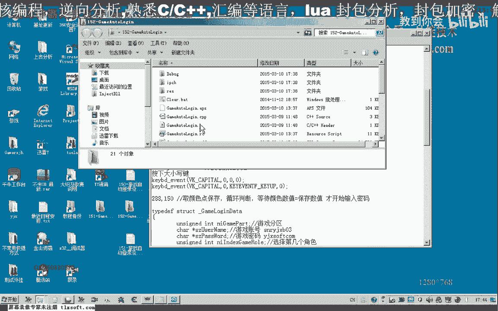
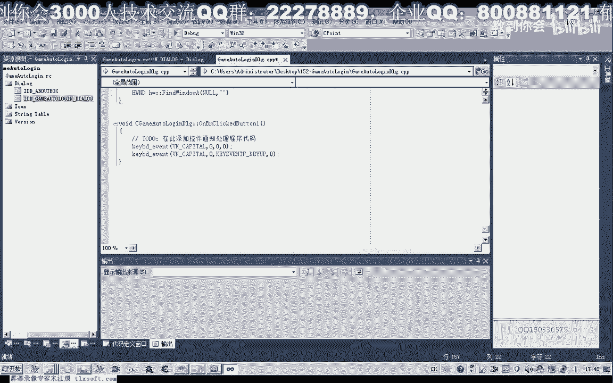
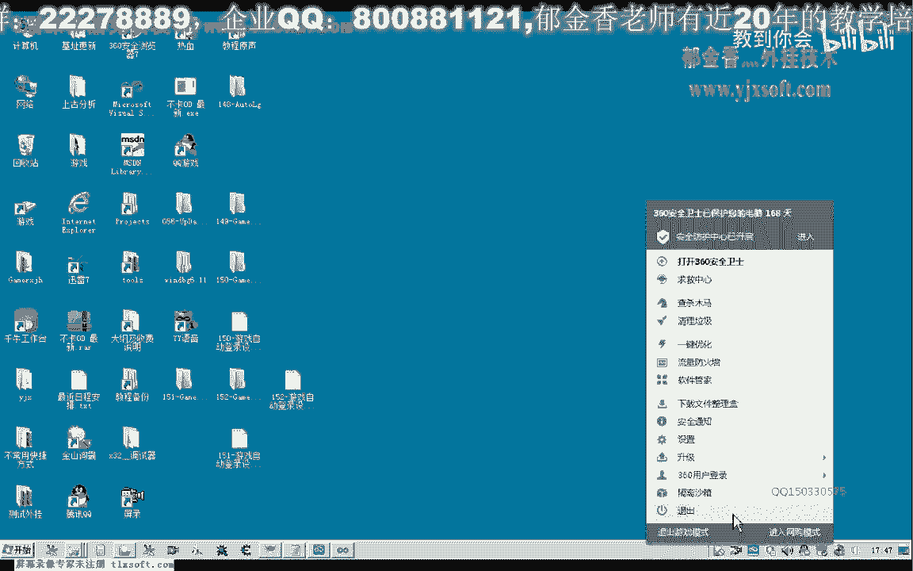
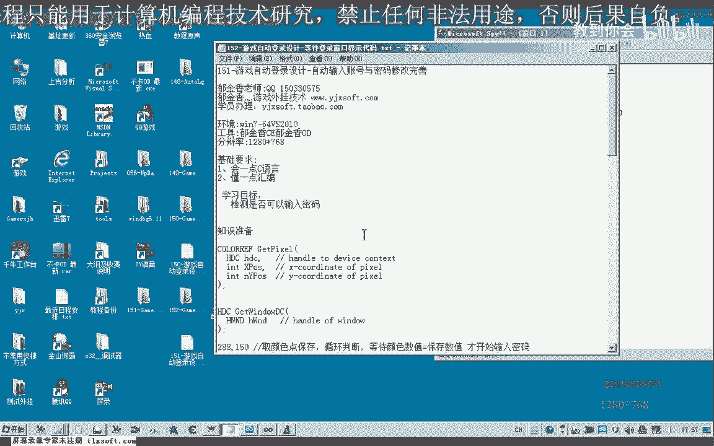

# 课程 P141：游戏自动登录设计 - 等待登录窗口显示代码 🎮

在本节课中，我们将学习如何编写一段代码，用于等待游戏登录界面窗口显示出来，然后再进行账号和密码的输入。这样做可以解决因不同电脑配置差异导致的加载时间不一致问题，使自动登录脚本更加稳定可靠。

---



上一节我们介绍了自动登录的基本流程。本节中，我们来看看如何实现“等待登录窗口显示”这一关键步骤。

## 准备工作与思路分析

首先，我们需要打开第151课的代码，并在此基础上进行修改。我们的目标是在“等待进入游戏”这个环节，用代码检测游戏是否已正常加载到可以输入密码的状态。

核心思路是：在登录界面的一个特定坐标点（例如 `(288, 150)`）取色。当该点的颜色变为目标颜色时，即代表登录窗口已完全显示，可以执行后续的输入操作。



## 获取目标窗口与颜色



以下是实现等待功能的具体步骤。


### 1. 获取窗口句柄

要获取窗口内像素的颜色，首先需要获得目标窗口的句柄。我们使用窗口标题来查找它。

```cpp
HWND hWnd = FindWindow(NULL, L"游戏客户端标题");
if (hWnd == NULL) {
    // 调试信息：窗口未找到
    return;
}
```

### 2. 获取设备上下文并取色

获得窗口句柄后，需要获取其设备上下文（DC），然后使用 `GetPixel` 函数获取指定坐标的颜色值。

```cpp
HDC hDC = GetDC(hWnd);
COLORREF color = GetPixel(hDC, 288, 150);
ReleaseDC(hWnd, hDC);
```

为了测试，我们可以先将获取到的颜色值打印出来，以确认坐标点和颜色是否正确。

## 实现等待循环检测

获取到目标颜色值后，我们就可以完善之前的等待代码了。我们将用一个循环来持续检测，直到目标点的颜色匹配为止。

以下是实现等待检测的核心代码结构：

```cpp
COLORREF targetColor = 0x00FF00; // 替换为实际获取到的目标颜色值
bool isWindowReady = false;

for (int i = 0; i < 200; ++i) { // 设置一个最大循环次数，防止无限等待
    HWND hWnd = FindWindow(NULL, L"游戏客户端标题");
    if (hWnd != NULL) {
        HDC hDC = GetDC(hWnd);
        COLORREF currentColor = GetPixel(hDC, 288, 150);
        ReleaseDC(hWnd, hDC);

        if (currentColor == targetColor) {
            isWindowReady = true;
            break; // 颜色匹配，退出循环
        }
    }
    Sleep(50); // 每次检测间隔50毫秒
}

if (isWindowReady) {
    // 执行输入账号密码等后续操作
}
```

在这段代码中：
*   我们通过一个 `for` 循环进行多次检测。
*   每次循环中，都重新获取窗口句柄和指定点的颜色。
*   将当前颜色与之前获取的 `targetColor` 进行比较。
*   如果颜色匹配，则设置标志并跳出循环，执行后续的输入操作。
*   每次检测后使用 `Sleep(50)` 暂停一小段时间，避免过度占用CPU资源。
*   注意，在颜色不匹配时，应使用 `continue` 继续下一次循环，而不是 `return`，否则会提前结束整个函数。

## 扩展应用与练习


等待界面显示的逻辑可以应用于自动登录流程的多个环节。例如，在分区选择之后，界面可能会显示一个“开始”按钮，同样可以通过检测按钮特定位置的颜色变化来判断是否可以进行点击。

大家可以尝试将此方法应用到脚本的其他等待环节，逐步完善整个自动登录流程。

---



本节课中，我们一起学习了如何通过检测屏幕特定坐标颜色来实现等待游戏登录窗口显示的功能。我们掌握了获取窗口句柄、设备上下文以及像素颜色的方法，并利用循环检测构建了一个可靠的等待机制。下一节课，我们将继续学习角色选择等相关功能的代码设计。