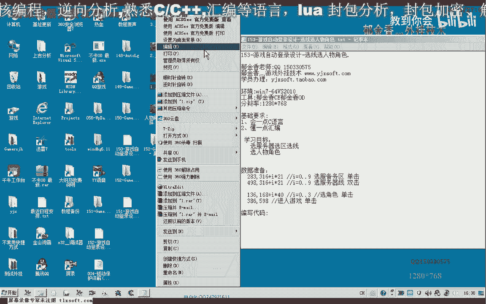
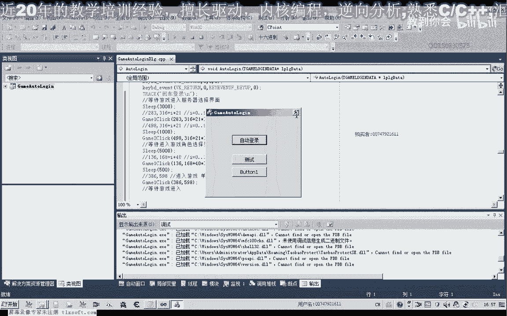
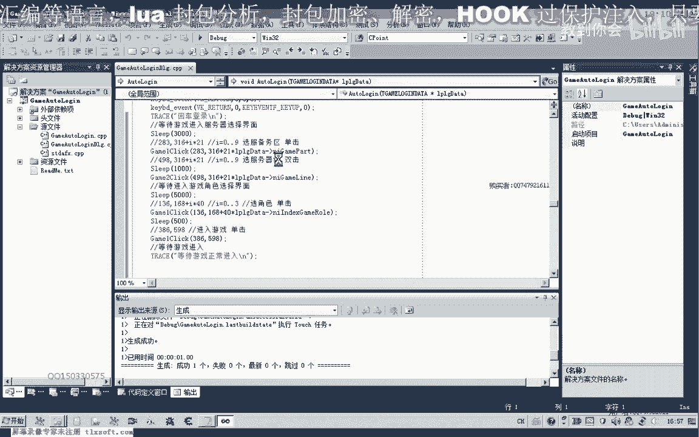
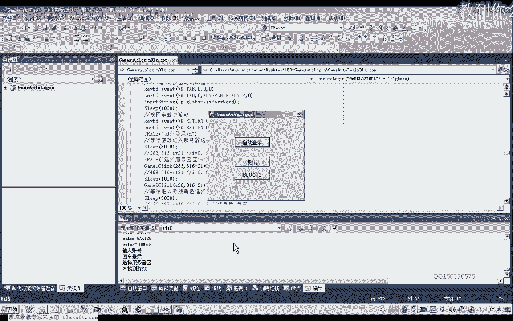
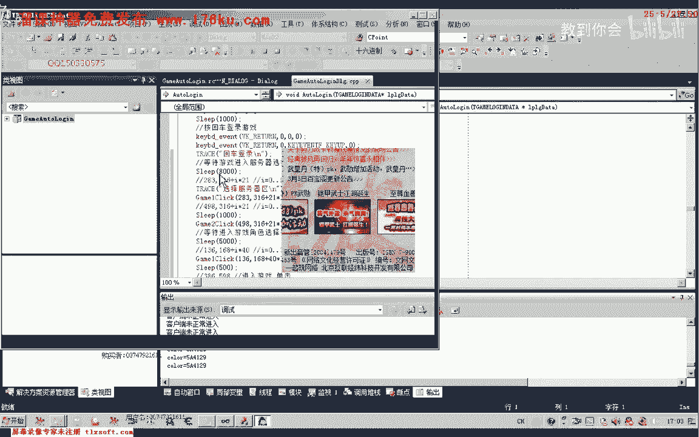

# P142：153-游戏自动登录设计-选线选人物角色 - 教到你会 - BV1DS4y1n7qF

大家好，我是郁金香老师，那么这节课呢我们继续设计我们自动登录的相关代码嗯，这节课的目标呢一个是选择服务器的，一个是选项，还有呃还有一个选区啊，服务器选项，选区选项呃，服务器的一个选择。

另外一个是人物角色的一个选择啊，以及我们的介入游游戏哈，那么首先呢我们是通过鼠标来模拟完成的，那么所以说在这里的话，我们需要来先获取它相关的这个数据。

那么这里呢抓了几幅图啊，首先呢它服务器的这个选区的话是在这个位置啊，我们可以在这里的话，在这个下面这个位置来看到它的一个大致的一个坐标啊，那么这里下下来之后呢，我们他一共呢最多的这个服务器的话，嗯。

它的一个选区的话最多也可以有十个，但是下边这里是空白的，那么这里我们看到它的y坐标是305，到这里的话，它是515左右哈，516，那么大概有，幺六到我们这前面的3。5，大概是210左右哈，除以10的话。

一共还有十个选区，那么这里的高度呢也就是21，那么这里呢它的y坐标呢可以是相同的，只是我们的x坐标不一样，那么最终取出来的结果的话，那么大概的话因为这个前面的这个坐标的话。

实际上它是可以在这个二幺这个范围变动的啊，这里呢它可以在这个范围内变动，那么最终取出来了，大致上就是啊前面这个坐标啊，283316啊，后面的这个y坐标的话，他从呃为每一个分区之前呢，相隔的距离是21啊。

就是我们的i乘以21啊，好的这个数值来为0~9，那么为九的话肯定就是选的这个分区啊，在这个范围内它的坐标来我们看它是变动的啊，我是取得大概是在这个位置的坐标啊，只要是在这个范围内的坐标呢都是可以的。

好那么这里是一个单机的动作，那么另外一个这里是498316过去的啊，大概是在这个位置，大概是在这个位置鼠标指向的，那么这个位置下来的话，它的每一格呢也是加上21，这个到到这个地方的距离的是21。

这里到这里的地方呢是21，所以说它也有一个公式啊，那么这是选择我们的服务器限相关的数据，那么服务器线啊选择好了之后呢，然后呢就是我们的人物角色在选择的时候呢需要一些数据。

那么这里的坐标呢大概是呃我取得是取得136啊，168这个数据大家开始在这个位置，啊136168，而他从这个位置是149150的样子，到这里的话，我们看一下是310的样子。

那么大概就是说这四个呢占了160个距离，那么160的话除以四啊，大概每一格呢是所占的距离呢是40，那么选择角色的话啊，那么现在的话这个角色的话如果有更多的这个角色。

但是但是目前这个游戏呢只支持四个角色啊，所以说这里呢是0~3，那么如果有更多的角色呢，可以是0~9这一类的，以此类推就可以了，那么这里选角色的时候呢，我们是单击选择，选了之后进。

入游戏我们可以双击这个人物或者是这个进入江湖这个字，那么这里呢需要双击，这里呢我们只是单机就可以了，那么我选的是这个位置啊，单机进入游戏就是最后的啊，单机进入游戏，那么这就是我们所要准备的这个数据。

那么这些数据准备好了之后呢，我们就可以编写我们的代码，那么打开156克的代码，那么首先呢我们可以来设计一个单击或双击这个的一个函数，那么这个函数的参数呢就是相应的一个坐标。

然后呢我们直接调用这个函数的话，就选择了比较简单一些。

那么我们先移动到登录部分，那么首先在这里我们这个结构的话好像是要添加相应的数据，我们来看一下需不需要再添加，还要需要设计一个服务器区的呃，这样一个数据，那么这里呢我们已经设计了一个游戏的分区啊。

但是呢我们还有一个游戏还要选几线啊，呃服务器线我们需要实际上这个服务器限呢，我们最好是因为它有可能是某一个线，可能会买掉，最好是智能的进行一个选项啊，那么现在呢我们先先给它设置一个这个服务器的线。

然后再是选角色，然后选我们的，选项，五，好那么在相关的这个结构我们定义好之后呢，接下来我们就呃写两个这个游戏啊，单击或双击的这个函数，那么我们就把这个单机的函数呢把它写在这个选区的前面。

那么这个呢是我们的单机啊，然后呢我们传送两个坐标信息，ter x乘y，那么在这里的话，我们首先呢要找找到我们的这个窗口坐标，那么我们看一下里边有类似的代码，我们把它复制一下，你。

那么如果找到了这个窗口呢，然后呢我们取得这个窗口的位置，哈哈，那么取得这个位置之后呢，我们需要来把这个传送进来的这个坐标啊，还需要来加上我们的这个本身窗口的呃，这个x坐标和y坐标啊。

也就是左上角的这个这个坐标，那么这个x它的质量我们还需要对它进行改变，net加上y呢复制为我们的y加上aron。co它的顶点坐标，那么加上了之后呢，我们再模拟鼠标的单机。

那么我们首先呢需要把这个坐标移动到指定的这个位置，然后呢再执行我们的单机的一个操作，那么这里有单机的操作，我们把它复制一下，哈哈哈哈，好我们编译生成一下代码，看有没有错误。

然后把这一段代码呢呃如果是没有错误的话，我们把它复制一下，再写一个双击的代码，双击的话，这里呢就是单击两次，实际上，哈哈，one啊，或者是直接改为一，然后呢这里呢我们再把它复制一下啊。

这后面这一部分代码，那么这是第一次按下释放，按下释放，那么以后呢这里就是两次，好那么这个代码写好了之后呢，我们直接出来就可以，到我们的登录部分和完成我们的代码，那么登录游戏之后呢，我们还需要一段时间哈。

等待，那么我们还需要呢用代码来判断它是否进入了我们的这个服务器，那这个选择的界面啊，这个需要一段时间，那么这里的话我们用实力来看，等待三秒来实现，然后呢我们就可以了，按照我们这里所准备的数据啊。

单击这个位置，那么我们把这个公式啊复制进来，哈哈哈，啊跟啊，我们需要把这个函数呢，这两个函数需要把它前置一下哈，不然的话我们调用不了，然后我们把它的坐标传进去，283316。

然后呢后面这个再加上一个i乘以二一或者是二幺神，以我们的，传进来的这个参数，我们看一下参数的名字，lloy dirt，那么这里是服务器啊啊选区的某一个区，啊然后我们把后面这里呢是双击，我们把它改一下。

然后呢呃也需要等待几秒的时间，比如说，然后呢我们这里呢再次选线，这里是498316，然后呢在后面的这个选项的数据传送进来，然后我们最后呢再次选嗯嗯等待进入这个游戏角色的界面。

那么这里呢我们先等三秒钟或者是五秒钟的时间，然后这里呢也是单机，单机的话，我们把前面的这里是双击，我们改一下函数名字，单击呢我们把前面的这个函数哈复制一下，选角色，这里是136168，四零十一。

然后在这里呢它的参数的话是角色，第几个角色，最后这里是进入游戏，这里呢也需要等待一段时间，但是这里等待的时间可以比较短啊，等于零点啊，等待0。5秒的时间，然后呢再次单击进入游戏，598好。

后面的这里会有相应的参数了啊，然后呢在，等你大一点嗯，这里呢也需要一段时间，当然这个时间的话，具体具体需要多少呢，我们最好是用一个像之前的用一个循环去进行判断，那么我们后边呢再完善哈。

这种等待时间的呃一个完善，那么今天呢我们先做一下我们的测试，看能否正常地进入到游戏里面去。

那么最后的话执行到这里的时候呢，我们也打印一段调试信息。

那么在这个我们发现的话，这个时候呢在我们的这个选区和选线的时候呢，他出了这个问题啊，他不能这个选择，那么说明我们的代码呢有问题，那么我们继续的来查看一下哈，可能是这里的等待的一个时间呢太短了。

那么我们把它设置为六秒钟的时间啊，这个时候，然后呢在后边我们加上我们的单机，之前呢我们加上相应的调试信息。

那么这个时候呢我们发现的话应当是我们的呃，这个选区的信息呢没有传送进去呃。

我们还要对这个结构来进行一个初始化才可以，那么在这里的话，我们还有一些数据呢没有进行初始化，呃因为我们之前指的这个分区的话，它是四分区，是登录的这个分区，那么我们还要进到这个游游戏客户端呢。

有一个这个分区，那么这里呢有一个选项哈，呃我们选择比如说选择三线，那么三线之前呢，我们还应当有一个，这里我们把它改一下，这是游戏客户端的一个显现显示啊，这里是我们登录器的一个选项。

那么我们移到这个结构里面啊，把它进行一下修改，这是选择哈游戏分区登录器，然后呢我们在这里的话，是游戏客户端的一个分区选择，那么我们把它区分开来，哈哈，你，这里是选线啊。

那么另外还有一个游戏客户端的一个选区，我们需要给他打进行一个副词，那么我们选择二啊，这里，那么实际上的话我们呢因为它的下标是从零开始的，我们传进来的时候呢，呃是从一开始的。

这里呢我们还要需要来减掉一个一，这里我们需要减一，那么这样的话最终的结果才是正确的。

好的，那么我们再次开始测试。

那么最后呢还有一个地方呢他选角色的时候呢，我们的坐标呢也需要减一啊，在这里，因为他也是从零开始的，这里呢也需要减一，那么最后呢传进来的数字才是正确的，再保存一下，那么最终呢这个时候呢就能够完成呃。

大致能够完成我们的正常登录了，那么还有一点的话，我们可以根据这个血量来判断它是否能正常的进入到了游戏啊，等待进入游戏这里呢，我们可以从从人物的基础或者是人物的血量啊数据来判断。

那么如果是进入到了游戏里边，那么人物的这个机制它肯定是有，相应的数值的，那么通过一般编程的话，我们知道它需要对这个指针来进行一个初始化，那么初始化的时候呢，这个人物的机子呢一般呢都是初始化为空。

那么也就是为零，那么只有在正常登录游戏之后啊，那一段时间呢他才会给这个人物指针机制来进行一个赋值，那么这个时候产生的数值呢才是一个非零的一个数值。

那么所以说我们比如说在这里要等待游戏正常正正常进入之后再开启，我们开启我们的这个脚本去挂机打怪的话，那么这里的话我们可以通过这个人物机制这一，类呢来进行判断。

那么相关的代码呢我们在下一节课我们再来完善啊，那么这一节课的话我们就到这个嗯，就到这里了，好的，那么我们下一节课再见，那么下一节课我们可以把这些呃等待的啊，比如说等待的比较长的这些地方呢。

服务器还选择界面，这里的话啊，我们都可以来把它写成通过颜色来判断，或者是通过这个游戏的机制来判断啊。

这一类的进行完善好。

