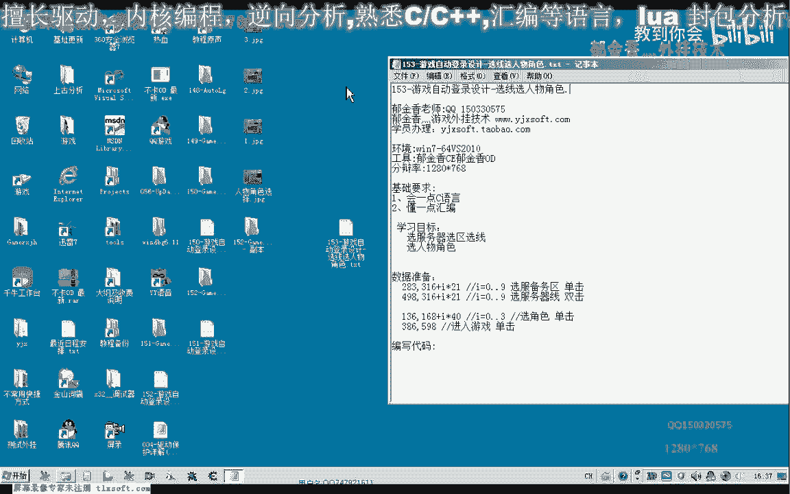
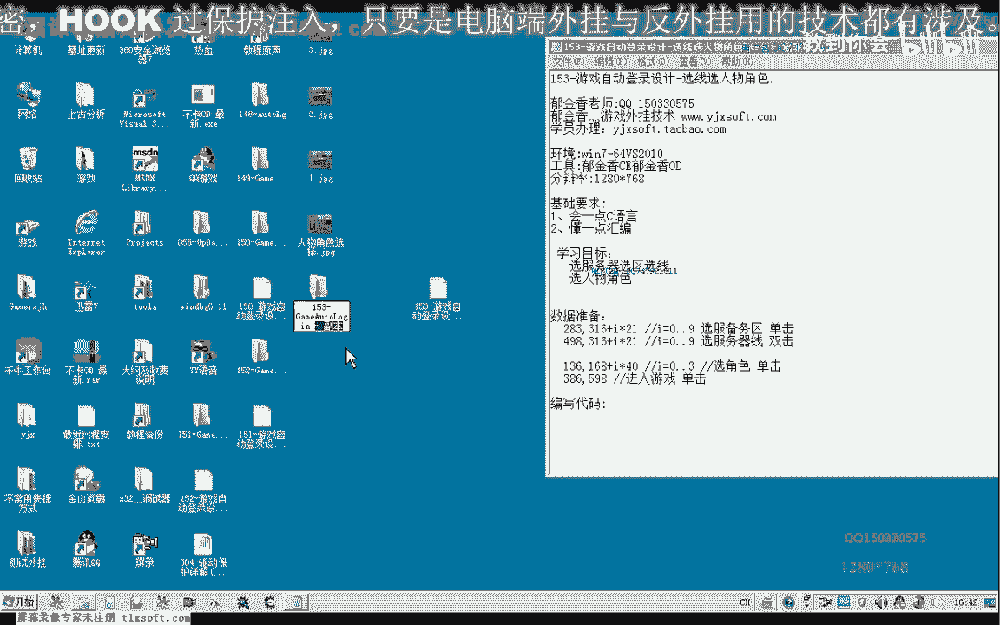
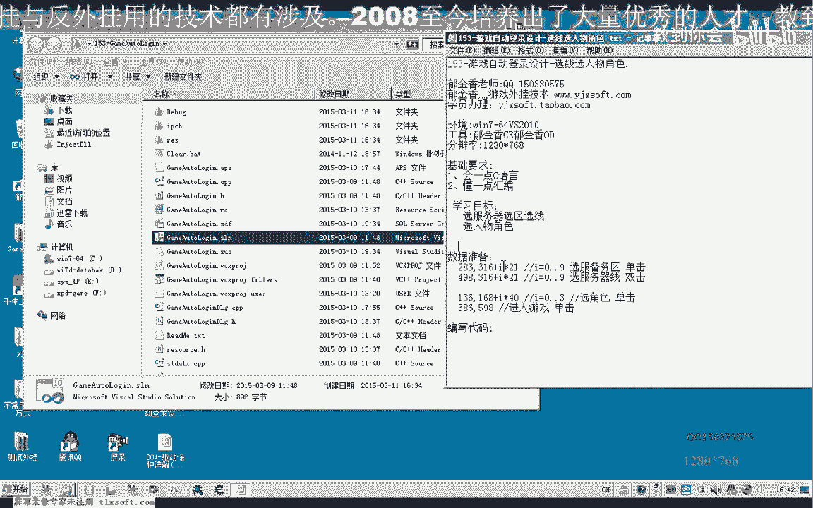
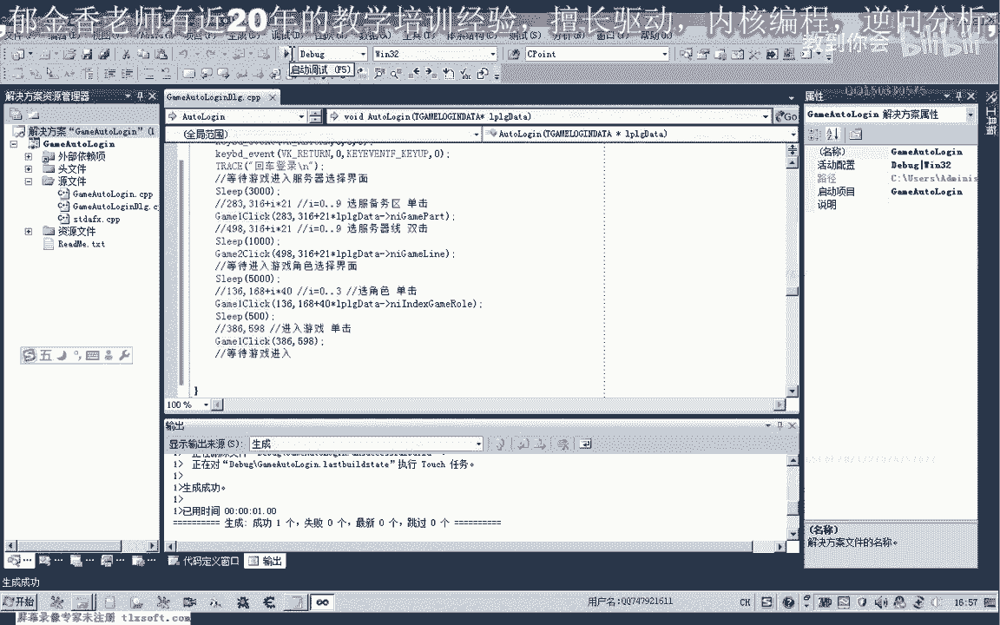
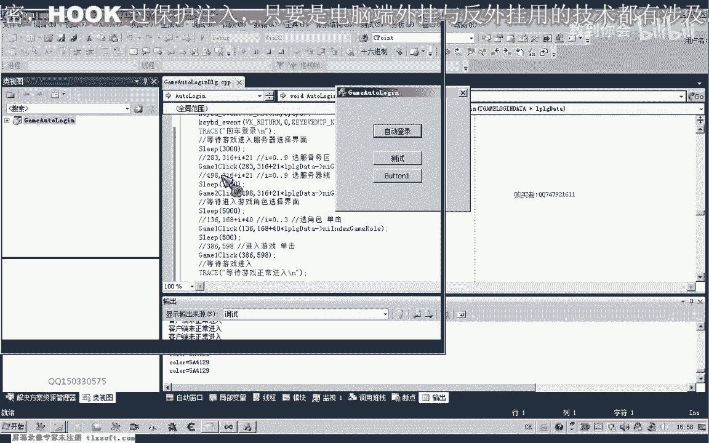
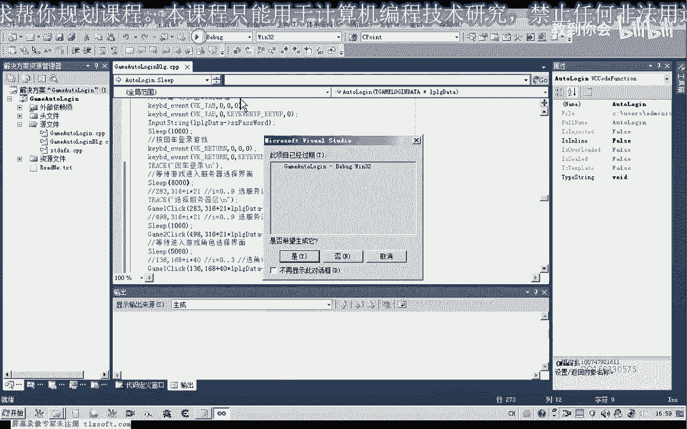
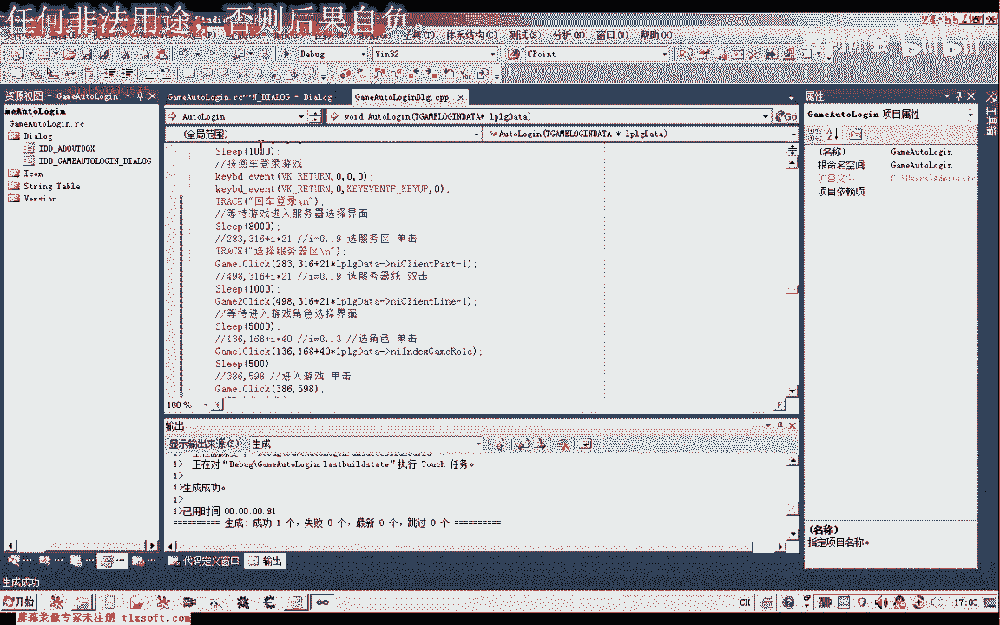
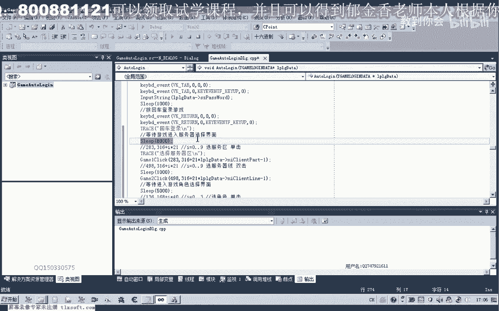
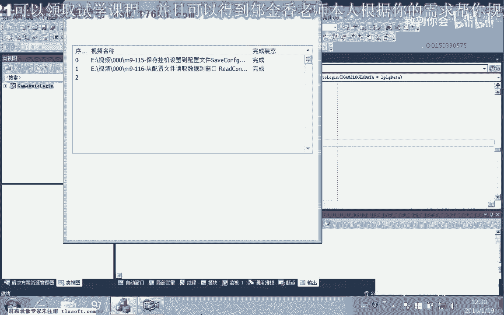

# 课程 P142：游戏自动登录设计 - 选区与选角色 🎮




在本节课中，我们将学习如何为游戏自动登录功能编写代码，核心目标是实现自动选择服务器分区、线路以及游戏角色，并最终进入游戏。我们将通过模拟鼠标点击来完成这些操作。

## 概述

上一节我们介绍了自动登录的基础框架。本节中，我们来看看如何具体实现选区、选线和选角色的功能。整个过程依赖于计算好的屏幕坐标，并通过代码模拟鼠标的单击和双击操作。

## 第一步：分析界面与计算坐标

首先，我们需要获取游戏登录界面中关键元素的屏幕坐标。通过截图分析，我们确定了以下数据：

以下是服务器分区选择的坐标计算：
*   分区选择区域的起始Y坐标约为305，结束Y坐标约为516。
*   总高度约为210像素，共10个分区，因此每个分区的高度差为21像素。
*   分区选择的X坐标固定，Y坐标遵循公式：`Y = 基础Y坐标 + 分区索引 * 21`。

以下是服务器线路选择的坐标计算：
*   线路选择与分区选择类似，其X坐标不同，但Y坐标的间隔同样为21像素。





以下是游戏角色选择的坐标计算：
*   角色选择区域的起始坐标约为(136, 168)。
*   四个角色水平排列，总宽度约为160像素，因此每个角色的宽度间隔约为40像素。
*   角色选择的X坐标遵循公式：`X = 基础X坐标 + 角色索引 * 40`，Y坐标固定。

进入游戏的按钮是一个固定坐标的单击操作。

## 第二步：编写鼠标模拟函数

为了简化操作，我们首先编写两个通用的鼠标模拟函数：一个用于单击，一个用于双击。

以下是鼠标单击函数的代码框架：
```c
void ClickAtPoint(int x, int y) {
    // 1. 查找游戏窗口
    // 2. 获取窗口左上角坐标(winX, winY)
    // 3. 计算实际屏幕坐标：screenX = winX + x; screenY = winY + y;
    // 4. 移动鼠标到(screenX, screenY)
    // 5. 执行鼠标按下和释放操作
}
```

以下是鼠标双击函数的代码框架，它在单击函数的基础上执行两次快速点击：
```c
void DoubleClickAtPoint(int x, int y) {
    ClickAtPoint(x, y);
    // 短暂延迟
    ClickAtPoint(x, y);
}
```

## 第三步：定义登录配置数据结构

我们需要一个结构体来存储登录时的选择配置，例如选择第几个分区、第几条线路以及第几个角色。

以下是登录配置结构体的示例：
```c
struct LoginConfig {
    int serverRegion; // 游戏分区 (0-9)
    int serverLine;   // 服务器线路 (0-9)
    int gameRegion;   // 游戏内分区 (0-9)
    int roleIndex;    // 角色索引 (0-3)
};
```
请注意，在代码中传递参数时，如果用户输入是从1开始的，需要在函数内部进行减1操作，因为我们的索引是从0开始计算的。

## 第四步：集成到自动登录流程




将上述函数和配置集成到主登录逻辑中。流程如下：




1.  **等待登录完成**：登录账号密码后，等待界面加载（例如3秒）。
2.  **选择游戏分区**：使用`DoubleClickAtPoint`函数，结合公式 `Y = 316 + serverRegion * 21` 进行点击。
3.  **选择服务器线路**：使用`DoubleClickAtPoint`函数，结合公式 `Y = 316 + serverLine * 21` 进行点击。
4.  **等待角色界面加载**：等待一段时间（例如3秒）。
5.  **选择游戏角色**：使用`ClickAtPoint`函数，结合公式 `X = 136 + roleIndex * 40` 进行点击。
6.  **进入游戏**：短暂延迟后，使用`ClickAtPoint`函数点击“进入游戏”的固定坐标。




在每一步操作之间，需要根据游戏客户端的响应速度添加适当的等待时间。


## 第五步：测试与调试

初始测试时，可能会因为等待时间不足或坐标计算有误导致失败。我们需要：

*   **添加调试信息**：在每一步操作前后打印日志，方便定位问题。
*   **调整等待时间**：将固定等待时间适当加长，确保界面元素加载完成。
*   **验证参数传递**：确保从配置结构体到点击函数的参数传递正确，特别是索引的减1操作。




## 第六步：优化与完善（下节课预告）

当前的实现使用固定等待时间，不够健壮。下一节课我们将进行优化：

*   **智能等待**：通过循环检测特定像素颜色或判断游戏窗口状态，来代替固定的`Sleep`等待。
*   **登录状态判断**：在尝试进入游戏后，通过读取游戏内存（如人物血量指针或角色基址）是否被正确赋值，来判断是否真正登录成功，从而决定是否启动后续的挂机脚本。

## 总结





本节课中我们一起学习了游戏自动登录中选区、选线和选角色功能的设计与实现。我们分析了界面坐标并推导出点击公式，编写了通用的鼠标模拟函数，定义了登录配置，并将所有步骤集成到自动登录流程中。通过本次实践，我们掌握了通过模拟用户操作实现界面自动化的基本方法。在下一节课，我们将着重优化等待机制和登录状态判断，使我们的自动登录脚本更加稳定和智能。