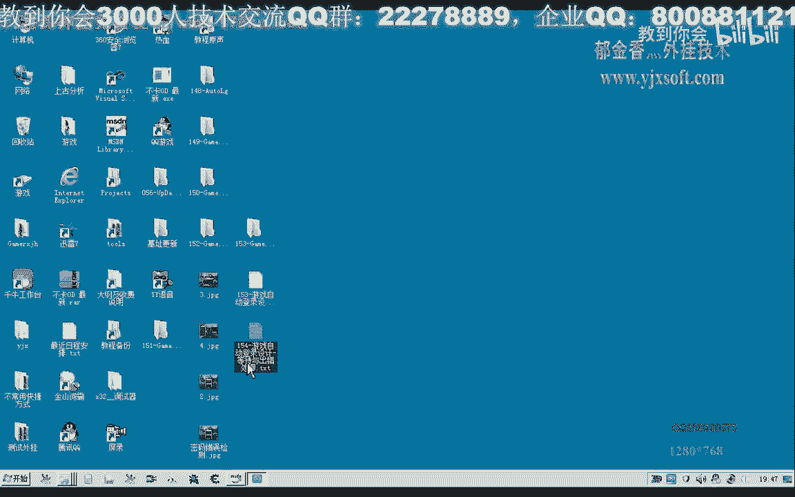
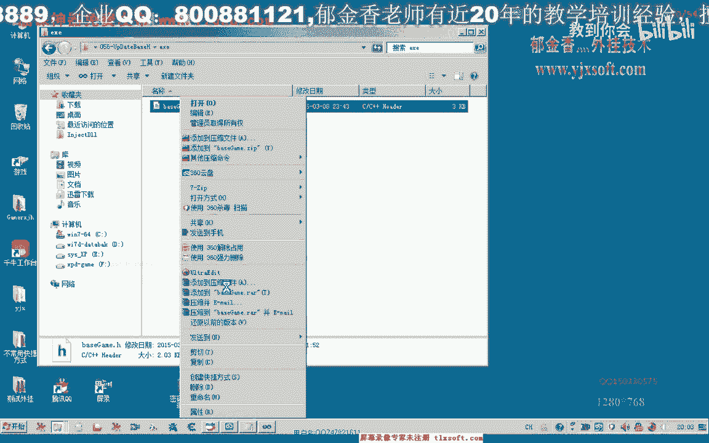
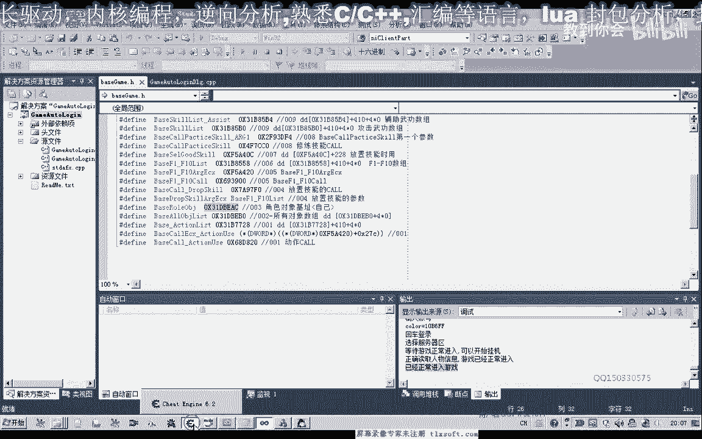
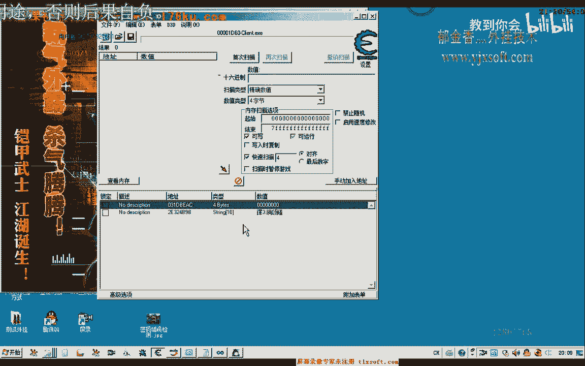
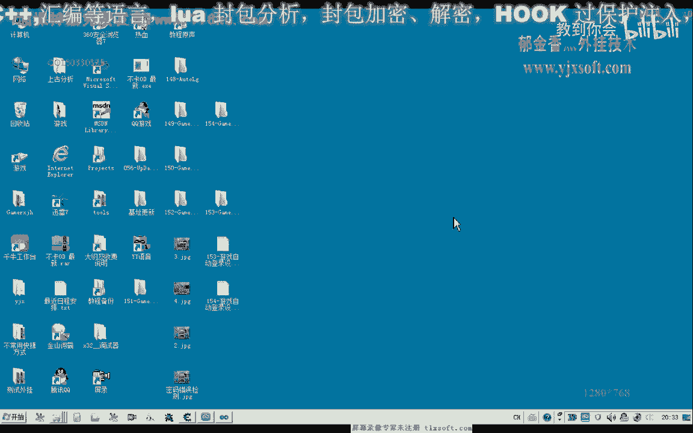
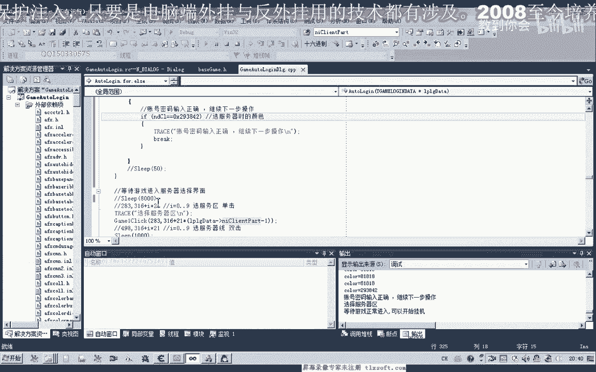
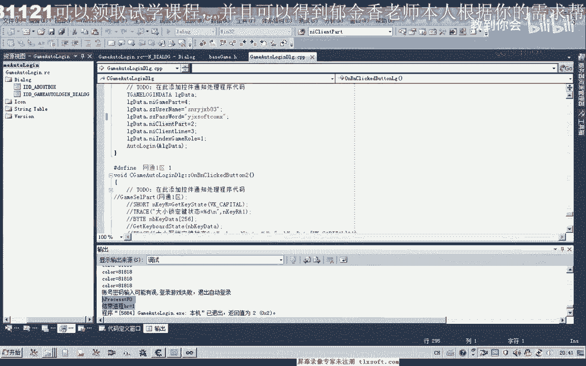

# 课程 P143：游戏自动登录设计 - 等待与出错处理 🛠️



在本节课中，我们将学习如何为游戏自动登录脚本添加等待机制和错误处理逻辑，以提高其稳定性和可靠性。我们将基于上一课的代码进行完善，确保脚本能够应对网络延迟、输入错误等异常情况。

---

## 概述

本节课的目标是完善自动登录函数，增加对登录过程中各种状态的等待判断和错误处理。核心内容包括：检测客户端是否成功启动、验证账号密码输入是否正确、判断游戏角色是否正常进入游戏，并在失败时进行相应处理。

---

## 一、 检测客户端启动状态

上一节我们介绍了自动登录的基本流程，本节中我们来看看如何确保游戏客户端成功启动。

首先，在登录函数中，我们需要在输入账号密码前，判断游戏客户端窗口是否成功打开。这里使用一个循环来持续寻找窗口句柄，并设置超时机制。

```cpp
// 伪代码示例：检测客户端窗口
HWND hWnd = NULL;
int i = 0;
for (i = 0; i < 1000; i++) {
    hWnd = FindWindow(NULL, "客户端窗口标题");
    if (hWnd != NULL) {
        break; // 找到窗口，跳出循环
    }
    Sleep(50); // 等待50毫秒
}
if (i >= 1000) {
    // 超过50秒未找到窗口，判定为启动失败
    return false;
}
```

以下是关键逻辑说明：
*   循环寻找目标窗口，每次循环间隔50毫秒。
*   设置最大循环次数为1000次，即最长等待50秒。
*   如果超时仍未找到窗口，则函数返回 `false`，表示自动登录失败。

---

## 二、 验证账号密码输入




在成功找到客户端窗口并输入账号密码后，我们需要验证输入是否被游戏接受。

一种有效的方法是检测登录界面某个特定像素点的颜色变化。输入正确的账号密码后，界面通常会切换，导致特定位置颜色改变。

```cpp
// 伪代码示例：检测密码输入后的界面变化
COLORREF targetColor = 0x00FF00; // 登录成功后目标点的颜色
POINT checkPoint = {296, 418}; // 需要检测的坐标点
int retryCount = 0;
bool loginSuccess = false;



while (retryCount < 50) { // 最大检测约2.5秒
    COLORREF currentColor = GetPixel(hDC, checkPoint.x, checkPoint.y);
    if (currentColor == targetColor) {
        loginSuccess = true;
        break; // 颜色匹配，登录成功
    }
    Sleep(50);
    retryCount++;
}


if (!loginSuccess) {
    // 账号密码可能错误，或登录失败
    return false;
}
```



以下是检测逻辑的要点：
*   在输入密码后，开始循环检测预设坐标点的颜色。
*   如果颜色变为预期的“成功状态”颜色，则跳出循环，继续后续步骤。
*   如果循环超时（例如2.5秒）后颜色仍未变化，则判定为账号密码错误或登录失败，函数返回 `false`。
*   更精确的方法可以检测密码错误时弹出的提示框所在位置的颜色。

---

## 三、 判断游戏角色正常进入

账号密码验证通过后，脚本会点击进入游戏。接下来需要判断游戏角色是否成功加载并进入游戏世界。

这里我们使用读取游戏内存中“人物角色指针”的方法来判断。在角色未进入游戏前，该指针值为空或零；成功进入后，该指针会被初始化为有效的对象地址。

```cpp
// 伪代码示例：通过角色指针判断游戏进入状态
DWORD roleBaseAddr = 0x12345678; // 人物角色基址
HANDLE hProcess = OpenProcess(PROCESS_ALL_ACCESS, FALSE, gamePID);
int waitTime = 0;
bool gameEntered = false;

while (waitTime < 1000) { // 最大等待约60秒
    DWORD rolePointer = 0;
    ReadProcessMemory(hProcess, (LPCVOID)roleBaseAddr, &rolePointer, sizeof(rolePointer), NULL);
    
    if (rolePointer > 0) {
        // 成功读取到有效的角色指针，说明已进入游戏
        gameEntered = true;
        break;
    }
    Sleep(60); // 每60毫秒检测一次
    waitTime++;
}

CloseHandle(hProcess);

if (!gameEntered) {
    // 超时未进入游戏，判定为登录失败
    TerminateProcess(...); // 结束游戏进程
    return false;
}
```


以下是此环节的核心步骤：
*   以读写权限打开游戏进程。
*   循环读取“人物角色指针”的内存地址。
*   如果读出的值大于零，说明角色已加载，游戏进入成功。
*   如果等待超时（例如60秒）后仍未读到有效值，则判定为登录失败，并强制结束游戏进程。


---




## 四、 错误处理与进程管理


在检测到任何一步失败时（如客户端未启动、密码错误、角色未进入），都应进行清理工作并返回错误状态。

关键操作是结束残留的游戏进程，防止留下未响应的客户端。

```cpp
// 在判定登录失败的各个分支中
if (登录失败) {
    if (游戏进程句柄有效) {
        TerminateProcess(hProcess, 0); // 强制结束进程
        CloseHandle(hProcess);
    }
    return false; // 向主调函数报告失败
}
```

---



## 总结




本节课中我们一起学习了如何为自动登录脚本添加健壮的等待与错误处理机制。
1.  **客户端启动检测**：通过循环和超时机制，确保脚本只在客户端成功启动后继续执行。
2.  **输入结果验证**：利用界面像素颜色变化，判断账号密码是否输入正确。
3.  **游戏进入判断**：通过读取游戏内存中关键指针的状态，确认角色是否成功进入游戏。
4.  **异常流程处理**：在任何一步失败时，妥善结束游戏进程并返回错误信息，保证脚本的稳定性和可控性。


通过实现这些逻辑，你的自动登录脚本将能够更可靠地处理各种异常情况，为后续的自动挂机或任务脚本打下坚实基础。