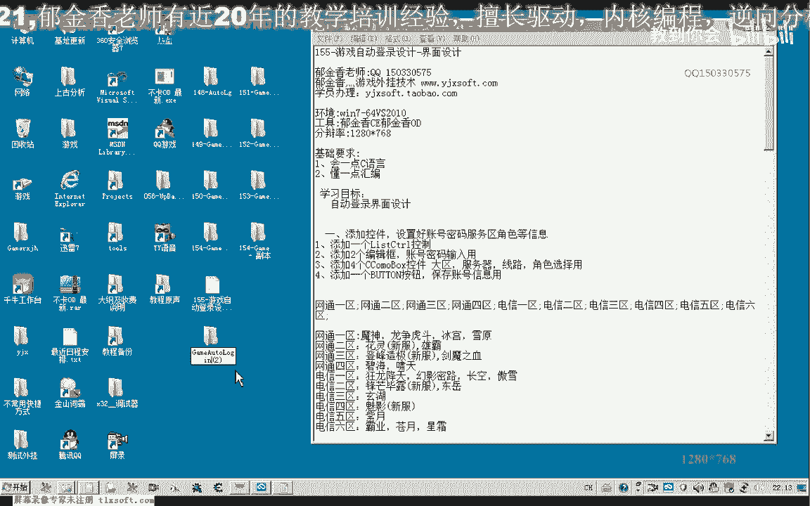
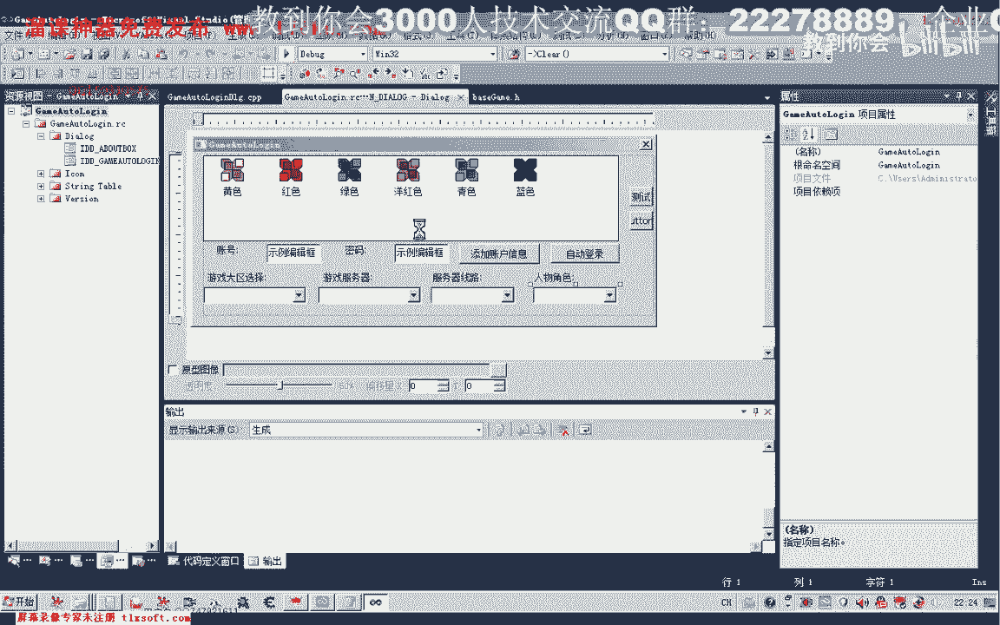
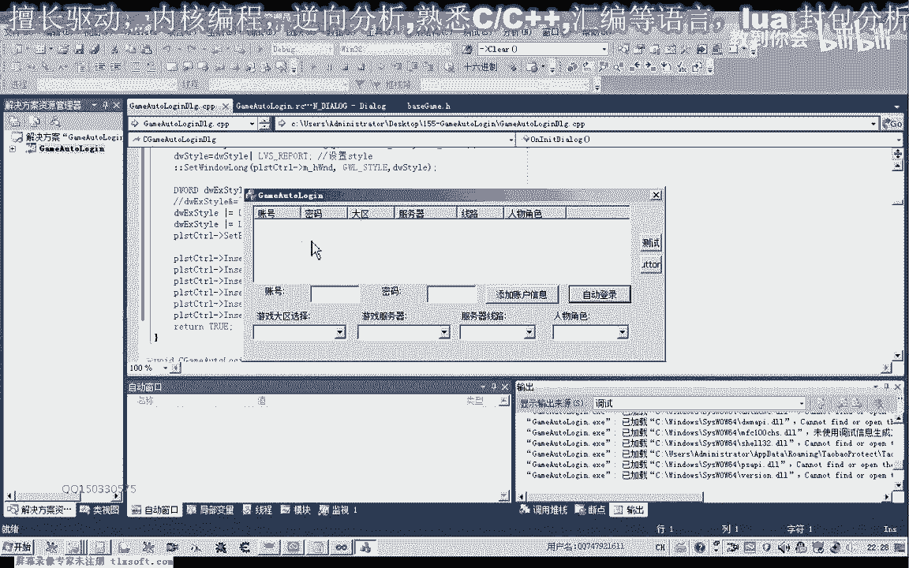
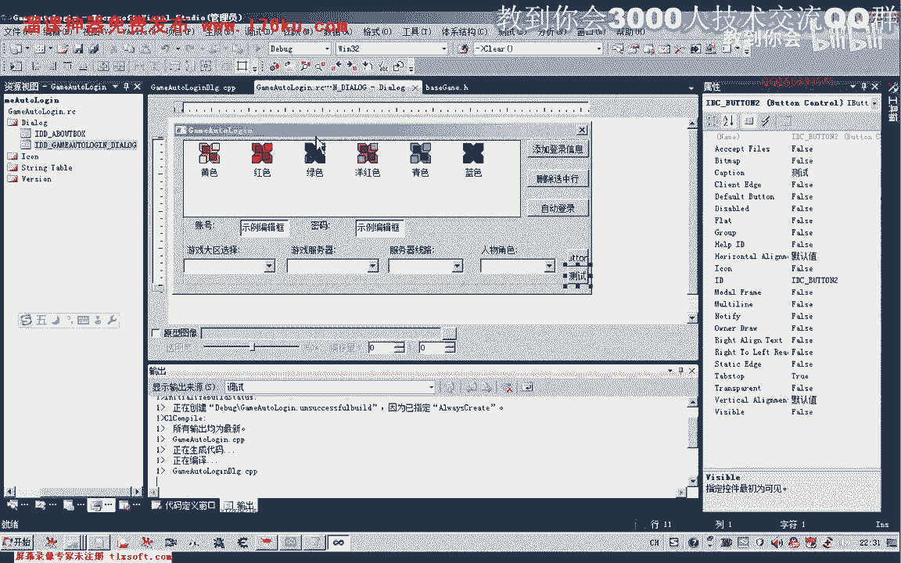
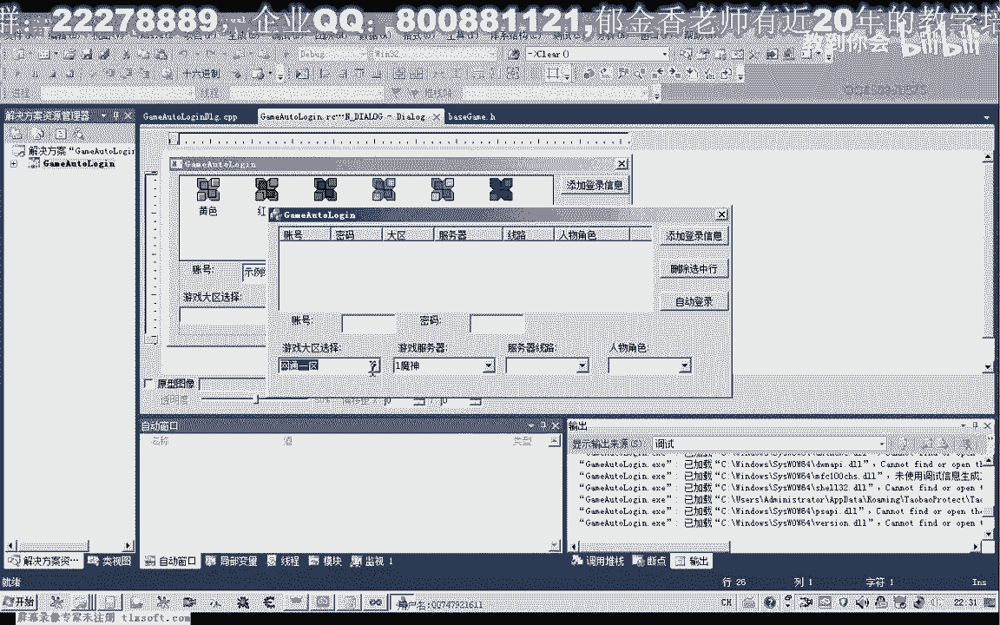
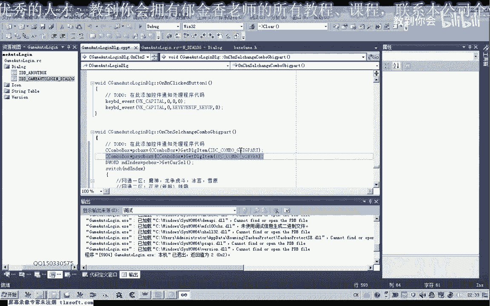

# P144：155-游戏自动登录设计-界面设计 - 教到你会 - BV1DS4y1n7qF

大家好，我是郁金香老师，那么这节课呢我们继续设计我们的游戏的自动登录啊。

那么主要这节课呢我们主要是设计一个嗯窗口的一个界面，那么我们打开154克的代码。

在他的基础上我们进行一些修改，咳咳咳咳，啊，那么打开之后呢，我们调整一下窗口的大小嗯，把这几个测试的按钮呢放到左边嗯，然后我们第一个来添加一个list country，找一下，那么这个历史题刚出来。

我们主要是一个表格用来保存呢，呃自动登录的一个账号，我们密码相关的一些信息，那么下面呢我们再添加两个文本框，用来就是输入我们的账号和密码的信息，然后呢调整一下啊，让他顶端对齐。

那么接下来呢我们在添加四个啊，combbox用来第一个我们是用来选择游戏的一个大区啊，也就是我们在登录的时候的这个游戏的网通一区二区，还有电信一区到六区，那么第二个呢就是选择某一个区的服务器。

那么服务器后边呢我们在需要选择的是它的一个线路啊，线路后边呢我们是选择的这个游戏的角色，大致是这样几个部分，选择顶端对齐，然后呢我们做上一些标记，在这里呢我们把上边的这个静态文本的方法再复制一下。

按住ctrl键拖动鼠标，那么第一个呢我们写，游戏大区选择，然后呢我们再次嗯游戏辅助器选择，然后再是服务器的线路选机，最后呢再是我们的人物角色选择，那么大概是这几个，然后呢我们让它顶端对齐，嗯。

那么调整之后呢，然后我们再进行一些初始化数据选择，那么首先呢我们属性里面呢，我们把这个自动排序啊，给它关掉啊，防止它自动进行排序，然后呢我们把我们相关的一些信息呢把它放进去啊。

初始化的这里游戏大区呢就是往东一区到市区，电信一区到六区，那么我们在他的d a t选项里面啊，给它进行一个初始化，然后把他的id改一下就更好，你第一个炮塔游戏大区的一个选择，然后再是一个服务器的选择。

啧啧这里的id改一下u p的一个线路选择，最后呢我们是游戏的一个人物角色的一个选择，嗯，然后这里呢我们是密码，那么这里呢是我们的一个账户，嗯然后我们再需要一个，这个button按钮。

那么这里呢是添加我们的信息呢，添加到我们上边的这个框里面去，嗯，表格里边去，我们把这个表格再往后移，那么这里顶端我们再给它对齐一下，然后呢自动登录，我们移到这个位置了，那么自动登录的话。

实际上最后呢我们可能会以这个复选框的呃这个形式呃来该出，那么我们暂时呢我们就这样设计了这个测试呢，我们把它调小一点，好的，我们先保存一下，然后呢我们要对嗯对它进行了一些初始化啊。

然后呢这个服务器的一个初始化的话，它是根据它所选的这个分区，比如说我们网通一区呢有这几个服务器，那么我们在选择网通一区的时候呢，这个combbox这个列表里边的话，我们就需要添加这几个服务器的信息。

那么如果我们选择是网通二区的时候呢，那么这里呢我们添加啊这里的一些信息，那么这里的编号的话，我们就是来从零最后来到九啊，那么我们双击这里啊，双击这个空间，那么当这个控件它的选择改变的时候。

那么我们在这里呢添加我们的这个相关分支的代码switch，当然呢我们首先呢需要取得这个控件的这个指针啊，那么我们在这里呢可以了，直接复制它的这个代码。

那么我们再来看一下这个代码是怎么写的。

那么首先呢我们取得啊这个相应的控件的一个指针，先取得这个comb列表框的这个游戏的大区啊，及big part，那么这个指针取下来之后啊，我们呢先取得他所选择的服呃这个序号啊，如果是零。

那么我们就是网通的一区，那么我们就给他添加这几个数字，那么在这一行呢我们就清空列表对对，那么这个列表的话，我们是指的这个服务器啊，选择了这个列表，那么先取得这个控件的这个指针。

然后呢我们对这个第二个啊控件呢就添加我们相应的服务器啊，添加我们相应的服务器，好的，我们先运行一下，看一下它的一个效果。

那么这个时候呢这里我们如果选择网通一区的时候呢，那么这里面呢它会出来相应的一些信息，当然这个列表呢呃我们还需要调整它的大小，不然的话看不到啊，这里面的这些信息。

那么我们先把它调整一下，点一下这个三角形，然后我们把这个往下拉，然后点一下这个服务器的啊，这个三角形往下拉一下，呃服务器线路的啊，往下拉一下，等一下这个空间的也忘了，下边来拉一下。

好那么这个时候呢我们相应的电信六区啊，最后这个区呢呃没有输入完整，那么我们选网通二区的时候呢，就是8年或雄霸这两个服务器，只有选网通一区的时候呢，它有四个服务器，那么选电信六的时候呢，它只有三个服务器。

那么选网通四的时候呢有两个啊啊有的有两个，有的也有一个的，这里也是两个，那么服务器线路的话，那么一般情况下啊，嗯它都是啊六个都是零到啊，一到十啊，一共都是十条线路啊，只有特殊的情况呢。

它的线路呢可能只有五条或者是六条啊，那么所以说在这里的话，我们呢就不用再通过这个服务器去去关联啊，直接呢我们就给它默认的呃，把它设置为十条线路啊，好那么最后这个是人物角色的这个信息哈。

那么角色的话我们就用角色1234这样来代替，好复制一下，那么一般情况呢是四个角色啊，那么在这里呢我们就添加四个啊相关的信息，那么最后的话实际上我们保存的话，保存的时候呢，我们都按照序号来保存就可以了。

给它添加相应的这个信息就可以了，那么这是一个界面的一个设计啊，那么我们这这个表格呢，我们这里呢还还需要一些初始化，那么我们首先来设置它的一个这个表格的一个i d啊，重新把它设置一下，那么设置之后呢。

我们找到这个窗口内，然后它的这个初始化函数转进去，在最后哈，这里呢我们添加我们自己的代码，那么这段代码添加进去，说实话这个，账户登录相关第二个，我看那么首先呢我们也是需要先取得啊。

先取得一下这个相应的指针，这一行呢我们得把它注释掉，这一行不需要，然后呢我们取得它的一个样式啊，然后我们把它设置为这个reporting这种这种表格的样式啊。

然后呢在后面呢我们是设置它的一个扩展的一个信息，啊，然后这里设置网格线啊，后边呢我们就呃设置了相应这个列的一些信息，好的我们再次编译生成一下啊。

好那么这里呢我们账号的信息呢最主要添加在在这个表格。

密码，我们添加在这个表格，然后呢是游戏的一个大区啊，它的信息呢我们添加在在这个表格里边啊，然后呢我们这里是服务器啊，它的一个线路信息呢我们添加在这里嗯。

最后呢我们是人物角色的添加在这里大致就是这样一个信息啊，啊，好的嗯，那么我们保存一下，那么这节课呢我们界面的设计呢，我们就到这个位置，那么下一节课呢我们再来设计一个相关的一个代码啊。

比如说我们添加账户的一个信息，这里呢我们应该还有一个呃删除的一些按键啊，这两个的话我们可以来把它隐藏掉啊，或者改一下它的名字了，那么我们还是另外添加两个按钮，那么这里呢我们用来了添加或删除。

把它设置小一点，还可以，八点，那么这个呢我们就是删除，那么这个visible这里呢我们把它设置为不可见哈，好的，那么这就是大致的一个界面的一个自动登录的一个界面的一个设。

设置了，就是这样，那么还有一点呢我们也可以进行一个设置，在它呃初始化的时候，那么我们在这里呢我们选择了默认的给它设置一个选中的行啊。

嗯，那么这里呢默认我们选择这个网通四区的话，也就是三，那么既然是默认的选择了网通四区的话，我们呢在后边呢也要做一些初始化啊，那么我们再退回来啊，这里呢我们要调用这个k3 的相关的一个代码。

还有我们需要对这个组织来进行初始化。

好再次我们生成一下，啊这个时候呢网通是去他默认选择的是这个第一个服务器啊，那么这就是我们的一些初始化，那么线路这里呢我们也可以跟他初始化一下。

还有人物角色，这里你跟他初始化一下，这样来看起来呢它有一个默认的设置啊，不是那么单调啊，嗯那么我们可以来在后边呢再次添加相关的信息，首先我们在这里呢没有关联相应的控件，我们就跟它指定相应的这个指针。

最后一个我们是人物角色的，好的我们再次申请一下，好那么这里呢都有一些呃初始值，那么这里需要一个账号和密码嗯，然后呢我们就其他的这个代码呢，我们在下节课呢再来陆续的完成。

那么这一节课我们界面的一个设计的话啊。

就到这里。