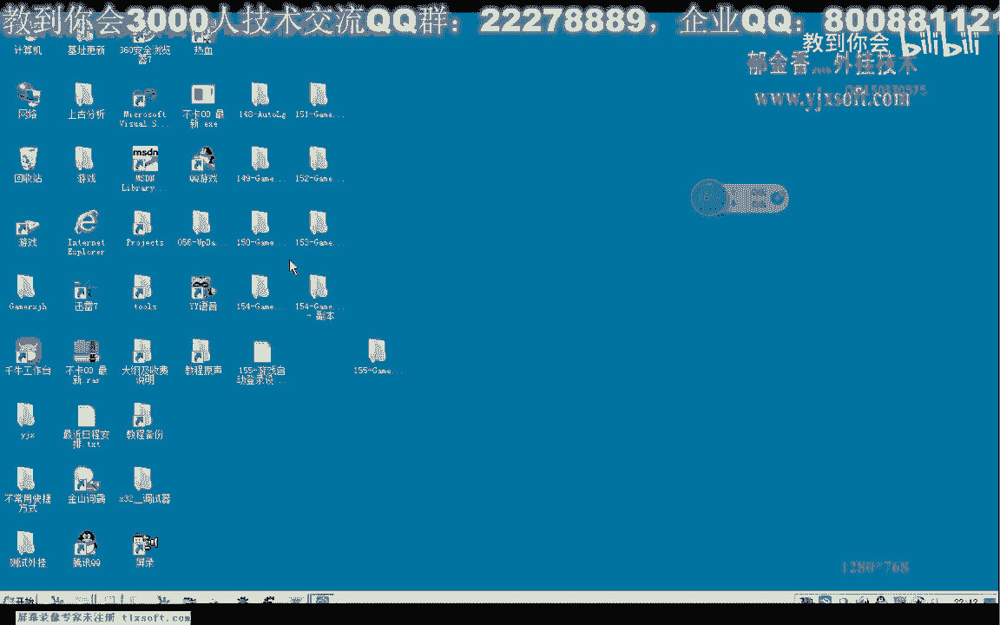

# 课程 P144：游戏自动登录设计 - 界面设计 🎮

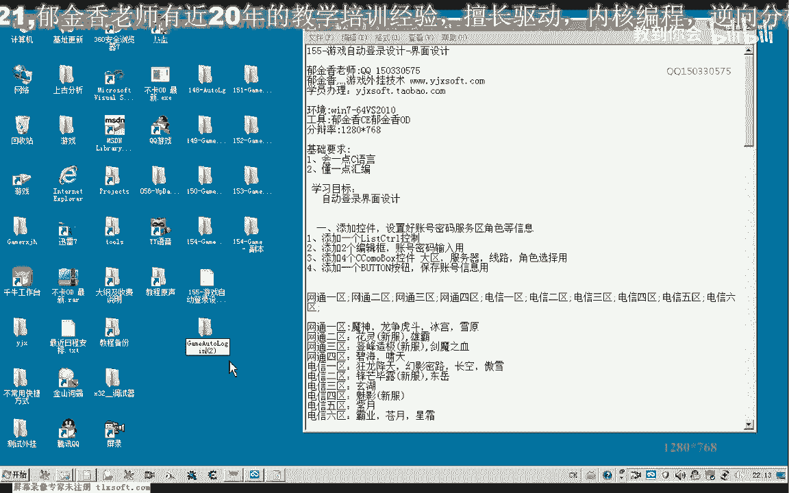

在本节课中，我们将学习如何为游戏自动登录程序设计一个用户界面。我们将基于上一节课的代码，添加列表控件、文本框、下拉框等元素，并完成界面布局与数据初始化。

---

## 界面布局设计

上一节我们介绍了项目的基础框架，本节中我们来看看如何设计主窗口的界面布局。

我们打开第154课的代码，在其基础上进行修改。首先调整窗口大小，并将测试按钮移至左侧。

以下是界面需要添加的核心控件：

*   **列表控件 (List Control)**：用于保存自动登录的账号、密码等相关信息。
*   **文本框 (Edit Control)**：两个，分别用于输入账号和密码。
*   **下拉框 (Combo Box)**：四个，分别用于选择游戏大区、服务器、服务器线路和游戏角色。

调整这些控件的位置，使其顶端对齐。接着，我们为下拉框添加说明标签。

以下是添加静态文本标签的步骤：

1.  复制已有的静态文本控件。
2.  按住 `Ctrl` 键并拖动鼠标进行复制。
3.  将标签文本分别修改为：“游戏大区选择”、“游戏服务器选择”、“服务器线路选择”和“人物角色选择”。

调整完毕后，再次确保所有控件顶端对齐。

---

## 控件属性与数据初始化

界面布局完成后，我们需要对各个控件的属性进行设置，并初始化其数据。

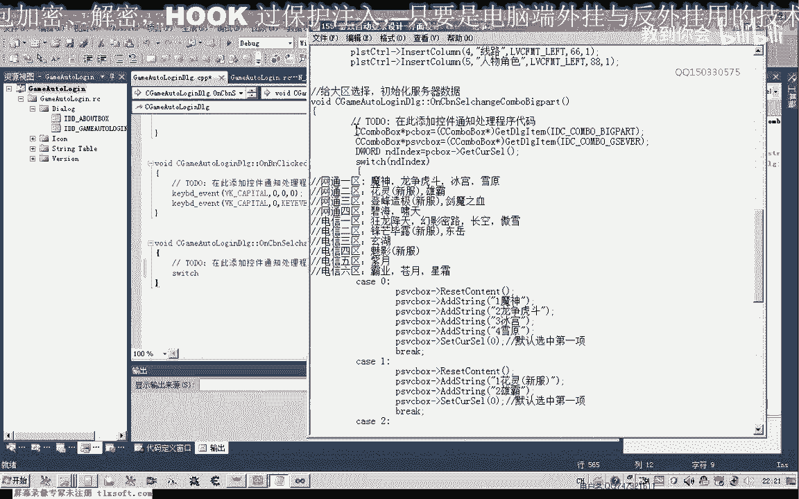

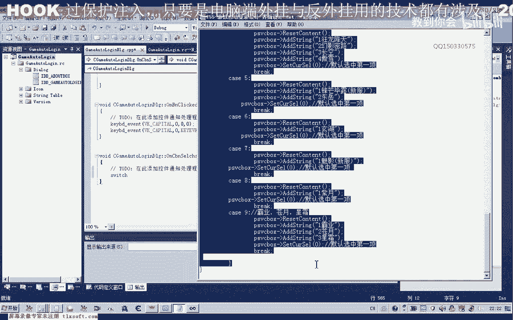

首先，在列表控件的属性中，关闭“自动排序”功能。然后，我们初始化各个下拉框的选项。

以下是各下拉框的初始化数据：

*   **游戏大区**：网通一区到四区，电信一区到六区。在控件的 `Data` 属性中进行初始化。
*   **服务器**：其选项将根据所选大区动态变化。
*   **服务器线路**：通常为1到10条线路，可先默认设置。
*   **人物角色**：可初始化为“角色1”、“角色2”等。

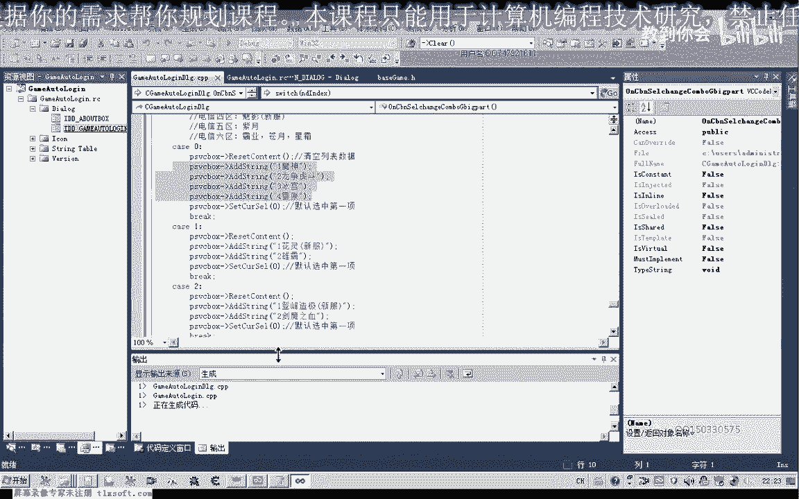

接着，我们添加两个按钮控件，分别用于“添加”账号信息到列表和“删除”列表中的信息。将“自动登录”功能调整为复选框形式，并调整测试按钮的大小。

保存当前设计后，我们需要编写代码来实现服务器列表的动态联动。

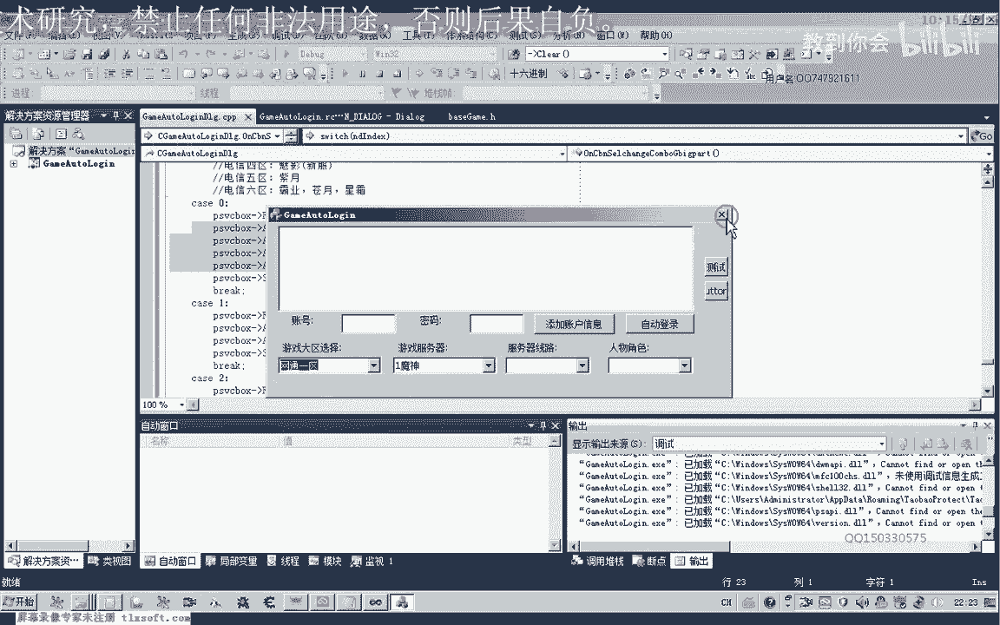

---

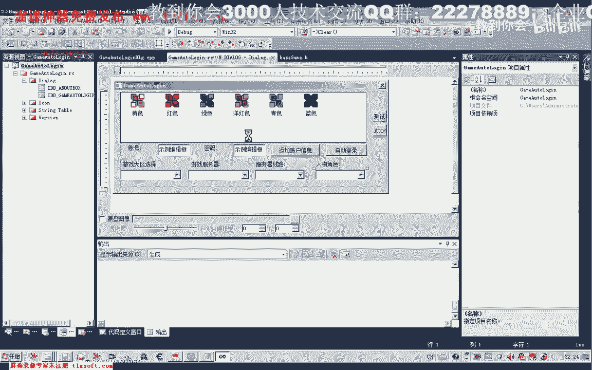

## 实现控件联动逻辑

当用户选择不同的游戏大区时，服务器下拉框的选项应相应改变。我们通过为“游戏大区选择”下拉框添加事件处理函数来实现。

双击该下拉框控件，为其“选择改变”事件生成处理函数。在该函数中，我们需要编写分支逻辑。

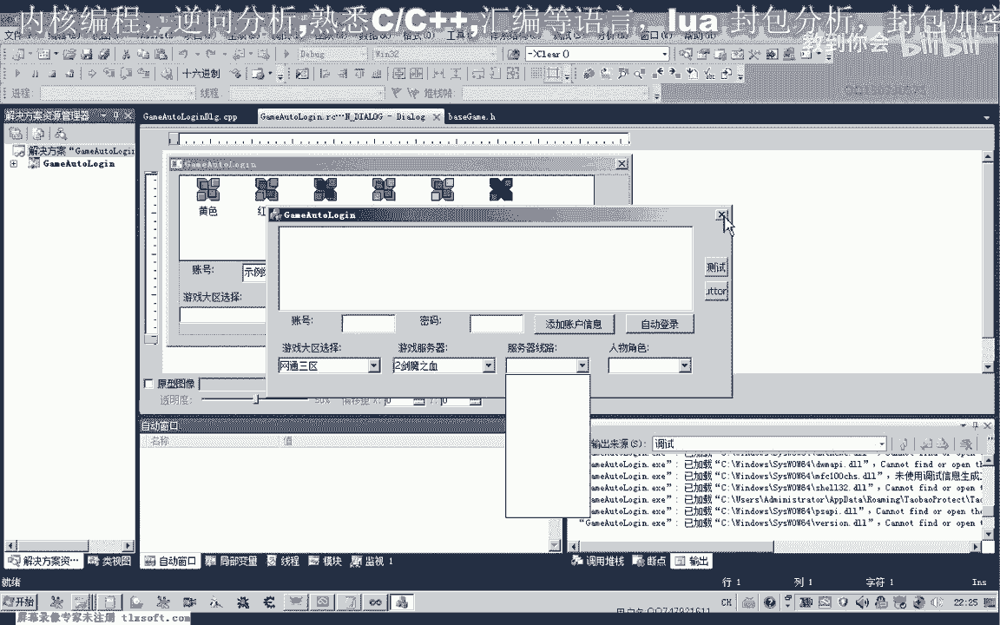

核心逻辑公式如下：
1.  获取游戏大区下拉框的指针。
2.  获取当前选择的序号 `index`。
3.  使用 `switch` 语句，根据 `index` 值清空并填充服务器下拉框的选项。

例如，当 `index` 为 0（网通一区）时，向服务器下拉框添加“雪原”、“雄霸”等选项。

运行程序测试，选择“网通一区”时，服务器下拉框应显示对应的服务器列表。调整下拉框的大小以确保所有选项可见。

对于“服务器线路”和“人物角色”下拉框，我们可以直接进行静态初始化，例如默认设置10条线路和4个角色。

---

## 列表控件样式与初始化

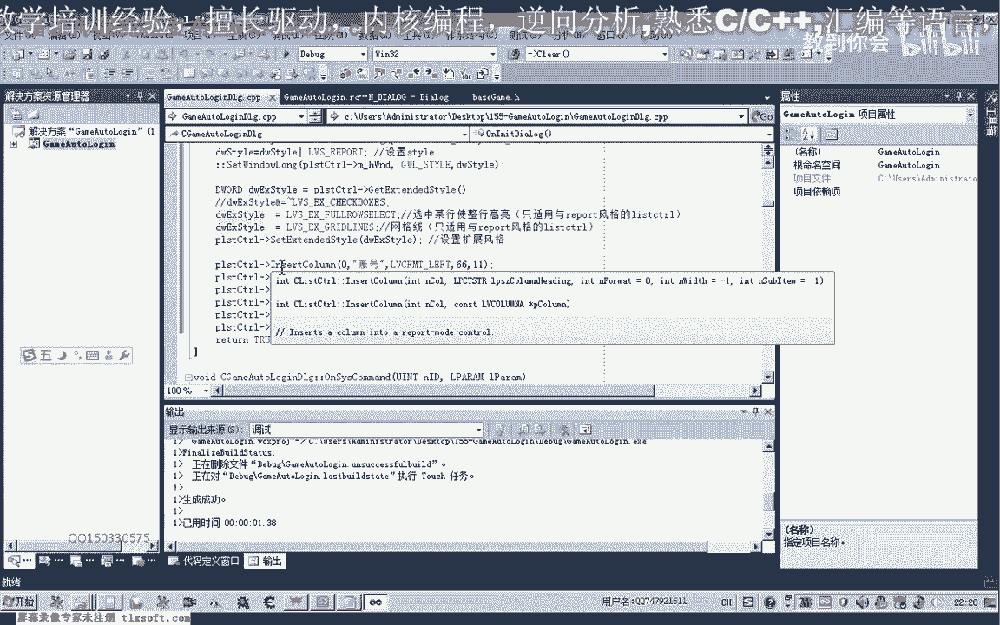

接下来，我们需要详细设置列表控件的样式，并在窗口初始化函数中为其添加表头。

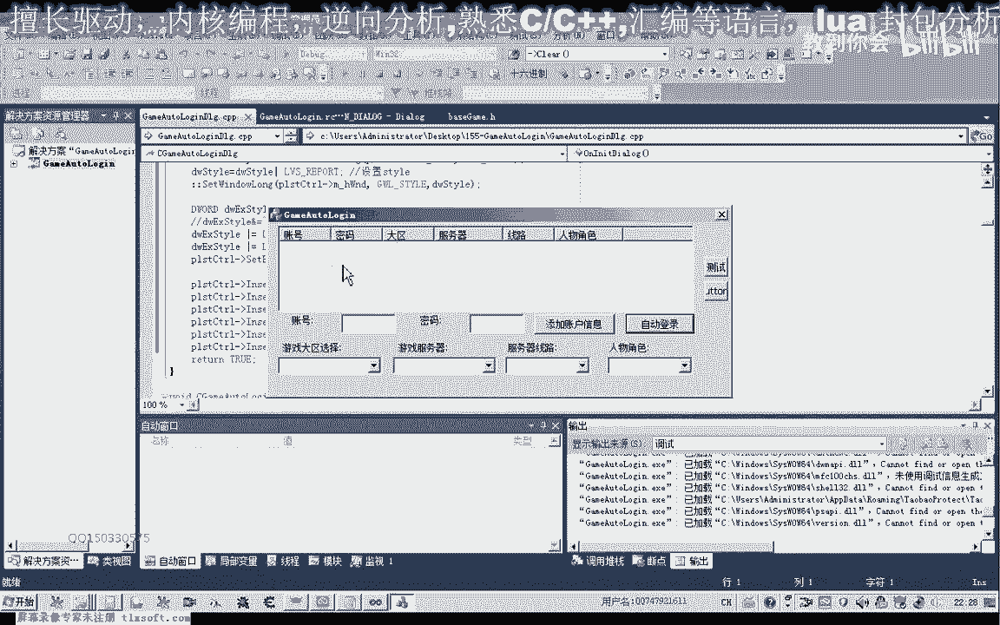

在对话框的 `OnInitDialog` 初始化函数末尾，添加自定义代码。

以下是初始化列表的核心代码步骤：

```cpp
// 1. 获取列表控件指针
CListCtrl* pList = (CListCtrl*)GetDlgItem(IDC_LIST1);
// 2. 设置控件为报表样式
pList->ModifyStyle(0, LVS_REPORT);
// 3. 设置扩展样式（如网格线、整行选择）
pList->SetExtendedStyle(LVS_EX_GRIDLINES | LVS_EX_FULLROWSELECT);
// 4. 插入列并设置列宽
pList->InsertColumn(0, _T("账号"), LVCFMT_LEFT, 80);
pList->InsertColumn(1, _T("密码"), LVCFMT_LEFT, 80);
pList->InsertColumn(2, _T("大区"), LVCFMT_LEFT, 60);
pList->InsertColumn(3, _T("服务器"), LVCFMT_LEFT, 80);
pList->InsertColumn(4, _T("线路"), LVCFMT_LEFT, 50);
pList->InsertColumn(5, _T("角色"), LVCFMT_LEFT, 60);
```

编译运行后，列表控件将显示带有“账号”、“密码”、“大区”、“服务器”、“线路”、“角色”表头的表格。

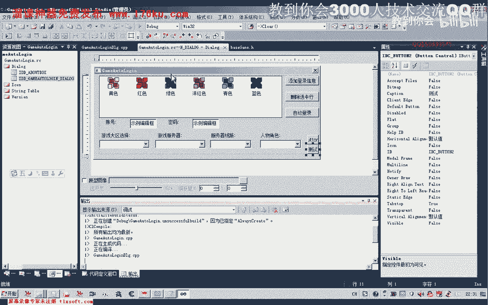

---

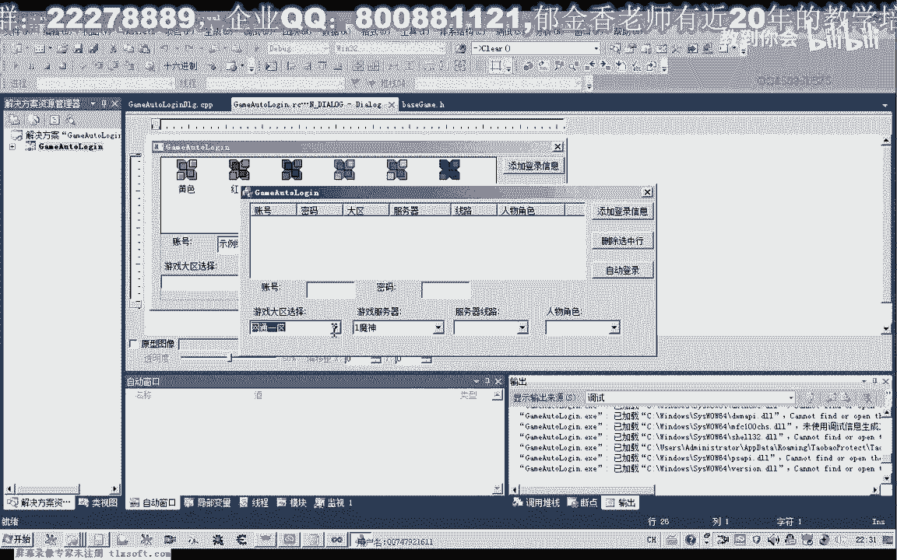

## 完善默认设置

为了使界面启动时更友好，我们可以为各个下拉框设置默认选中项。

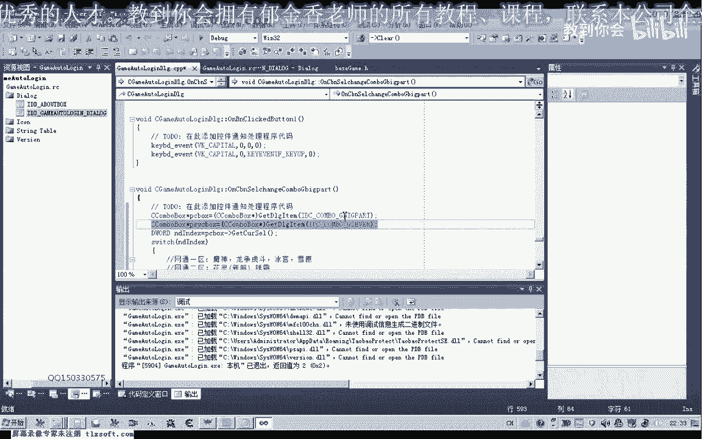

例如，在初始化函数中，将游戏大区默认设置为“网通四区”（索引为3）。设置后，需要手动调用服务器选择改变的事件处理函数，以联动初始化服务器列表。

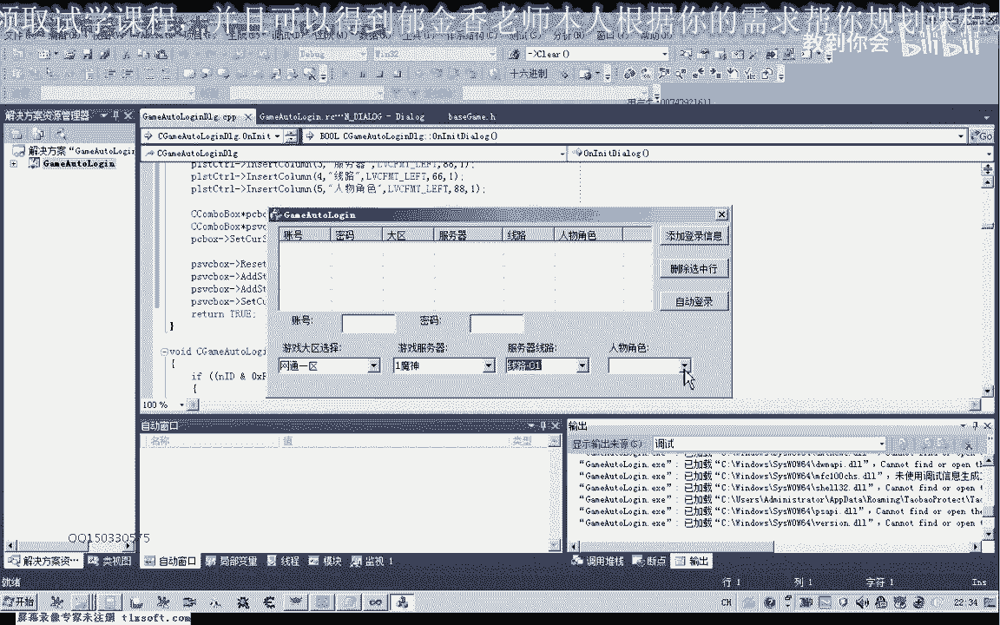

同样，我们也可以为“服务器线路”和“人物角色”下拉框设置一个默认选项。

最后，确保所有控件变量都已正确关联。至此，一个功能清晰、具备联动效果的自动登录程序界面就设计完成了。

---

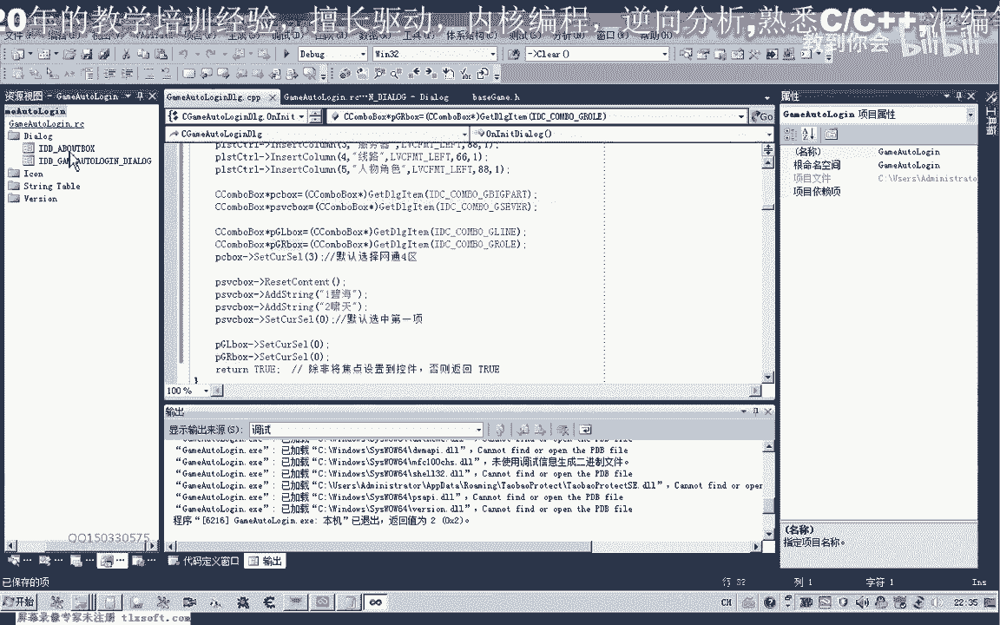

本节课中我们一起学习了游戏自动登录程序的界面设计。我们完成了主窗口的布局，添加了列表、文本框、下拉框等控件，实现了下拉框之间的数据联动，并完成了列表控件的样式初始化与数据展示。下一节课，我们将在此基础上，实现“添加”和“删除”账号信息的核心功能代码。