# 课程 P145：156-游戏自动登录设计-批量账号信息处理 📝

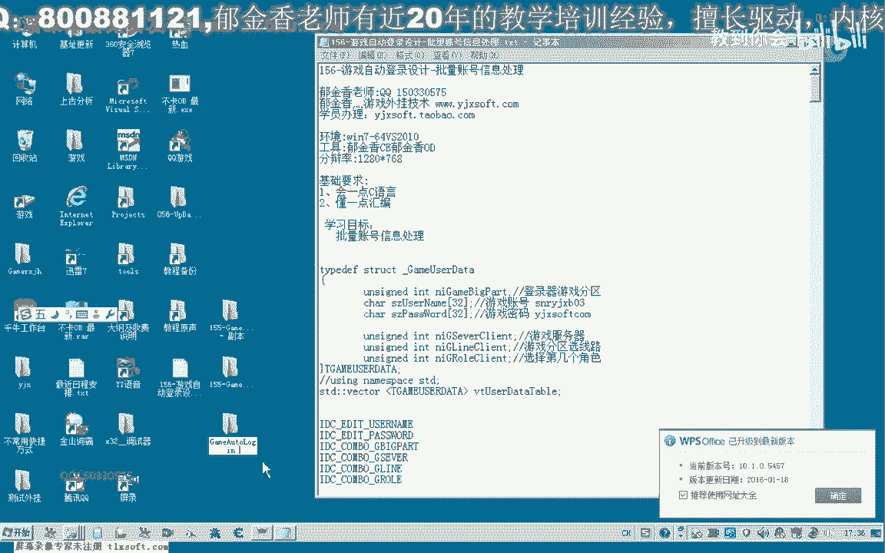

在本节课中，我们将学习如何为游戏自动登录程序编写批量账号信息处理功能。我们将基于上一节课的代码，实现账号信息的添加、显示和删除，并设计数据结构来管理多个账号。

---

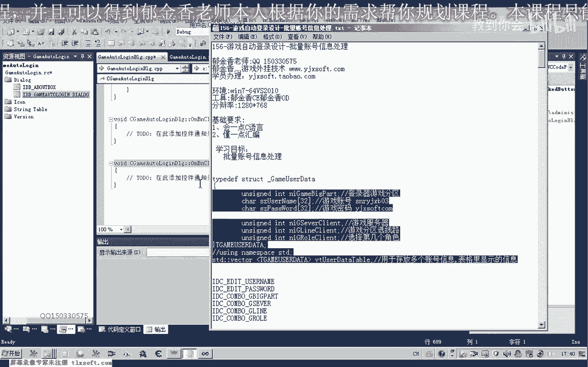

## 概述

上一节我们介绍了游戏登录界面的基本设计。本节中，我们将重点实现批量账号信息的处理逻辑。这包括定义一个结构体来存储账号信息，使用动态数组管理多个账号，并将数据显示在表格控件中。

---

## 定义账号信息结构体

首先，我们需要定义一个结构体来存储单个账号的所有登录信息。这个结构体包含账号、密码、大区、服务器、线路和角色等信息。

```cpp
struct AccountInfo {
    CString strUsername; // 用户名
    CString strPassword; // 密码
    int nZone;           // 大区索引
    int nServer;         // 服务器索引
    int nLine;           // 线路索引
    int nRole;           // 角色索引
};
```

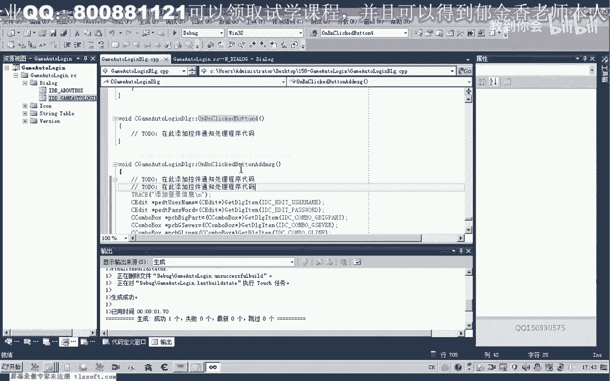

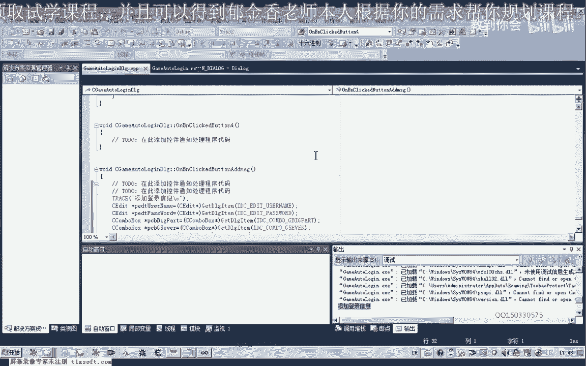

为了管理多个账号，我们使用一个 `std::vector` 动态数组。

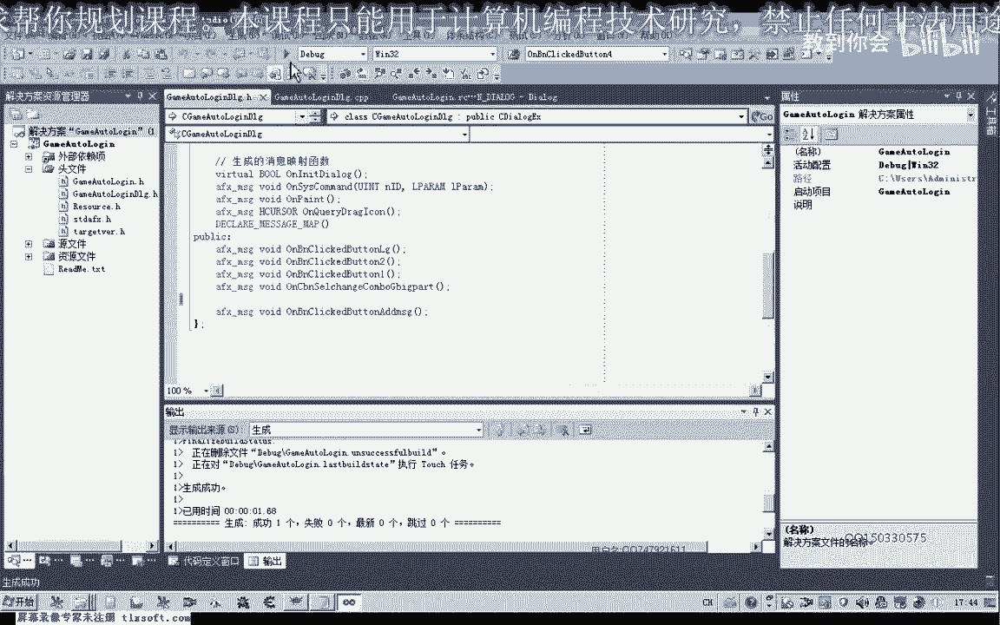

```cpp
std::vector<AccountInfo> m_vAccountList; // 用于存放多个账号信息
```


定义好结构后，需要在文件头部包含必要的头文件，例如 `<vector>`。

---

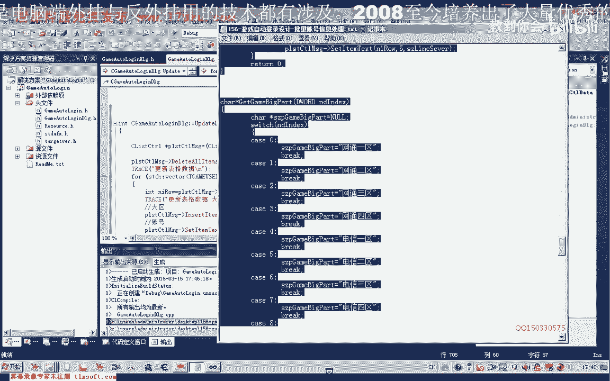

## 实现信息添加功能

接下来，我们实现“添加登录信息”按钮的功能。该功能需要从界面的各个输入控件中获取数据，填充到 `AccountInfo` 结构体中，然后将其添加到 `m_vAccountList` 数组。

以下是实现该功能的核心步骤：

1.  获取各个控件（如编辑框、组合框）的指针。
2.  从控件中读取文本或选项索引。
3.  将读取到的值赋值给一个新的 `AccountInfo` 对象。
4.  将新对象 `push_back` 到 `m_vAccountList` 数组中。
5.  调用更新表格的函数，将数组数据显示出来。

在编写代码时，需要注意控件ID冲突的问题。如果发现点击按钮没有反应，可能是消息映射关联到了错误的函数。需要检查资源ID，并确保消息映射指向正确的处理函数。

---

## 更新表格显示数据

数据添加到数组后，我们需要将其同步显示到列表控件中。为此，我们编写一个 `UpdateListCtrl` 函数。

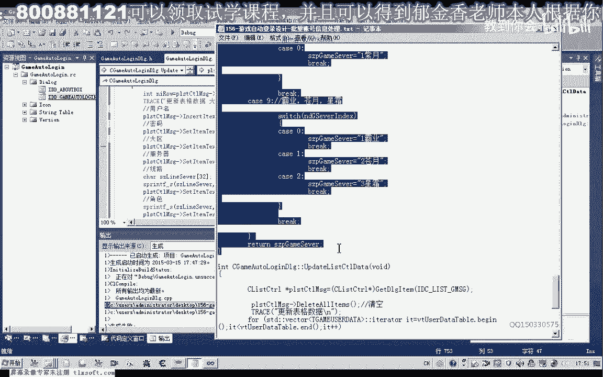

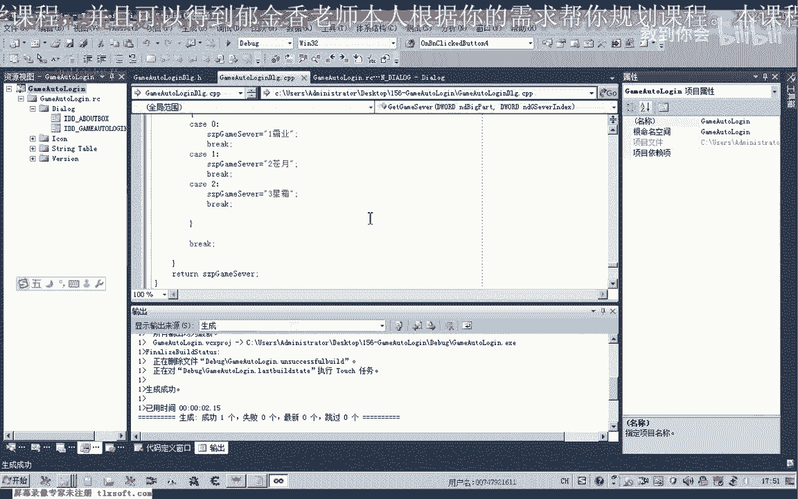

这个函数的主要逻辑是清空列表现有项，然后遍历 `m_vAccountList` 数组，将每个账号的六项信息依次插入到列表的新行中。

对于非文本类型的数据（如大区、服务器索引），我们需要将其转换为用户可读的文字。这需要两个辅助函数：

*   `GetZoneName(int nIndex)`: 根据大区索引返回大区名称（如“网通一区”）。
*   `GetServerName(int nZone, int nServer)`: 根据大区索引和服务器索引返回服务器名称。这里使用嵌套的 `switch` 结构来实现。

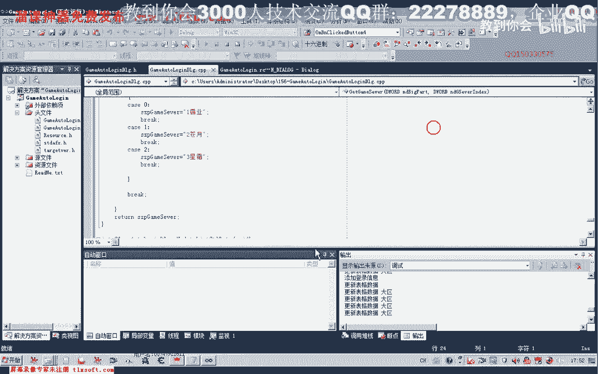

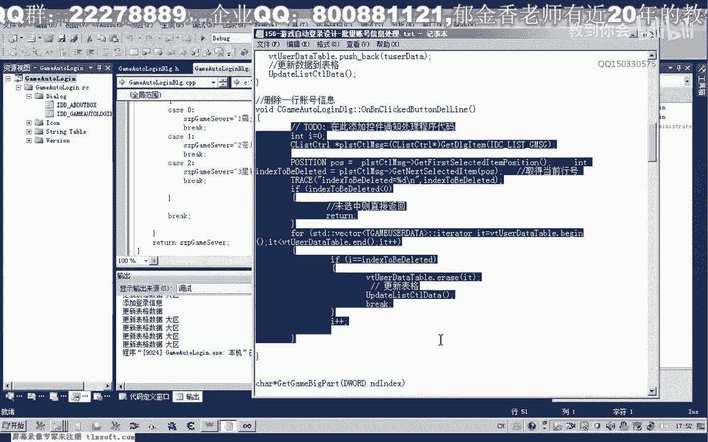

```cpp
CString GetServerName(int nZone, int nServer) {
    switch(nZone) {
        case 0: // 网通一区
            switch(nServer) {
                case 0: return _T("龙争虎斗");
                case 1: return _T("雄霸天下");
                // ... 其他服务器
            }
            break;
        case 1: // 电信四区
            switch(nServer) {
                case 0: return _T("啸天");
                // ... 其他服务器
            }
            break;
        // ... 其他大区
    }
    return _T("未知");
}
```

在插入数据时，注意索引通常从0开始，而显示给用户时通常从1开始（例如“线路1”、“角色1”），因此需要进行 `+1` 处理。

---

## 实现信息删除功能

我们还需要提供删除已添加账号信息的功能。以下是删除选中行信息的步骤：


1.  获取列表控件中当前选中的行号。
2.  如果行号有效（大于等于0），则根据该行号找到 `m_vAccountList` 数组中对应的元素。
3.  使用 `vector::erase` 方法删除该元素。
4.  删除元素后，必须立即调用 `break` 退出查找循环，因为数组大小和索引已发生变化。
5.  最后，调用 `UpdateListCtrl` 函数刷新表格显示。

```cpp
// 删除选中行
int nSel = m_listCtrl.GetNextItem(-1, LVNI_SELECTED);
if (nSel >= 0) {
    for (size_t i = 0; i < m_vAccountList.size(); ++i) {
        if (i == nSel) {
            m_vAccountList.erase(m_vAccountList.begin() + i);
            UpdateListCtrl(); // 更新表格
            break; // 重要：删除后立即退出循环
        }
    }
}
```


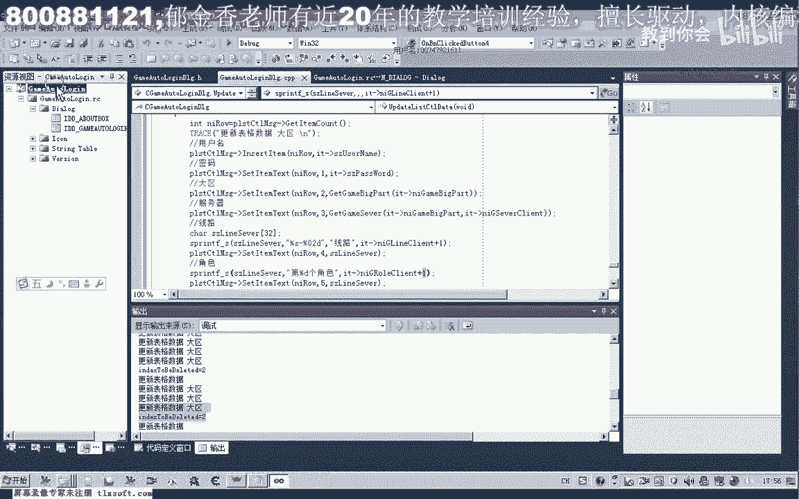

---

## 总结与下节预告

本节课中，我们一起学习了批量账号信息处理的核心功能：
1.  定义了 `AccountInfo` 结构体来存储账号信息。
2.  使用 `std::vector<AccountInfo>` 管理账号列表。
3.  实现了向列表添加账号信息的功能。
4.  编写了将数据更新到表格控件显示的 `UpdateListCtrl` 函数。
5.  实现了删除表格中选中行账号信息的功能。

目前，我们的程序还缺少两个重要功能：
1.  **重复账号检测**：在添加信息时，应检查 `m_vAccountList` 中是否已存在相同账号名的记录，避免重复添加。
2.  **数据持久化**：将 `m_vAccountList` 中的数据保存到文件，并在程序启动时自动加载，这样就不需要每次重启都重新输入账号。

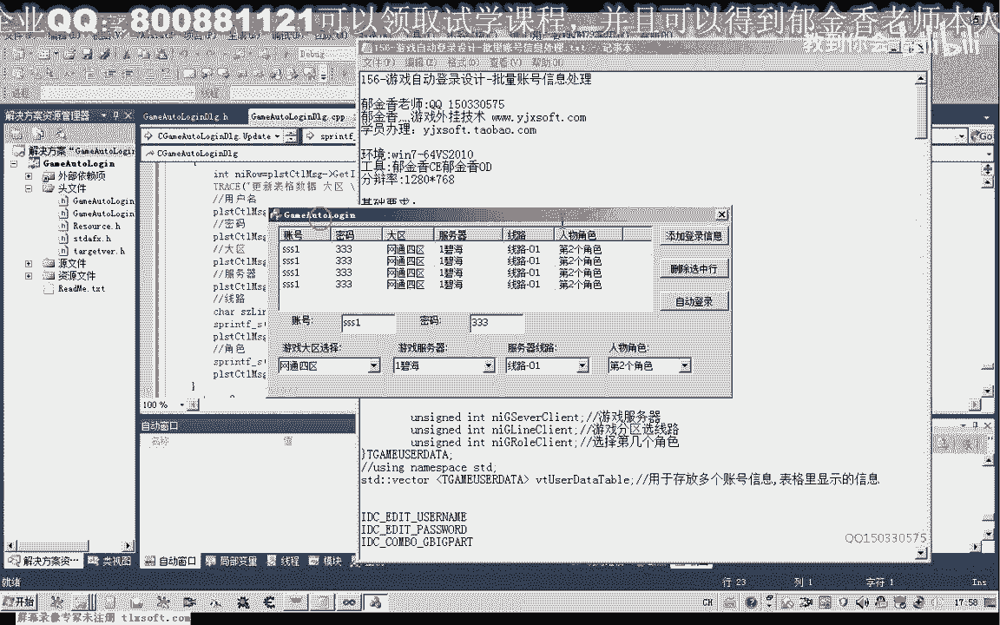

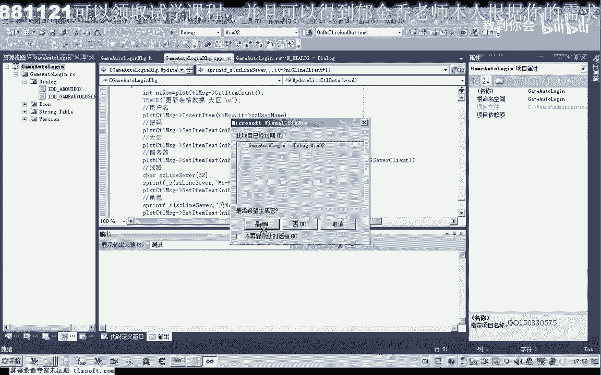

下一节课，我们将首先实现重复账号检测功能，然后重点讲解如何将账号信息保存到配置文件中。

---