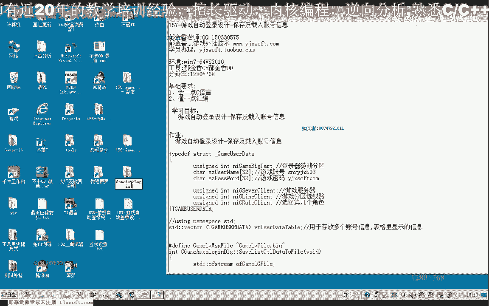


# 课程 P146：游戏自动登录设计 - 保存及载入账号信息 📂

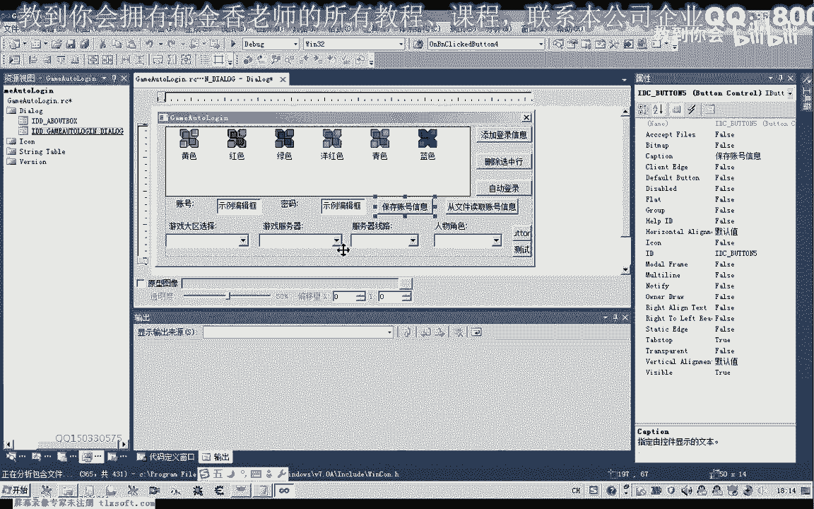

在本节课中，我们将学习如何将游戏账号信息保存到本地配置文件，并在程序启动时自动载入这些信息。这将极大提升工具的便利性，避免用户每次都需要手动输入账号。

## 概述与目标

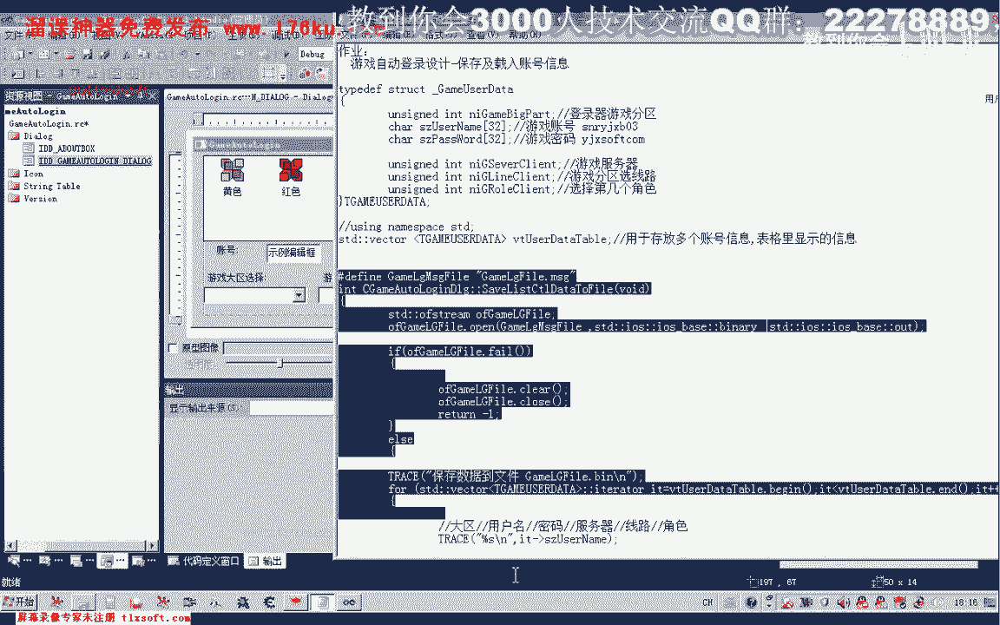

上一节我们完成了账号列表的界面交互功能。本节中，我们将实现数据的持久化存储。核心目标是：设计两个函数，一个用于将内存中的账号列表以二进制形式保存到文件，另一个用于从文件读取数据并恢复到内存和界面中。

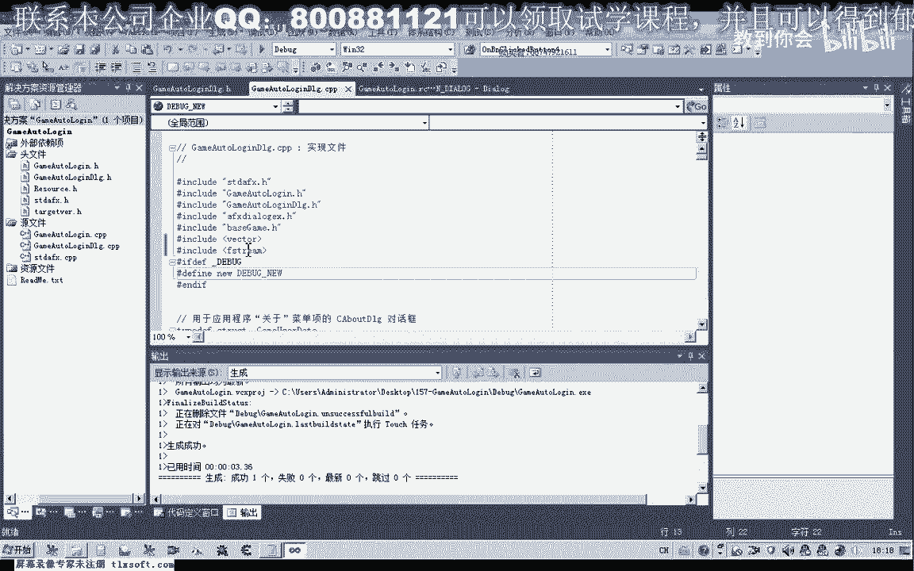

## 添加测试按钮


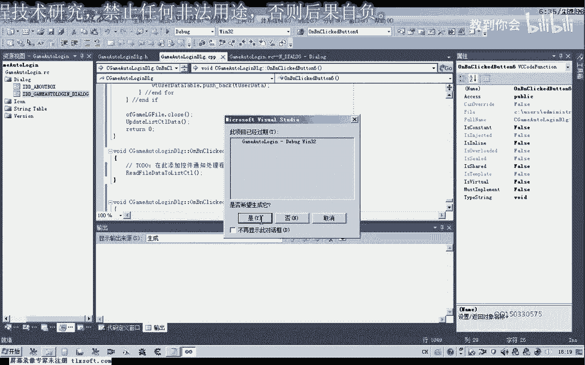

为了便于开发和测试，我们首先在界面上添加两个临时按钮。


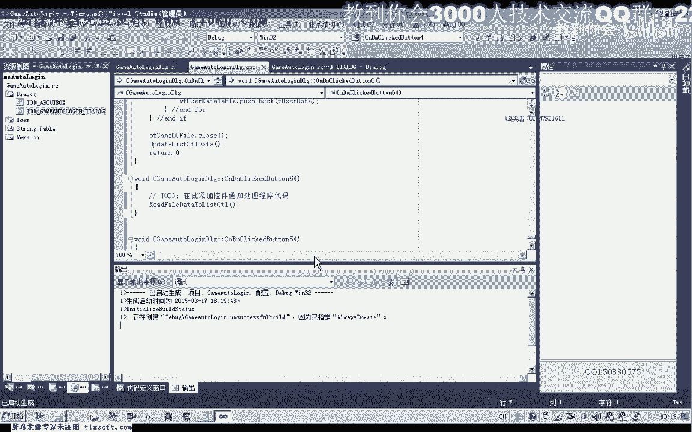


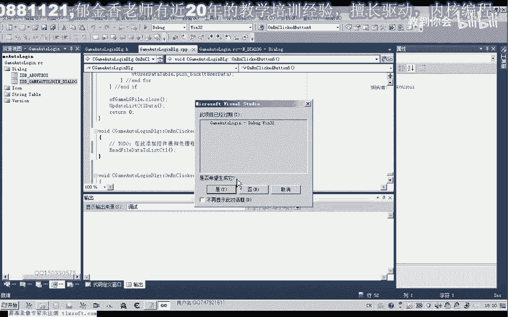

以下是按钮的功能说明：
*   **保存账号信息**：点击后，将当前列表中的所有账号信息保存到指定的配置文件中。
*   **读取账号信息**：点击后，从配置文件中读取账号信息，并更新到列表控件中。


测试成功后，我们会将相关代码集成到窗口初始化函数和账号添加/删除逻辑中，实现自动保存与载入。

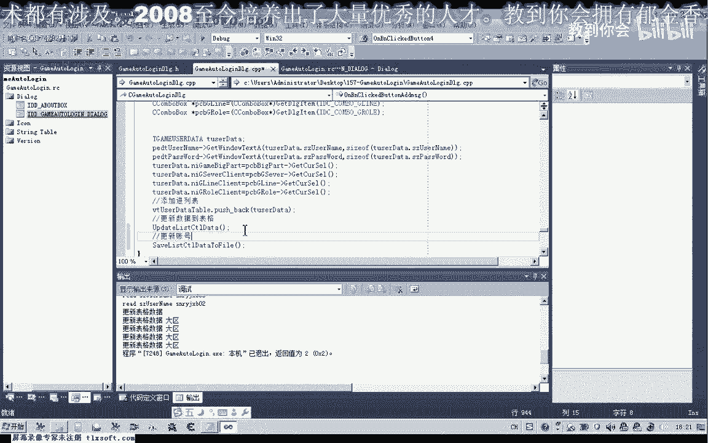

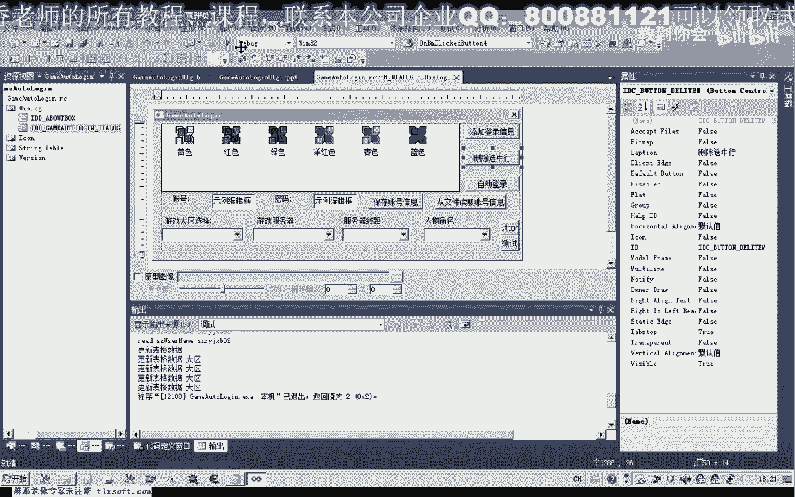

## 设计保存函数

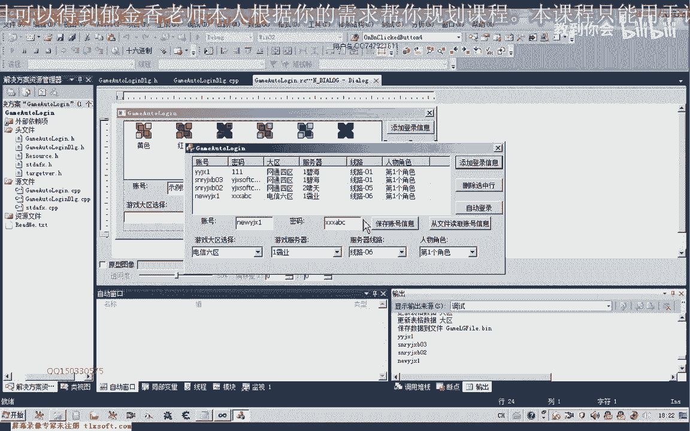


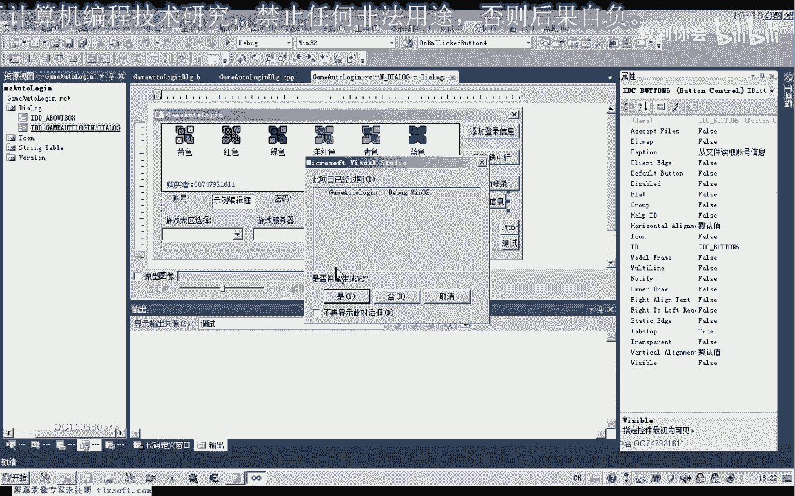

本节中我们来看看如何将数据保存到文件。我们采用二进制文件流的方式，将内存中的数据原封不动地写入文件。


核心操作是使用 `std::ofstream`（输出文件流），并指定 `std::ios::out | std::ios::binary` 模式打开文件。

```cpp
void CGameLoginDlg::SaveAccountToFile()
{
    std::ofstream ofs("account.cfg", std::ios::out | std::ios::binary);
    if (!ofs.is_open())
    {
        // 文件打开失败，进行清理并返回
        ofs.clear();
        ofs.close();
        return;
    }

    // 遍历存储账号信息的动态数组（vector）
    for (auto& acc : m_vAccountList)
    {
        // 将每个账号结构体的内存数据写入文件
        ofs.write((char*)&acc, sizeof(AccountInfo));
    }

    // 写入完成后清理
    ofs.clear();
    ofs.close();
}
```

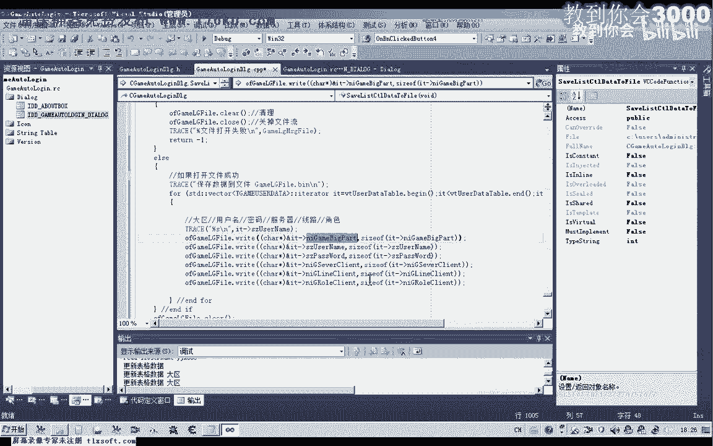

**代码解释**：
1.  `"account.cfg"` 是配置文件名，后缀可以任意指定（如 .txt, .ini, .dat 等）。
2.  `std::ios::out` 表示写入模式，`std::ios::binary` 表示以二进制模式操作，防止数据被转换。
3.  使用 `is_open()` 判断文件是否成功打开。
4.  通过 `write` 函数，将 `AccountInfo` 结构体变量的内存映像直接写入文件。写入顺序必须与结构体定义一致。
5.  操作完成后，调用 `clear()` 和 `close()` 是良好的编程习惯。


## 设计读取函数

上一节我们介绍了如何保存数据，本节中我们来看看如何从文件读取数据并恢复。我们使用 `std::ifstream`（输入文件流），并指定 `std::ios::in | std::ios::binary` 模式。

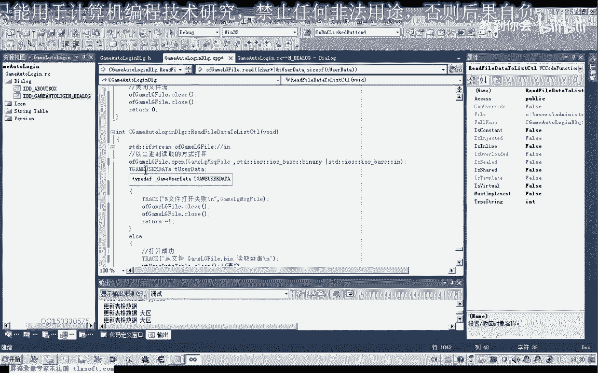

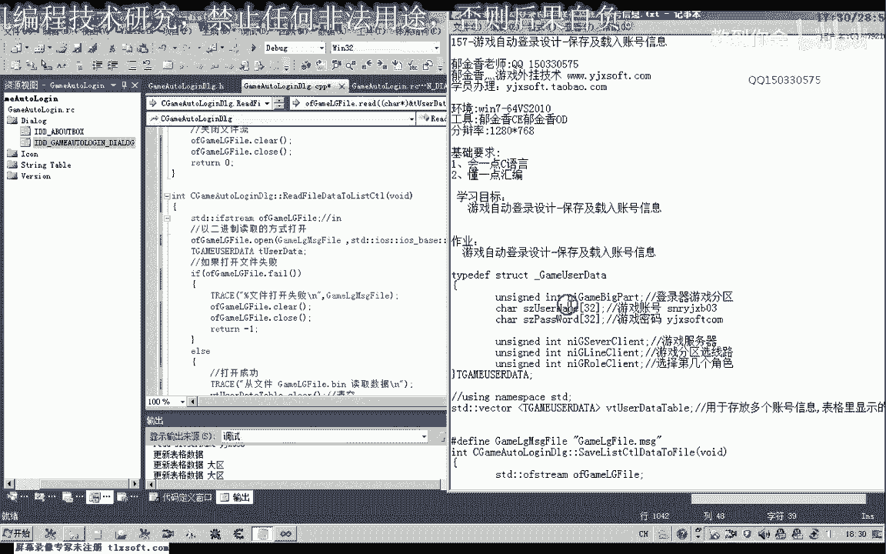

```cpp
void CGameLoginDlg::LoadAccountFromFile()
{
    std::ifstream ifs("account.cfg", std::ios::in | std::ios::binary);
    if (!ifs.is_open())
    {
        // 文件打开失败（可能首次运行），清理并返回
        ifs.clear();
        ifs.close();
        return;
    }

    // 可选：清空当前内存中的列表，防止重复添加
    m_vAccountList.clear();

    AccountInfo tempAcc;
    // 循环读取，直到文件末尾
    while (!ifs.eof())
    {
        // 读取一个结构体大小的数据到临时变量
        ifs.read((char*)&tempAcc, sizeof(AccountInfo));
        // 判断本次读取是否成功（可能遇到文件尾）
        if (ifs.fail())
        {
            break;
        }
        // 将读取到的账号信息添加到内存列表
        m_vAccountList.push_back(tempAcc);
    }

    ifs.clear();
    ifs.close();

    // 关键步骤：调用之前编写的函数，将内存列表数据更新到界面控件
    RefreshAccountToListCtrl();
}
```

**代码解释**：
1.  `std::ios::in` 表示读取模式。
2.  `ifs.eof()` 判断是否到达文件末尾。
3.  `ifs.read(...)` 从文件中读取一个 `AccountInfo` 结构体大小的数据。
4.  `ifs.fail()` 判断单次读取操作是否失败（例如在文件末尾尝试读取），失败则退出循环。
5.  读取成功后，通过 `push_back` 将数据添加到 `m_vAccountList` 动态数组中。
6.  最后必须调用 `RefreshAccountToListCtrl()` 函数，将内存数据同步更新到列表控件显示。

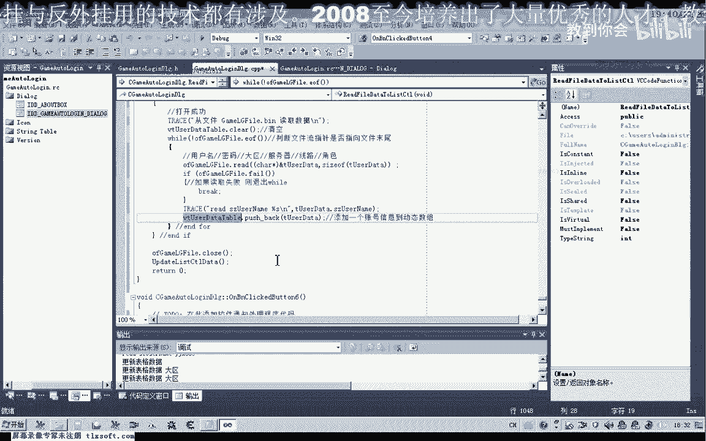


## 集成与自动化

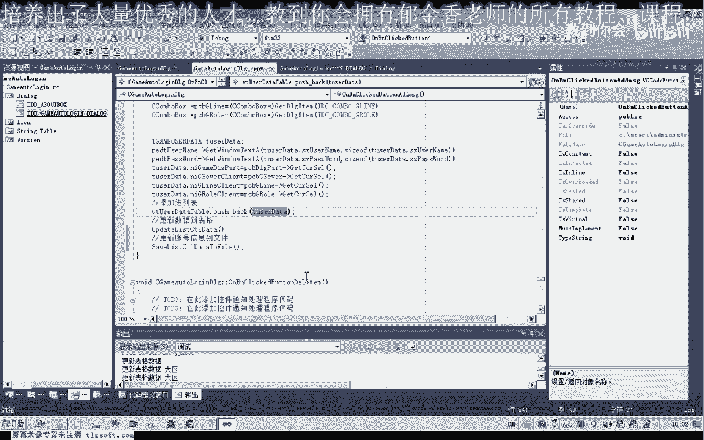


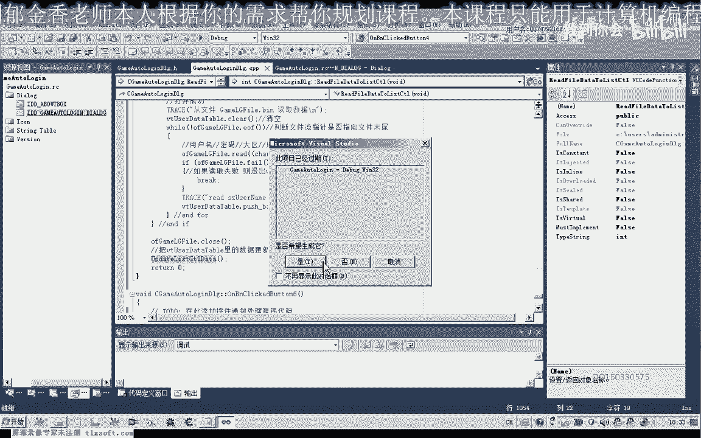

测试确认保存和读取功能正常工作后，我们将移除测试按钮，并将功能集成到主流程中。


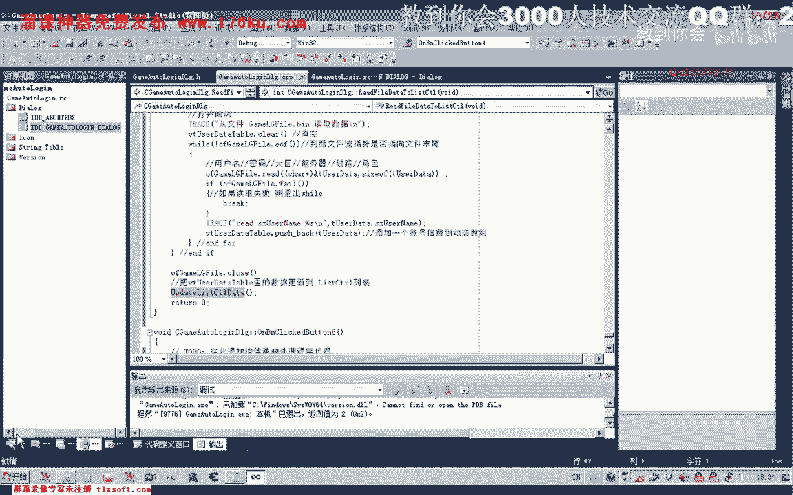

以下是需要集成的关键点：
*   **程序启动时自动载入**：在对话框的初始化函数（如 `OnInitDialog`）中调用 `LoadAccountFromFile()`。
*   **数据变更时自动保存**：在添加账号、删除账号、修改账号信息等任何导致 `m_vAccountList` 发生变化的操作之后，调用 `SaveAccountToFile()`。


这样，用户每次添加账号信息都会自动保存到文件。下次启动程序时，所有账号信息会自动加载并显示在列表中，无需手动操作。


## 注意事项与调试


在集成过程中，需要注意文件路径问题。如果程序调试运行时的“工作目录”与可执行文件（.exe）所在目录不同，可能导致找不到配置文件。


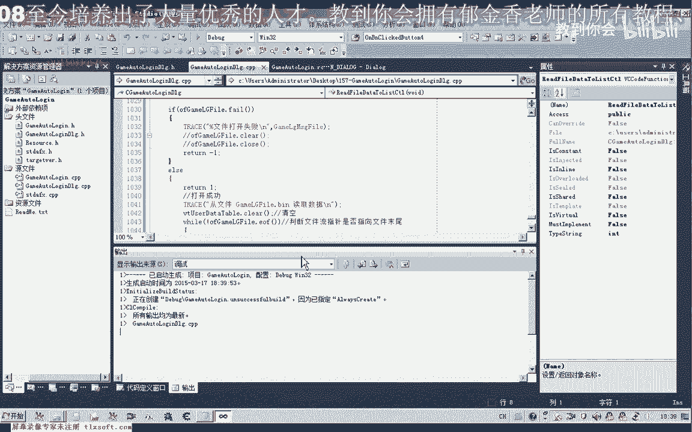


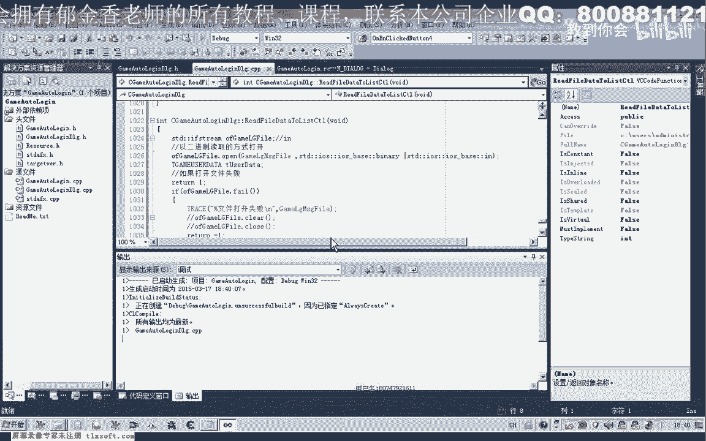

**解决方法**：
1.  在代码中使用绝对路径。
2.  或者，在调试器的设置中配置正确的工作目录。
3.  在文件打开失败的处理分支中，可以输出调试信息（注意格式化字符串的正确性），帮助定位问题。


## 总结

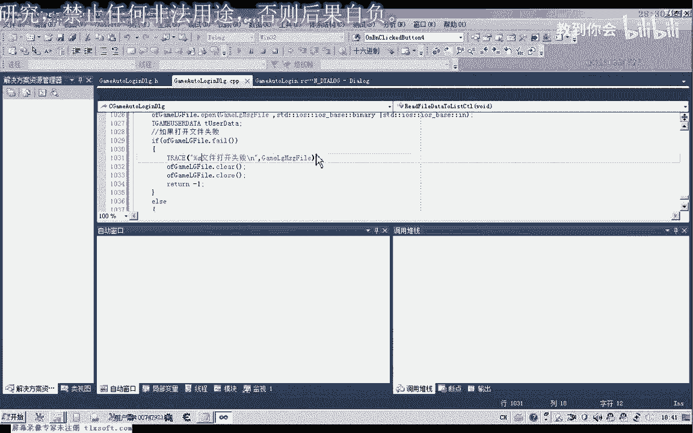


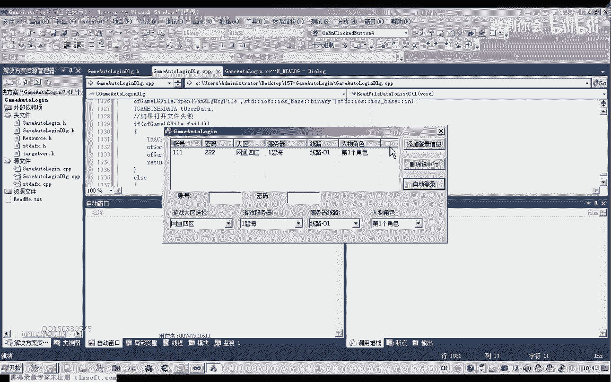


本节课中我们一起学习了游戏自动登录工具数据持久化的实现方法。我们掌握了两个核心函数：`SaveAccountToFile` 用于将账号列表以二进制格式保存到本地文件，`LoadAccountFromFile` 用于从文件读取并恢复数据。通过将这两个函数集成到程序初始化和数据变更事件中，我们实现了账号信息的自动保存与载入，大大提升了工具的实用性和用户体验。