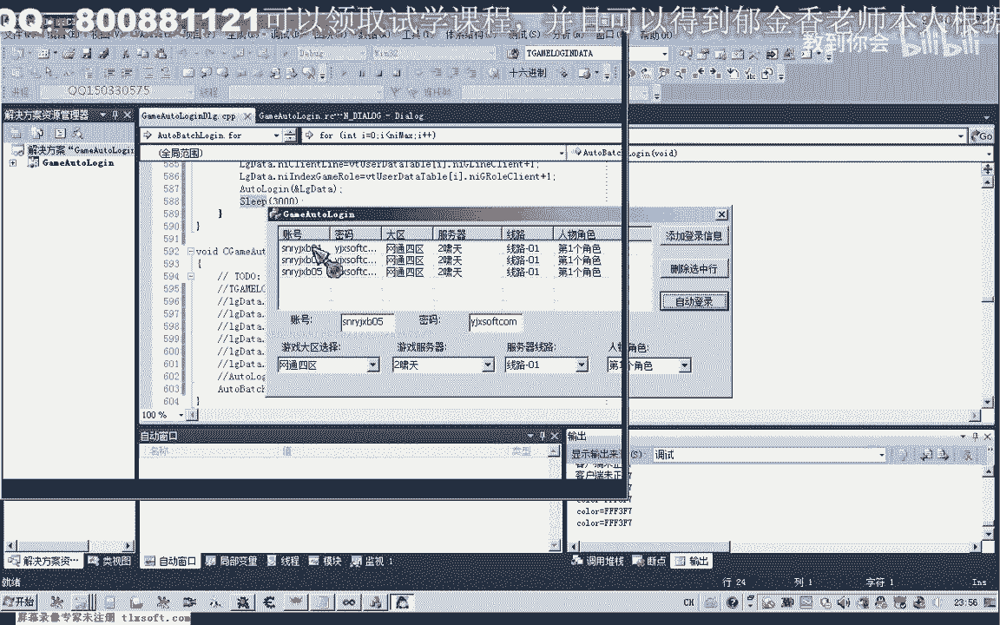
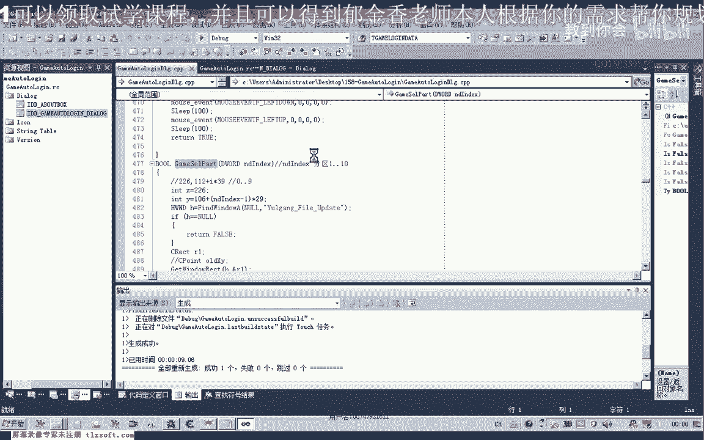
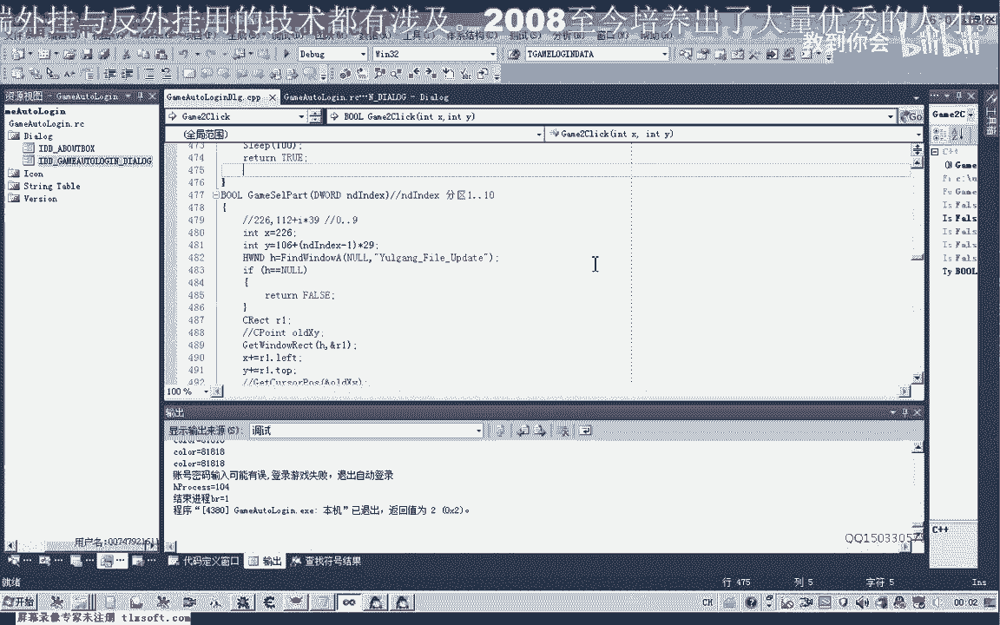

# P147：158-游戏自动登录设计-批量登录代码设计 - 教到你会 - BV1DS4y1n7qF

大家好，我是郁金香老师，那么这节课呢我们一起来看一下嗯。

你游戏账号的一个批量登录的相关代码的一个设计，那么首先呢我们打开157克的代码。

100。

那么由于我们之前已经设计过账号登录的这个函数，那么如果我们批量登录的话，我们所以说在设计的时候呢，实际上代码呢也很简单，那么我们可以直接调用这个water啊logo，那我直接调用这个函数来就可以了。

然后呢他的这个账号密码这些的来源呢就来源于我们的这个动态数组，这个微课堂的动态数组嘛，uual代替table，那么但是这两个结构的话，我们在设计的时候呢，这两个结构呢它有一点点的区别啊。

这两个结构那么造成了我们在使用的时候呢，需要把呃这个结构里边的数据呢需要复制在里边去啊，当然你也可以修改一下源源代码，统一一下这两个结构，好把它合并一下，那么我们使用同一个结构呢。

在调用这个waterlogan的时候，那么呢更加的简单一些啊，那么现在呢我们啊这节课来讨论一下，在不修改这两个结构的情况下，怎么实现实现我们的代码。

那么我们可以来另外写一个函数啊。

那么这个函数呢也很简单，就是把我们的呃，这个victor动态数组里面的账号和密码的相关信息来进行一个偏离啊，然后呢依次的登录，那么偏离了我们以前啊用的另外一种形式，用的这个iterector的这个指针。

那么这节课呢我们讲另外一种形式来建立这个动动态的数据。

那么首先呢这个呢我们size它有一个size函数，取得数组元素的个数，那么也可以看成是取得这个动态数组的一个大小啊，在你取得动态，那么也就是说里面它包含了多少个哈，账号信息。

然后我们根据这些信息来进行一个for循环，进行一个偏离啊，当然我们也可以直接的把这段信息呢替换到这里来都是可以的啊，然后呢依次的啊对它进行一个赋值，我们把里边的每一个呃元素里边的这个账号的信息啊。

分区以及我们的账号密码，这些信息呢嗯复制到我们的一个临时变量里面啊，最后呢我们再把这个临时变量的结构变量的地址传到这个waterlog里面，然后呢我们就实现我们的这个自动登录了啊，实际上是很简单的。

刚刚我们也可以统一一下结构啊，这个我们就做一个作业啊，大家呃自己去实现一下，做了我们就是把这两个结构呢啊进行修改，那么修改之后的话要求呢呃就只用这一个结构来实现，那么这个结构呢我们就可以删除掉啊。

呃应应该是只用这前面这个结构呢就能够实现，后面这个结构呢我们可以删除掉啊，是这样的一个要求，好的，那么现在我们在这里的话，由于我们的这个分区呢，它保存的保存的时候呢是从一啊，是从零开始的。

那呃那么所以说这里呢我们都要加上一啊，因为它里面的这个账号啊，分区啊这一类的呢，我们都是从他的这个呃都是标记了，都是从一开始的，那么这里呢我们也可以从两方面来修改，一个是这个地方加一。

那么另外一个呢是我们在这个添加信息的时候呢，我们就在这个地方呢来加一也是可以的，在保存的时候，我们就在这个地方呢进行一个加一的一个操作哈，分区啊，server是这个man这个地方加了一的话。

那么我们后面这个地方就不用加一啊，在这里呢就不用加一，那么具体是在什么地方回家啊，这个呢自己去考虑，它都要涉及到呃一部分的代码的一个修改，那么这里呢我们把这个信息呢相当于全部的就啊。

把这个wink的动态数组里面的某一个元素呢，就移植到我们的这个呃log date里面来，那么然后呢我们就把这个账号信息来传到这个mod log里面，然后呢我们就可以实现我们的自动登录了。

当然这里呢我们要等待几秒的这个时间，等待三秒或者是六秒的一个时间，那么实际上我们这个我他说跟你比呢，他已经啊有一个时间的等待啊，最后这里，那么这里呢还有一个等待。

就是来读取我们的这个人物信息啊的一个循环啊，那么这里的话实际上已经有了一个等待，大概是，这里是一秒，大概是等待一分钟的时间，那么一般来说是足够了啊，那么如果是不够不够的话。

那么这里呢我们可以把这个值呢呃修改大一些啊，修改大一些，好的，那么我们重新生成一下，然后我们来测试一下，看能不能够达到一个自动登录的一个目的，然后在这里的话我们把前面的这个代码呢就可以把它注释掉啊。

直接调用这个批量登录的代码，那么最好的办法呢是把这个代码呢放在一个县城里边哈，那这样的话它不会影响到这个主窗口，那么如果现在没有放在这个进程里面的话，我们现在调用了它，由于这个等待的时间线比较长。

那么这个呃登录窗口的话也会来会造成一个假死的一个状态。

好的，那么我们先来进行一下测试，啊删掉相应的行，然后这里呢把我们准备好的这些账号密码自己去申请几个账号或密码，然后呢实现它的一个批量的一个登录，好的，那么我们测测试一下哈。

实际上这里呢我们在测试的话的时候呢，只需要测试两个账号，实际上实际上就够了啊，那么我们点一下自动登录这个。

嗯嗯对，八，这是暗部，那么这个这个运行的时候呢，我们看一下它有时候也出现了一些问题，没有正常的达到我们的一个预期预期的一个效果，那么我们可以把相关的这个安全的软件啊退一下。

另外把登录的这个时间呢嗯做一下，相应的它有一些地方你可以做一下适当的修改，嗯，那么这个登录时间这里呢我们可以让他多等一会儿嗯，然后呢我们转到第一里边来看一下，还有其他地方等待登录器器打开之后。

选择分区分区，这大，那么这里呢我们等待的时间可以稍微改长一点，好的，那么我们重新再生成一下，再来看一下，那么同时呢这个呢我们需要把它先注释掉呃，先退出我们的这个游戏。

好的，然后我们再次尝试一下自动登录，嗯嗯，那么现在呢还没有进入到游戏的游戏里边呢，它就会一直到这个代码呢会等待啊检测，直到这个人物的信息读取完整之后，那么在开始开始了下一个账号的一个读取。

然后呢开始下一个账号的一个登录，那么这次的话我们的这个延迟的时间呢稍微改长一点之后，那么看起来的话呃，这个登录的过程比较顺利的进，啊这个呢是战马啊，这个密码输入错误了啊，所以说呢结束掉了我们的这个进程。

好的，那么实际上我们的这个批量登录的话已经ok了啊，那么这个呢是我们账号的一个问题啊。

密码的一个问题可能是我没有把它呃这个更改正确的，那么这节课呢我们就到这里了，那么下一节课呢，我们在编写一些这个看似开始我们的这个管脚本相关的，那么或者是我们这个掉线检测啊这一类的啊，掉线重新登录啊。

这一类的代码的一个编写。

好的。

