# 课程 P147：游戏自动登录设计 - 批量登录代码设计 🎮

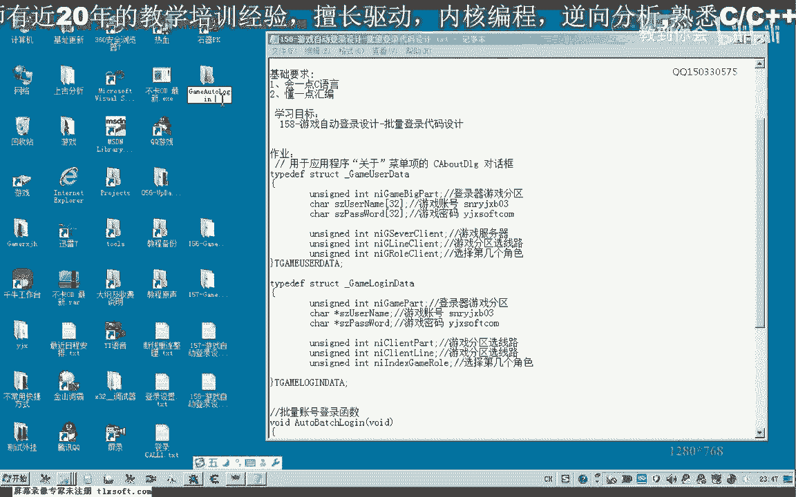

在本节课中，我们将学习如何设计批量登录游戏账号的代码。我们将基于已有的单个账号登录函数，通过循环调用它来实现多个账号的自动登录。

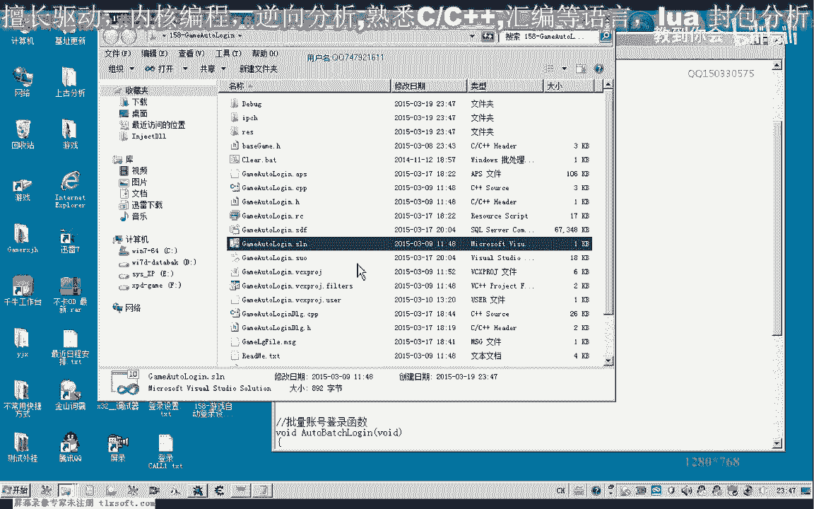

---

## 回顾与准备

上一节我们介绍了单个账号的登录函数。本节中我们来看看如何批量调用这个函数。

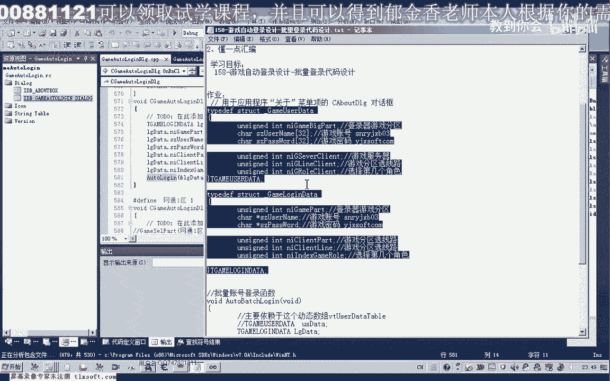

首先，我们打开第157课的代码。我们已经设计好了账号登录函数 `water_login`。批量登录的核心思路就是循环调用这个函数。

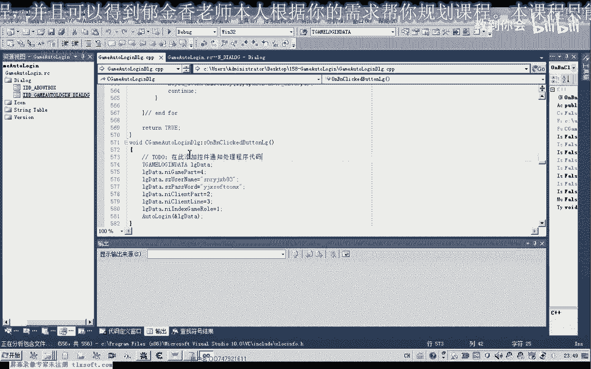

账号和密码的来源是我们的动态数组 `vector<user_data_table>`。但这里存在一个细节问题：登录函数 `water_login` 所使用的数据结构 `login_data` 与我们存储账号的动态数组结构 `user_data_table` 略有不同。

这两个结构的差异意味着我们在调用 `water_login` 函数前，需要将数据从一个结构复制到另一个结构。当然，你也可以通过修改源代码来统一这两个结构，使调用更简单。本节课，我们先讨论在不修改原有结构的情况下如何实现。

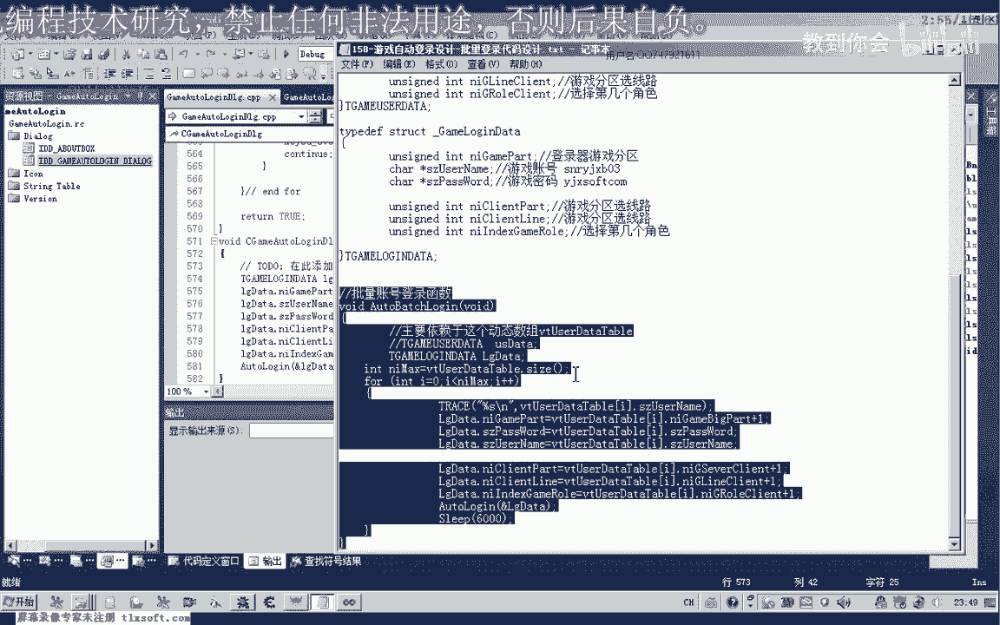

---

## 设计批量登录函数

我们可以编写一个新的函数来处理批量登录。

这个函数的作用是遍历 `vector` 动态数组中的所有账号密码信息，并依次进行登录。遍历动态数组有多种方式，之前我们使用过迭代器指针。本节课我们介绍另一种形式：通过 `size()` 函数获取数组大小进行循环。

以下是实现步骤：

1.  使用 `size()` 函数获取动态数组中账号信息的个数。
2.  根据这个数量进行 `for` 循环遍历。
3.  在循环中，将每个 `user_data_table` 元素中的账号、分区、密码等信息，复制到一个临时的 `login_data` 结构变量中。
4.  将这个临时变量的地址传给 `water_login` 函数，实现自动登录。

**核心代码逻辑如下：**
```cpp
void batch_login() {
    int count = user_data_vector.size(); // 获取账号数量
    for (int i = 0; i < count; i++) {
        login_data temp_data;
        // 将 user_data_vector[i] 的信息复制到 temp_data
        temp_data.account = user_data_vector[i].account;
        temp_data.password = user_data_vector[i].password;
        temp_data.server = user_data_vector[i].server + 1; // 注意分区编号的调整
        // 调用登录函数
        water_login(&temp_data);
        // 可在此处添加等待时间，确保上一个账号登录完成
        Sleep(3000);
    }
}
```

关于分区编号有一个细节需要注意：我们保存的分区号是从0开始的，但游戏登录时可能需要从1开始。因此，在复制数据时需要做 `+1` 处理。这个调整可以在保存信息时进行，也可以在复制到临时结构时进行，这需要你根据整体代码结构来决定。

---

## 测试与优化

代码编写完成后，我们需要进行测试。

首先重新生成项目。在测试时，我们可以将之前单个登录的代码注释掉，直接调用批量登录函数 `batch_login`。

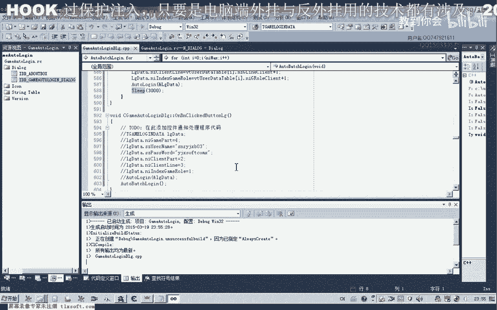

这里有一个重要的优化建议：最好将批量登录的代码放在一个独立的**线程**中运行。如果不这样做，由于登录过程等待时间较长，可能会导致主程序窗口出现“假死”状态，无法响应用户操作。

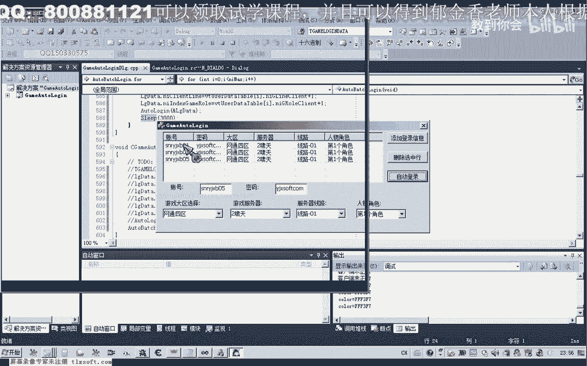

在测试过程中，可能会遇到登录不成功的情况。这可能是由于安全软件干扰，或者等待时间不足。我们可以尝试以下调整：

1.  暂时退出安全软件。
2.  适当增加登录过程中的等待时间。例如，在 `water_login` 函数内部，等待登录器打开、选择分区等环节的延时可以加长。

调整后再次生成并测试。使用两个测试账号即可验证功能是否正常。程序会等待第一个账号完全登录（读取完人物信息）后，再开始下一个账号的登录流程。

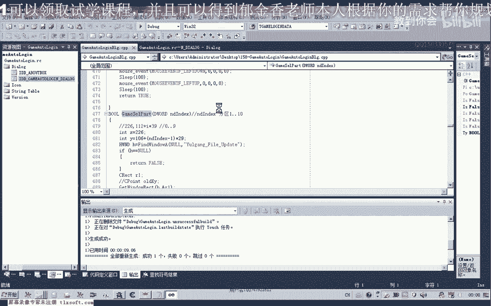

---

## 总结与作业

本节课我们一起学习了游戏账号批量登录的代码设计。我们利用已有的登录函数，通过遍历存储账号信息的动态数组，并处理数据结构差异，实现了自动化批量登录。

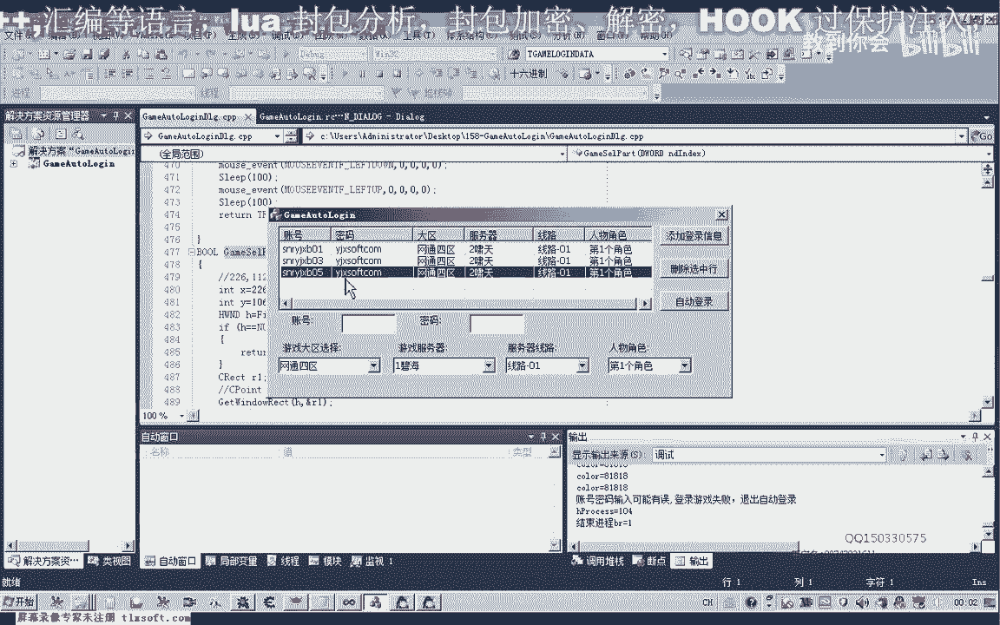

**课后作业**：
尝试修改源代码，统一 `user_data_table` 和 `login_data` 这两个结构。目标是只使用一个统一的结构来完成账号信息存储和登录传递，使代码更加简洁。修改成功后，可以删除冗余的结构定义。

在下一节课中，我们将开始编写游戏管理脚本的相关功能，例如掉线检测与自动重连。

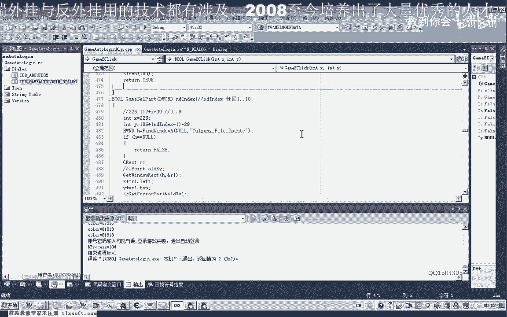

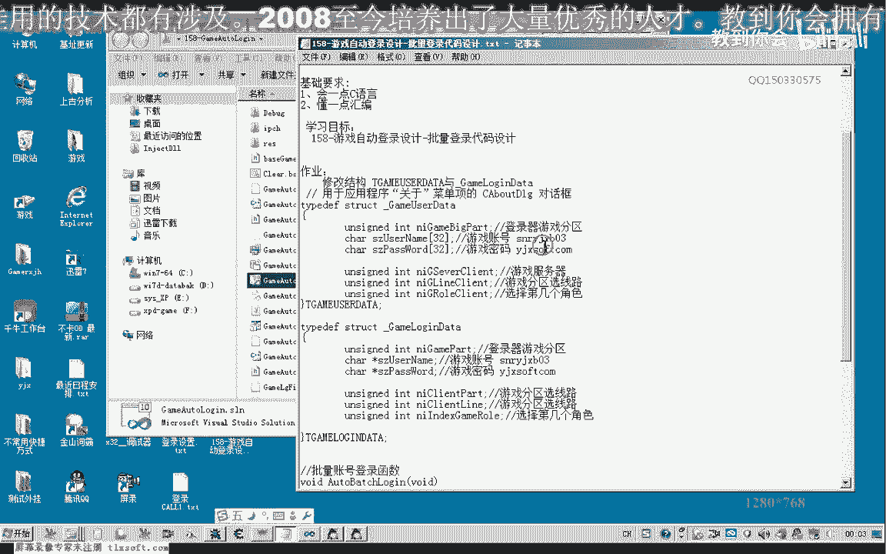

---